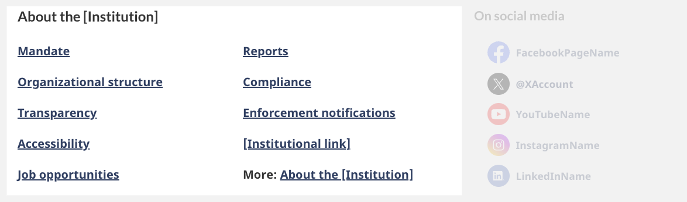
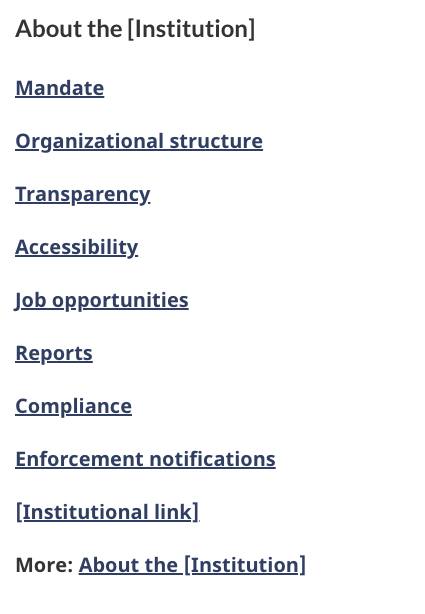

<strong>Last updated</strong>: {{ page.dateModified }}

The about the institution pattern is a section on an institutional landing page that provides links to corporate, program and policy information.

<section>
    <h2>On this page</h2>
    <ul>
        <li><a href="#use">When to use</a></li>
        <li><a href="#avoid">What to avoid</a></li>
        <li><a href="#design">Content and design</a></li>
        <li><a href="#implement">How to implement</a></li>
        <li><a href="#research">Research and rationale</a></li>
        <li><a href="#latest">Latest changes</a></li>
    </ul>
</section>
<section>
    <h2 id="use">When to use</h2>
    
About the institution is a mandatory pattern on an institutional landing page. It must include mandate and transparency links.

</section>
<section>
    <h2 id="avoid">What to avoid</h2>
    
Don’t use icons or images (only include links).

</section>
<section>
    <h2 id="design">Content and design</h2>
    
Find content and design specifications and visual examples.

    <h3>Content specifications</h3>
    
The heading is “About” followed by the name of the institution.

    
The heading appears above the links on all screen sizes.

    
Mandatory links:

    <ul>
        <li>Mandate</li>
        <li>Transparency</li>
        <li>Accessibility</li>
    </ul>
    
Optional links:

    <ul>
        <li>
            Recommended:
            <ul>
                <li>Programs</li>
                <li>Consultations</li>
                <li>Organizational structure</li>
                <li>Reports</li>
                <li>Job opportunities</li>
                <li>
                    More: About the [Institution]
                    <ul>
                        <li>only if you have a general “About” page for your institution</li>
                    </ul>
                </li>
                <li>
                    Other links can include any content that falls under corporate information or program and policy development content types
                    <ul>
                        <li>
                            <a href="https://www.canada.ca/en/treasury-board-secretariat/services/government-communications/canada-content-information-architecture-specification/organizing-content.html#corporate">Corporate information</a>
                        </li>
                        <li>
                            <a href="https://www.canada.ca/en/treasury-board-secretariat/services/government-communications/canada-content-information-architecture-specification/organizing-content.html#program">
                                Program and policy development
                            </a>
                        </li>
                    </ul>
                </li>
            </ul>
        </li>
    </ul>
    
Organize the links in an unstyled list.

    
Recommended maximum of 10 links.

    <h3>Design specifications</h3>
    <ul>
        <li>
            Heading:
            <ul>
                <li>
                    Uses standard Canada.ca styles:
                    <ul>
                        <li><a href="https://design.canada.ca/styles/typography.html">Typography</a></li>
                        <li><a href="https://design.canada.ca/styles/colours.html">Colours</a></li>
                        <li>Heading is coded as an H2 but styled as an H3</li>
                    </ul>
                </li>
            </ul>
        </li>
        <li>List links:</li>
        <ul>
            <li>
                Uses standard Canada.ca styles:
                <ul>
                    <li><a href="https://design.canada.ca/styles/typography.html">Typography</a></li>
                    <li><a href="https://design.canada.ca/styles/colours.html">Colours</a></li>
                </ul>
            </li>
            <li>Line-height of link: 1.65em</li>
        </ul>
        <li>
            The list of links appears in:
            <ul>
                <li>2 columns on large screens</li>
                <li>1 column on small screens</li>
            </ul>
        </li>
    </ul>
    <h3>Visual examples</h3>
    

        <figure class="mrgn-tp-md mrgn-bttm-lg">
            <figcaption><b>About the institution - large screen</b></figcaption>
            
            

                
Image description:

                
About the institution links appear in a section with the heading “About the [Institution]”. The links appear in a bulleted list that spans across two columns. The first column has:

                <ul>
                    <li>Mandate</li>
                    <li>Organizational structure</li>
                    <li>Transparency</li>
                    <li>Accessibility</li>
                    <li>Job opportunities</li>
                </ul>
                
The second column has:

                <ul>
                    <li>Reports</li>
                    <li>Compliance</li>
                    <li>Enforcements notifications</li>
                    <li>[Institutional link]</li>
                    <li>More: About the [institution]</li>
                </ul>
            

        </figure>
    

    

        <figure class="mrgn-tp-md mrgn-bttm-lg">
            <figcaption><b>About the institution - small screen</b></figcaption>
            
            

                
Image description:

                
About the institution links appear in a section with the heading “About the [Institution]”. The design organizes links in a bulleted list:

                <ul>
                    <li>Mandate</li>
                    <li>Organizational structure</li>
                    <li>Transparency</li>
                    <li>Accessibility</li>
                    <li>Job opportunities</li>
                    <li>Reports</li>
                    <li>Compliance</li>
                    <li>Enforcements notifications</li>
                    <li>[Institutional link]</li>
                    <li>More: About the [institution]</li>
                </ul>
            

        </figure>
    

</section>
<section>
    <h2 id="implement">How to implement</h2>
    
Find working examples and code for implementing the contact us band pattern.

    <h3>GCweb (WET) theme implementation reference</h3>
    
The implementation reference includes how to configure elements of the design system.

    <ul>
        <li><a href="">GCWeb (WET) Institutional landing page</a></li>
        <li></li>
        <li><a href="https://wet-boew.github.io/GCWeb/docs/implementing-en.html">Quick implementation guide - GCWeb theme</a></li>
    </ul>
    <h3>Implementations</h3>
    
Determine what best suits the type of page you're creating.

    

        

            

                

                    

                        
<strong>GC-AEM</strong>

                        
For the Government of Canada Adobe Experience Manager (AEM):

                        <ul>
                            <li><a href="https://www.gcpedia.gc.ca/wiki/AEM_GC-specific_Documentation_6.5">AEM/Managed Web Service documentation (GCPedia link - only available on the Government of Canada network)</a></li>
                        </ul>
                    

                    

                        
<strong>CDTS</strong>

                        
For the Centrally Deployed Templates Solution (CDTS):

                        <ul>
                            <li><a href="https://cenw-wscoe.github.io/sgdc-cdts/docs/index-en.html">CDTS documentation</a></li>
                        </ul>
                    

                    

                        
<strong>Drupal WxT</strong>

                        
For Drupal WxT:

                        <ul>
                            <li><a href="https://drupalwxt.github.io/en/">Drupal WxT documentation</a></li>
                        </ul>
                    

                

            

        

    

</section>
<section>
    <h2 id="research">Research and rationale</h2>
    
Consult resarch findings and policy rationale.

    <h3>Research findings</h3>
    
Research shows that this section isn’t what most people are looking for when they reach an institutional landing page. Therefore, this pattern appears near the bottom of the page so it doesn’t interfere with more important tasks.

    <h3>Policy rationale</h3>
    
The About the institution pattern is required in the following mandatory templates:

    <ul>
        <li><a href="">Institutional landing page</a></li>
    </ul>
</section>
<section>
    <h2 id="latest">Latest changes</h2>
    <dl class="dl-horizontal">
        <dt>
            <time datetime="2023-08-23" class="link-muted">2023-08-23</time>
        </dt>
        <dd>Added About the institution guidance to support updates to the Institutional landing page template</dd>
    </dl>
</section>