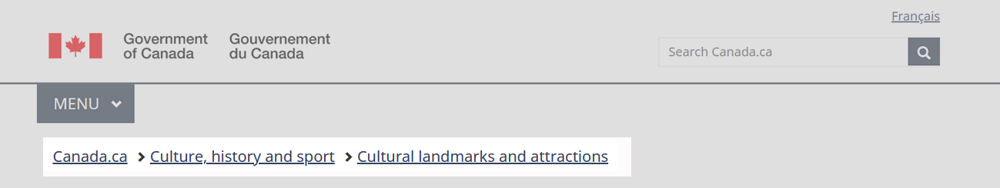
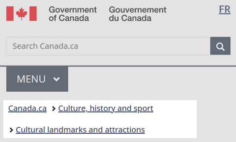

  

    <ul class="list-inline small mrgn-bttm-sm" id="list-inline-desktop-only">
      <li class="mrgn-rght-lg"> Last updated: YYYY-MM-DD</li>
    </ul>
  

  
Mandatory on standard and campaign pages

  
The breadcrumb trail is a horizontal series of links that gives people a sense of where they are in relation to Canada.ca’s navigation model.  It represents the location of a page in relation to its parent and provides a clear way to navigate to higher levels in the site structure.

  

    <figure class="mrgn-bttm-sm"></figure>
  

  <section>
    <h2>On this page</h2>
    <ul>
      <li><a href="#when">When to use</a></li>
      <li><a href="#avoid">What to avoid</a></li>
      <li><a href="#content">Content and design</a></li>
      <li><a href="#implementation">How to implement</a></li>
      <li><a href="#research">Research and rationale</a></li>
      <li><a href="#changes">Latest changes</a></li>
    </ul>
  </section>
  <h2 id="when">When to use</h2>
  
The breadcrumb trail is mandatory on all pages, except transactional pages.

  <h2 id="avoid">What to avoid</h2>
  
Don’t program the breadcrumb trail to be generated dynamically based on a visitor’s journey to a page. It should represent the location of a page as it stands in relation to the site’s navigation model.

  
Avoid long link labels that push content down on mobile. Use shortened versions of multi-word page titles when possible.

  
Don’t display the current page at the end of the breadcrumb trail (linked or unlinked). It increases the length of the breadcrumb unnecessarily, especially on mobile. The heading of the page is enough to let people know where they are.

  <h2 id="content">Content and design</h2>
  
Find content and design specifications and visual examples.

  <h3>Content specifications</h3>
  <ul>
    <li>Align the breadcrumb trail to the left directly below the menu button (or the divider line if there is no menu button)</li>
    <li>Use “Canada.ca” as the text of the first breadcrumb link on standard and campaign pages
      <ul>
        <li>Link to the Canada.ca home page in the language of the current page</li>
      </ul>
    </li>
    <li>You can use either “Home” or the name of the process or application as the text of the first breadcrumb link on transactional pages that use a breadcrumb trail
      <ul>
        <li>Link to the starting page of the process or the landing page of the application</li>
      </ul>
    </li>
    <li>Use a single right chevron icon to separate each breadcrumb link</li>
    <li>Reflect the title of the page in the breadcrumb label
      <ul>
        <li>Shorten breadcrumb labels where possible to improve readability and reduce space</li>
      </ul>
    </li>
  </ul>
  
For example, these breadcrumbs:

  
Canada.ca  Immigration and citizenship  Canadian citizenship  Apply for Canadian citizenship  Prepare for the Canadian citizenship test and interview

Can be shortened to this:

  
Canada.ca  Immigration and citizenship  Canadian citizenship  Apply  Prepare for the test and interview

  <h4>Accessibility</h4>
  <ul>
    <li>Include “You are here:” as invisible help text</li>
  </ul>
  <h4>Interactions</h4>
  <ul>
    <li>When selected, each breadcrumb should bring the user to a unique page</li>
  </ul>
  <h3>Design specifications</h3>
  
Design specifications for the breadcrumbs are:

  <ul>
    <li>Type: link</li>
    <li>Position: top left</li>
    <li>Font: Noto sans</li>
    <li>Size: 16px</li>
    <li>Text colour:
      <ul>
        <li>default link: #284162</li>
        <li>selected link (on hover or focus): #0535d2</li>
        <li>visited link: #7834bc</li>
      </ul>
    </li>
    <li>Spacing
      <ul>
        <li>vertical padding: 13px</li>
        <li>Horizontal padding: 2px</li>
        <li>margin top: 15px</li>
        <li>Line-height: 23px</li>
      </ul>
    </li>
    <li>Icon: glyphicon-chevron-right</li>
  </ul>
  <h4>Accessibility</h4>
  
Code breadcrumbs as an ordered list

  <h4>Breadcrumb structure</h4>
  
Here are some examples of breadcrumbs for different locations on Canada.ca

<h5 class="mrgn-tp-lg">Theme pages, institutional and organizational pages</h5>

  
Canada.ca

<h5>First-level topic pages</h5>

  
Canada.ca  [Parent theme]

<h5>Second-level topic pages</h5>

  
Canada.ca  [Parent theme]  [Parent topic]

<h5>Corporate, program or policy content pages</h5>

  
Canada.ca  [Institutional profile page]

<h5>Partnering and collaborative arrangement profile pages</h5>

  
Canada.ca

<h5>Basic search pages</h5>

  
Canada.ca

<h5>Advanced search pages</h5>

  
Canada.ca  [Basic search]

  <h5>Campaigns and promotions</h5>
  
Promotion campaigns don't need a breadcrumb trail. If you add one, it can lead back to the topic tree, the Institutional/Organizational profile, or to the Home page of Canada.ca.

<h5 class="mrgn-tp-lg">News</h5>

  
Canada.ca  [Institutional profile page]

<h5 class="mrgn-tp-lg">Application</h5>

  
Home

  <h3>Visual examples</h3>
  

    <figure>
      <figcaption><b>Global header with breadcrumb trail  - large screen</b></figcaption>
      
      

        
Image description: global header with breadcrumb trail  - large screen

        
The breadcrumbs appear under the menu button in a horizontal line.

      

    </figure>
  

  

    <figure>
      <figcaption><b>Global header – small screen</b></figcaption>
      
      

        
Image description: global header with breadcrumb trail  - small screen

        
The breadcrumbs appear under the menu button.

      

    </figure>
  

  <h2 id="implementation">How to implement</h2>
  
Find working examples for implementing the breadcrumbs.

  <h3>GCweb (WET) theme implementation reference</h3>
  
The implementation reference includes how to configure each element of the header.

  <ul>
    <li><a href="https://wet-boew.github.io/GCWeb/sites/breadcrumbs/breadcrumbs-en.html">Breadcrumbs - GCWeb (WET) documentation</a></li>
    <li><a href="https://wet-boew.github.io/GCWeb/sites/header/header-docs-en.html">GCWeb (WET) header documentation</a></li>
  </ul>
  <h3>Implementations</h3>
  
Determine what best suits the type of page you're creating. Refer to your implementation's guidance if you want to exclude breadcrumbs.

  

    

      

        

          

            
<strong>GC-AEM</strong>

            
For the Government of Canada Adobe Experience Manager (AEM):

            <ul>
              <li><a href="https://www.gcpedia.gc.ca/gcwiki/images/9/9a/AEM-6.5-Documentation-Unit-3-7-Changing-the-Default-Breadcrumb.pdf">Changing the default breadcrumb (PDF - GCPedia link - only available on the Government of Canada network)</a></li>
              <li><a href="https://www.gcpedia.gc.ca/wiki/AEM_GC-specific_Documentation_6.5">AEM/Managed Web Service documentation (GCPedia link - only available on the Government of Canada network)</a></li>
            </ul>
          

          

            
<strong>CDTS</strong>

            
For the Centrally Deployed Templates Solution (CDTS):

            <ul>
              <li><a href="https://cdts.service.canada.ca/app/cls/WET/gcweb/v4_0_47/cdts/samples/breadcrumbs-en.html">Breadcrumbs - CDTS documentation </a></li>
              <li><a href="https://cenw-wscoe.github.io/sgdc-cdts/docs/index-en.html">CDTS documentation</a></li>
            </ul>
          

          

            
<strong>Drupal WxT</strong>

            
For Drupal WxT:

            <ul>
              <li><a href="https://drupalwxt.github.io/en/">Drupal WxT documentation</a></li>
            </ul>
          

        

      

    

  

  

    <h2 id="research">Research and rationale</h2>
    
Consult research findings and policy rationale.

    <h3>Research findings</h3>
    
<a href="https://blog.canada.ca/2020/08/10/CanadaDotCa-trusted-source.html">Canada.ca is a trusted source</a> 
      Explains the decision to use “Canada.ca” as the label for the first link in the breadcrumb.

    
<a href="https://blog.canada.ca/research-summaries/wayfinding-on-canada-ca.html">Wayfinding on Canada.ca research summary</a> 
      Research shows that people navigating on the site use breadcrumb links nearly twice as often as they use the Theme and topic menu.

    
The spacing specifications for the breadcrumb links are designed so that touch targets meet WCAG AAA requirements.

    <h3>Policy rationale</h3>
    
As part of the global header, the breadcrumb is a mandatory element under the Content and Information Architecture Specification.

    <ul>
      <li><a href="https://www.canada.ca/en/treasury-board-secretariat/services/government-communications/canada-content-information-architecture-specification/mandatory-elements.html">Mandatory elements of the design system</a></li>
    </ul>
    <h2 id="changes">Latest changes</h2>
    <dl class="dl-horizontal">
      <dt>
        <time datetime="2023-MM-DD" class="link-muted">2023-MM-DD</time>
      </dt>
      <dd>Updated the guidance to include content and design specifications, visual examples and implementation guidance</dd>
    </dl>
  

