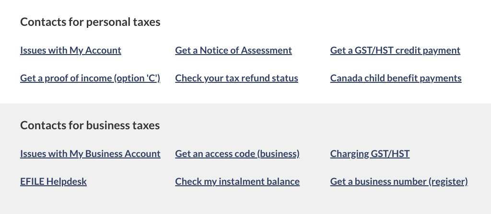

<strong>Last updated</strong>: {{ page.dateModified }}

The Contact us band provides relevant contact information.

 

<section>
  <h2>On this page</h2>
  <ul>
    <li><a href="#use">When to use</a></li>
    <li><a href="#avoid">What to avoid</a></li>
    <li><a href="#design">Content and design</a></li>
    <li><a href="#implement">How to implement</a></li>
    <li><a href="#research">Research and rationale</a></li>
    <li><a href="#latest">Latest changes</a></li>
    <li><a href="#discuss">Discussion</a></li>
  </ul>
</section>
<section>
  <h2 id="use">When to use</h2>
  
Use the contact us band on pages to:

    <ul>
      <li>present contact information consistently in a variety of contexts</li>
      <li>provide access to multiple contact options</li>
    </ul>
</section>
<section>
  <h2 id="avoid">What to avoid</h2>
  
Don’t add borders to this band.

  
Don’t add non-contact links in a contact band.

</section>
<section>
  <h2 id="design">Content and design</h2>
  
Find content and design specifications and visual examples.

  <h3>Content specifications</h3>
  
Use a descriptive heading that starts with ‘Contact’ or ‘Contacts’.

  
Use descriptive link text so it's clear what contact information the user will be brought to.

  
The optimal number of links is three.

  
If you are using a contextual footer that contains the same contact links, ensure you use the same link labels.

  <h3>Design specifications</h3>
  <ul>
  <li>Text uses standard Canada.ca styles:
    <ul>
        <li><a href="https://design.canada.ca/styles/typography.html">Typography</a></li>
        <li><a href="https://design.canada.ca/styles/colours.html">Colours</a></li>
        <li>Heading is coded as an H2 but styled as an H3</li>
        <li>Make the links bold and arrange them in a horizontal no-bullet list</li>
    </ul>
    </li>
    <li>Background:
        <ul>
        <li>Default colour: #f5f5f5</li>
        <li>Padding:
          <ul>
            <li>Bottom: 15px</li>
            <li>Top: 15px</li>
          </ul>
        </li>
      </li>
    <li>Layout:
     <ul>
        <li>If you have multiple sets of links to present on the same page, you can use more than one contact us band on the page in alternating background colours of white and grey (zebra striping).</li>
        </ul>
    </li>
  </ul>

  <h3>Visual examples</h3>
    

      <figure class="mrgn-tp-md mrgn-bttm-lg">
        <figcaption><b>Standard contact us band - large screen</b></figcaption>
        
        

          
Image description:

          
A horizontal grey band with a Contact us heading followed by three links in a single row. The first link is Contact [Institution], the following links are placeholders for top contact tasks.

        

      </figure>
    

    

      <figure class="mrgn-tp-md mrgn-bttm-lg">
        <figcaption><b>Contact us band - small screen</b></figcaption>
        
        

          
Image description:

          
A single column with light grey shading in the background. A Contact us heading is followed by three links. The first link is Contact [Institution], the following links are placeholders for top contact tasks.

        

      </figure>
    

    

      <figure class="mrgn-tp-md mrgn-bttm-lg">
        <figcaption><b>Multiple contact us bands - large screen</b></figcaption>
        
        

          
Image description:

          
A horizontal white band with a Contacts for [subject] heading followed by six links. The links are presented in two rows with three links in each row.

          
Following the white band is a horizontal grey band with a Contacts for [subject] heading followed by six links. The links are presented in two rows with three links in each row.

        

      </figure>
    

     

      <figure class="mrgn-tp-md mrgn-bttm-lg">
        <figcaption><b>Multiple contact us bands - small screen</b></figcaption>
        
        

          
Image description:

          
A single column with white shading contains a Contacts for [subject] heading followed by six links.

          
Following that column is a single column with grey shading contains a Contacts for [subject] heading followed by six links.

        

      </figure>
    

</section>

<section>
  <h2 id="implement">How to implement</h2>

  
Find working examples and code for implementing the contact us band pattern.

  <h3>GCweb (WET) theme implementation reference</h3>

  
The implementation reference includes how to configure elements of the design system.

    <ul>
      <li><a href="https://wet-boew.github.io/GCWeb/docs/implementing-en.html">Quick implementation guide - GCWeb theme</a></li>
    </ul>

  <h3>Implementations</h3>
  
Determine what best suits the type of page you're creating.

  <h4>GC-AEM</h4>
  
For the Government of Canada Adobe Experience Manager (AEM):

  <ul>
    <li><a href="https://www.gcpedia.gc.ca/wiki/AEM_GC-specific_Documentation_6.5">AEM/Managed Web Service documentation (GCPedia link - only available on the Government of Canada network)</a></li>
  </ul>

  <h4>CDTS</h4>
  
For the Centrally Deployed Templates Solution (CDTS):

  <ul>
    <li><a href="https://cenw-wscoe.github.io/sgdc-cdts/docs/index-en.html">CDTS documentation</li>
  </ul>

  <h4>Drupal WxT</h4>
  
For Drupal WxT:

    <ul>
    <li><a href="https://drupalwxt.github.io/en/">Drupal WxT documentation</li>
  </ul>
</section>

<section>
  <h2 id="research">Research and rationale</h2>
  
Consult resarch findings and policy rationale.

  
  <h3>Research findings</h3>
  
Canada Revenue Agency and the Digital Transformation Office developed contact bands as part of the optimization project for CRA contacts. We found contact bands to be useful for providing access to specific contact information for different services.

  
<a href="https://blog.canada.ca/2018/08/16/collab-gsthst-payroll.html">CRA and TBS collaborate to optimize GST/HST and Payroll webpage content</a>

  
This blog post explains how shorter keyword phrases showed significant advantages over full sentences on navigation pages. They made the key information easier to find.

  <h3>Policy rationale</h3>

  
The Contact us band is required in the following mandatory templates:

  <ul>
    <li><a href="">Institutional landing page</a></li>
  </ul>

</section>
<section>
  <h2 id="latest">Latest changes</h2>
  <dl class="dl-horizontal">
    <dt>
      <time datetime="2023-08-13" class="link-muted">2023-08-23</time>
    </dt>
    <dd>Updated the guidance to include content and design specifications, visual examples and implementation guidance</dd>
  </dl>
</section>