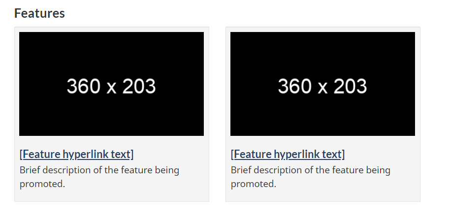

<strong>Last updated</strong>: {{ page.dateModified }}

The Context specific features pattern includes an image along with a link and a description for promoting government activities, initiatives, programs and services.

<section>
    <h2>On this page</h2>
    <ul>
        <li><a href="#use">When to use</a></li>
        <li><a href="#avoid">What to avoid</a></li>
        <li><a href="#design">Content and design</a></li>
        <li><a href="#implement">How to implement</a></li>
        <li><a href="#research">Research and rationale</a></li>
        <li><a href="#latest">Latest changes</a></li>
    </ul>
</section>
<section>
    <h2 id="use">When to use</h2>
    
Use feature tiles for promotions that are contextually related to the page.

</section>
<section>
    <h2 id="avoid">What to avoid</h2>
    
Don't use this pattern to promote unrelated content or content that doesn’t fit the context of the page.

    
Don’t use this pattern when it may distract from the task flow.

</section>
<section>
    <h2 id="design">Content and design</h2>
    
Find content and design specifications and visual examples.

    <h3>Content specifications</h3>
    
Position context-specific feature tiles after the main content of the page, but before the footer section.

    
Use a maximum of 3 features on a page.

    
Always use a heading for this block:

    <ul>
        <li>
            Multiple features:
            <ul>
                <li>The default heading is “Features” in English and “En vedette” in French</li>
                <li>You can use a more specific heading to provide stronger context</li>
            </ul>
        </li>
        <li>
            Single feature:
            <ul>
                <li>You can make the heading invisible so that it feels more integrated with the content</li>
                <li>If the heading is visible, it’s better to use a more specific heading to provide stronger context</li>
            </ul>
        </li>
        <li>
            Include an image, a linked title, and a description in each feature:
            <ul>
                <li>Keep the title to approximately 40 characters</li>
                <li>Keep the description text short and concise, ideally 1 or 2 lines, or below 145 characters</li>
            </ul>
        </li>
    </ul>
    <h3>Design specifications</h3>
    <ul>
        <li>
            Text uses standard Canada.ca styles:
            <ul>
                <li><a href="https://design.canada.ca/styles/typography.html">Typography</a></li>
                <li><a href="https://design.canada.ca/styles/colours.html">Colours</a></li>
                <li>Code the heading as an H2 but style it as an H3</li>
                <li>Code the linked title as an H5</li>
            </ul>
        </li>
        <li>
            Layout for multiple features:
            <ul>
                <li>Image should appear first, followed by hyperlinked title and then description</li>
                <li>Image dimensions are 360px x 203px</li>
                <li>News items is coded as an unstyled list</li>
                <li>Enclose the feature within a grey container:</li>
            </ul>
        </li>
        <li>background colour: #f5f5f5</li>
        <li>border: 1px solid #e3e3e3</li>
        <li>border radius: 4px</li>
        <li>bottom margin: 20px</li>
        <li>
            box shadow:
            <ul>
                <li>blur radius: 1px</li>
                <li>colour: black with 5% opacity</li>
                <li>offset x: 0</li>
                <li>offset y: 1px</li>
                <li>type: inset</li>
            </ul>
        </li>
        <li>minimum height: 20px</li>
        <li>padding: 19px</li>
    </ul>
    <li>
        Layout for single features:
        <ul>
            <li>Place the image on the left, with the hyperlinked title and description to the right of the image</li>
            <li>Image dimensions are 360px x 203px</li>
            <li>
                Apply a 5px grey border to the image
                <ul>
                    <li>background: #eaebed</li>
                    <li>border colour: #eee</li>
                    <li>border radius: 0</li>
                    <li>padding: 5px</li>
                </ul>
            </li>
        </ul>
    </li>
    <h3>Visual examples</h3>
    

        <figure class="mrgn-tp-md mrgn-bttm-lg">
            <figcaption><b>Context-specific features - large screen </b></figcaption>
            
            

                
Image description:

                

                    A heading titled “Features” is followed by two feature placeholders in a horizontal row. Each has an image placeholder surrounded by a light grey background. Within the image placeholder are the prescribed image
                    dimensions: 360px x 203px. Below each image placeholder on the grey background is a placeholder hyperlink that reads [Feature hyperlink text]. Underneath is the following placeholder text: Brief description of the
                    feature being promoted.
                

            

        </figure>
    

    

        <figure class="mrgn-tp-md mrgn-bttm-lg">
            <figcaption><b>Context-specific features - small screen </b></figcaption>
            
            

                
Image description:

                

                    A heading titled “Features” is followed by two feature placeholders in a vertical row. Each has an image placeholder surrounded by a light grey background. Within the image placeholder are the prescribed image
                    dimensions: 360px x 203px. Below each image placeholder on the grey background is a placeholder hyperlink that reads [Feature hyperlink text]. Underneath is the following placeholder text: Brief description of the
                    feature being promoted.
                

            

        </figure>
    

</section>
<section>
    <h2 id="implement">How to implement</h2>
    
Find working examples and code for implementing the latest news pattern.

    <h3>GCweb (WET) theme implementation reference</h3>
    <ul>
        <li><a href="https://wet-boew.github.io/GCWeb/components/gc-features/gc-features-doc-en.html">Context-specific features (wet-boew)</a></li>
    </ul>
    <h3>Implementations</h3>
    
Determine what best suits the type of page you're creating.

    

        

            

                

                    

                        
<strong>GC-AEM</strong>

                        
For the Government of Canada Adobe Experience Manager (AEM):

                        <ul>
                            <li><a href="https://www.gcpedia.gc.ca/wiki/AEM_GC-specific_Documentation_6.5">AEM/Managed Web Service documentation (GCPedia link - only available on the Government of Canada network)</a></li>
                        </ul>
                    

                    

                        
<strong>CDTS</strong>

                        
For the Centrally Deployed Templates Solution (CDTS):

                        <ul>
                            <li><a href="https://cenw-wscoe.github.io/sgdc-cdts/docs/index-en.html">CDTS documentation</a></li>
                        </ul>
                    

                    

                        
<strong>Drupal WxT</strong>

                        
For Drupal WxT:

                        <ul>
                            <li><a href="https://drupalwxt.github.io/en/">Drupal WxT documentation</a></li>
                        </ul>
                    

                

            

        

    

</section>
<section>
    <h2 id="research">Research and rationale</h2>
    

        Less is more. Research on improving promotions on Canada.ca shows that features are the most effective when they’re relevant to the content on the page. A single feature tile works best, but keep the number to a minimum if you plan
        to use more than one.
    

    <h3>Policy rationale</h3>
    
This is an optional pattern for the following mandatory templates:

    <ul>
        <li><a href="">Institutional landing page</a></li>
        <li><a href="">Theme and topic page</a></li>
        <li><a href="https://design.canada.ca/mandatory-templates/ministerial-profile-pages">Ministerial pages</a></li>
    </ul>
</section>
<section>
    <h2 id="latest">Latest changes</h2>
    <dl class="dl-horizontal">
        <dt>
            <time datetime="2023-08-13" class="link-muted">2023-08-23</time>
        </dt>
        <dd>Updated the guidance to include content and design specifications, visual examples and implementation guidance</dd>
    </dl>
</section>