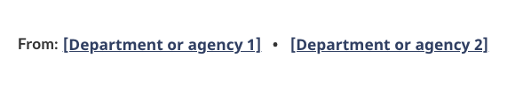

Use the contributors pattern to highlight institutions/organizations that have contributed to the content on a webpage.

<section>
    <h2>On this page</h2>
    <ul>
        <li><a href="#use">When to use</a></li>
        <li><a href="#design">Content and design</a></li>
        <li><a href="#implement">How to implement</a></li>
    </ul>
</section>
<section>
    <h2 id="use">
        When to use
    </h2>
    

        Use the contributors pattern to link to the institutions, organizations or similar entities who are responsible for, or support, the content on the page. You can list a single contributor or multiple contributors.
    

</section>
<section>
    <h2 id="design">
        Content and design
    </h2>
    
Find content and design specifications and visual examples.

    <h3>Content specifications</h3>
    
The link to the institution or organization is introduced by the word "From:"

    
List supporting institutions or organizations. Links must point to the organization’s main landing page. Where possible, use:

    <ul>
        <li>
            institutional landing page
        </li>
        <li>
            partnering/collaborative arrangement profile page
        </li>
    </ul>
    
The link label must be the same as the name that appears on the page it is linking to.

    <h3>Design specifications</h3>
    
This pattern should be positioned below all content on the page, but above the date modified field.

    
Do not place this block in line with other text blocks or layout elements; it stands alone.

    
Left-align the heading and the links.

    
Use standard paragraph, heading and link <a href="https://design.canada.ca/styles/colours.html">colours</a>.

    
The heading is an H2 styled at font-size: 87% (or 17px).

    
The list items are bolded and sized at font-size: 87% (or 17px).

    
The links are to the right of the H2 and are coded in a horizontal list. The first item in the list is unstyled (no bullet).

    <h3>Visual example</h3>
    

        <figure class="mrgn-tp-md mrgn-bttm-lg">
            <figcaption><b>Contributors pattern</b></figcaption>
            
            

                
Image description: contributors

                

                    The heading “From;” is aligned to the left. Two placeholder links appear in a list, aligned horizontally with the heading. The placeholder link text is [Department or agency 1]. This is followed by a bullet and then
                    another placeholder link labeled [Department or agency 2]
                

            

        </figure>
    

</section>
<section>
    <h2 id="implement">How to implement</h2>
    
Find working examples and code for implementing the contributors pattern.

    <h3>GCweb (WET) theme implementation reference</h3>
    <ul>
        <li><a href="https://wet-boew.github.io/GCWeb/components/gc-contributors/gc-contributors-doc-en.html">Contributors - GCWeb</a></li>
    </ul>
</section>
