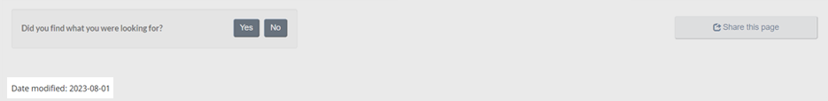

   

   

    <ul class="toc lst-spcd col-md-12">
     <li class="col-md-4 col-sm-6">
      <a class="list-group-item" href="site-footer-content.html">
       Content
			footer
      </a>
     </li>
     <li class="col-md-4 col-sm-6">
      <a class="list-group-item" href="report-problem.html">
       Report a problem
      </a>
     </li>
     <li class="col-md-4 col-sm-6">
      <a class="list-group-item" href="share-page.html">
       Share this page
      </a>
     </li>
     <li class="col-md-4 col-sm-6">
      <a class="list-group-item active">
       Date modified
      </a>
     </li>
    </ul>
   

  

  <section>
   

    
     Mandatory on all pages
    
   

   

    The date modified component indicates how recently the content of a web page has been updated.
   

   <figure>
    <figcaption>
     <b>
      Date modified section
     </b>
    </figcaption>
    
   </figure>
  </section>
  <section>
   <h2>
    Objectives
   </h2>
   

    Use the date modified component to provide a person with the date that the content was last updated.
   

  </section>
  <section>
   <h2>
    When to use the Date modified pattern
   </h2>
   

    The Date modified pattern is mandatory on all pages. In applications, it can be replaced by a version number. For
		more information, go to the
    <a href="{{ site.url }}/architecture/mandatory-elements.html#header-footer">
     Mandatory
			elements of the design system
    </a>
    .
   

  </section>
  <section>
   <h2>
    When to update the Date modified
   </h2>
   

    This component:
   

   <ul>
    <li>
     should generally only be updated when significant content changes occur
    </li>
    <li>
     should generally not be updated for corrections to typographical errors or changes to the underlying HTML code
    </li>
    <li>
     can be updated manually to signify that the content has been fully reviewed and is still valid as of that date
    </li>
   </ul>
   

    For applications, the component can be replaced by a “Version number” if desired.
   

  </section>
  <section>
   <h2>
    How to implement the Date modified
   </h2>
   <ul>
    <li>
     This component always starts with the words “Date modified:” followed by a date.
    </li>
    <li>
     The date appears using the common numeric method, for example: 2016-10-04.
    </li>
    <li>
     Placement: left-aligned, below the main content area. If used in conjunction with the Page feedback tool, this component appears after.
    </li>
   </ul>
  </section>
 

