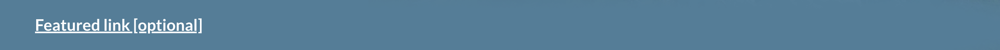
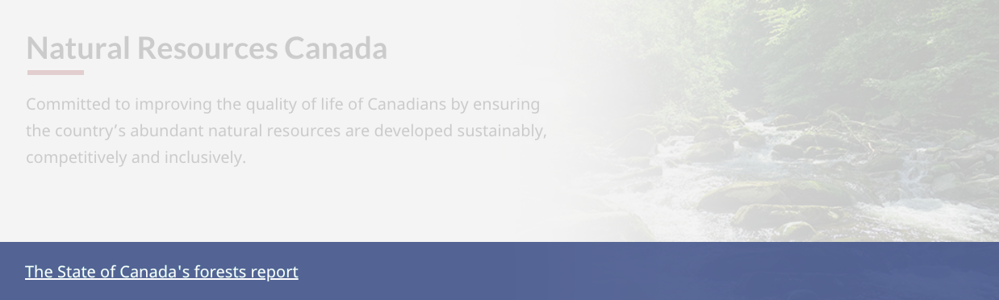

<strong>Last updated</strong>: {{ page.dateModified }}

The featured link is a short, descriptive link that your institution needs to feature prominently.

<section>
    <h2>On this page</h2>
    <ul>
        <li><a href="#use">When to use</a></li>
        <li><a href="#avoid">What to avoid</a></li>
        <li><a href="#design">Content and design</a></li>
        <li><a href="#implement">How to implement</a></li>
        <li><a href="#research">Research and rationale</a></li>
        <li><a href="#latest">Latest changes</a></li>
    </ul>
</section>
<section>
    <h2 id="use">When to use</h2>
    
Use the featured link pattern to promote significant items of a temporary nature, such as a Remembrance day statement.

    
Use this pattern on navigation pages only.

    
You can manage multiple links in the featured link spot by randomizing them for every visit to the page.

</section>
<section>
    <h2 id="avoid">What to avoid</h2>
    
Don’t use this pattern when you want people to stay on the page and do their task.

    
Don't include images in this section.

    
Don’t include more than one link within the pattern.

    
Don’t include more than one featured link section on a page.

</section>
<section>
    <h2 id="design">Content and design</h2>
    
Find content and design specifications and visual examples.

    <h3>Content specifications</h3>
    
Within this pattern, left-align the text.

    
Use descriptive link text so it's clear where the user will go if they click on the link.

    <h3>Design specifications</h3>
    <ul>
        <li>
            Text:
            <ul>
                <li>Colour: #FFF</li>
                <li>Font type: Lato Sans</li>
                <li>Font size: 20px</li>
            </ul>
        </li>
        <li>
            Background:
            <ul>
                <li>Default colour: #31708F</li>
                <li>Opacity: 0.9</li>
                <li>
                    Padding:
                    <ul>
                        <li>Bottom: 15px</li>
                        <li>Top: 15px</li>
                    </ul>
                </li>
            </ul>
        </li>
    </ul>
    
You can change the background colour to match design needs.

    <h4>Accessibility</h4>
    
The "Featured" heading should have the wb-inv class, so it isn’t visible, but is still present for the semantic outline and screen readers.

    
If you change the background colour, ensure there is a contrast ratio of at least 4.5:1.

    <h3>Visual examples</h3>
    

        <figure class="mrgn-tp-md mrgn-bttm-lg">
            <figcaption><b>Featured link - large screen</b></figcaption>
            
            

                
Image description:

                

                    A featured link is displayed in a blue band that spans the length of the screen. Above the featured link is the department name (Natural Resources Canada) followed by a short description about the department. Below the
                    featured link is a Most requested heading followed by three links.
                

            

        </figure>
    

</section>
<section>
    <h2 id="implement">How to implement</h2>
    
Find working examples and code for implementing the featured link, including the randomizer functionality.

    <h3>GCWeb</h3>
    <ul>
        <li><a href="https://wet-boew.github.io/GCWeb/components/gc-featured-link/gc-featured-link-en.html">Featured link - Canada.ca</a></li>
    </ul>
    <h3>Randomizer in WET</h3>
    <ul>
        <li><a href="https://wet-boew.github.io/v4.0-ci/demos/wb-randomize/wb-randomize-en.html">Randomize</a> - working examples and code</li>
        <li><a href="https://wet-boew.github.io/GCWeb/docs/implementing-en.html">Quick implementation guide - GCWeb theme</a></li>
    </ul>
    <h3>Implementations</h3>
    
Determine what best suits the type of page you're creating.

    

        

            

                

                    

                        
<strong>GC-AEM</strong>

                        
For the Government of Canada Adobe Experience Manager (AEM):

                        <ul>
                            <li><a href="https://www.gcpedia.gc.ca/wiki/AEM_GC-specific_Documentation_6.5">AEM/Managed Web Service documentation (GCPedia link - only available on the Government of Canada network)</a></li>
                        </ul>
                    

                    

                        
<strong>CDTS</strong>

                        
For the Centrally Deployed Templates Solution (CDTS):

                        <ul>
                            <li><a href="https://cenw-wscoe.github.io/sgdc-cdts/docs/index-en.html">CDTS documentation</a></li>
                        </ul>
                    

                    

                        
<strong>Drupal WxT</strong>

                        
For Drupal WxT:

                        <ul>
                            <li><a href="https://drupalwxt.github.io/en/">Drupal WxT documentation</a></li>
                        </ul>
                    

                

            

        

    

</section>
<section>
    <h2 id="research">Research and rationale</h2>
    
The featured link provides a controlled way to offer promotional space “above the fold” on landing pages.

    <h3>Policy rationale</h3>
    
It’s an optional pattern for the following mandatory templates:

    <ul>
        <li><a href="">Institutional landing page</a></li>
        <li>Canada.ca home page</li>
    </ul>
</section>
<section>
    <h2 id="latest">Latest changes</h2>
    <dl class="dl-horizontal">
        <dt>
            <time datetime="2023-08-23" class="link-muted">2023-08-23</time>
        </dt>
        <dd>Updated the guidance to include content and design specifications, visual examples and implementation guidance</dd>
    </dl>
</section>