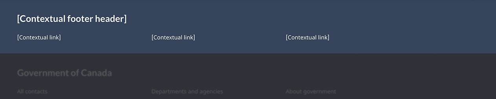
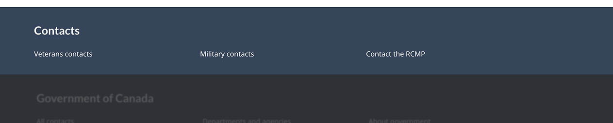
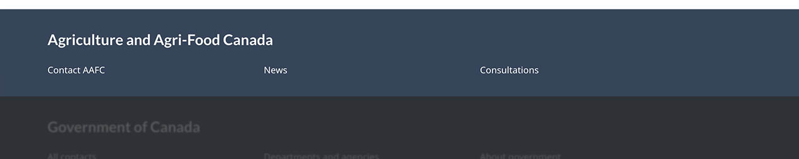

<strong>Last updated</strong>: {{ page.dateModified }}

<section>
  
Optional

  
The contextual footer band is an optional element of the global footer.

  
It provides support links that are specific to an entire group of pages, such as contact details for a program. A group of pages
    might be an entire theme, all the pages related to a specific program or service, or all the pages related to a single
    organization.

  
<strong>2022 design update</strong>: We’ve recently updated this pattern as part of a new navigation strategy coming
    out of the Wayfinding research project. To find out more about this project, visit the <a href="#research">Research and rationale</a> section on this page.

  
  

  <h2>On this page</h2>
  <ul>
    <li><a href="#use">When to use</a></li>
    <li><a href="#avoid">What to avoid</a></li>
    <li><a href="#design">Content and design</a></li>
    <li><a href="#implement">How to implement</a></li>
    <li><a href="#research">Research and rationale</a></li>
    <li><a href="#latest">Latest changes</a></li>
    <li><a href="#discuss">Discussion</a></li>
  </ul>
  <h2 id="use">When to use</h2>
  
The footer generally acts as a rescue for people. They check it if they don't find what they want in the main content of
    the page.

  
Use a contextual footer band when you have a consistent set of rescue links that should be available throughout a
    specific group of pages.

  <ul>
    <li>For example, the Taxes theme pages could have a contextual footer band with a link to Contact the CRA.</li>
  </ul>
  
<strong>Tip:</strong> If your pages have previously had a contextualized Contact us link in the global footer, you should add a contextual footer band.

  <h2 id="avoid">What to avoid</h2>
  
The content of this band shouldn’t duplicate the Government of Canada links in the <a href="./site-footer.html">main footer band</a>.

  
Don’t use this band for a single page. It should apply to a group of related pages.

  <h2 id="design">Content and design</h2>
  
Include only 1 contextual footer band on any page.

  <h3>Content specifications</h3>
  
Limit this band to a single row with a maximum of 3 links.

  
Include a heading that’s relevant to the content in this band, such as the name of the organization, theme or program.

  
Remember that it's a rescue pattern when you're choosing content for this band. It’s ok if something like a contact link appears
    in both the content area and the footer. If you have a page that has contact information in the body, it’s ok to have another contact link in the footer.

  
Choose links that people will expect to find in a footer based on web conventions. Common contextual footer links could
    include:

  <ul>
    <li>Contact [...] or [...] Contacts (link to the organization or program contact page)</li>
    <li>Careers (link to job postings)</li>
    <li>News (or other curated indexes such as consultations)</li>
  </ul>
  <h3>Design specifications</h3>
  
Design specifications for this band are:

  <ul>
    <li>Background colour: Contextual footer blue (#33465c)</li>
    <li>Text colour: white (#FFFFFF)</li>
    <li>Font family:
      <ul>
        <li>header: Lato</li>
        <li>links: Noto Sans</li>
      </ul>
    </li>
    <li>Text size (base size for the footer is 16px):
      <ul>
        <li>header: 19px or 1.2em</li>
        <li>links: 14px or 0.875em</li>
      </ul>
    </li>
    <li>Font weight:
      <ul>
        <li>header: 700 or bold</li>
        <li>links: 400 or regular</li>
      </ul>
    </li>
    <li>Columns: 3 column in large and medium screen formats, 1 column in small screen format</li>
  </ul>
  <h3>Visual examples</h3>
  
The contextual band should remain the same for the whole group of pages under the theme or institution.

  

    <figure class="mrgn-bttm-lg">
      <figcaption><b>Example for the Veterans and military theme</b></figcaption>
      
      

        
Text version

        
Contextual band for the Veterans and military theme with the title “Contacts” and 3 contextual links: “Veterans contacts,” “Military contacts,” and “Contact the RCMP”

      

    </figure>
  

  

    <figure class="mrgn-bttm-lg">
      <figcaption><b>Example for an institution</b></figcaption>
      
      

        
Text version

        
Contextual band for an institution with the title “Agriculture and Agri-Food Canada” and 3 contextual links: “Contact AAFC,” “News,” and “Consultations”

      

    </figure>
  

</section>
<section>
  <h2 id="implement">How to implement</h2>
  <h3>GCweb (WET) theme implementation reference</h3>
  <h4>Default</h4>
  <ul>
    <li><a href="https://wet-boew.github.io/GCWeb/sites/footers/no-footer-contextual-en.html">Main band and sub-footer band</a></li>
  </ul>
  <h4>Alternate options for standard pages</h4>
  <ul>
    <li><a href="https://wet-boew.github.io/GCWeb/sites/footers/footers-en.html">Complete footer (contextual, main and sub-footer bands)</a></li>
  </ul>
  <h4>Alternate options for transactional or campaign pages</h4>
  <ul>
    <li><a href="https://wet-boew.github.io/GCWeb/sites/footers/no-footer-contextual-en.html">Main band and sub-footer band</a></li>
    <li><a href="https://wet-boew.github.io/GCWeb/sites/footers/only-footer-main-en.html">Main band and sub-footer band with no optional links</a></li>
    <li><a href="https://wet-boew.github.io/GCWeb/sites/footers/no-footer-main-en.html">Contextual band and sub-footer band</a></li>
    <li><a href="https://wet-boew.github.io/GCWeb/sites/footers/only-footer-contextual-en.html">Contextual band and sub-footer band with no optional links</a></li>
    <li><a href="https://wet-boew.github.io/GCWeb/sites/footers/only-footer-corporate-en.html">Sub-footer band only</a></li>
    <li><a href="https://wet-boew.github.io/GCWeb/sites/footers/no-footers-en.html">Sub-footer band only with no optional links</a></li>
  </ul>
</section>
<section>
  <h3>Implementations</h3>
  
Determine the footer configuration that best suits your needs for the type of page you're creating. Refer to your implementation's guidance to customize the contextual band or sub-footer band links.

  

    

      

        
<strong>GC-AEM</strong>

        
For the Government of Canada Adobe Experience Manager (AEM):

        <ul>
          <li><a href="https://www.gcpedia.gc.ca/gcwiki/images/2/22/AEM-6.5-Documentation-Unit_3-1-1-_Customizing_Global_Footer.pdf">Customizing the Global footer (PDF - only available on the Government of Canada network)</a></li>
          <li><a href="https://www.gcpedia.gc.ca/wiki/AEM_GC-specific_Documentation_6.5">AEM/Managed Web Service documentation (only available on the Government of Canada network)</a></li>
        </ul>
      

      

        
<strong>CDTS</strong>

        
For the Centrally Deployed Templates Solution (CDTS):

        <ul>
          <li><a href="https://cdts.service.canada.ca/app/cls/WET/gcweb/v4_0_47/cdts/samples/footer-en.html">Complete footer (contextual, main, sub-footer bands)</a></li>
          <li><a href="https://cenw-wscoe.github.io/sgdc-cdts/docs/index-en.html">CDTS documentation</a></li>
        </ul>
      

      

        
<strong>Drupal WxT</strong>

        
For Drupal WxT:

        <ul>
          <li><a href="https://drupalwxt.github.io/">Drupal WxT documentation</a></li>
        </ul>
        
2023 footer update:

        <ul>
          <li><a href="https://github.com/drupalwxt/wxt/releases/tag/4.4.1">Drupal WxT (4.4.1) release notes</a></li>
          <li><a href="https://drupalwxt.github.io/en/docs/general/update/">Drupal WxT update process</a></li>
        </ul>
      

    

  

</section>
<section>
  <h2 id="research">Research and rationale</h2>
  
We updated the global footer for Canada.ca to align with a new overall navigation strategy that came out of the
    Wayfinding research project.

  <ul>
    <li><a href="{{ site.url }}/research-summaries/wayfinding-on-canada-ca">Wayfinding on Canada.ca research summary</a> 
      This summary explains the context of the research and the insights that drove the design updates.</li>
    <li><a href="https://blog.canada.ca/2022/12/21/wayfinding-research-project">Wayfinding research project improves our approach to navigation on Canada.ca</a> 
      This blog post explains the changes that are being made to the Canada.ca design, and how they are being implemented.</li>
  </ul>
</section>
<section>
  <h2 id="latest">Latest changes</h2>
  <dl class="dl-horizontal">
    <dt>
      <time datetime="2023-02-08" class="link-muted">2023-02-08</time>
    </dt>
    <dd>Added links to GC-AEM, CDTS and Drupal WxT implementation guidance</dd>
    <dt>
      <time datetime="2022-12-23" class="link-muted">2022-12-23</time>
    </dt>
    <dd>Added links to the research summary and blog post for the Wayfinding project</dd>
    <dt>
      <time datetime="2022-11-30" class="link-muted">2022-11-30</time>
    </dt>
    <dd>Added guidance for this new pattern</dd>
  </dl>
</section>
<section>
  <h2 id="discuss">Discussion</h2>
  <ul>
    <li><a href="https://github.com/canada-ca/design-system-systeme-conception/issues">Discuss the pattern in GitHub
      issues</a></li>
    <li><a href="https://design-gc-conception.slack.com/join/shared_invite/enQtODE1OTc5Mzg5NzQ4LWQ3MjZjMTdjMjk2ZTZmMTJjYWQ3ZmRiNDYwYjRmN2NjYzQyNjFlNDBlY2FkNWE1ODg2YjExY2QwZmVjN2MwMGM">Join the conversation on Slack</a></li>
    <li><a href="mailto:{{ site.emails.dto }}">Send an email to the Digital Transformation Office</a></li>
  </ul>
</section>
