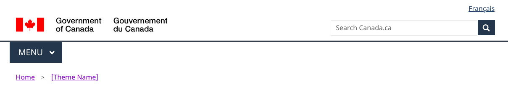

 

  <strong>
   From:
   <a href="https://www.canada.ca/en/treasury-board-secretariat.html">
    Treasury Board of Canada Secretariat
   </a>
  </strong>
 

 

  
   Mandatory
  
 

 <mark>
  update pictures
 </mark>
 

  <figure class="mrgn-bttm-lg">
   <figcaption>
    <b>
     Global header – large screen
    </b>
   </figcaption>
   
   

    

     Text version
    

    

     The global header has the Government of Canada signature in the top left. Under the signature is the theme and topic menu, and under the menu is the breadcrumb trail. The language toggle link is at the rop right. Under the language toggle is the site search box.
    

   

  </figure>
 

 

  <figure class="mrgn-bttm-lg">
   <figcaption>
    <b>
     Global header – small screen
    </b>
   </figcaption>
   
   

    

     Text version
    

    

     The global header has the Government of Canada signature in the top left.  The language toggle link is at the rop right. Under the signature and the language toggle is the site search box. Under the search box is the theme and topic menu. Under the theme and topic menu is the breadcrumb trail.
    

   

  </figure>
  

   The global header is at the top of each Government of Canada web page.
  

  

   The header consists of the following elements:
  

  <ul>
   <li>
    Background colour (white)
   </li>
   <li>
    Government of Canada signature
   </li>
   <li>
    Link to canada.ca landing page from Government of Canada signature
   </li>
   <li>
    Language toggle
   </li>
   <li>
    Site search box
   </li>
   <li>
    Sign in button
   </li>
   <li>
    Theme and topic menu
   </li>
   <li>
    Key line
   </li>
   <li>
    Breadcrumb trail
   </li>
  </ul>
 

 <h2>
  How to implement
 </h2>
 

  Elements can be configured for the type of asset you’re creating.
 

 <ul>
  <li>
   <b>
    Standard web page
   </b>
   : Pages where people can navigate away without losing data, triggering errors or terminating their
						session.
  </li>
  <li>
   <b>
    Transactional page
   </b>
   : Pages with an interaction task where people might lose data, trigger errors, or terminate their
						session if they navigate away from the page.
  </li>
  <li>
   <b>
    Campaigns
   </b>
   : Landing pages for external marketing or advertising campaigns. The flexibility in layout allows institutions
						to match elements of their external campaign with the landing page.
  </li>
  <li>
   <b>
    Web application
   </b>
   : Government of Canada Web applications that require authentication.
  </li>
 </ul>
 <h2 id="when">
  When to use
 </h2>
 

  The global header should be on all pages from the Goverment of Canada. Some elements are optional in these situations:
 

 <ul>
  <li>
   <strong>
    Transactional scenarios
   </strong>
   : Pages where people are engaged in a transactional process such that mistakenly following other links  would result in errors, loss of data or accidental termination of the session.
  </li>
  <li>
   <strong>
    Campaigns
   </strong>
   : Landing pages for external marketing or advertising campaigns. The flexibility in layout allows institutions to match elements of their external campaign with the landing page.
  </li>
 </ul>
 <h2 id="how">
  How to implement
 </h2>
 

  If you're not on the Managed Web Service, you can implement the global header by using the
  <a href="https://cenw-wscoe.github.io/sgdc-cdts/docs/index-en.html">
   Centrally Deployed Templates Solution (CDTS)
  </a>
  .
 

 

  Follow these requirements:
 

 <table class="table table-bordered table-condensed">
  <caption>
   Global header requirements
  </caption>
  <thead>
   <tr class="active">
    <th scope="col">
     Header element
    </th>
    <th scope="col">
     Standard page
    </th>
    <th scope="col">
     Campaign page
    </th>
    <th scope="col">
     Transactional page
    </th>
   </tr>
  </thead>
  <tbody>
   <tr>
    <td>
     <a href="https://design.canada.ca/common-design-patterns/signature.html">
      Government of Canada signature (linked to Canada.ca home)
     </a>
    </td>
    <td>
     Mandatory
    </td>
    <td>
     Mandatory
    </td>
    <td>
     Mandatory, but link to Canada.ca home page is optional
    </td>
   </tr>
   <tr>
    <td>
     <a href="https://design.canada.ca/common-design-patterns/language-toggle.html">
      Language toggle
     </a>
    </td>
    <td>
     Mandatory
    </td>
    <td>
     Mandatory
    </td>
    <td>
     Mandatory
     
      <a class="fn-lnk" href="#table1-fn1">
       
        table 1 note
       
       1
      </a>
     
    </td>
   </tr>
   <tr>
    <td>
     <a href="https://design.canada.ca/common-design-patterns/search-box.html">
      Site search box
     </a>
    </td>
    <td>
     Mandatory
    </td>
    <td>
     Optional
    </td>
    <td>
     Optional
    </td>
   </tr>
   <tr>
    <td>
     <a href="https://design.canada.ca/common-design-patterns/site-menu.html">
      Theme and topic menu
     </a>
    </td>
    <td>
     Mandatory
    </td>
    <td>
     Optional
    </td>
    <td>
     Optional
    </td>
   </tr>
   <tr>
    <td>
     <a href="https://design.canada.ca/common-design-patterns/breadcrumb-trail.html">
      Breadcrumb trail
     </a>
    </td>
    <td>
     Mandatory
    </td>
    <td>
     Optional
    </td>
    <td>
     Optional
    </td>
   </tr>
   <tr>
    <td>
     Background colour (white)
    </td>
    <td>
     Mandatory
    </td>
    <td>
     Optional
    </td>
    <td>
     Mandatory
    </td>
   </tr>
  </tbody>
  <tfoot>
   <tr>
    <td class="wb-fnote" colspan="4">
     <h2 class="wb-inv" id="table1-fn">
      Table 1 Notes
     </h2>
     <dl>
      <dt>
       Table 1 Note 1
      </dt>
      <dd id="table1-fn1">
       

        Transactional web applications must be developed so that people can toggle between official languages on any given page or screen. Some legacy web applications may not have been designed this way. Such applications should be updated to allow this functionality. Until they are replaced or updated, the language toggle can be omitted if its use would result in a loss of data.
       

       

        <a href="#table1-fn1-rf">
         
          Return to table 1 note
         
         1
         
          referrer
         
        </a>
       

      </dd>
     </dl>
    </td>
   </tr>
  </tfoot>
 </table>
 <h2 id="changes">
  Latest changes
 </h2>
 

  <strong>
   2020-06-25:
  </strong>
  the small screen version was modified to a slimmer version
 

