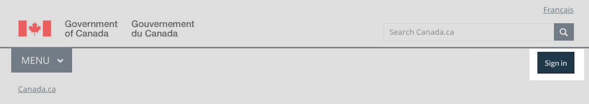
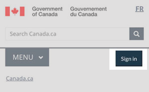

<section>
  
The Sign in button is an optional header element that directs people to government accounts that require authentication.
    It is a contextual and persistent call to action within a group of related pages.

  

    <figure class="mrgn-bttm-lg">
      <figcaption><b>Sign in – large screen</b></figcaption>
       </figure>
    <figure class="mrgn-bttm-lg">
      <figcaption><b>Sign in – small screen</b></figcaption>
       </figure>
  

</section>
<section>
  <h2>On this page</h2>
  <ul>
    <li><a href="#when">When to use</a></li>
    <li><a href="#avoid">What to avoid</a></li>
    <li><a href="#content">Content and design</a></li>
    <li><a href="#how">How to implement</a></li>
    <li><a href="#research">Research and rationale</a></li>
    <li><a href="#latest">Latest changes</a></li>
  </ul>
</section>
<section>
  <h2 id="when">When to use</h2>
  
Add the Sign in button when signing in to an account is a key task within a series of pages. This includes:

  <ul>
    <li>pages where there is already a link or button to an account or accounts</li>
    <li>a set of pages that support a specific service (such as Employment insurance, GST)</li>
    <li>pages where analytics show people are using the menu or the search bar to access an account</li>
  </ul>
  
You can use the Sign in button in addition to a supertask button on the same page. If you have an existing super task button, don’t remove it. Instead, add the Sign in button. You may see changes in use over time in your analytics that show that you can remove the super task button.

</section>
<section>
  <h2 id="avoid">What to avoid</h2>
  <ul>
    <li>Use Sign in, not Log in</li>
    <li>Exclude the Sign in button from:
      <ul>
        <li>account-chooser pages or sign-in process pages</li>
        <li>pages that aren’t related to the authenticated service</li>
      </ul>
    </li>
  </ul>
</section>
<section>
  <h2 id="content">Content and design</h2>
  
Find content and design specifications and visual examples.

  <h3>Content specifications</h3>
  
Use “Sign in” as the label

  <ul>
    <li><b>Small screens</b>: total of 12 characters including spaces (no additional descriptive text)</li>
    <li><b>Large/medium screens</b>: total of 25 characters including spaces (for additional descriptive text if needed, such as “Sign in to [account name]”)</li>
  </ul>
</section>
<section>
  <h3>Interactions</h3>
  
Link the Sign in button directly to the page where you begin your sign-in process, or to an account-chooser page with the
    different accounts you can sign in to.

  <h3>Design specifications</h3>
  
Button structure

  <ul>
    <li>Border:
      <ul>
        <li>weight: 1px</li>
        <li>style: solid</li>
        <li>radius: 0</li>
      </ul>
    </li>
  </ul>
  <ul>
    <li>Font:
      <ul>
        <li>weight: 400</li>
        <li>family: Lato</li>
        <li>size: 16px</li>
        <li>colour: #fff</li>
      </ul>
    </li>
  </ul>
  <ul>
    <li>Margin:
      <ul>
        <li>top margin: 5px</li>
        <li>other margins: 0px</li>
      </ul>
    </li>
  </ul>
  <ul>
    <li>Padding:
      <ul>
        <li>top: 10px</li>
        <li>bottom: 10px</li>
        <li>left: 14px</li>
        <li>right: 14px</li>
      </ul>
    </li>
  </ul>
  
Default state

  <ul>
    <li>background colour: #26374a</li>
    <li>border colour: #26374a</li>
  </ul>
  
Hover state

  <ul>
    <li>background colour: #444</li>
    <li>border colour: #444</li>
  </ul>
  <h3> Visual examples</h3>
  

    <figure>
      <figcaption><b>Contextual Sign in button - large screen</b></figcaption>
      
      

        
Image description: Contextual Sign in button - large screen

        
Standard header of an English Canada.ca page with the Sign in button highlighted

      

    </figure>
  

  

    <figure>
      <figcaption><b>Contextual Sign in button - small screen</b></figcaption>
      
      

        
Image description: Contextual Sign in button - small screen

        
Standard header of an English Canada.ca page with the Sign in button highlighted

      

    </figure>
  

</section>
<section>
  <h2 id="how">How to implement</h2>
  
Find working examples and code for implementing the header.

  <h3>GCweb (WET) theme implementation reference</h3>
  
The implementation reference includes how to configure each element of the header.

  <ul>
    <li><a href="https://wet-boew.github.io/GCWeb/sites/authentication/authentication-en.html">Authentication patterns</a></li>
  </ul>
  <h3>Implementations</h3>
  
Determine what best suits the type of page you're creating.

  

    

      

        

          

            
<strong>GC-AEM</strong>

            
For the Government of Canada Adobe Experience Manager (AEM):

            <ul>
              <li><a href="https://www.gcpedia.gc.ca/wiki/AEM_GC-specific_Documentation_6.5">AEM/Managed Web Service documentation (GCPedia link - only available on the Government of Canada network)</a></li>
            </ul>
          

          

            
<strong>CDTS</strong>

            
For the Centrally Deployed Templates Solution (CDTS):

            <ul>
              <li><a href="https://cenw-wscoe.github.io/sgdc-cdts/docs/index-en.html">CDTS documentation</a></li>
            </ul>
          

          

            
<strong>Drupal WxT</strong>

            
For Drupal WxT:

            <ul>
              <li><a href="https://drupalwxt.github.io/en/">Drupal WxT documentation</a></li>
            </ul>
          

        

      

    

  

</section>
<section>
  <h2 id="research">Research and rationale</h2>
  <ul>
    <li><a href="https://blog.canada.ca/2022/09/23/introducing-contextual-sign-in-button">Introducing the contextual Sign in button</a></li>
  </ul>
  
We introduced the contextual sign in button to improve findability for this top task.

</section>
<section>
  <h2 id="latest">Latest changes</h2>
  <dl class="dl-horizontal">
    <dt>
      <time datetime="2023-06-15" class="link-muted">2023-06-15</time>
    </dt>
    <dd>Updated the guidance to include advice on what to avoid, content and design specifications, visual examples, implementation guidance, and policy rationale</dd>
    <dt>
      <time datetime="2022-08-17" class="link-muted">2022-08-17</time>
    </dt>
    <dd>Expanded Sign in button guidance</dd>
  </dl>
</section>
