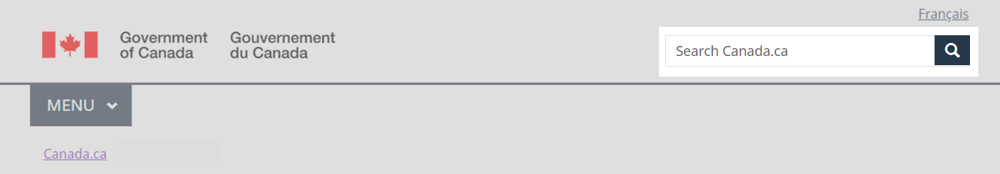
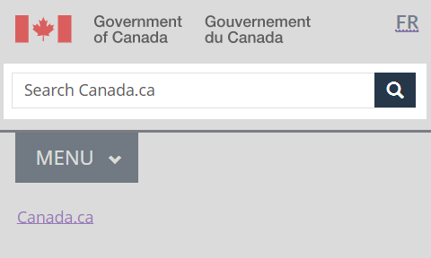

  

    <ul class="list-inline small mrgn-bttm-sm" id="list-inline-desktop-only">
      <li class="mrgn-rght-lg"> Last updated: {{ page.dateModified }}</li>
    </ul>
  

Mandatory on standard and campaign pages

The site search box is an element of the global header. It allows people to search Government of Canada content using a simple search field.

Results for site search are at the level of all Government of Canada web content, or a subset of content at the department or agency level.

  <figure class="mrgn-bttm-sm"></figure>

<section>
  <h2>On this page</h2>
  <ul>
    <li><a href="#when">When to use</a></li>
    <li><a href="#avoid">What to avoid</a></li>
    <li><a href="#content">Content and design</a></li>
    <li><a href="#implementation">How to implement</a></li>
    <li><a href="#research">Research and rationale</a></li>
    <li><a href="#changes">Latest changes</a></li>
  </ul>
</section>
<h2 id="when">When to use</h2>

The site search box is mandatory on all pages, except transactional pages.

<h2 id="avoid">What to avoid</h2>

Don’t use the site search box for searching anything other than content indexed by GC Search. Place search for other datasets within the content area of the page.

<h2 id="content">Content and design</h2>

Find content and design specifications and visual examples.

<h3>Content specifications</h3>

The site search box consists of 3 visual elements:

<ul>
  <li>text input field (maximum 170 characters)</li>
  <li>input box placeholder text</li>
  <li>search button with magnifying glass icon</li>
</ul>

In the text input field, the placeholder label is:

<ul>
  <li>“Search Canada.ca” in English</li>
  <li>"Rechercher dans Canada.ca" in French</li>
</ul>

The placeholder label in a contextualized search box is:

<ul>
  <li>“Search [institution]” in English</li>
  <li>"Rechercher dans [institution]" in French</li>
</ul>
<h4>Interactions</h4>
<ul>
  <li>Searches query the GC Search index. Typing a search term in the input field and selecting the search icon opens a results page.</li>
</ul>
<h3>Design specifications</h3>
<ul>
  <li>Position: top-right corner of the global header area, below the language toggle link</li>
  <li>Form class: form-inline</li>
  <li>Button icon: glyphicon-search glyphicon</li>
  <li>Button class: btn btn-primary btn-small</li>
  <li>Colour: #26374a</li>
  <li>Length of input field: maxlength=170</li>
  <li>Value size: 34</li>
</ul>

The search elements are responsive.  They scale according to screen size.

<h3>Visual examples</h3>

  <figure>
    <figcaption><b>Site search box - large screen</b></figcaption>
    
    

      
Image description: site search box - large screen

      
The search box appears in the top-right corner, underneath the language toggle and directly across from the Government of Canada signature. 

      
The site search bar is a rectangle, defined by a light grey border. Within the rectangle are the words, ‘Search Canada.ca’.  To the right of the rectangle is a blue square with a white magnifying glass icon within.

         

  </figure>

  <figure>
    <figcaption><b>Site search box - small screen</b></figcaption>
    
    

      
Image description: site search box - small screen

      
The search box appears in the header, directly below the Government of Canada signature and the language toggle. It spans across the screen.

      
The site search bar is a rectangle, defined by a light grey border. Within the rectangle are the words, ‘Search Canada.ca’.  To the right of the rectangle is a blue square with a white magnifying glass icon within. 

    

  </figure>

<h2 id="implementation">How to implement</h2>

Find working examples for implementing the site search box.

<h3>GCweb (WET) theme implementation reference</h3>

The implementation reference includes how to configure each element of the header.

<ul>
  <li><a href="https://wet-boew.github.io/GCWeb/sites/header/header-docs-en.html">GCWeb (WET) header documentation</a></li>
</ul>
<h3>Implementations</h3>

Determine what best suits the type of page you're creating.

  

    

      

        

          
<strong>GC-AEM</strong>

          
For the Government of Canada Adobe Experience Manager (AEM):

          <ul>
            <li><a href="https://www.gcpedia.gc.ca/wiki/AEM_GC-specific_Documentation_6.5">AEM/Managed Web Service documentation (GCPedia link - only available on the Government of Canada network)</a></li>
          </ul>
        

        

          
<strong>CDTS</strong>

          
For the Centrally Deployed Templates Solution (CDTS):

          <ul>
            <li><a href="https://cdts.service.canada.ca/app/cls/WET/gcweb/v4_0_45/cdts/samples/custom-search-en.html">Custom search</a> - configuration options for the site search box</li>
            <li><a href="https://cenw-wscoe.github.io/sgdc-cdts/docs/index-en.html">CDTS documentation</a></li>
          </ul>
        

        

          
<strong>Drupal WxT</strong>

          
For Drupal WxT:

          <ul>
            <li><a href="https://drupalwxt.github.io/en/">Drupal WxT documentation</a></li>
          </ul>
        

      

    

  

<h3>Configure search</h3>

The Principal Publisher provides support for GC Search adoption, search configuration, indexing of web pages, functionality errors and other search related requests:

<ul>
  <li><a href="https://www.gcpedia.gc.ca/wiki/GC_Search_Support">GC Search Support (only available on the GC network)</a></li>
</ul>
<h2 id="research">Research and rationale</h2>

Placing site search in the top-right corner of a web page is an established web convention.

<h3>Policy rationale</h3>

As part of the global header, the site search box is a mandatory element under the <cite>Content and Information Architecture Specification.</cite>

<ul>
  <li><a href="https://www.canada.ca/en/treasury-board-secretariat/services/government-communications/canada-content-information-architecture-specification/mandatory-elements.html">Mandatory elements of the design system</a></li>
</ul>
<h2 id="changes">Latest changes</h2>
<dl class="dl-horizontal">
  <dt>
    <time datetime="2023-06-26" class="link-muted">2023-06-26</time>
  </dt>
  <dd>Updated the guidance to include advice on what to avoid, content and design specifications, visual examples, implementation guidance, support for search configuration, and policy rationale</dd>
</dl>
