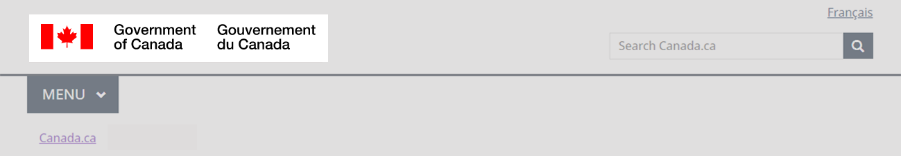

  

    <ul class="list-inline small mrgn-bttm-sm" id="list-inline-desktop-only">
      <li class="mrgn-rght-lg"> Last updated: {{ page.dateModified }}</li>
    </ul>
  

Mandatory on all pages

The Government of Canada signature is a mandatory element of the global header. The signature is an official symbol of the Government of Canada. It combines the flag symbol and “Government of Canada” in both official languages.

The Government of Canada signature helps users identify that the page they are on belongs to the Government of Canada.

  <figure class="mrgn-bttm-sm"></figure>

<section>
  <h2>On this page</h2>
  <ul>
    <li><a href="#when">When to use</a></li>
    <li><a href="#avoid">What to avoid</a></li>
    <li><a href="#content">Content and design</a></li>
    <li><a href="#implementation">How to implement</a></li>
    <li><a href="#research">Research and rationale</a></li>
    <li><a href="#changes">Latest changes</a></li>
  </ul>
</section>
<h2 id="when">When to use</h2>

The Government of Canada signature is mandatory on all pages.

<h2 id="avoid">What to avoid</h2>

Don’t modify the signature.

Don’t change the colour of the flag. It must appear in colour (red), not in black and white.

Don’t modify the text (Government of Canada Gouvernement du Canada) or the font.

<h2 id="content">Content and design</h2>

Find content and design specifications and visual examples.

<h3>Content specifications</h3>
  
The Government of Canada signature appears in the top-left corner of the page.

  
The signature is composed of the flag symbol in Federal Identity Program red, followed by the words Government of Canada in English and Gouvernement du Canada in French, both in black text.

  
The signature must appear as English first on English pages and French first on French pages.

<h4>Accessibility</h4>

Include Government of Canada as alt text on the English side, Gouvernement du Canada as alt text on the French side.

<h4>Interactions</h4>

When selected, the signature brings the user to the homepage of Canada.ca.

<h3>Design specifications</h3>
<ul>
  <li>Type: image</li>
  <li>Position: top left</li>
  <li>Flag symbol colour: FIP red (#eb4837)</li>
  <li>Text colour: black (#000000)</li>
  <li>Alt text: Government of Canada</li>
</ul>

The signature is a Scalable Vector Graphics (SVG) file, configured to scale automatically according to screen size.

The signature is an image file that must be formatted according to the <a href="https://www.canada.ca/en/treasury-board-secretariat/services/government-communications/design-standard.html">Design Standard for the Federal Identity Program</a>.

<h3>Visual examples</h3>

  <figure>
    <figcaption><b>Government of Canada signature - large screen</b></figcaption>
    
    

      
Image description: Government of Canada signature - large screen

      
The Government of Canada signature is in the top-left corner of the website. It is composed of the flag symbol in red, followed by the words <strong>Government of Canada</strong> in English and <strong>Gouvernement du Canada</strong> in French, both in black text.

    

  </figure>

  <figure>
    <figcaption><b>Government of Canada signature - small screen</b></figcaption>
    
    

      
Image description: Government of Canada signature - small screen

      
The Government of Canada signature is in the top-left corner of the website. It is composed of the flag symbol in red, followed by the words <strong>Government of Canada</strong> in English and <strong>Gouvernement du Canada</strong> in French, both in black text.

    

  </figure>

<h2 id="implementation">How to implement</h2>

Find working examples for implementing the GC signature, an element of the global header.

<h3>GCweb (WET) theme implementation reference</h3>

The implementation reference includes how to configure each element of the header.

<ul>
  <li><a href="https://wet-boew.github.io/GCWeb/sites/header/header-docs-en.html">GCWeb (WET) header documentation</a></li>
</ul>
<h3>Implementations</h3>

Determine what best suits the type of page you're creating.

  

    

      

        

          
<strong>GC-AEM</strong>

          
For the Government of Canada Adobe Experience Manager (AEM):

          <ul>
            <li><a href="https://www.gcpedia.gc.ca/wiki/AEM_GC-specific_Documentation_6.5">AEM/Managed Web Service documentation (GCPedia link - only available on the Government of Canada network)</a></li>
          </ul>
        

        

          
<strong>CDTS</strong>

          
For the Centrally Deployed Templates Solution (CDTS):

          <ul>
            <li><a href="https://cenw-wscoe.github.io/sgdc-cdts/docs/index-en.html">CDTS documentation</a></li>
          </ul>
        

        

          
<strong>Drupal WxT</strong>

          
For Drupal WxT:

          <ul>
            <li><a href="https://drupalwxt.github.io/">Drupal WxT documentation</a></li>
          </ul>
        

      

    

  

<h2 id="research">Research and rationale</h2>

Consult research findings and policy rationale.

<h3>Research findings</h3>

Trust and consistency are essential. Our Canada.ca Trust Study and prior research show that a consistent header is necessary to maintaining a trusted brand.

For example, people trust the page more when the flag in the Government of Canada signature is red.

If you want to know more about this research, contact the Digital Transformation Office at <a href="mailto:{{ site.emails.dto }}">{{ site.emails.dto }}</a>.

<h3>Policy rationale</h3>

The Government of Canada signature is defined by the Federal Identity Program. As a part of the global header, it is a mandatory element under the <cite>Content and Information Architecture Specification.</cite>

<ul>
  <li><a href="https://www.canada.ca/en/treasury-board-secretariat/services/government-communications/design-standard/colour-design-standard-fip.html">Design Standard for the Federal Identity Program</a></li>
  <li><a href="https://www.canada.ca/en/treasury-board-secretariat/services/government-communications/canada-content-information-architecture-specification/mandatory-elements.html">Mandatory elements of the design system</a></li>
</ul>
<h2 id="changes">Latest changes</h2>
<dl class="dl-horizontal">
  <dt>
    <time>2023-06-26</time>
  </dt>
  <dd>Updated the guidance to include advice on what to avoid, content and design specifications, visual examples, implementation guidance, research findings and policy rationale</dd>
</dl>
