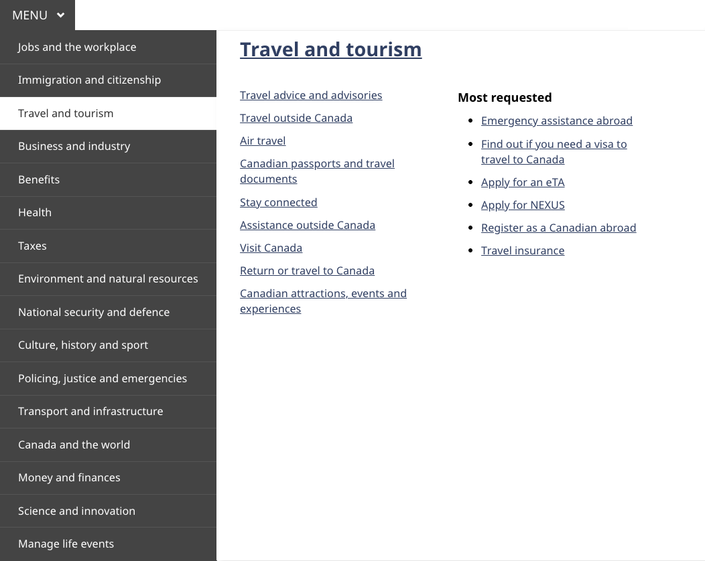
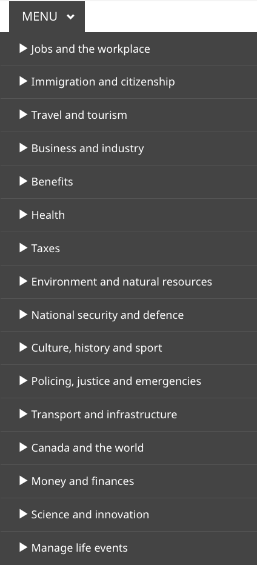
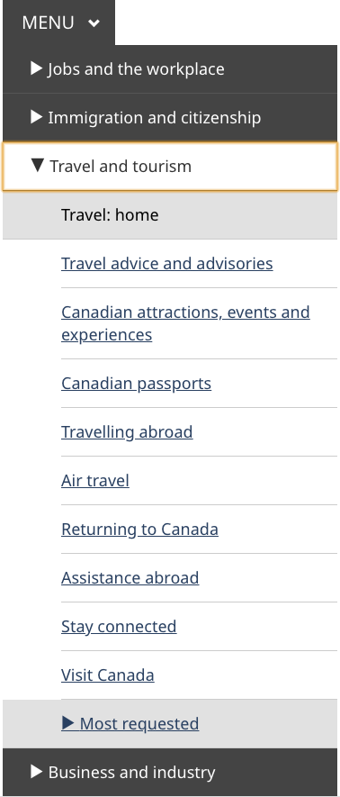
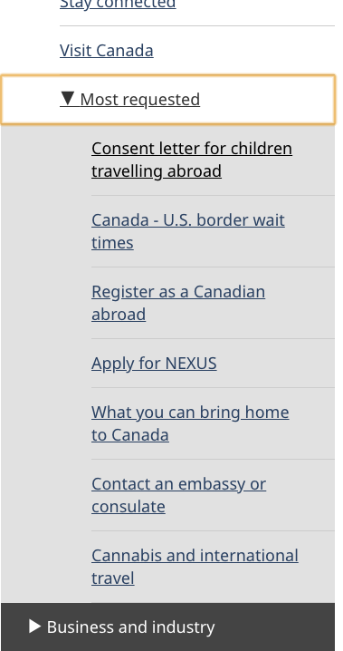

	

		<ul class="list-inline small mrgn-bttm-sm" id="list-inline-desktop-only">
			<li class="mrgn-rght-lg"> Last updated: {{ page.dateModified }}</li>
		</ul>
	

Mandatory on standard pages

The theme and topic menu provides access to the top tasks from all Government of Canada websites grouped under the main themes of Canada.ca.

	<figure class="mrgn-bttm-sm"></figure>

<section>
	<h2>On this page</h2>
	<ul>
		<li><a href="#when">When to use</a></li>
		<li><a href="#avoid">What to avoid</a></li>
		<li><a href="#content">Content and design</a></li>
		<li><a href="#implementation">How to implement</a></li>
		<li><a href="#research">Research and rationale</a></li>
		<li><a href="#changes">Latest changes</a></li>
	</ul>
</section>
<h2 id="when">When to use</h2>

<strong>2023 design update</strong>: We’ve recently updated this pattern as part of a new navigation strategy coming out of the Wayfinding research project. The theme and topic menu is in transition. To find out more about this project, visit the <a href="#research">Research and rationale</a> section on this page. 

<h3>Current situation</h3>

Apply the theme and topic menu as follows:

<ul>
	<li><strong>campaign pages</strong> optional</li>
	<li><strong>transactional pages</strong> optional but not recommended</li>
	<li><strong>theme and topic pages</strong> mandatory</li>
</ul>

On <strong>standard destination pages</strong> and <strong>institutional landing pages</strong>, the theme and topic menu is mandatory until ALL the following conditions are met:

<ul>
	<li>the page has the 2023 <a href="site-footer.html">global footer</a></li>
	<li>the menu regularly receives less than 1% of clicks within a group of related pages
		<ul>
			<li>if you’re adopting the design for the first time, you don’t need to add the menu</li>
		</ul>
	</li>
	<li>you’ve added a <a href="contextual-signin.html">contextual Sign in button</a> where it’s relevant to the content</li>
</ul>

A group of pages might be all the pages related to a specific program or service, or all the pages related to a single organization.

<h3>Future state</h3>

Eventually we will retire the theme and topic menu pattern. Links to the theme pages will remain available through the main band of the global footer and the breadcrumb trail.

<h2 id="avoid">What to avoid</h2>

Don’t repurpose the Theme and topic menu for other navigation. The menu is a global navigation tool. It’s confusing for users if it behaves differently depending on where they are in the site.

Don’t remove it from standard destination pages before you meet the conditions above.

Don’t change the style or colour scheme.

Don’t put additional links or text in the flyout.

<h2 id="content">Content and design</h2>

The theme and topic menu consists of 3 integrated elements - the menu button which opens and closes the menu, the theme list that allows for choosing between themes, and the flyout that presents topics and most requested links for each theme.

<h3>Content specifications</h3>
<ol>
	<li>Menu button:
		<ul>
			<li>label is “MENU” with a downwards caret</li>
		</ul>
	</li>
	<li class="mrgn-tp-lg">Theme list, which includes the 15 main Canada.ca themes in the following order:
		<ul>
			<li>Jobs and the workplace</li>
			<li>Immigration and citizenship</li>
			<li>Travel and tourism</li>
			<li>Business and industry</li>
			<li>Benefits</li>
			<li>Health</li>
			<li>Taxes</li>
			<li>Environment and natural resources</li>
			<li>National security and defence</li>
			<li>Culture, history and sport</li>
			<li>Policing, justice and emergencies</li>
			<li>Transport and infrastructure</li>
			<li>Canada and the world</li>
			<li>Money and finances</li>
			<li>Science and innovation</li>
		</ul>
	</li>
	<li class="mrgn-tp-lg">Flyout:
		
Hovering or clicking on one of the 15 themes reveals a flyout containing:

		<ul>
			<li>a link to the landing page for the theme itself</li>
			<li>first-level topics within that theme</li>
			<li>Most requested links based on the highest demand items for that theme</li>
		</ul>
	</li>
</ol>

Topics and Most requested links should appear in the same order on both the menu and the theme page.

<h4>Interactions</h4>
<h5>Large screens</h5>
<ul>
	<li>Clicking on the menu button expands the theme list element with the Jobs flyout open</li>
	<li>Once opened, hovering or clicking on one of the 15 themes reveals a flyout for that theme</li>
	<li>Clicking on the menu a second time closes it</li>
</ul>
<h5>Small screens</h5>
<ul>
	<li>Tapping the menu button expands the theme list as a series of submenu options</li>
	<li>Tapping any theme option expands the list of topics for that theme and reveals another submenu option for the Most requested</li>
	<li>Tapping the Most requested option expands the list of most requested links for that theme</li>
	<li>Tapping any expanded item again will close it</li>
</ul>
<h3>Design specifications</h3>
<ol>
	<li>Menu button styles:
		<ul>
			<li>Background colour: primary accent colour (#26374a)</li>
			<li>Text colour: white (#FFFFFF)</li>
			<li>Text size: 20px or 1em</li>
			<li>Font: Noto Sans</li>
		</ul>
		
Note: The homepage of Canada.ca uses different styling for the menu button. That styling is reserved for the homepage only.

	</li>
	<li class="mrgn-tp-lg">Theme list styles:
		<ul>
			<li>Background colour: (#444)</li>
			<li>Text colour: white (#FFF)</li>
			<li>Background colour selected: (#FFF)</li>
			<li>Text colour when selected: dark grey (#333)</li>
			<li>Text size: 18px</li>
			<li>Font: Noto Sans</li>
		</ul>
	</li>
	<li class="mrgn-tp-lg">Flyout styles:
		<ul>
			<li>Background colour: primary accent colour (#FFF)</li>
			<li>Text colour: white (#284162)</li>
			<li>Text size: 18px</li>
			<li>Text size theme title: 32px</li>
			<li>Font: Noto Sans</li>
		</ul>
	</li>
</ol>
<h3>Visual examples</h3>

	<figure>
		<figcaption><b>Theme and topic menu with flyout open - large screen</b></figcaption>
		
		

			
Image description: theme and topic menu with flyout open - large screen

			
The theme and topic menu consists of a button with the word "Menu" and a downward-facing chevron. When clicked, it expands to a menu that exposes the titles of all 15 themes. When the title of a theme is clicked a menu flyout appears on the right-hand side of the theme menu. The theme title is featured prominently at the top of the flyout while the main topics are listed below the title on the left-hand side. On the right-hand side of the flyout there is a "Most requested" heading followed by a list of the most requested tasks.

		

	</figure>

	<figure>
		<figcaption><b>Theme and topic menu – small screen</b></figcaption>
		
		

			
Image description: theme and topic menu  - small screen

			
The theme and topic menu consists of a button with the word "Menu" and a downward-facing chevron. When clicked, it expands to a menu that exposes the titles of all 15 themes. When the title of a theme is clicked a menu flyout appears on the right-hand side of the theme menu. The theme title is featured prominently at the top of the flyout while the main topics are listed below the title on the left-hand side. On the right-hand side of the flyout there is a "Most requested" heading followed by a list of the most requested tasks.

		

	</figure>

	<figure>
		<figcaption><b>Theme and topic submenu open – small screen</b></figcaption>
		
		

			
Image description: theme and topic submenu open – small screen

			
The theme and topic menu consists of a button with the word "Menu" and a downward-facing chevron. When clicked, it expands to a menu that exposes all themes. The "Travel and tourism"  theme is expanded. It has a downwards-facing chevron to the left of the title "Travel and tourism". Below that title is a box with the words "Travel: home". Below that are links to the other topics within the theme. At the end of the expanded menu is another box with a sideways-facing chevron and a "Most requested" heading.

		

	</figure>

	<figure>
		<figcaption><b>Theme and topic menu with most requested submenu open - small screen</b></figcaption>
		
		

			
Image description: theme and topic menu with most requested submenu open - small screen

			
The "Most requested" menu is expanded. It has a downwards-facing chevron to the left of the words "Most requested". Underneath this heading are links to the 7 most requested pages for that theme.

		

	</figure>

<h2 id="implementation">How to implement</h2>

Find working examples and code for implementing the theme and topic menu.

<h3>GCweb (WET) theme implementation reference</h3>

The implementation reference includes how to configure each element of the header.

<ul>
	<li><a href="https://wet-boew.github.io/GCWeb/sites/gcweb-menu/gcweb-menu-docs-en.html">Theme and topic menu</a></li>
	<li><a href="https://wet-boew.github.io/GCWeb/sites/header/header-docs-en.html">GCWeb (WET) header documentation</a></li>
</ul>
<h3>Implementations</h3>

Determine whether you have to include the Theme and topic menu.

	

		

			

				

					
<strong>GC-AEM</strong>

					
For the Government of Canada Adobe Experience Manager (AEM):

					<ul>
						<li><a href="https://www.gcpedia.gc.ca/wiki/AEM_GC-specific_Documentation_6.5">AEM/Managed Web Service documentation (GCPedia link - only available on the Government of Canada network)</a></li>
					</ul>
				

				

					
<strong>CDTS</strong>

					
For the Centrally Deployed Templates Solution (CDTS):

					<ul>
						<li><a href="https://cenw-wscoe.github.io/sgdc-cdts/docs/index-en.html">CDTS documentation</a></li>
					</ul>
				

				

					
<strong>Drupal WxT</strong>

					
For Drupal WxT:

					<ul>
						<li><a href="https://drupalwxt.github.io/en/">Drupal WxT documentation</a></li>
					</ul>
				

			

		

	

<h2 id="research">Research and rationale</h2>

Consult research findings and policy rationale.

<h3>Research findings</h3>

We updated the theme and topic menu guidance to align with a new overall navigation strategy that came out of the Wayfinding research project.

<ul>
<li><a href="https://blog.canada.ca/research-summaries/wayfinding-on-canada-ca">Wayfinding on Canada.ca research summary</a> 
	Explains the context of the research and the insights that drove the design updates</li>
<li><a href="https://blog.canada.ca/2022/12/21/wayfinding-research-project">Wayfinding research project improves our approach to navigation on Canada.ca</a> 
	Blog post explaining the changes that are being made to the Canada.ca design, and how they are being implemented</li>
</ul>
<h2 id="changes">Latest changes</h2>
<dl class="dl-horizontal">
	<dt>
		<time>2023-MM-DD</time>
	</dt>
	<dd>Updated pattern to reflect design changes from wayfinding project, and to include advice on what to avoid, content and design specifications, visual examples, implementation guidance, research and policy rationale</dd>
</dl>
