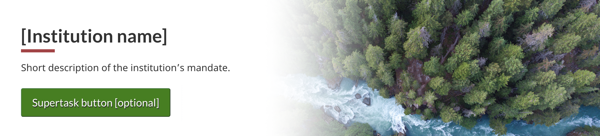
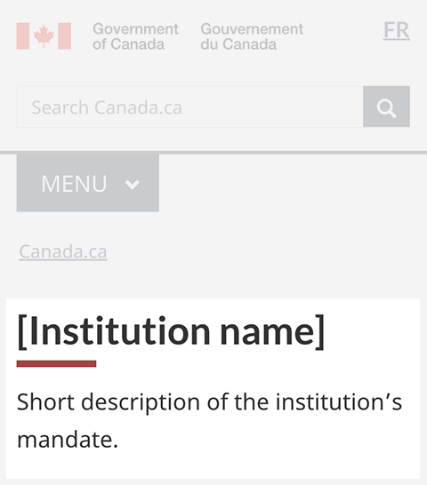

<strong>Last updated</strong>: {{ page.dateModified }}

The introduction block pattern introduces the content of a landing page.

<section>
    <h2>On this page</h2>
    <ul>
        <li><a href="#use">When to use</a></li>
        <li><a href="#avoid">What to avoid</a></li>
        <li><a href="#design">Content and design</a></li>
        <li><a href="#implement">How to implement</a></li>
        <li><a href="#research">Research and rationale</a></li>
        <li><a href="#latest">Latest changes</a></li>
        <li><a href="#discuss">Discussion</a></li>
    </ul>
</section>
<section>
    <h2 id="use">When to use</h2>
    
The introduction block pattern is a mandatory element for institutional landing pages and topic pages. It’s optional for other landing pages.

</section>
<section>
    <h2 id="avoid">What to avoid</h2>
    
Don’t use this on destination pages when people are trying to complete a task.

</section>
<section>
    <h2 id="design">Content and design</h2>
    
Find content and design specifications and visual examples.

    <h3>Content specifications</h3>
    
The introduction block pattern consists of:

    <ul>
        <li><a href="#title">title</a></li>
        <li><a href="#short-desc">short description</a></li>
    </ul>
    
It can also include:

    <ul>
        <li><a href="#image">image</a></li>
        <li><a href="#super-task">super task button</a></li>
    </ul>
    <h4 id="title">Title</h4>
    
The page title should be descriptive and unique, but brief.

    
Don’t use acronyms or abbreviations in the title.

    <h4 id="short-desc">Short description</h4>
    
Keep the text short and concise, 1 or 2 lines is ideal.

    <ul>
        <li>approximately 145 characters with spaces</li>
    </ul>
    
Write in plain language.

    <h4 id="image">Image</h4>
    
Only use decorative images because the image is hidden on small screens.

    
Don't apply a link to the image, use the featured link pattern instead.

    <ul>
        <li><a href="./featured-link.html">Featured link pattern</a></li>
    </ul>
    
Limit use of text in images.

    <ul>
        <li><a href="http://www.canada.ca/en/treasury-board-secretariat/services/government-communications/canada-content-style-guide.html">Consult the Canada.ca Style Guide</a> for further guidance on images.</li>
    </ul>
    <h4 id="super-task">Super task button</h4>
    
Only include a super task button if there’s a specific task that has at least 1/3 of the clickthrough rate from the page.

    
Find out how to use a super task button:

    <ul>
        <li><a href="https://design.canada.ca/common-design-patterns/buttons.html">Buttons - Canada.ca design pattern</a></li>
    </ul>
    <h3>Design specifications</h3>
    <ul>
        <li>
            Title and short description
            <ul>
                <li>The title is an H1 and the short description uses body text</li>
                <li>Use <a href="https://design.canada.ca/styles/typography.html">standard typography styles</a></li>
            </ul>
        </li>
        <li>
            Image
            <ul>
                <li>1200px by 726px</li>
                <li>Image ratio: 1.65:1</li>
                <li>Visible on large screens, but hidden on medium and small screens</li>
                <li>Treated as a background image and positioned to the right</li>
            </ul>
        </li>
        <li>
            Supertask button
            <ul>
                <li><a href="https://design.canada.ca/common-design-patterns/buttons.html#action">See details for the supertask button</a></li>
                <li></li>
            </ul>
        </li>
    </ul>
    <h4>Accessibility</h4>
    <ul>
        <li>If you’re superimposing text over an image, ensure there’s a contrast ratio of at least 4.5:1.</li>
    </ul>
    <h3>Visual examples</h3>
    

        <figure class="mrgn-tp-md mrgn-bttm-lg">
            <figcaption><b>Introduction block - Large screen</b></figcaption>
            
            

                
Image description:

                
The introduction block appears below the global header and the Canada.ca breadcrumb. It consists of an h1 for Institution name and a short description of the institution’s mandate.

            

        </figure>
    

    

        <figure class="mrgn-tp-md mrgn-bttm-lg">
            <figcaption><b>Introduction block - small screen</b></figcaption>
            
            

                
Image description:

                
The introduction block appears below the global header and the Canada.ca breadcrumb. It consists of an h1 for Institution name and a short description of the institution’s mandate.

            

        </figure>
    

</section>
<section>
    <h2 id="implement">How to implement</h2>
    <mark>we need the right text for here linking to the GCWeb example</mark>
    <h3>Implementations</h3>
  
Determine what best suits the type of page you're creating.

  

  

    

      

        

          
<strong>GC-AEM</strong>

          
For the Government of Canada Adobe Experience Manager (AEM):

          <ul>
            <li><a href="https://www.gcpedia.gc.ca/wiki/AEM_GC-specific_Documentation_6.5">AEM/Managed Web Service documentation (GCPedia link - only available on the Government of Canada network)</a></li>
          </ul>
        

        

          
<strong>CDTS</strong>

          
For the Centrally Deployed Templates Solution (CDTS):

          <ul>
            <li><a href="https://cenw-wscoe.github.io/sgdc-cdts/docs/index-en.html">CDTS documentation</a></li>
          </ul>
        

        

          
<strong>Drupal WxT</strong>

          
For Drupal WxT:

          <ul>
            <li><a href="https://drupalwxt.github.io/en/">Drupal WxT documentation</a></li>
          </ul>
        

      

    

  

</section>
<section>
    <h2 id="research">Research and rationale</h2>
    
Consult research findings and policy rationale.

    <h3>Research fidings</h3>
    
<a href="https://blog.canada.ca/research-summaries/cra-contact-us-research-summary.html">Research summary: Contact the CRA</a>

    
Canada Revenue Agency and DTO developed the introduction block as part of the optimization project for CRA contacts.

    

        We found the introduction block design to be useful on institutional landing pages, especially in situations where a supertask button is needed. Check the research summary for additional information about other aspects of the
        project.
    

    <h3>Policy rationale</h3>
    
The introduction block pattern is required in the following mandatory templates:

    <ul>
        <li><a href="">Institutional landing page</a></li>
        <li><a href="https://design.canada.ca/mandatory-templates/theme-topic.html">Theme and topic page template</a></li>
    </ul>
</section>
<section>
    <h2 id="latest">Latest changes</h2>
    <dl class="dl-horizontal">
        <dt>
            <time datetime="2023-08-20" class="link-muted">2023-08-20</time>
        </dt>
        <dd>Updated the guidance to include content and design specifications, visual examples and implementation guidance</dd>
    </dl>
</section>
