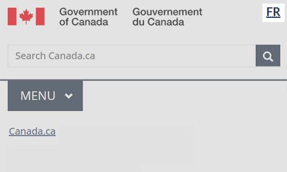

  

    <ul class="list-inline small mrgn-bttm-sm" id="list-inline-desktop-only">
      <li class="mrgn-rght-lg"> Last updated: YYYY-MM-DD</li>
    </ul>
  

Mandatory

All public-facing Government of Canada content is available in both official languages. A language toggle in the global header provides access to the corresponding page in the other official language.

  <figure class="mrgn-bttm-sm"></figure>

<section>
  <h2>On this page</h2>
  <ul>
    <li><a href="#when">When to use</a></li>
    <li><a href="#avoid">What to avoid</a></li>
    <li><a href="#content">Content and design</a></li>
    <li><a href="#implementation">How to implement</a></li>
    <li><a href="#research">Research and rationale</a></li>
    <li><a href="#changes">Latest changes</a></li>
  </ul>
</section>
<h2 id="when">When to use</h2>

The language toggle is mandatory on all pages.

New transactional pages for web applications must allow people to toggle between official languages. Legacy web applications that don’t support toggling should be updated or replaced. Until then, you can omit the language toggle if its use results in a loss of data.

<h2 id="avoid">What to avoid</h2>

Don’t put other language options in the language toggle. It is only for English and French. Links to content in other languages should appear in the content area of the page.

Don’t use the language toggle to point to anything other than the corresponding page in the equivalent language.

<h2 id="content">Content and design</h2>

Find content and design specifications and visual examples.

<h3>Content specifications</h3>

Ensure that the language toggle links to the corresponding page in the alternate language.

<h4>Large screens</h4>
<ul>
  <li>On English pages, the link label text is “Français”</li>
  <li>On French pages, the link label text is “English”</li>
</ul>
<h4>Small screens</h4>

For small screens, the language toggle uses a 2-letter abbreviation for each language:

<ul>
  <li>On English pages, the link label text is “FR” in uppercase</li>
  <li>On French pages, the link label text is “EN” in uppercase</li>
</ul>
<h4>Accessibility</h4>
<ul>
  <li>Add the full name of the language in the title attribute for the abbreviated language toggle
    <ul>
      <li>the abbreviation title for EN is “English”</li>
      <li>the abbreviation title for FR is “Français”</li>
    </ul>
  </li>
</ul>
<h4>Interactions</h4>
<ul>
  <li>When selected, the language toggle brings the user to the alternate language version of the page they were on</li>
</ul>
<h3>Design specifications</h3>
<ul>
  <li>Type: link</li>
  <li>Position: top-right corner</li>
  <li>Font: Lato</li>
  <li>Size: 1.2 em</li>
  <li>Text colour:
    <ul>
      <li>default link: #284162</li>
      <li>selected link (on hover or focus): #0535d2</li>
      <li>visited link: #284162</li>
    </ul>
  </li>
</ul>
<h4>Accessibility</h4>
<ul>
  <li>Label the language toggle code so that it’s spoken in the correct language if read aloud by assistive technologies</li>
  <li>Ensure that the text label for the language toggle won’t be translated by browser translation tools</li>
</ul>
<h3>Visual examples</h3>

  <figure>
    <figcaption><b>Language toggle (English page) - large screen</b></figcaption>
    
    

      
Image description: language toggle (English page) - large screen

      
Standard header of an English Canada.ca page with a highlight of the linked word Français in the top-right corner

    

  </figure>

  <figure>
    <figcaption><b>Language toggle (French page) - large screen</b></figcaption>
    
    

      
Image description: language toggle (French page) - large screen

      
Standard header of a French Canada.ca page with a highlight of the linked word English in the top-right corner

    

  </figure>

  <figure>
    <figcaption><b>Language toggle (English page) - small screen</b></figcaption>
    
    

      
Image description: language toggle - small screen

      
Standard header of an English Canada.ca page with a highlight of the linked abbreviation FR in the top-right corner

    

  </figure>

  <figure>
    <figcaption><b>Language toggle (French page) - small screen</b></figcaption>
    
    

      
Image description: Language toggle (French page) - small screen

      
Standard header of a French Canada.ca page with a highlight of the linked abbreviation EN in the top-right corner

    

  </figure>

<h2 id="implementation">How to implement</h2>

Find working examples for implementing the language toggle.

<h3>GCweb (WET) theme implementation reference</h3>

The implementation reference includes how to configure each element of the header.

<ul>
  <li><a href="https://wet-boew.github.io/GCWeb/sites/header/header-docs-en.html">GCWeb (WET) header documentation</a></li>
</ul>
<h3>Implementations</h3>

Determine what best suits the type of page you're creating.

  

    

      

        

          
<strong>GC-AEM</strong>

          
For the Government of Canada Adobe Experience Manager (AEM):

          <ul>
            <li><a href="https://www.gcpedia.gc.ca/wiki/AEM_GC-specific_Documentation_6.5">AEM/Managed Web Service documentation (GCPedia link - only available on the Government of Canada network)</a></li>
          </ul>
        

        

          
<strong>CDTS</strong>

          
For the Centrally Deployed Templates Solution (CDTS):

          <ul>
            <li><a href="https://cenw-wscoe.github.io/sgdc-cdts/docs/index-en.html">CDTS documentation</a></li>
          </ul>
        

        

          
<strong>Drupal WxT</strong>

          
For Drupal WxT:

          <ul>
            <li><a href="https://drupalwxt.github.io/en/">Drupal WxT documentation</a></li>
          </ul>
        

      

    

  

  <h2 id="research">Research and rationale</h2>
  
Consult policy rationale.

  <h3>Policy rationale</h3>
  
As part of the global header, the language toggle is a mandatory element under the <cite>Content and Information Architecture Specification.</cite>

  <ul>
    <li><a href="https://www.canada.ca/en/treasury-board-secretariat/services/government-communications/canada-content-information-architecture-specification/mandatory-elements.html">Mandatory elements of the design system</a></li>
  </ul>
  
All Government of Canada communications must be available in both official languages.

  <ul>
    <li><a href="https://www.tbs-sct.canada.ca/pol/doc-eng.aspx?id=26160">Policy on Official Languages</a></li>
  </ul>
  <h2 id="changes">Latest changes</h2>
  <dl class="dl-horizontal">
    <dt>
      <time datetime="2023-MM-DD" class="link-muted">2023-MM-DD</time>
    </dt>
    <dd>Updated the guidance to include advice on what to avoid, content and design specifications, visual examples, implementation guidance, and policy rationale</dd>
  </dl>

