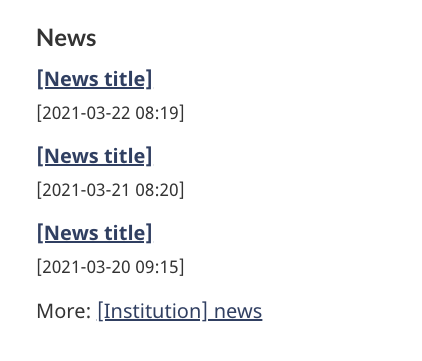

<strong>Last updated</strong>: {{ page.dateModified }}

Latest news is a pattern to display the most recent Government of Canada newsroom items directly associated with the content of the page.

 

<section>
  <h2>On this page</h2>
  <ul>
    <li><a href="#use">When to use</a></li>
    <li><a href="#avoid">What to avoid</a></li>
    <li><a href="#design">Content and design</a></li>
    <li><a href="#implement">How to implement</a></li>
    <li><a href="#research">Research and rationale</a></li>
    <li><a href="#latest">Latest changes</a></li>
    <li><a href="#discuss">Discussion</a></li>
  </ul>
</section>
<section>
  <h2 id="use">When to use</h2>
  
Use the latest news pattern to offer news items that directly relate to your page content or your organization.

</section>
<section>
  <h2 id="avoid">What to avoid</h2>
  
Don’t use this pattern if your organization doesn’t regularly issue news.

  
Don't use this pattern to display news by a different organization or for unrelated content.

  
Don’t use this pattern to display Features, which is a type of promotional product, not news.

  
Don’t use this pattern on navigational pages.

  
Don’t use this pattern when you want people to stay on the page and do their task.

</section>
<section>
  <h2 id="design">Content and design</h2>

  
The label for the heading is “News” in English and “Nouvelles” in French.

  
Include three news items, followed by the link “More:” that directs people to the full newsroom feed, such as “More: [Institution] news”. Use descriptive link text so it's clear where the user will go if they click on the link.

  
Each news item is formatted in the following manner:

  
[link to news release] 
  [YYYY-MM-DD HH:MM]

  <h3>Design specifications</h3>
  <ul>
  <li>Text uses standard Canada.ca styles:
    <ul>
        <li><a href="https://design.canada.ca/styles/typography.html">Typography</a></li>
        <li><a href="https://design.canada.ca/styles/colours.html">Colours</a></li>
        <li>Heading is coded as an H2 but styled as an H3</li>
    </ul>
    </li>
    <li>Layout
        <ul>
        <li>Maximum of 3 items listed at a time, use the “More” link to connect other news items</li>
        <li>News items is coded as an unstyled list</li>
        </ul>
    </li>
  </ul>

  <h3>Visual examples</h3>
    

      <figure class="mrgn-tp-md mrgn-bttm-lg">
        <figcaption><b>Latest news pattern</b></figcaption>
        
        

          
Image description:

          
A heading, News, is followed by three links. Each link title is [News title]. Under each link is a placeholder for the date and time, presented as YYYY-MM-DD HH:MM. Below the list of links and dates there is a line that says More: [Institution] news.

        

      </figure>
    

</section>

<section>
  <h2 id="implement">How to implement</h2>

  
Find working examples and code for implementing the latest news pattern.

  <h3>GCweb (WET) theme implementation reference</h3>

  
The implementation reference includes how to configure each element of the latest news.

    <ul>
      <li>Feeds plugin</li>
      <li><a href="https://wet-boew.github.io/GCWeb/docs/implementing-en.html">Quick implementation guide - GCWeb theme</a></li>
    </ul>

  <h3>Implementations</h3>
  
Determine what best suits the type of page you're creating.

  <h4>GC-AEM</h4>
  
For the Government of Canada Adobe Experience Manager (AEM):

  <ul>
    <li><a href="https://www.gcpedia.gc.ca/wiki/AEM_GC-specific_Documentation_6.5">AEM/Managed Web Service documentation (GCPedia link - only available on the Government of Canada network)</a></li>
  </ul>

  <h4>CDTS</h4>
  
For the Centrally Deployed Templates Solution (CDTS):

  <ul>
    <li><a href="https://cenw-wscoe.github.io/sgdc-cdts/docs/index-en.html">CDTS documentation</li>
  </ul>

  <h4>Drupal WxT</h4>
  
For Drupal WxT:

    <ul>
    <li><a href="https://drupalwxt.github.io/en/">Drupal WxT documentation</li>
  </ul>
</section>

<section>
  <h2 id="research">Research and rationale</h2>

  
The latest news pattern is an optional pattern for the following mandatory templates:

  <ul>
    <li><a href="">Institutional landing page</a></li>
    <li><a href="">Ministerial pages</a></li>
  </ul>

</section>
<section>
  <h2 id="latest">Latest changes</h2>
  <dl class="dl-horizontal">
    <dt>
      <time datetime="2023-08-13" class="link-muted">2023-08-23</time>
    </dt>
    <dd>Updated the guidance to include content and design specifications, visual examples and implementation guidance</dd>
  </dl>
</section>