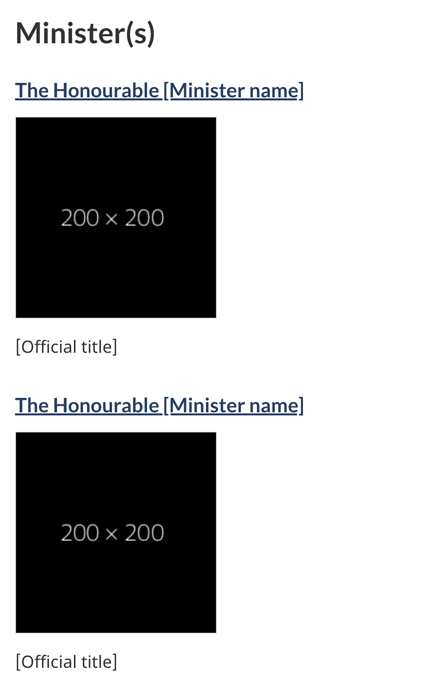
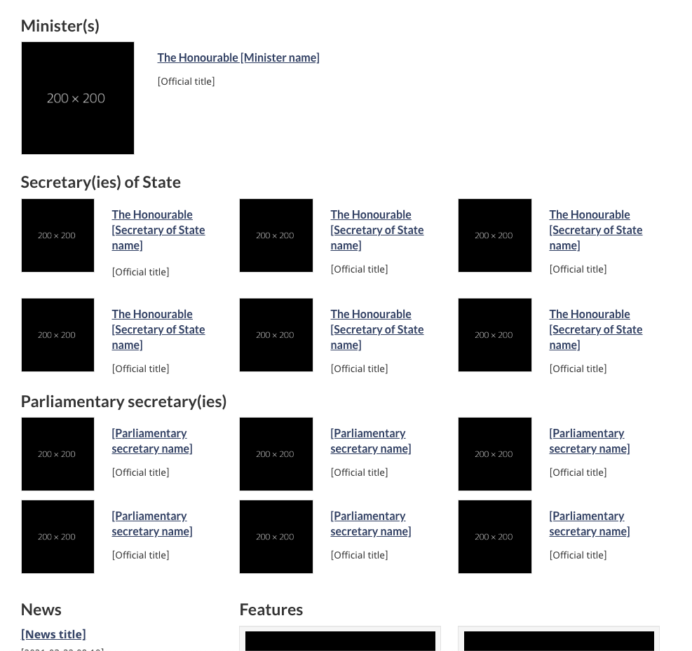

<strong>Last updated</strong>: {{ page.dateModified }}

The Minister or institutional head pattern identifies the relevant Minister(s) or head(s) for a department, agency or organization. It provides links to the official bio for an institution’s minister(s), secretary(ies) of State, associate minister(s), or institutional head, and may also include a headshot or links to mandate letters and briefing materials.

<section>
  <h2>On this page</h2>
  <ul>
      <li><a href="#use">When to use</a></li>
      <li><a href="#avoid">What to avoid</a></li>
      <li><a href="#design">Content and design</a></li>
      <li><a href="#implement">How to implement</a></li>
      <li><a href="#research">Research and rationale</a></li>
      <li><a href="#latest">Latest changes</a></li>
  </ul>
</section>
<section>
  <h2 id="use">When to use</h2>
  
The Minister or institutional head pattern is mandatory on an institutional landing page.

</section>
<section>
  <h2 id="avoid">What to avoid</h2>
  
Don’t use this pattern on pages where it is not relevant to the main task(s) of the page.

</section>
<section id="design">
  <h2>Content and design</h2>
  
Find content and design specifications and visual examples.

  <h3>Content specifications</h3>
  
Use the appropriate heading for the section, for example:

  <ul>
      <li>Minister</li>
      <li>Secretary of State</li>
      <li>President</li>
      <li>Parliamentary secretary</li>
      <li>Associate minister</li>
      <li>Ombudsman</li>
      <li>Management</li>
  </ul>
  
The following elements are mandatory for each head of an institution:

  <ul>
    <li>The minister, secretary of State, or institutional head’s honorific (“The Honourable”) and first and last name
      <ul>
        <li>These link to a ministerial profile page (<a href="https://design.canada.ca/mandatory-templates/ministerial-profile-pages.html">see Ministerial profile pages</a>)</li>
      </ul>
    </li>
    <li>The institutional head’s official title</li>
  </ul>
  
The following elements are optional for each head of an institution:

  <ul>
    <li>Image</li>
    <li>Links:
      <ul>
        <li>Mandate letter</li>
        <li>Briefing book</li>
        <li>Material relevant to the institutional head</li>
      </ul>
    </li>
  </ul>
  <h3>Design specifications</h3>
  <ul>
    <li>Background: white</li>
    <li>Name and title of institutional head (linked)
      <ul>
        <li>Standard <a href="https://design.canada.ca/styles/colours.html">Canada.ca link colours</a></li>
        <li>Standard <a href="https://design.canada.ca/styles/typography.html">Canada.ca body font family and size</a></li>
      </ul>
    </li>
    <li>Title of institutional head
      <ul>
        <li>Standard <a href="https://design.canada.ca/styles/colours.html">Canada.ca link colours</a></li>
        <li>Standard <a href="https://design.canada.ca/styles/typography.html">Canada.ca body font family and size</a>. Has a small class which is 87% of the body size.</li>
      </ul>
    </li>
    <li>Optional links
      <ul>
        <li>Text uses standard Canada.ca styles
          <ul>
            <li><a href="https://design.canada.ca/styles/typography.html">Typography</a></li>
            <li><a href="https://design.canada.ca/styles/colours.html">Colours</a></li>
          </ul>
        </li>
        <li>Use a list
          <ul>
            <li>Has a small class which is 87% of the standard body size</li>
          </ul>
        </li>
      </ul>
    </li>
    <li>Images: 200px by 200px</li>
    <li>Layout: 2 columns with image to the left and bullets to the right in large and medium screen, single column in small screen</li>
  </ul>
  <h3>Visual examples</h3>
  

    <figure class="mrgn-tp-md mrgn-bttm-lg">
      <figcaption><b>Minister or institutional head - large screen</b></figcaption>
      
      

        
Image description: minister or institutional head - large screen

        
The Minister or institutional head pattern appears in 2 columns with the heading “Minister(s)”.

        
The first column presents a placeholder for an institutional head's image on the left. The dimensions for the image are 200px x 200px. Information on the right includes:

        <ul>
          <li>The Honourable [Minister name] (link)</li>
          <li>[Official title] (text)</li>
        </ul>
        
The second column presents a placeholder for an institutional head's image on the left. The dimensions for the image are 200px x 200px. Information on the right includes:

        <ul>
          <li>The Honourable [Minister name] (link)</li>
          <li>[Official title] (text)</li>
        </ul>
      

    </figure>
  

  

    <figure class="mrgn-tp-md mrgn-bttm-lg">
      <figcaption><b>Minister or institutional head - small screen</b></figcaption>
      
      

        
Image description: minister or institutional head - small screen

        
The Minister or institutional head pattern appears in 1 column and has 2 items with the heading “Minister(s)”.

        
The first element begins with a title with the link "The Honourable [Minister name]" followed by a space reserved for the image with the prescribed dimensions of 200 x 200 pixels. Below the image is the text [Official title]. It is followed by a bulleted list with the following two linked items:

        <ul>
          <li>Mandate letter [optional]</li>
          <li>Briefing book [optional]</li>
        </ul>
        
The second element begins with a linked title "The Honourable [Minister name]" followed by a space reserved for the image with the prescribed dimensions of 200 x 200 pixels. Below the image is the text [Official title]. It is followed by the following link element:

      

    </figure>
  

  

    <figure class="mrgn-tp-md mrgn-bttm-lg">
      <figcaption><b>Minister and/or secretary of State and/or parliamentary secretary (small image variation) - large screen</b></figcaption>
      
      

        
Image description: minister and/or secretary of State and/or parliamentary secretary (small image variation) - large screen

        
The Minister or institutional head pattern appears in 2 columns with the heading “Minister(s)”.

        
The first column presents a placeholder for an institutional head's image on the left. The dimensions for the image are 200px x 200px. Information on the right includes:

        <ul>
            <li>The Honourable [Minister name] (link)</li>
            <li>[Official title] (text)</li>
        </ul>
        
The second column is empty. If there is more than one minister for a department you would present the additional minister here, following the same format as described in the first column.

        
The minister row is then followed by a “Secretary(ies) of State” heading. Following that heading is 3 columns.

        
Each of the 3 columns presents a placeholder for a secretary of State's image on the left. The dimensions for the image are 200px x 200px, but appear smaller on a large screen. Information on the right includes:

        <ul>
          <li>The Honourable [Secretary of State name] (link)</li>
          <li>[Official title] (text)</li>
        </ul>
        
The secretary of State row is then followed by a “Parliamentary secretary(ies)” heading. Following that heading is 3 columns.

        
Each of the 3 columns presents a placeholder for a parliamentary secretary's image on the left. The dimensions for the image are 200px x 200px, but appear smaller on a large screen. Information on the right includes:

        <ul>
          <li>[Parliamentary secretary name] (link)</li>
          <li>[Official title] (text)</li>
        </ul>
      

    </figure>
  

</section>
<section id="implement">
  <h2>How to implement</h2>
  
Find working examples and code for implementing the Minister or institutional head pattern.

  <h3>GCweb (WET) theme implementation reference</h3>
  
The implementation reference includes how to configure elements of the design system.

  <ul>
    <li><a href="https://wet-boew.github.io/GCWeb/components/gc-minister/gc-minister-en.html">Minister or institutional head - GCWeb</a></li>
    <li><a href="https://wet-boew.github.io/GCWeb/docs/implementing-en.html">Quick implementation guide - GCWeb theme</a></li>
  </ul>
  <h3>Implementations</h3>
  
Determine what best suits the type of page you're creating.

  

    

      

        

          

            
<strong>GC-AEM</strong>

            
For the Government of Canada Adobe Experience Manager (AEM):

            <ul>
              <li><a href="https://www.gcpedia.gc.ca/wiki/AEM_GC-specific_Documentation_6.5">AEM/Managed Web Service documentation (GCPedia link - only available on the Government of Canada network)</a></li>
            </ul>
          

          

            
<strong>CDTS</strong>

            
For the Centrally Deployed Templates Solution (CDTS):

            <ul>
              <li><a href="https://cenw-wscoe.github.io/sgdc-cdts/docs/index-en.html">CDTS documentation</a></li>
            </ul>
          

          

            
<strong>Drupal WxT</strong>

            
For Drupal WxT:

            <ul>
              <li><a href="https://drupalwxt.github.io">Drupal WxT documentation</a></li>
            </ul>
          

        

      

    

  

</section>
<section id="research">
  <h2>Research and rationale</h2>
  
Consult policy rationale.

  <h3>Policy rationale</h3>
  
The Minister or institutional head pattern is required on the following mandatory template:

  <ul>
    <li><a href="https://design.canada.ca/mandatory-templates/institutional-profile-pages.html">Institutional landing page</a></li>
  </ul>
</section>
<section id="latest">
  <h2>Latest changes</h2>
  <dl class="dl-horizontal">
    <dt><time>{{ page.dateModified }}</time></dt>
    <dd>
      <ul>
        <li>Updated the guidance to include square image specifications, visual examples and implementation guidance</li>
      </ul>
    </dd>
    <dt><time>2025-06-13</time></dt>
    <dd>Added an additional image variant to include the new secretary of State role.</dd>
    <dt><time>2025-05-15</time></dt>
    <dd>Updated typography specifications in tandem with alignment activities for GCWeb and GC Design System.</dd>
    <dt><time>2024-04-03</time></dt>
    <dd>Added guidance to support updates to the institutional landing page.</dd>
  </dl>
</section>
