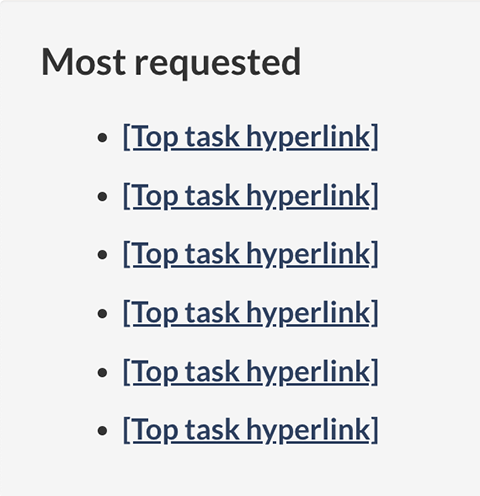

<strong>Last updated</strong>: {{ page.dateModified }}

<label class="label label-info">Optional</label>

The most requested pattern features top tasks for landing pages that offer many choices. Top tasks are the main things that users are trying to do in a given context

<section>
    <h2>On this page</h2>
    <ul>
        <li><a href="#use">When to use</a></li>
        <li><a href="#avoid">What to avoid</a></li>
        <li><a href="#design">Content and design</a></li>
        <li><a href="#implement">How to implement</a></li>
        <li><a href="#research">Research and rationale</a></li>
        <li><a href="#latest">Latest changes</a></li>
    </ul>
</section>
<section>
    <h2 id="use">When to use</h2>
    
Use this pattern on navigation pages where people are trying to find where to start their task, such as a topic page or an institutional landing page.

</section>
<section>
    <h2 id="avoid">What to avoid</h2>
    
Don’t use this pattern when you want people to stay on the page and do their task.

    
Don’t use this to promote departmental preferences. Use data and evidence to determine the top tasks people are trying to access.

    
Don’t present different top tasks on the English and French versions of the landing page. Top tasks should be the same in both languages.

</section>
<section>
    <h2 id="design">Content and design</h2>
    
Find content and design specifications and visual examples.

    <h3>Content specifications</h3>
    
The heading is “Most requested” in English and “En demande” in French.

    
Include links to relevant top tasks - use evidence and data to determine which links should appear.

    
Organize the links in a bulleted list.

    
Make bullets visible so links are easy to scan.

    
Recommended maximum of 8 links.

    
Use task-oriented, plain language link labels (avoid program names or titles that may be unfamiliar to people).

    
On large screens:

    <ul>
        <li>the heading appears to the left of the links</li>
        <li>the list of links appears in up to 2 columns</li>
    </ul>
    
On small screens:

    <ul>
        <li>the heading appears above the links</li>
        <li>the list of links appears in a single column</li>
    </ul>
    <h3>Design specifications</h3>
    <ul>
        <li>
            Layout:
            <ul>
                <li>Columns: 2 columns of bullets on large and medium screens, single column of bullets on small screens (if you have only 2-3 links, make it a single column in all screen sizes)</li>
                <li>Tab order: left to right, then top to bottom</li>
            </ul>
        </li>
        <li>
            Styling:
            <ul>
                <li>Background colour: #f5f5f5</li>
                <li>Font family: Noto Sans</li>
                <li>Font weight: Bold</li>
                <li>Heading: H2, Lato: 1.2em</li>
                <li>Line height: 2em (base size is 20px)</li>
                <li>Text size: 87% (base size is 20px)</li>
            </ul>
        </li>
    </ul>
    <h3>Visual examples</h3>
    

        <figure class="mrgn-tp-md mrgn-bttm-lg">
            <figcaption><b>Most requested - Large screen</b></figcaption>
            
            

                
Image description:

                
Most requested links appear in a horizontal band with the heading “Most requested”. Links are organized in a bulleted list.

            

        </figure>
    

    

        <figure class="mrgn-tp-md mrgn-bttm-lg">
            <figcaption><b>Most requested - small screen</b></figcaption>
            
            

                
Image description:

                
Most requested links appear in a bulleted list underneath the heading “Most requested”.

            

        </figure>
    

</section>
<section>
    <h2 id="implement">How to implement</h2>
    
Find working examples and code for implementing the most requested pattern.

    <h3>Implementations</h3>
  
Determine what best suits the type of page you're creating.

  

  

    

      

        

          
<strong>GC-AEM</strong>

          
For the Government of Canada Adobe Experience Manager (AEM):

          <ul>
            <li><a href="https://www.gcpedia.gc.ca/wiki/AEM_GC-specific_Documentation_6.5">AEM/Managed Web Service documentation (GCPedia link - only available on the Government of Canada network)</a></li>
          </ul>
        

        

          
<strong>CDTS</strong>

          
For the Centrally Deployed Templates Solution (CDTS):

          <ul>
            <li><a href="https://cenw-wscoe.github.io/sgdc-cdts/docs/index-en.html">CDTS documentation</a></li>
          </ul>
        

        

          
<strong>Drupal WxT</strong>

          
For Drupal WxT:

          <ul>
            <li><a href="https://drupalwxt.github.io/en/">Drupal WxT documentation</a></li>
          </ul>
        

      

    

  

</section>
<section>
    <h2 id="research">Research and rationale</h2>
    <h3>Research fidings</h3>
    
The banded approach to the most requested pattern was successfully tested on the Canada.ca home page in 2018.

    
As part of the Contact the Canada Revenue Agency (CRA) project in 2019, the banded approach was successfully tested on a prototype of the CRA institutional landing page.

    
The usefulness of most requested links for navigation pages was reconfirmed as part of the Wayfinding project in 2022.

    <h3>Policy rationale</h3>
    
The most requested pattern is required in the following mandatory templates:

    <ul>
        <li><a href="">Institutional landing page</a></li>
        <li><a href="https://design.canada.ca/mandatory-templates/theme-topic.html">Theme and topic page template</a></li>
    </ul>
</section>
<section>
    <h2 id="latest">Latest changes</h2>
    <dl class="dl-horizontal">
        <dt>
            <time datetime="2023-08-20" class="link-muted">2023-08-20</time>
        </dt>
        <dd>Updated guidance to reflect the banded style for the most requested pattern</dd>
        <dt>
            <time datetime="2018-12-19" class="link-muted">2018-12-19</time>
        </dt>
        <dd>Documented the most requested pattern</dd>
    </dl>
</section>