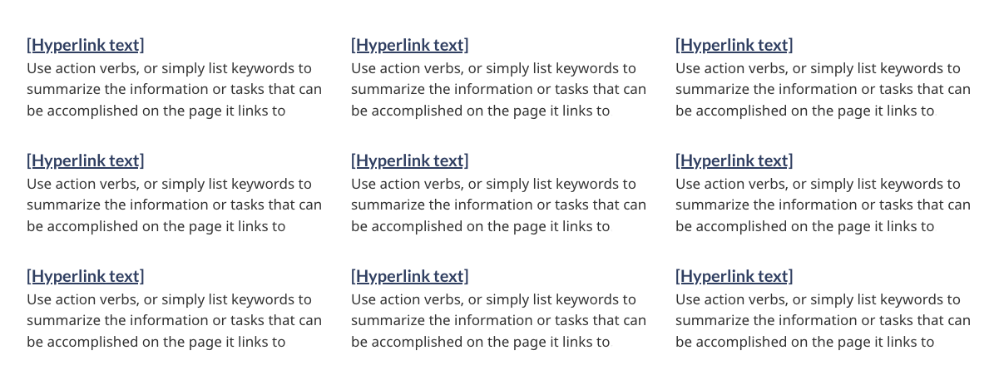
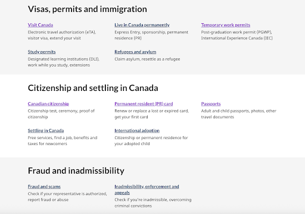
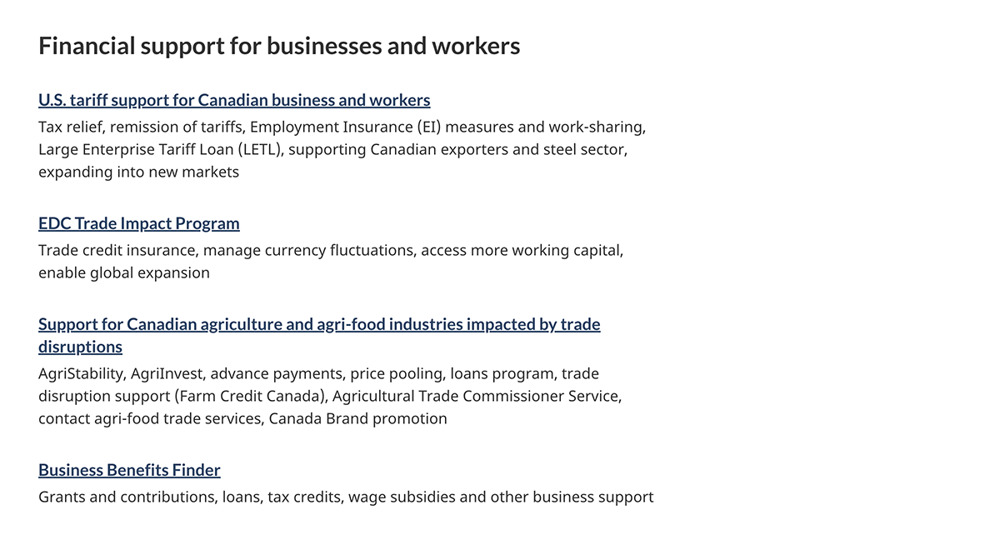
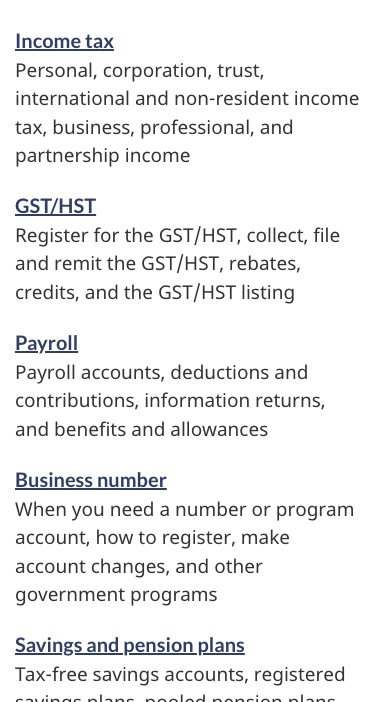

<strong>Last updated</strong>: {{ page.dateModified }}

The services and information pattern presents sets of links with accompanying descriptions (also known as doormats). It acts as a roadmap when a landing page has a series of pages to link to. Each link with its description provides a concise summary of what a person will find on destination pages.

<section>
  <h2>On this page</h2>
  <ul>
      <li><a href="#use">When to use</a></li>
      <li><a href="#avoid">What to avoid</a></li>
      <li><a href="#design">Content and design</a></li>
      <li><a href="#implement">How to implement</a></li>
      <li><a href="#research">Research and rationale</a></li>
      <li><a href="#latest">Latest changes</a></li>
  </ul>
</section>

<section>
  <h2 id="use">When to use</h2>
  
Use the services and information pattern whenever the primary purpose of the page is to provide clear choices to navigate to tasks. Together, these sets of links and descriptions provide clear and distinct choices for people trying to find where to complete their task.

  
<b>Section headings</b> can be used to group together related doormats. If included, the headings should be specific and clearly describe the type of content the doormats contain, for example: “Visas and permits”.

  
<b>Grey full-width banding</b> can be used in situations where splitting up the content with an additional visual aid is beneficial for users.

  
<b>The single column format</b> of the doormats can be used in situations where the content benefits from this format, for example:

  <ul>
    <li>the links are being used to direct users to sequential tasks</li>
    <li>character length is over the recommendation for standard doormats, and the wording cannot be simplified without losing clarity for users</li>
    <li>several doormats have descriptions or titles that create wildly inconsistent heights, causing visual gaps</li>
    <li>to align the look for all doormat sections on a page, due to choosing the single column on a different part of the page</li>
  </ul>
</section>

<section>
  <h2 id="avoid">What to avoid</h2>
  
Don’t repeat links that are found in your most requested pattern (if using both patterns on the same page).

  
Don’t use decorative icons or images in the pattern, as these can distract from people’s ability to make choices.

</section>

<section>
  <h2 id="design">Content and design</h2>
  
Find content and design specifications and visual examples.

  <h3>Content specifications</h3>
  
Style is very important when implementing the services and information pattern. Please see the Canada.ca Content Style Guide for more information on how to write content for this pattern.

  <ul>
    <li><a href="https://www.canada.ca/en/treasury-board-secretariat/services/government-communications/canada-content-style-guide.html">Canada.ca Content Style Guide</a></li>
  </ul>
  
Each doormat consists of a heading and a description. The heading is a link.

  
The optimal limit of doormats on a page is 9.

  <h4>Doormat design options</h4>
  
You can use the following design variations:

  <ul>
    <li>Visible section headings to group sets of doormats</li>
    <li>Single column, extra wide doormats</li>
    <li>Grey background bands to give visual contrast to divide sections</li>
  </ul>

  <h4>Linked doormat headings</h4>
  <ul>
    <li>The optimal character limit for links is 45 characters (with spaces) for both official languages, but can extend to 75 characters (including spaces)</li>
    <li>Don’t end doormat headings with punctuation (for example, use “Apply for funding” instead of “How do you apply for funding?”)</li>
  </ul>

  <h4>Descriptions</h4>
  <ul>
    <li>Optimal character limit for descriptions is 120 characters (with spaces) in both official languages</li>
    <li>Recommended style is to list keywords or keyword phrases separated by commas; full sentences aren’t required
      <ul>
        <li>Don’t use introductory phrases such as “Includes…”, “Information on…” or “Learn more about…”</li>
        <li>Don’t include links in the descriptions</li>
        <li>Don’t include promotional messaging</li>
        <li>Don’t add extra formatting to the descriptions (bold, bullets, etc.)</li>
      </ul>
    </li>
  </ul>

  <h3>Design specifications</h3>
  <ul>
    <li>Layout
      <ul>
        <li>Columns:
          <ul>
            <li>3 for large screens</li>
            <li>2 for medium screens</li>
            <li>1 for small screens</li>
            <li>Or 1 column for all screens if using the single column variant</li>
            <li><b>Note</b>: the 2 column variant is used for large screens on the layered theme template</li>
          </ul>
        </li>
        <li>Tab order is from left to right, then top to bottom</li>
      </ul>
    </li>
    <li>Headings:
      <ul>
        <li>Colour: <a href="https://design.canada.ca/styles/colours.html">Standard colour</a> for links</li>
        <li>Font size: 24px (H3 styled as H5 size)</li>
        <li>Font type: Lato Sans</li>
      </ul>
    </li>
    <li>Descriptions:
      <ul>
        <li>Colour: <a href="https://design.canada.ca/styles/colours.html">Standard colour</a> for text</li>
        <li>Font size:
          <ul>
            <li>18px (desktop & mobile)</li>
          </ul>
        </li>
        <li>Font type: Noto Sans</li>
      </ul>
    </li>
  </ul>

  <h4>Accessibility</h4>
  
The heading is generally “Services and information” in English and “Services et renseignements” in French. It’s required for the semantic outline and screen readers, but you can style it as invisible.

  <h3>Visual examples</h3>
  

    <figure class="mrgn-tp-md mrgn-bttm-lg">
      <figcaption><b>Services and information - large screen</b></figcaption>
      
      

        
Image description: services and information - large screen

        
Nine separate doormats are displayed across three columns and three rows. Each doormat has a linked heading. Below the heading are keywords that describe what will be found by clicking on the linked heading.

      

    </figure>
  

  

    <figure class="mrgn-tp-md mrgn-bttm-lg">
      <figcaption><b>Services and information with headings and banding - large screen</b></figcaption>
      
      

        
Image description: services and information with headings and banding - large screen

        
Five separate doormats are displayed across three columns and three rows with the heading “Visas, permits and immigration” on a light grey background reaching the browser’s edges. Below, there is a second set of five doormats in three columns with the heading “Citizenship and settling in Canada” on a white background. Below that, there is final grouping of two doormats across three columns, with one column empty, with the heading “Fraud and inadmissibility” on a light grey background reaching the browser’s edges.

      

    </figure>
  

  

    <figure class="mrgn-tp-md mrgn-bttm-lg">
      <figcaption><b>Services and information with single column doormats - large screen</b></figcaption>
      
      

        
Image description: services and information with single column doormats - large screen

        
Four separate doormats are displayed in a single column with the heading “Financial support for businesses and workers”. These doormats are wider than the standard, and occupy 2/3 of the browser screen width.

      

    </figure>
  

  

    <figure class="mrgn-tp-md mrgn-bttm-lg">
      <figcaption><b>Services and information - small screen</b></figcaption>
      
      

        
Image description: services and information - small screen

        
Nine separate doormats are displayed in a list. Each doormat has a linked heading. Below the heading are keywords that describe what will be found by clicking on the linked heading.

      

    </figure>
  

</section>

<section>
  <h2 id="implement">How to implement</h2>
  
Find working examples and code for implementing the services and information pattern.

  <h3>GCweb (WET) theme implementation reference</h3>
  
The implementation reference includes how to configure each element of the services and information pattern.

  <ul>
    <li><a href="https://wet-boew.github.io/GCWeb/components/gc-srvinfo/gc-srvinfo-doc-en.html">Services and information - GCWeb</a></li>
  </ul>

  <h3>Implementations</h3>
  
Determine what best suits the type of page you're creating.

  

    

      

        

          

            
<strong>GC-AEM</strong>

            
For the Government of Canada Adobe Experience Manager (AEM):

            <ul>
              <li><a href="https://www.gcpedia.gc.ca/wiki/AEM_GC-specific_Documentation_6.5">AEM/Managed Web Service documentation (GCPedia link - only available on the Government of Canada network)</a></li>
            </ul>
          

          

            
<strong>CDTS</strong>

            
For the Centrally Deployed Templates Solution (CDTS):

            <ul>
              <li><a href="https://cenw-wscoe.github.io/sgdc-cdts/docs/index-en.html">CDTS documentation</a></li>
            </ul>
          

          

            
<strong>Drupal WxT</strong>

            
For Drupal WxT:

            <ul>
              <li><a href="https://drupalwxt.github.io">Drupal WxT documentation</a></li>
            </ul>
          

        

      

    

  

</section>

<section>
  <h2 id="research">Research and rationale</h2>

  <h3>Research findings</h3>
  
<a href="https://blog.canada.ca/research-summaries/business-account-research-summary.html">Research summary: Tax filing</a>

  
This research summary explains how choosing the right keywords helped users find the path they needed. It also explains how the team reduced and simplified text by putting keywords at the beginning of titles, links and doormats. Improved scent of information.

  
<a href="https://blog.canada.ca/2018/08/16/collab-gsthst-payroll.html">CRA and TBS collaborate to optimize GST/HST and Payroll webpage content</a>

  
This blog post explains how shorter keyword phrases showed significant advantages over full sentences on navigation pages. They made the key information easier to find.

  <h3>Policy rationale</h3>
  
Services and information is a required pattern for the following mandatory templates:

  <ul>
    <li><a href="https://design.canada.ca/mandatory-templates/institutional-profile-pages.html">Institutional landing page</a></li>
    <li><a href="https://design.canada.ca/mandatory-templates/theme.html">Theme template</a></li>
    <li><a href="https://design.canada.ca/mandatory-templates/topic.html">Topic page template</a></li>
  </ul>
</section>

<section>
  <h2 id="latest">Latest changes</h2>
  <dl class="dl-horizontal">
    <dt><time>2025-12-02</time></dt>
    <dd>Updated to include guidance for the available variations; with headings, grey banding, and single column doormats</dd>
    <dt><time>2025-05-15</time></dt>
    <dd>Updated typography specifications in tandem with alignment activities for GCWeb and GC Design System.</dd>
    <dt><time>2024-04-03</time></dt>
    <dd>Updated the guidance to include content and design specifications, visual examples and implementation guidance</dd>
  </dl>
</section>
