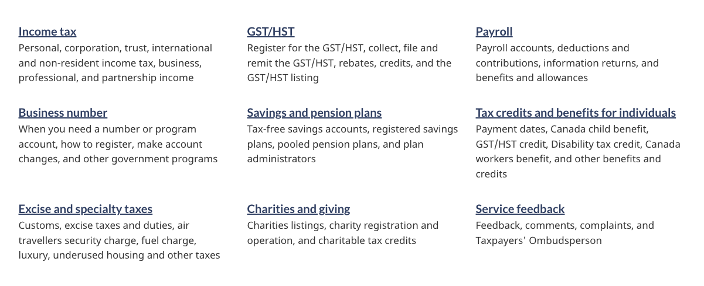

<strong>Last updated</strong>: {{ page.dateModified }}

    The services and information pattern presents sets of links with accompanying descriptions (also known as doormats). It acts as a roadmap when a landing page has a series of pages to link to. Each link with its description provides a
    concise summary of what a person will find on destination pages.

<section>
    <h2>On this page</h2>
    <ul>
        <li><a href="#use">When to use</a></li>
        <li><a href="#avoid">What to avoid</a></li>
        <li><a href="#design">Content and design</a></li>
        <li><a href="#implement">How to implement</a></li>
        <li><a href="#research">Research and rationale</a></li>
        <li><a href="#latest">Latest changes</a></li>
        <li><a href="#discuss">Discussion</a></li>
    </ul>
</section>
<section>
    <h2 id="use">When to use</h2>
    

        Use the services and information pattern whenever the primary purpose of the page is to provide clear choices to navigate to tasks. Together, these sets of links and descriptions provide clear and distinct choices for people trying
        to complete their task.
    

</section>
<section>
    <h2 id="avoid">What to avoid</h2>
    
Don’t repeat links that are found in your most requested pattern (if using both patterns on the same page).

    
Don’t use decorative icons or images in the pattern, as these can distract from people’s ability to make choices.

</section>
<section>
    <h2 id="design">Content and design</h2>
    
Find content and design specifications and visual examples.

    <h3>Content specifications</h3>
    
Style is very important when implementing the services and information pattern. Please see the Canada.ca Content Style Guide for more information on how to write content for this pattern.

    <ul>
        <li><a href="https://www.canada.ca/en/treasury-board-secretariat/services/government-communications/canada-content-style-guide.html">Canada.ca Content Style Guide</a></li>
    </ul>
    
Each doormat consists of a heading and a description. The heading is a link.

    <h4>Doormats</h4>
    <ul>
        <li>Optimal limit of doormats on a page is 9</li>
        <li>You can use headings to group sets of doormats if needed</li>
    </ul>
    <h4>Linked doormat headings</h4>
    <ul>
        <li>The optimal character limit for links is 45 characters (with spaces) for both official languages, but can extend to 75 characters (with spaces)</li>
        <li>Don’t end doormat headings with punctuation (for example, “How do you apply for funding?”)</li>
    </ul>
    <h4>Descriptions</h4>
    <ul>
        <li>Optimal character limit for descriptions is 120 characters (with spaces) in both official languages</li>
        <li>
            Recommended style is to list keywords or keyword phrases separated by commas; full sentences aren’t required
            <ul>
                <li>Don’t use introductory phrases such as “Includes…”, “Information on…” or “Learn more about…”</li>
                <li>Don’t include links in the descriptions</li>
                <li>Don’t include promotional messaging</li>
                <li>Don’t add extra formatting to the descriptions (bold, bullets, etc.)</li>
            </ul>
        </li>
    </ul>
    <h3>Design specifications</h3>
    <ul>
        <li>
            Layout
            <ul>
                <li>
                    Columns:
                    <ul>
                        <li>3 for large screens</li>
                        <li>2 for medium screens</li>
                        <li>1 for small screens</li>
                    </ul>
                </li>
                <li>Tab order is from left to right, then top to bottom</li>
            </ul>
        </li>
        <li>
            Headings:
            <ul>
                <li>Colour: <a href="https://design.canada.ca/styles/colours.html">Standard Canada.ca link colours</a></li>
                <li>Font size: Canada.ca H3 (1em)</li>
                <li>Font type: Lato Sans</li>
            </ul>
        </li>
        <li>
            Descriptions:
            <ul>
                <li>Colour: <a href="https://design.canada.ca/styles/colours.html">Standard Canada.ca link colours</a></li>
                <li>
                    Font size:
                    <ul>
                        <li>17px (desktop)</li>
                        <li>19px (mobile)</li>
                    </ul>
                </li>
                <li>Font type: Noto Sans</li>
            </ul>
        </li>
    </ul>
    <h4>Accessibility</h4>
    
The heading is generally “Services and information” in English and “Services et renseignements” in French. It’s required for the semantic outline and screen readers, but you can style it as invisible.

    <h3>Visual examples</h3>
    

        <figure class="mrgn-tp-md mrgn-bttm-lg">
            <figcaption><b>Services and information - large screen</b></figcaption>
            
            

                
Image description:

                
Nine separate doormats are displayed across three columns and three rows. Each doormat has a linked heading. Below the heading are keywords that describe what will be found by clicking on the linked heading.

            

        </figure>
    

    

        <figure class="mrgn-tp-md mrgn-bttm-lg">
            <figcaption><b>Services and information - small screen</b></figcaption>
            
            

                
Image description:

                
Nine separate doormats are displayed in a list. Each doormat has a linked heading. Below the heading are keywords that describe what will be found by clicking on the linked heading.

            

        </figure>
    

</section>
<section>
    <h2 id="implement">How to implement</h2>
    
Determine what best suits the type of page you're creating.

    
For the Government of Canada Adobe Experience Manager (AEM):

    <ul>
        <li>Doormat links component</li>
        <li><a href="https://www.gcpedia.gc.ca/gcwiki/images/2/2b/AEM-6.5-Documentation-Unit-4-12-Doormat-link-set-Component.pdf">Doormat link set component</a></li>
        <li><a href="https://www.gcpedia.gc.ca/wiki/AEM_GC-specific_Documentation_6.5">AEM/Managed Web Service documentation (GCPedia link - only available on the Government of Canada network)</a></li>
    </ul>
    
For the Centrally Deployed Templates Solution (CDTS):

    <ul>
        <li><a href="https://cenw-wscoe.github.io/sgdc-cdts/docs/index-en.html">CDTS documentation</a></li>
    </ul>
    
For Drupal WxT:

    <ul>
        <li><a href="https://drupalwxt.github.io/en/">Drupal WxT documentation</a></li>
    </ul>
</section>
<section>
    <h2 id="research">Research and rationale</h2>
    
Consult resarch findings and policy rationale.

    <h3>Research findings</h3>
    
<a href="https://blog.canada.ca/research-summaries/business-account-research-summary.html">Research summary: Tax filing</a>

    

        This research summary explains how choosing the right keywords helped users find the path they needed. It also explains how the team reduced and simplified text by putting keywords at the beginning of titles, links and doormats.
        Improved scent of information
    

    
<a href="https://blog.canada.ca/2018/08/16/collab-gsthst-payroll.html">CRA and TBS collaborate to optimize GST/HST and Payroll webpage content</a>

    
This blog post explains how shorter keyword phrases showed significant advantages over full sentences on navigation pages. They made the key information easier to find.

    <h3>Policy rationale</h3>
    
Services and information is an required pattern for the following mandatory templates:

    <ul>
        <li><a href="">Institutional landing page</a></li>
        <li><a href="https://design.canada.ca/mandatory-templates/theme-topic.html">Theme and topic page template</a></li>
    </ul>
</section>
<section>
    <h2 id="latest">Latest changes</h2>
    <dl class="dl-horizontal">
        <dt>
            <time datetime="2023-08-13" class="link-muted">2023-08-23</time>
        </dt>
        <dd>Updated the guidance to include content and design specifications, visual examples and implementation guidance</dd>
    </dl>
</section>