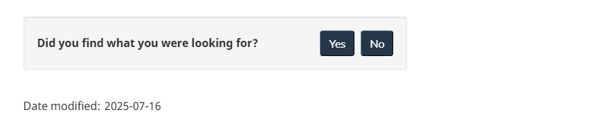

 

  <strong>
   From:
   <a href="https://www.canada.ca/en/treasury-board-secretariat.html">
    Treasury Board of Canada Secretariat
   </a>
  </strong>
 

 

  

   <ul class="toc lst-spcd col-md-12">
    <li class="col-md-4 col-sm-6">
     <a class="list-group-item active">
      Content
              footer
     </a>
    </li>
    <li class="col-md-4 col-sm-6">
     <a class="list-group-item" href="report-problem.html">
      Report a problem
     </a>
    </li>
    <li class="col-md-4 col-sm-6">
     <a class="list-group-item" href="share-page.html">
      Share this page
     </a>
    </li>
    <li class="col-md-4 col-sm-6">
     <a class="list-group-item" href="date-modified.html">
      Date modified
     </a>
    </li>
   </ul>
  

 

 <section>
  

   
    Mandatory
   
  

  

   The content footer appears at the bottom of the content area for each web page.
  

  

   Use the content footer in conjunction with the global footer pattern.
  

  

   <a href="site-footer.html">
    See Global footer
   </a>
   for guidance on how to apply the contextual footer band, main footer band and sub-footer band.
  

  <h2>
   How to implement the content footer
  </h2>
  

   The content footer displays up to 3 components:
  

  <ul>
   <li>
    <a href="report-problem.html">
     Report a problem
    </a>
    (optional)
   </li>
   <li>
    <a href="share-page.html">
     Share this page
    </a>
    (optional)
   </li>
   <li>
    <a href="date-modified.html">
     Date modified
    </a>
    (mandatory, but can be a version number when used for an application)
   </li>
  </ul>
  

   Insert the content footer within the content area block so that its margins are aligned with the main page content.
  

  <h2>
   Page feedback tool pilot
  </h2>
  

   The Page feedback tool is a pilot product. Add the pattern to the content footer instead of the “Report a problem”
          pattern to actively collect user feedback.
  

  

   <a href="https://design.canada.ca/continuous-improvement/monitoring/feedback.html">
    Page feedback tool
   </a>
  

 </section>
 <h2>
  Example
 </h2>
 

  <figure class="mrgn-bttm-lg">
   <figcaption>
    <b>
     Content footer
    </b>
   </figcaption>
   
   

    

     Text version
    

    

     The content footer contains the following components: Report a problem, Share this page and Date modified.
    

   

  </figure>
 

