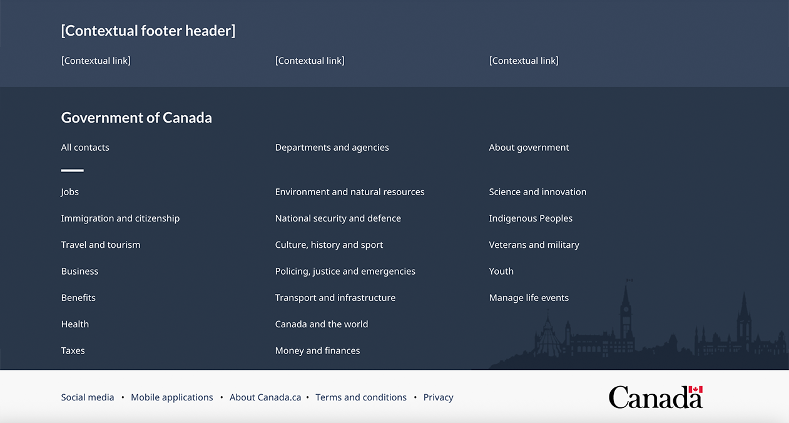
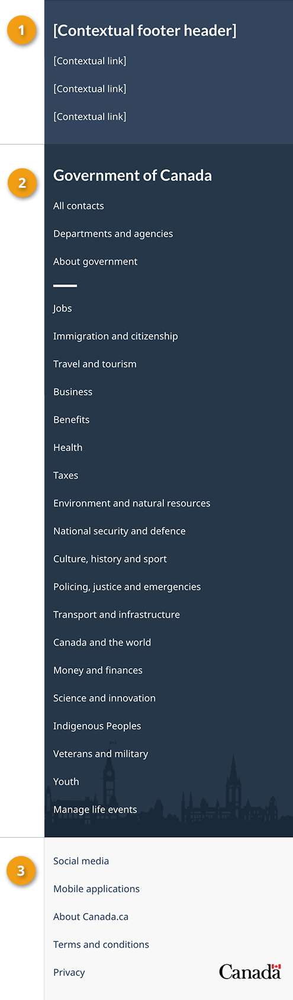

<strong>Last updated</strong>: {{ page.dateModified }}

Mandatory

The global (site-wide) footer at the bottom of each web page contains up to 3 bands:

<ul>
  <li>Contextual band</li>
  <li>Main band</li>
  <li>Sub-footer band</li>
</ul>

<strong>2022 design update</strong>: We’ve recently updated this pattern as part of a new navigation strategy coming
  out of the Wayfinding research project. To find out more about this project, visit the <a href="#research">Research and rationale</a> section on this page.

<!--<a href="">Blog post link</a>-->

 

<a href="site-footer-content.html">See Content footer pattern</a> for guidance on how to apply the Date modified, Share this page, Report a problem or Page feedback tool components.

<section>
  <h2>On this page</h2>
  <ul>
    <li><a href="#use">When to use</a></li>
    <li><a href="#avoid">What to avoid</a></li>
    <li><a href="#design">Content and design</a></li>
    <li><a href="#implement">How to implement</a></li>
    <li><a href="#research">Research and rationale</a></li>
    <li><a href="#latest">Latest changes</a></li>
  </ul>
</section>
<section>
  <h2 id="use">When to use</h2>
  
The footer acts as a rescue for people. They check it if they don't find what they want in the main content of the page.

  
Each element of the global footer provides direct, centralized access to specific types of content (for example, Contacts, Departments and agencies, Privacy).

  
Determine which footer elements to use based on the type of page you’re creating.

  

    

      

        
<strong>Standard pages</strong>

        

          
<strong>Standard pages</strong> are pages where people can navigate away without losing data, triggering errors or terminating their session.

        

        

          <h3>Global footer requirements for a standard page</h3>
          

            <table class="table table-striped table-condensed" id="mandatory-01" aria-live="polite">
              <caption class="wb-inv">
              Global footer requirements
              </caption>
              <thead>
                <tr>
                  <th class="col-md-4">Footer element</th>
                  <th class="col-md-3">Mandatory</th>
                </tr>
              </thead>
              <tbody>
                <tr>
                  <td>1. <a href="site-footer-contextual.html">Contextual band</a></td>
                  <td>Optional</td>
                </tr>
                <tr>
                  <td>2. <a href="site-footer-main.html">Main band</a></td>
                  <td> Mandatory</td>
                </tr>
                <tr>
                  <td>3. <a href="site-footer-sub.html">Sub-footer band with Canada wordmark
                    

                    </a></td>
                  <td> Mandatory</td>
                </tr>
              </tbody>
            </table>
          

        

      

      

        
<strong>Transactional pages</strong>

        

          
<strong>Transactional pages</strong> are pages with an interaction task where people might lose data, trigger errors, or terminate their session if they navigate away from the page.

        

        

          <h3>Global footer requirements for a transactional page</h3>
          

            <table class="table table-striped table-condensed" id="mandatory-02" aria-live="polite">
              <caption class="wb-inv">
              Global footer requirements
              </caption>
              <thead>
                <tr>
                  <th class="col-md-4">Footer element</th>
                  <th class="col-md-3">Mandatory</th>
                </tr>
              </thead>
              <tbody>
                <tr>
                  <td>1. <a href="site-footer-contextual.html">Contextual band</a></td>
                  <td>Optional</td>
                </tr>
                <tr>
                  <td>2. <a href="site-footer-main.html">Main band</a></td>
                  <td>Optional</td>
                </tr>
                <tr>
                  <td>3. <a href="site-footer-sub.html">Sub-footer band with Canada wordmark</a></td>
                  <td> Mandatory</td>
                </tr>
              </tbody>
            </table>
          

        

      

      

        
<strong>Campaign pages</strong>

        

          
<strong>Campaign pages</strong> are landing pages for external marketing or advertising
            campaigns. The flexibility in layout allows institutions to include elements of their external campaign in the page.

        

        

          <h3>Global footer requirements for a campaign page</h3>
          

            <table class="table table-striped table-condensed" id="mandatory-03" aria-live="polite">
              <caption class="wb-inv">
              Global footer requirements
              </caption>
              <thead>
                <tr>
                  <th class="col-md-4">Footer element</th>
                  <th class="col-md-3">Mandatory</th>
                </tr>
              </thead>
              <tbody>
                <tr>
                  <td>1. <a href="site-footer-contextual.html">Contextual band</a></td>
                  <td>Optional</td>
                </tr>
                <tr>
                  <td>2. <a href="site-footer-main.html">Main band</a></td>
                  <td>Optional</td>
                </tr>
                <tr>
                  <td>3. <a href="site-footer-sub.html">Sub-footer band with Canada wordmark</a></td>
                  <td> Mandatory</td>
                </tr>
              </tbody>
            </table>
          

        

      

    

  

</section>
<section>
  <h2 id="avoid">What to avoid</h2>
  
Don’t customize the mandatory elements of the global footer, beyond what is recommended in the guidance for each. Consistency in this space is essential for building brand awareness and user trust.

  
For example, the Canada wordmark should always appear in the lower right corner and the links in the main band should never change.

</section>
<section>
  <h2 id="design">Content and design</h2>
  
Find detailed content and design specifications for each element of the footer:

  <ol>
    <li><a href="site-footer-contextual.html">Contextual band</a></li>
    <li><a href="site-footer-main.html">Main band</a></li>
    <li><a href="site-footer-sub.html">Sub-footer band</a></li>
  </ol>
  <h3>Visual examples</h3>
  

    
Standard pages

    

      <figure class="mrgn-tp-md mrgn-bttm-lg">
        <figcaption><b>Global footer – large screen</b></figcaption>
        
        

          
Text version

          
On large screens the global footer includes 3 distinct bands of links. The first is the
            contextual band. It contains a title and 3 contextual links in a single row. The second is the main band. It’s arranged in 3 columns and contains links to
            “All contacts,” “Departments and agencies,” and “About government.” There is a small decorative line as a break before
            continuing with links to all themes and audiences. The sub-footer is at the bottom and contains links to “Social media,”
            “Mobile applications,” “About Canada.ca,” “Terms and conditions,” and “Privacy.” These are all aligned to the left in a single
            row. It also includes the Canada wordmark in the same row, aligned to the right.

        

      </figure>
    

    

      <figure class="mrgn-tp-md mrgn-bttm-lg">
        <figcaption><b>Global footer – small screen</b></figcaption>
        
        

          
Text version

          
On small screens the global footer includes 3 distinct bands of links. The first is
            the contextual band. It contains a title and 3 contextual links in a single column. The second is the main band. It’s arranged in a single column and contains links
            to “All contacts,” “Departments and agencies,” and “About government.” There is a small decorative line as a break before
            continuing with links to all themes and audiences. The sub-footer is at the bottom and contains links to “Social media,”
            “Mobile applications,” “About Canada.ca,” “Terms and conditions,” and “Privacy,” arranged in 2 columns. Below these links is a final row with a “Top of page” link aligned to the left and the Canada wordmark aligned to the right.

        

      </figure>
    

  

  

    
Transactional and campaign pages

    

      <figure class="mrgn-tp-md mrgn-bttm-lg">
        <figcaption><b>Minimum global footer – large screen</b></figcaption>
        
        

          
Text version

          
On large screens, the minimum global footer for transactional and campaign pages includes only the sub-footer band with links
            to “Terms and conditions” and “Privacy.” These are aligned to the left in a single row. It also
            includes the Canada wordmark in the same row, aligned to the right.

        

      </figure>
    

    

      <figure class="mrgn-tp-md mrgn-bttm-lg">
        <figcaption><b>Minimum global footer – small screen</b></figcaption>
        
        

          
Text version

          
On small screens, the minimum global footer for transactional and campaign pages includes only the sub-footer band, with
            links to “Terms and conditions” and “Privacy.” Below these links is a final row with a “Top of page”
            link, aligned to the left and the Canada wordmark aligned to the right.

        

      </figure>
    

  

</section>
<section>
  <h2 id="implement">How to implement</h2>
  <h3>GCweb (WET) theme implementation reference</h3>
  <h4>Default</h4>
  <ul>
    <li><a href="https://wet-boew.github.io/GCWeb/sites/footers/no-footer-contextual-en.html">Main band and sub-footer band</a></li>
  </ul>
  <h4>Alternate options for standard pages</h4>
  <ul>
    <li><a href="https://wet-boew.github.io/GCWeb/sites/footers/footers-en.html">Complete footer (contextual, main and sub-footer bands)</a></li>
  </ul>
  <h4>Alternate options for transactional or campaign pages</h4>
  <ul>
    <li><a href="https://wet-boew.github.io/GCWeb/sites/footers/no-footer-contextual-en.html">Main band and sub-footer band</a></li>
    <li><a href="https://wet-boew.github.io/GCWeb/sites/footers/only-footer-main-en.html">Main band and sub-footer band with no optional links</a></li>
    <li><a href="https://wet-boew.github.io/GCWeb/sites/footers/no-footer-main-en.html">Contextual band and sub-footer band</a></li>
    <li><a href="https://wet-boew.github.io/GCWeb/sites/footers/only-footer-contextual-en.html">Contextual band and sub-footer band with no optional links</a></li>
    <li><a href="https://wet-boew.github.io/GCWeb/sites/footers/only-footer-corporate-en.html">Sub-footer band only</a></li>
    <li><a href="https://wet-boew.github.io/GCWeb/sites/footers/no-footers-en.html">Sub-footer band only with no optional links</a></li>
  </ul>
</section>
<section>
  <h3>Implementations</h3>
  
Determine the footer configuration that best suits your needs for the type of page you're creating. Refer to your implementation's guidance to customize the contextual band or sub-footer band links.

  

    

      

        
<strong>GC-AEM</strong>

        
For the Government of Canada Adobe Experience Manager (AEM):

        <ul>
          <li><a href="https://www.gcpedia.gc.ca/gcwiki/images/2/22/AEM-6.5-Documentation-Unit_3-1-1-_Customizing_Global_Footer.pdf">Customizing the Global footer (PDF - only available on the Government of Canada network)</a></li>
          <li><a href="https://www.gcpedia.gc.ca/wiki/AEM_GC-specific_Documentation_6.5">AEM/Managed Web Service documentation (only available on the Government of Canada network)</a></li>
        </ul>
      

      

        
<strong>CDTS</strong>

        
For the Centrally Deployed Templates Solution (CDTS):

        <ul>
          <li><a href="https://cdts.service.canada.ca/app/cls/WET/gcweb/v4_0_47/cdts/samples/footer-en.html">Complete footer (contextual, main, sub-footer bands)</a></li>
          <li><a href="https://cenw-wscoe.github.io/sgdc-cdts/docs/index-en.html">CDTS documentation</a></li>
        </ul>
      

      

        
<strong>Drupal WxT</strong>

        
For Drupal WxT:

        <ul>
          <li><a href="https://drupalwxt.github.io/">Drupal WxT documentation</a></li>
        </ul>
        
2023 footer update:

        <ul>
          <li><a href="https://github.com/drupalwxt/wxt/releases/tag/4.4.1">Drupal WxT (4.4.1) release notes</a></li>
          <li><a href="https://drupalwxt.github.io/en/docs/general/update/">Drupal WxT update process</a></li>
        </ul>
      

    

  

</section>
<section>
  <h2 id="research">Research and rationale</h2>
  
We updated the global footer for Canada.ca to align with a new overall navigation strategy that came out of the
    Wayfinding research project.

  <ul>
    <li><a href="{{ site.url }}/research-summaries/wayfinding-on-canada-ca">Wayfinding on Canada.ca research summary</a> 
      This summary explains the context of the research and the insights that drove the design updates.</li>
    <li><a href="https://blog.canada.ca/2022/12/21/wayfinding-research-project">Wayfinding research project improves our approach to navigation on Canada.ca</a> 
      This blog post explains the changes that are being made to the Canada.ca design, and how they are being implemented.</li>
  </ul>
</section>
<section>
  <h2 id="latest">Latest changes</h2>
  <dl class="dl-horizontal">
    <dt>
      <time datetime="2023-02-08" class="link-muted">2023-02-08</time>
    </dt>
    <dd>Added links to GC-AEM, CDTS and Drupal WxT implementation guidance</dd>
    <dt>
      <time datetime="2022-12-23" class="link-muted">2022-12-23</time>
    </dt>
    <dd>Added links to the research summary and blog post for the Wayfinding project</dd>
    <dt>
      <time datetime="2022-11-30" class="link-muted">2022-11-30</time>
    </dt>
    <dd>Updated pattern to reflect design changes from the Wayfinding project, moved detailed specifications to sub pages specific to individual bands</dd>
  </dl>
</section>
