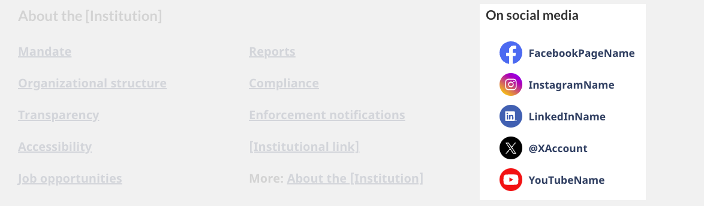
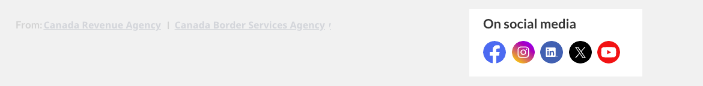
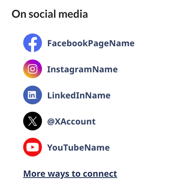
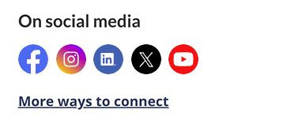
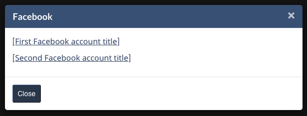

**Last updated**: {{ page.dateModified }}

The social media channels pattern provides links to official Government of Canada (GC) social media accounts.

    

## On this page

* [When to use](#when-to-use)
* [What to avoid](#what-to-avoid)
* [Content and design](#content-and-design)
* [How to implement](#how-to-implement)
* [Research and rationale](#research-and-rationale)
* [Latest changes](#latest-changes)

## When to use

Use the social media channels pattern on pages to promote official GC social media accounts that are relevant to the page.

Examples:

* Institutional landing page
* Blog
* Topic page

## What to avoid

Don’t use the social media channels pattern when a user’s flow must not be interrupted, such as in a transactional process.

## Content and design

Find content and design specifications and visual examples.

### Content specifications

The social media channels pattern is made up of the heading “On social media” and icons linking to official GC social media accounts.

Accounts referred to in the pattern must be fully compliant with the [Directive on the Management of Communications](https://www.tbs-sct.canada.ca/pol/doc-eng.aspx?id=30682).

You can use social media icons other than those provided in this pattern, as long as they represent official GC social media accounts.

The order of social media icons isn’t prescribed. You can arrange them in any order that makes sense for your context.

A maximum of 5 icons is recommended. Display icons aligned in a vertical column or horizontal row:

* Vertical display includes a label next to each icon
* Horizontal display only includes the icons

If there is more than one account from a platform:

* Include the platform name next to its icon (vertical only)
* Use a lightbox modal to display the name of each different account on that platform
  * the lightbox can have up to 8 text links
  * use the names of the accounts as labels

Place the social media channels after task and navigation content.

#### Optional link

You can add a link with the label “More ways to connect” if you want to link to additional social media accounts or other departmental communications platforms (e.g., podcasts, external magazine, etc.). The link should point to a page that lists all your social media accounts and additional ways to connect with/follow the department.

### Design specifications

* Lightbox design specifications
  * Modal header background colour: #2e5274
  * Header: Lato, H2, 27px (H2 styled as H4 size)
  * Button is styled as a primary button.
* Links:
  * Font: Noto Sans, 17px, [standard link colours](https://design.canada.ca/styles/colours.html)
* “More ways to connect” link:
  * Font: Noto Sans, 17px, [standard link colours](https://design.canada.ca/styles/colours.html)
  * Aligned to the left
  * Positioned under the list of icons

The following social media link classes and associated icons are available.

    

        

            <table class="table table-striped" id="social-media" aria-live="polite">
                <caption class="wb-inv">Social media link classes and associated icons</caption>
                <thead>
                    <tr>
                        <th class="col-md-4">Social media platform</th>
                        <th class="col-md-6">CSS class</th>
                        <th class="col-md-2">Link to SVG file (GitHub)</th>
                    </tr>
                </thead>
                <tbody>
                    <tr>
                        <td>Facebook</td>
                        <td><code>facebook</code></td>
                        <td class="text-center">
                            

                                <ul class="list-inline">
                                    <li><a href="https://github.com/wet-boew/GCWeb/blob/master/components/gc-follow-us/assets/facebook.svg" class="facebook">Facebook</a></li>
                                </ul>
                            

                        </td>
                    </tr>
                    <tr>
                        <td>Instagram</td>
                        <td><code>instagram</code></td>
                        <td class="text-center">
                            

                                <ul class="list-inline">
                                    <li><a href="https://github.com/wet-boew/GCWeb/blob/master/components/gc-follow-us/assets/instagram.svg" class="instagram">Instagram</a></li>
                                </ul>
                            

                        </td>
                    </tr>
                    <tr>
                        <td>LinkedIn</td>
                        <td><code>linkedin</code></td>
                        <td class="text-center">
                            

                                <ul class="list-inline">
                                    <li><a href="https://github.com/wet-boew/GCWeb/blob/master/components/gc-follow-us/assets/linkedin.svg" class="linkedin">LinkedIn</a></li>
                                </ul>
                            

                        </td>
                    </tr>
                    <tr>
                        <td>X</td>
                        <td><code>twitter</code></td>
                         <td class="text-center">
                            

                                <ul class="list-inline">
                                    <li><a href="https://github.com/wet-boew/GCWeb/blob/master/components/gc-follow-us/assets/twitter.svg" class="twitter">X</a></li>
                                </ul>
                            

                        </td>
                    </tr>
                    <tr>
                        <td>YouTube</td>
                        <td><code>youtube</code></td>
                        <td class="text-center">
                            

                                <ul class="list-inline">
                                    <li><a href="https://github.com/wet-boew/GCWeb/blob/master/components/gc-follow-us/assets/youtube.svg" class="youtube">YouTube</a></li>
                                </ul>
                            

                        </td>
                    </tr>
                </tbody>
            </table>
        

    

### Visual examples

    <figure class="mrgn-tp-md mrgn-bttm-lg">
        <figcaption><b>Social media channels (vertical view with labels) - large screen</b></figcaption>
        
        

            
Image description: social media channels (vertical view with labels) - large screen

            
Social media channel links appear in a section with the heading “On social media”. Below the heading is a vertical list with associated icons and labels:

            <ul>
                <li>Facebook icon followed by the placeholder text FacebookPageName</li>
                <li>Instagram icon followed by the placeholder text InstagramName</li>
                <li>LinkedIn icon followed by the placeholder text LinkedInName</li>
                <li>X icon followed by the placeholder text @XAccount</li>
                <li>YouTube icon followed by the placeholder text YouTubeName</li>
            </ul>
        

    </figure>

    <figure class="mrgn-tp-md mrgn-bttm-lg">
        <figcaption><b>Social media channels (horizontal view) - large screen</b></figcaption>
        
        

            
Image description: social media channels (horizontal view) - large screen

            
Social media channel links appear in a section with the heading “On social media”. Below the heading is a horizontal list with associated icons, but without labels:

            <ul>
                <li>Facebook</li>
                <li>Instagram</li>
                <li>LinkedIn</li>
                <li>X</li>
                <li>YouTube</li>
            </ul>
        

    </figure>

    <figure class="mrgn-tp-md mrgn-bttm-lg">
        <figcaption><b>Social media channels (vertical view with labels and more ways to connect link) - small screen</b></figcaption>
        
        

            
Image description: social media channels (vertical view with labels and more ways to connect link) - small screen

            
Social media channel links appear in a section with the heading “On social media”. Below the heading is a vertical list with associated icons and labels:

            <ul>
                <li>Facebook icon followed by the placeholder text FacebookPageName</li>
                <li>Instagram icon followed by the placeholder text InstagramName</li>
                <li>LinkedIn icon followed by the placeholder text LinkedInName</li>
                <li>X icon followed by the placeholder text @XAccount</li>
                <li>YouTube icon followed by the placeholder text YouTubeName</li>
            </ul>
          
Below the icons is a link with the label: More ways to connect

        

    </figure>

    <figure class="mrgn-tp-md mrgn-bttm-lg">
        <figcaption><b>Social media channels (horizontal view with labels and more ways to connect link) - small screen</b></figcaption>
        
        

            
Image description: social media channels (horizontal view with more ways to connect link) - small screen

            
Social media channel links appear in a section with the heading “On social media”. Below the heading is a horizontal list with associated icons:

            <ul>
                <li>Facebook icon</li>
                <li>Instagram icon</li>
                <li>LinkedIn icon</li>
                <li>X icon</li>
                <li>YouTube icon</li>
            </ul>
            
Below the icons is a link with the label: More ways to connect

        

    </figure>

    <figure class="mrgn-tp-md mrgn-bttm-lg">
        <figcaption><b>Social media lightbox modal for multiple accounts</b></figcaption>
        
        

            
Image description: social media lightbox modal for multiple accounts

            
An overlay lightbox for displaying multiple Facebook accounts. There is a header indicating which social media platform, below there are two links titled [First Facebook account title] and [Second Facebook account title]. The lightbox has a close button and an X in the corner to exit the modal.

        

    </figure>

## How to implement

Find working examples and code for implementing the social media channels pattern.

### GCweb (WET) theme implementation reference

The implementation reference includes how to configure elements of the design system.

* [Social media channels - GCWeb](https://wet-boew.github.io/GCWeb/components/gc-follow-us/gc-follow-us-en.html)
* [Quick implementation guide - GCWeb theme](https://wet-boew.github.io/GCWeb/docs/implementing-en.html)

### Implementations

Determine what best suits the type of page you're creating.

    

        

            

                

                    
<strong>GC-AEM</strong>

                    
For the Government of Canada Adobe Experience Manager (AEM):

                    <ul>
                        <li><a href="https://www.gcpedia.gc.ca/wiki/AEM_GC-specific_Documentation_6.5">AEM/Managed Web Service documentation (GCPedia link - only available on the Government of Canada network)</a></li>
                    </ul>
                

                

                    
<strong>CDTS</strong>

                    
For the Centrally Deployed Templates Solution (CDTS):

                    <ul>
                        <li><a href="https://cenw-wscoe.github.io/sgdc-cdts/docs/index-en.html">CDTS documentation</a></li>
                    </ul>
                

                

                    
<strong>Drupal WxT</strong>

                    
For Drupal WxT:

                    <ul>
                        <li><a href="https://drupalwxt.github.io/">Drupal WxT documentation</a></li>
                    </ul>
                

            

        

    

## Research and rationale

Consult the policy rationale.

### Policy rationale

The content within the social media channels section must follow the [Directive on the Management of Communications](https://www.tbs-sct.canada.ca/pol/doc-eng.aspx?id=30682).

This is an optional pattern for the following mandatory templates:

* [Institutional landing page](https://design.canada.ca/mandatory-templates/institutional-profile-pages.html)
* [Topic page template](https://design.canada.ca/mandatory-templates/topic.html)
* [Ministerial pages](https://design.canada.ca/mandatory-templates/ministerial-profile-pages.html)

## Latest changes

<dl class="dl-horizontal">
    <dt><time>2026-09-01</time></dt>
    <dd>Updated the guidance to clarify that 5 icons are recommended as a best practice, not a maximum limit.</dd>
    <dt><time>2026-01-30</time></dt>
    <dd>Updated the guidance to clarify that other social media icons can be used and that icons can be rearranged.</dd>
    <dt><time>2025-05-15</time></dt>
    <dd>Updated typography specifications in tandem with alignment activities for GCWeb and GC Design System.</dd>
    <dt><time>2024-09-19</time></dt>
    <dd>Updated the pattern to add an optional “More ways to connect” link.</dd>
    <dt><time>2024-04-03</time></dt>
    <dd>Updated the guidance to include content and design specifications, visual examples and implementation guidance.</dd>
</dl>
