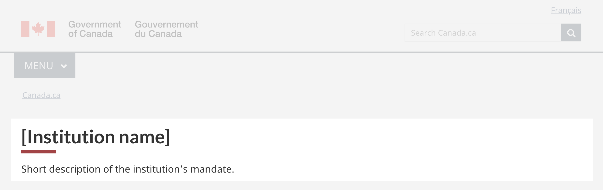

<strong>Last updated</strong>: {{ page.dateModified }}

The social media channels pattern provides links to official Government of Canada (GC) social media accounts.

 

<section>
  <h2>On this page</h2>
  <ul>
    <li><a href="#use">When to use</a></li>
    <li><a href="#avoid">What to avoid</a></li>
    <li><a href="#design">Content and design</a></li>
    <li><a href="#implement">How to implement</a></li>
    <li><a href="#research">Research and rationale</a></li>
    <li><a href="#latest">Latest changes</a></li>
    <li><a href="#discuss">Discussion</a></li>
  </ul>
</section>
<section>
  <h2 id="use">When to use</h2>
  
Use the social media channels pattern on pages to promote official GC social media accounts that are relevant to the page.

  
  
Examples:

  <ul>
    <li>Institutional landing page</li>
    <li>Blog</li>
    <li>Topic page</li>
  </ul>
</section>
<section>
  <h2 id="avoid">What to avoid</h2>
  
Don’t use the social media channels pattern when a user’s flow must not be interrupted, such as in a transactional process.

</section>
<section>
  <h2 id="design">Content and design</h2>
  
Find content and design specifications and visual examples.

  <h3>Content specifications</h3>
  
The social media channels pattern is made up of the heading “On social media” and icons linking to official GC social media accounts.

  
Accounts referred to in the pattern must be fully compliant with the <a href="https://www.tbs-sct.canada.ca/pol/doc-eng.aspx?id=30682">Directive on the Management of Communications</a>.

    

Display a maximum of 7 icons aligned in a vertical column or horizontal row:

<ul>
    <li>Vertical display includes a label next to each icon</li>
   <li>Horizontal display only includes the icons</li>
</ul>

If there is more than one account from a platform:

<ul>
    <li>Include the platform name next to its icon (vertical only)</li>
    <li>Use a lightbox modal to display the name of each different account on that platform
    <ul>
        <li>the lightbox can have up to 8 text links</li>
        <li>use the names of the accounts as labels</li>
    </ul>
    </li>

Place the social media channels after task and navigation content.

  <h3>Design specifications</h3>

 
The following social media link classes and associated icons are available.

  <h4>Accessibility</h4>
    <ul>
      <li>If you’re superimposing text over an image, ensure there’s a contrast ratio of at least 4.5:1.</li>
    </ul>

  <h3>Visual examples</h3>
    

      <figure class="mrgn-tp-md mrgn-bttm-lg">
        <figcaption><b>Introduction block - Large screen</b></figcaption>
        
        

          
Image description:

          
The introduction block appears below the global header and the Canada.ca breadcrumb. It consists of an h1 for Institution name and a short description of the institution’s mandate.

        

      </figure>
    

  

      <figure class="mrgn-tp-md mrgn-bttm-lg">
        <figcaption><b>Introduction block - small screen</b></figcaption>
        
        

          
Image description:

          
The introduction block appears below the global header and the Canada.ca breadcrumb. It consists of an h1 for Institution name and a short description of the institution’s mandate.

        

      </figure>
    

</section>
<section>
  <h2 id="implement">How to implement</h2>
</section>

<section>
  <h2 id="research">Research and rationale</h2>
  
Consult research findings and policy rationale.

  <h3>Research fidings</h3>
  
<a href="https://blog.canada.ca/research-summaries/cra-contact-us-research-summary.html">Research summary: Contact the CRA</a>
 
  
Canada Revenue Agency and DTO developed the introduction block as part of the optimization project for CRA contacts.
 

  
We found the introduction block design to be useful on institutional landing pages, especially in situations where a supertask button is needed. Check the research summary for additional information about other aspects of the project.

  <h3>Policy rationale</h3>

  
The introduction block pattern is required in the following mandatory templates:

  <ul>
    <li><a href="">Institutional landing page</a></li>
    <li><a href="https://design.canada.ca/mandatory-templates/theme-topic.html">Theme and topic page template</a></li>
  </ul>

</section>
<section>
  <h2 id="latest">Latest changes</h2>
  <dl class="dl-horizontal">
    <dt>
      <time datetime="2023-08-13" class="link-muted">2023-08-20</time>
    </dt>
    <dd>Updated the guidance to include content and design specifications, visual examples and implementation guidance</dd>
  </dl>
</section>

