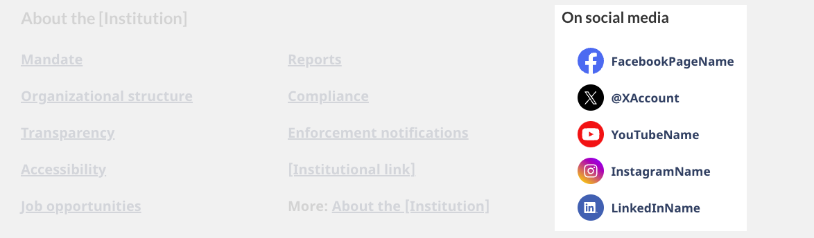
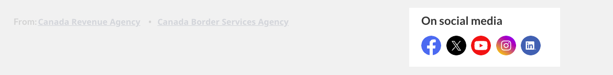

<strong>Last updated</strong>: {{ page.dateModified }}

The social media channels pattern provides links to official Government of Canada (GC) social media accounts.

<section>
    <h2>On this page</h2>
    <ul>
        <li><a href="#use">When to use</a></li>
        <li><a href="#avoid">What to avoid</a></li>
        <li><a href="#design">Content and design</a></li>
        <li><a href="#implement">How to implement</a></li>
        <li><a href="#research">Research and rationale</a></li>
        <li><a href="#latest">Latest changes</a></li>
    </ul>
</section>
<section>
    <h2 id="use">When to use</h2>
    
Use the social media channels pattern on pages to promote official GC social media accounts that are relevant to the page.

    
Examples:

    <ul>
        <li>Institutional landing page</li>
        <li>Blog</li>
        <li>Topic page</li>
    </ul>
</section>
<section>
    <h2 id="avoid">What to avoid</h2>
    
Don’t use the social media channels pattern when a user’s flow must not be interrupted, such as in a transactional process.

</section>
<section>
    <h2 id="design">Content and design</h2>
    
Find content and design specifications and visual examples.

    <h3>Content specifications</h3>
    
The social media channels pattern is made up of the heading “On social media” and icons linking to official GC social media accounts.

    
Accounts referred to in the pattern must be fully compliant with the <a href="https://www.tbs-sct.canada.ca/pol/doc-eng.aspx?id=30682">Directive on the Management of Communications</a>.

    
Display a maximum of 7 icons aligned in a vertical column or horizontal row:

    <ul>
        <li>Vertical display includes a label next to each icon</li>
        <li>Horizontal display only includes the icons</li>
    </ul>
    
If there is more than one account from a platform:

    <ul>
        <li>Include the platform name next to its icon (vertical only)</li>
        <li>
            Use a lightbox modal to display the name of each different account on that platform
            <ul>
                <li>the lightbox can have up to 8 text links</li>
                <li>use the names of the accounts as labels</li>
            </ul>
        </li>
    </ul>
    
Place the social media channels after task and navigation content.

    <h3>Design specifications</h3>
    <ul>
        <li>
            Lightbox design specifications
            <ul>
                <li>Modal header background colour: #2e5274</li>
                <li>Header: H2, Lato, styled as font size: 1.15em</li>
            </ul>
        </li>
        <li>
            Links:
            <ul>
                <li>Font: Noto Sans, 16px, standard link colours</li>
            </ul>
        </li>
        <li>Button is styled as a primary button.</li>
    </ul>
    
The following social media link classes and associated icons are available.

    

        

            

                <table class="table table-striped" id="social-media" aria-live="polite">
                    <caption class="wb-inv">
                        Social media link classes and associated icons
                    </caption>
                    <thead>
                        <tr>
                            <th class="col-md-4">Social media platform</th>
                            <th class="col-md-6">CSS class</th>
                            <th class="col-md-2">Link to SVG file (GitHub)</th>
                        </tr>
                    </thead>
                    <tbody>
                        <tr>
                            <td>Facebook</td>
                            <td>
facebook
</td>
                            <td class="text-center"></td>
                        </tr>
                        <tr>
                            <td>Twitter</td>
                            <td>
twitter
</td>
                            <td class="text-center"></td>
                        </tr>
                        <tr>
                            <td>YouTube</td>
                            <td>
youtube
</td>
                            <td class="text-center"></td>
                        </tr>
                        <tr>
                            <td>LinkedIn</td>
                            <td>
linkedin
</td>
                            <td class="text-center"></td>
                        </tr>
                        <tr>
                            <td>Instagram</td>
                            <td>instagram</td>
                            <td class="text-center"></td>
                        </tr>
                    </tbody>
                </table>
            

        

    

    
<a href="https://design.canada.ca/contact-us/">Contact the Digital Transformation Office (DTO)</a> if you want to include a platform that is not represented here.

    <h3>Visual examples</h3>
    

        <figure class="mrgn-tp-md mrgn-bttm-lg">
            <figcaption><b>Social media channels (vertical view with labels) - large screen</b></figcaption>
            
            

                
Image description:

                
Social media channel links appear in a section with the heading “On social media”. Below the heading is a vertical list with associated icons and labels:

                <ul>
                    <li>Facebook icon followed by the placeholder text FacebookPageName</li>
                    <li>Twitter icon followed by the placeholder text @TwitterAccount</li>
                    <li>Youtube icon followed by the placeholder text YouTubeName</li>
                    <li>Instagram icon followed by the placeholder text InstagramName</li>
                    <li>LinkedIn icon followed by the placeholder text LinkedInName</li>
                </ul>
            

        </figure>
    

    

        <figure class="mrgn-tp-md mrgn-bttm-lg">
            <figcaption><b>Social media channels (horizontal view) - large screen</b></figcaption>
            
            

                
Image description:

                
Social media channel links appear in a section with the heading “On social media”. Below the heading is a horizontal list with associated icons, but without labels:

                <ul>
                    <li>Facebook</li>
                    <li>Twitter</li>
                    <li>Youtube</li>
                    <li>Instagram</li>
                    <li>LinkedIn</li>
                </ul>
            

        </figure>
    

    

        <figure class="mrgn-tp-md mrgn-bttm-lg">
            <figcaption><b>Social media channels (vertical view with labels) - small screen</b></figcaption>
            
            

                
Image description:

                
Social media channel links appear in a section with the heading “On social media”. Below the heading is a vertical list with associated icons and labels:

                <ul>
                    <li>Facebook icon followed by the placeholder text FacebookPageName</li>
                    <li>Twitter icon followed by the placeholder text @TwitterAccount</li>
                    <li>Youtube icon followed by the placeholder text YouTubeName</li>
                    <li>Instagram icon followed by the placeholder text InstagramName</li>
                    <li>LinkedIn icon followed by the placeholder text LinkedInName</li>
                </ul>
            

        </figure>
    

    

        <figure class="mrgn-tp-md mrgn-bttm-lg">
            <figcaption><b>Social media lightbox modal for multiple accounts</b></figcaption>
            
            

                
Image description:

                

                    An overlay lightbox for displaying multiple Facebook accounts. There is a header indicating which social media platform, below there are two links titled [First Facebook account title] and [Second Facebook account
                    title]. The lightbox has a close button and an X in the corner to exit the modal.
                

            

        </figure>
    

</section>
<section>
    <h2 id="implement">How to implement</h2>
    
Find working examples and code for implementing the contact us band pattern.

    <h3>GCweb (WET) theme implementation reference</h3>
    
The implementation reference includes how to configure elements of the design system.

    <ul>
        <li><a href="">Social media channels - GCWeb</a></li>
        <li><a href="https://wet-boew.github.io/GCWeb/docs/implementing-en.html">Quick implementation guide - GCWeb theme</a></li>
    </ul>
    <h3>Implementations</h3>
    
Determine what best suits the type of page you're creating.

    

        

            

                

                    

                        
<strong>GC-AEM</strong>

                        
For the Government of Canada Adobe Experience Manager (AEM):

                        <ul>
                            <li><a href="https://www.gcpedia.gc.ca/wiki/AEM_GC-specific_Documentation_6.5">AEM/Managed Web Service documentation (GCPedia link - only available on the Government of Canada network)</a></li>
                        </ul>
                    

                    

                        
<strong>CDTS</strong>

                        
For the Centrally Deployed Templates Solution (CDTS):

                        <ul>
                            <li><a href="https://cenw-wscoe.github.io/sgdc-cdts/docs/index-en.html">CDTS documentation</a></li>
                        </ul>
                    

                    

                        
<strong>Drupal WxT</strong>

                        
For Drupal WxT:

                        <ul>
                            <li><a href="https://drupalwxt.github.io/en/">Drupal WxT documentation</a></li>
                        </ul>
                    

                

            

        

    

</section>
<section>
    <h2 id="research">Research and rationale</h2>
    
Consult the policy rationale.

    <h3>Policy rationale</h3>
    
The content within the social media channels section must follow the <a href="https://www.tbs-sct.canada.ca/pol/doc-eng.aspx?id=30682">Directive on the Management of Communications</a>.

    
This is an optional pattern for the following mandatory templates:

    <ul>
        <li><a href="">Institutional landing page</a></li>
        <li><a href="https://design.canada.ca/mandatory-templates/theme-topic.html">Theme and topic page template</a></li>
        <li><a href="https://design.canada.ca/mandatory-templates/ministerial-profile-pages.html">Ministerial pages</a></li>
    </ul>
</section>
<section>
    <h2 id="latest">Latest changes</h2>
    <dl class="dl-horizontal">
        <dt>
            <time datetime="2023-08-13" class="link-muted">2023-08-20</time>
        </dt>
        <dd>Updated the guidance to include content and design specifications, visual examples and implementation guidance.</dd>
    </dl>
</section>