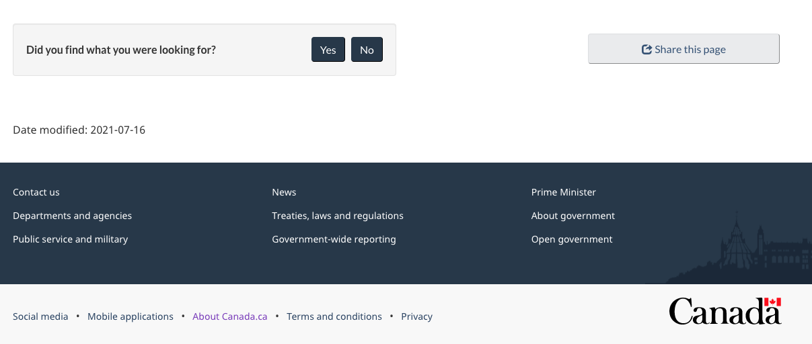
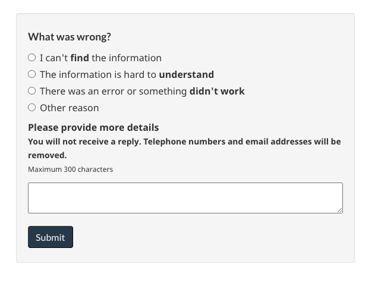

<h2>
 On this page
</h2>

<ul>
 <li>
  <a href="#why">
   Why collect user feedback
  </a>
 </li>
 <li>
  <a href="#when">
   When to use the page feedback tool
  </a>
 </li>
 <li>
  <a href="#how">
   How it works
  </a>
 </li>
 <li>
  <a href="#issues">
   Common issues that page feedback can uncover
  </a>
 </li>
 <li>
  <a href="#request">
   Request to use the page feedback tool
  </a>
 </li>
</ul>

 The page feedback tool is still in a pilot phase.

<h2 id="why">
 Why collect user feedback
</h2>

 User feedback can be useful to a range of people working on a product or service, including:  web teams, program specialists, policy analysts, and other communications professionals (social media, outreach).

 Combining qualitative insights with quantitative data is a step towards building a content culture that is human-centred, evidence-driven, and iterative.

<blockquote>
 

  Client feedback is a critical input into ensuring that services meet the needs of clients and to support continual improvement.
 

 

  Source:
  <a href="https://www.canada.ca/en/government/system/digital-government/guideline-service-digital.html#ToC2_2">
   Guideline on Service and Digital
  </a>
 

</blockquote>

 Collecting feedback:

<ul>
 <li>
  brings the voice of users into focus
 </li>
 <li>
  normalizes the continuous improvement of content
 </li>
 <li>
  identities issues affecting content effectiveness and task success
 </li>
</ul>

<h2 id="when">
 When to use the page feedback tool
</h2>

 First use the GC Task Success Survey to identify tasks that you would like to improve.   Then add the page feedback tool on specific pages related to that task to uncover specific page-level issues affecting task performance.

<h2 id="how">
 How it works
</h2>

 The feedback tool is an optional pattern.  Add it to the bottom of a content page after the page content and before the date modified.  It replaces the “Report a problem” pattern while actively collecting user feedback.

<figure class="mrgn-tp-lg">
 <figcaption>
  <b>
   Canada.ca footer with the feedback tool
  </b>
 </figcaption>
 
 </img>
</figure>

 The feedback tool invites visitors to:

<ul>
 <li>
  indicate if they found what they were looking for (yes / no)
 </li>
 <li>
  indicate a reason for why not (information was not clear)
 </li>
 <li>
  offer their feedback describing the problem
 </li>
</ul>

<figure class="mrgn-tp-lg">
 <figcaption>
  <b>
   Feedback tool after clicking "No"
  </b>
 </figcaption>
 
</figure>

 

  Feedback tool
 

 

  A heading labelled "What was wrong", followed by options to select:
 

 <ul>
  <li>
   I can't find the information
  </li>
  <li>
   The information is hard to understand
  </li>
  <li>
   There was an error or something didn't work
  </li>
  <li>
   Other reason
  </li>
 </ul>
 

  Followed by the text "Please provide more details. You will not receive a reply. Telephone numbers and email addresses will be removed. Maximum 300 characters", and a text field to provide more details.
 

<h2 id="issues">
 Common issues that page feedback can uncover
</h2>

<table class="provisional gc-table table table-striped" id="myTable1">
 <caption class="wb-inv">
  Common issues
 </caption>
 <thead>
  <tr>
   <th scope="col">
    Issue
   </th>
   <th scope="col">
    Type
   </th>
   <th scope="col">
    What to do
   </th>
  </tr>
 </thead>
 <tbody>
  <tr>
   <td data-label="Issue">
    
     Something is broken
    
   </td>
   <td data-label="Type">
    
     Technical errors
    
   </td>
   <td data-label="What to do">
    
     Quickly correct small errors like broken links or typos. Diagnose and fix interactive features.
    
   </td>
  </tr>
  <tr>
   <td data-label="Issue">
    
     Can’t find answer
    
   </td>
   <td data-label="Type">
    
     Navigation
    
   </td>
   <td data-label="What to do">
    
     Reconsider information architecture, improve information scent to the page
    
   </td>
  </tr>
  <tr>
   <td data-label="Issue">
    
     Can’t understand or use an answer
    
   </td>
   <td data-label="Type">
    
     Writing
    
   </td>
   <td data-label="What to do">
    
     Rewrite or edit using plain language
    
   </td>
  </tr>
  <tr>
   <td data-label="Issue">
    
     Answer not on page
    
   </td>
   <td data-label="Type">
    
     Missing user need / Content gap
    
   </td>
   <td data-label="What to do">
    
     Include the answer in the content
    
   </td>
  </tr>
  <tr>
   <td data-label="Issue">
    
     Doesn’t like the answer
    
   </td>
   <td data-label="Type">
    
     Program/Policy
    
   </td>
   <td data-label="What to do">
    
     Share feedback with appropriate program/policy channels
    
   </td>
  </tr>
 </tbody>
</table>

<h2 id="request">
 Request to use the page feedback tool
</h2>

 You can request to pilot the page feedback on your site by emailing the DTO:
 <a href="mailto:dto.btn@tbs-sct.gc.ca">
  dto.btn@tbs-sct.gc.ca.
 </a>

 What you will get:

<ul>
 <li>
  page feedback code
 </li>
 <li>
  guidance on best practices and feedback analysis
 </li>
 <li>
  access to download feedback
 </li>
</ul>

