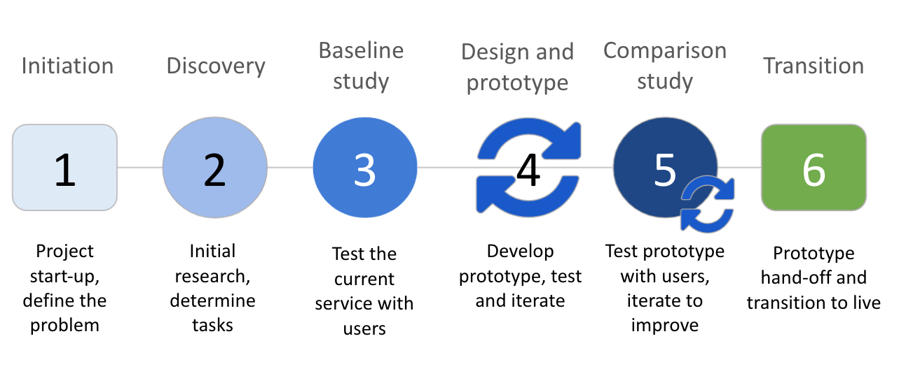

## On this page

* [Process](#process)
* [Initiation](#initiation)
* [Discovery phase](#discovery-phase)
* [Baseline measurement phase](#baseline-measurement-phase)
* [Prototype ideas to improve success](#prototype-ideas-to-improve-success)
* [Comparison testing](#comparison-testing)

## Process

There is no single method for continuous optimization, but most approaches will follow a similar process.  You identify a problem, research the issue, gather a baseline, prototype and test (as many times as needed), go live, and finally measure the impact of your work.

The method described here is how the Digital Transformation Office approaches content optimization projects.

<figure>
 
</figure>

 
DTO optimization process

 
Step 1: Initiation. Project start-up, define the problem.

 
Step 2: Discovery. Initial research, determine tasks.

 
Step 3: Baseline study. Test the current service with users.

 
Step 4: Design and prototype. Develop prototype, test and iterate.

 
Step 5: Comparison study. Test prototype with users, iterate to improve.

 
Step 6: Transition. Prototype hand-off and transition to live.

## Initiation

You need to identify all of the stakeholders - particularly those who will have an impact on whether what you’re doing goes live. If the right people aren’t involved early on, you may experience significant delays. In the worst case scenario, your work may never see the light of day.

Agree on what you’re trying to accomplish and make sure to have a good understanding of the barriers that may prevent implementation.

At the DTO we use a project tracking sheet where we can link to all of the important study artifacts:

* Template: [Optimization project sheet](https://docs.google.com/spreadsheets/d/1-GdYRLYISXDXZZAqFNrLPOImAzPka5mAw4aJdiLhCnM/edit?usp=sharing) (Google Docs)

## Discovery phase

The purpose of the discovery phase is to conduct user research that will:

* tell you about the people using your content
* identify the tasks they are trying to complete
* pinpoint the challenges people are facing
* help you form hypotheses for a usability testing plan
* help define or refine the specific goals for your project

Avoid making assumptions or thinking about solutions before discovery research is complete. It’s  important to understand the problems that people are having first. You will tackle potential solutions through prototypes in the next phase.

### Common research methods in the discovery phase

<blockquote>
 
Asking your own questions and knowing how to find the answers is a critical part of being a designer

 
Source: Erika Hall, Just Enough Research

</blockquote>

To create research questions, you need to understand gaps and weaknesses with the current situation.  Use all or some of these methods to analyze your current situation.

#### Qualitative research

* Feedback from users
* [User interviews](https://digital.canada.ca/tools-and-resources/guide-interviewing/)
* Previous usability studies
* Usability studies: first click tests, card sorting, tree jacks
* Surveys or other behavioral insights reports
* Social listening: web forums, social media

#### Quantitative research

* Content inventories and maps
* Call centre reports
* Web analytics
* GC Task Success Survey results

### Learn about people using your content

By understanding the people who use your content, you will know more about who they are and their behaviours. This will help you narrow down who you need to recruit for usability testing.

### Record your findings and the challenges people are facing

Some ways to summarize these findings include:

* kanban board
* spreadsheets with analytics
* concept maps
* interview transcripts
* journey maps

### Identify the specific tasks people are doing

Decide which specific tasks you will address as part of the optimization work.

You will build the solutions you prototype around these tasks.

Some examples of specific tasks from the Canada Child Benefit program:

* How much will the payment be?
* When will the payment be sent / deposited?
* Check if you are eligible to receive the Canada Child Benefit
* How to update your address

### Sharing the discovery research

Summarizing and sharing what you’ve learned is an important milestone. This is a living document that you add to as you learn more through your research.  You’ll refer back to these artifacts often.

## Baseline measurement phase

A baseline measurement gives you a direct comparison of how a task performed before you optimize it.

If having a direct comparison is important to demonstrate the impact and value of your solutions, this is an important step to include. Make sure to use the same measurement method before and after optimization if you want comparable results.

If your project is completely new you may not have anything to baseline test.

Additionally, if your proposed solution is small or you have another metric (like call centre data or GC Task Success Survey data) that you will use to evaluate effectiveness, you could skip running a baseline study.

### Why run a baseline usability study

Watching real people use your content is one of the most effective ways to gather evidence about the problems you’re looking to solve.

Perform moderated or unmoderated baseline studies with people trying scenarios on existing web content.

### When to use moderated and unmoderated testing

<table class="table table-bordered">
 <tbody>
  <tr class="bg-primary">
   <td>Moderated is best for:
   </td>
   <td>Unmoderated is best for:
   </td>
  </tr>
  <tr>
   <td>
    <ul>
     <li>a complicated process or concept</li>
     <li>when you want to ask follow-up questions if a participant is stuck or confused</li>
     <li>working with a specialized group of participants</li>
    </ul>
   </td>
   <td>
    <ul>
     <li>quick results</li>
     <li>studying a few very specific tasks</li>
     <li>if you only need to select participants using basic demographics (age or income)
     </li>
    </ul>
   </td>
  </tr>
 </tbody>
</table>

At the DTO, we include 16-18 participants in moderated baseline studies when we want to generate percentage task success scores that have reproducible results.

You can run smaller studies with fewer participants to gain insights about specific parts of your site. In our work at the DTO, we often run qualitative usability tests with 6-8 participants, but you can run studies with as few as 3-5 participants and still get useful results.

In small studies, do not report success or failure as percentages since the results are not reproducible.

 <section class="col-md-5 col-xs-6">
  <h2 class="mrgn-tp-0 text-success h4">
   
   Correct
  </h2>
  
2 / 8 participants were able to complete the task successfully

 </section>
 <section class="col-md-5 brdr-lft col-xs-6">
  <h2 class="mrgn-tp-0 text-danger h4">
   
   Incorrect
  </h2>
  
25% of participants were able to complete the task successfully

 </section>

### Recruiting participants

Recruit people for your usability tests that are **representative of the audience for your content or service**. You can work with a company to help recruit participants or use screening criteria in unmoderated tools to help find the right people to reduce variability in your results.

Plan to over-recruit - expect that there will be no-shows or that some unmoderated tests may not work out as expected.

Whoever is recruiting participants and conducting research is responsible for protecting the privacy of participants and ensuring they have informed consent before starting the study.

 
Collecting personal information

 
Before collecting participants’ personal information, check in with your privacy group.

 
The <cite><a href="https://laws-lois.justice.gc.ca/eng/acts/p-21/page-1.html">Privacy Act</a></cite> governs how the federal government handles personal information.

 <ul>
    <li>Section 3: Definitions</li>
    <li>Section 4: Authority to Collect</li>
    <li>Section 8 (2): Appropriate Disclosure of Information</li>
 </ul>
 
The <cite><a href="https://ethics.gc.ca/eng/policy-politique_tcps2-eptc2_2018.html">Tri-council policy statement on Ethical Conduct for research involving humans</a></cite> outlines best practices for conducting research with participants.

 <ul>
  <li>Chapter 3 provides guidelines for collecting informed consent.</li>
 </ul>
 
The <cite><a href="https://www.tbs-sct.gc.ca/pol/doc-eng.aspx?id=18309">Directive on Privacy Practices</a></cite> provides direction on how to implement effective privacy practices including collecting and notifying participants how their information will be used.

 <ul>
    <li>Section 6: Requirements</li>
    <li>Section 6.2.9: Privacy Notice</li>
 </ul>
 
When using unmoderated usability testing tools, we include a screening question that tells participants how we may use the recordings.  At this point, they are given the choice to opt out.

 <h4>Example privacy screener text</h4>
 

  “We sometimes use recordings in public blog posts, with any personally identifying information hidden and voices altered. Please only accept this test if you consent to us using your recording in this way.”
 

### Write task scenarios

#### Research questions

Using your discovery research, you now have a prioritized list of challenges that you're facing and potential tasks to test.

Develop research questions based on these tasks.  (What do you want to find out? To prove?)  Research questions help narrow the scope of your study to the behaviours you want evidence on - **make sure everyone agrees on them!**

With your list of research questions in hand, draft tasks that will help you gather evidence and provide insights about ideas to prototype.

#### Tasks

These must be **real things** people are trying to accomplish.

Hypothesize about what you think may happen during the test.

We find that we can test 8-10 small tasks in an hour-long moderated session or 5-6 tasks in an unmoderated 30-minute session.

#### Scenarios

Scenarios are realistic narratives for a task that the team creates together.

Using the job story formula, identify a situation a user may find themselves in and the strategies they use to arrive at a desired outcome.

A job story follows this format:

> “When I (situation), I want to (motivation), so I can (expected outcome)”

This is a valuable approach to reinforce your understanding of how and why a service is used.

 

  <strong>Example task</strong>
   
  Change direct deposit bank account details.
 

 

  <strong>Job story</strong>
   
  <strong>When</strong>
  I move my mortgage to a new bank,
  <strong>I want</strong>
  the CRA to put my tax refund into the new account,
  <strong>so I can</strong>
  pay my mortgage on time.
 

 

  <strong>Scenario</strong>
   
  You renewed your mortgage, and you moved all your bank accounts to a new bank. What number would you call to get your personal tax refund into your new bank account? (answer: 1-800-959-8281)
 

Fine-tune these tasks so they tell you as much as possible, are accurate, and feasible for your participants to complete. Make sure each task has a clear answer. Answers may be yes/no, or else something specific such as a number or percentage, a date, a telephone number, etc.

Before you run your first official test, make sure you pilot your task scenarios. For example, you can ask a friend or colleague to try doing the task to get a sense of whether participants will understand what you’re asking them to do.

#### More information on writing task scenarios

* [Turn User Goals into Task Scenarios for Usability Testing](https://www.nngroup.com/articles/task-scenarios-usability-testing/) - Nielsen Norman Group
* [Types of tasks](https://www.ontario.ca/page/usability-testing#section-3) - Ontario.ca User research guide

### Running a moderated or unmoderated baseline study

You can use an outside firm to run a moderated study for you or set it up yourself. If setting up a moderated study yourself, you will need to select a screen and audio sharing tool. Pay attention to any special installation requirements. If possible, let participants know in advance which tool you will be using so they can prepare their computer or device ahead of time.

You can choose from a range of third party services that provide moderated and unmoderated study tools. An unmoderated study can be run outside of work hours and is generally less expensive to run.

In both scenarios, you want to have video recordings at the end of each session that you can use to complete a detailed analysis.

#### Additional resources on moderated and unmoderated testing:

* [Remote moderated usability tests: How to do them](https://www.nngroup.com/articles/moderated-remote-usability-test/) - Nielsen Norman Group
* [Remote testing](https://www.usability.gov/how-to-and-tools/methods/remote-testing.html) - Usability.gov

### Analyzing baseline results

Involve everyone on the team in the analysis process, at least as an observer.

Reviewing transcripts and summary reports is helpful but there is no replacement for first-hand observations with real users. Ensure the whole team can participate by watching videos or live sessions.

#### Take notes of key behaviours during the sessions

* clicks - note all links clicked, and every click on anything, whether it’s clickable or not
* direct quotations of feedback about an issue
* scrolling the page
* reading headings aloud
* skimming text - missing links in skimmed text
* observations about issues encountered
* the point where they arrived on the page with the answer
* if they found the correct answer

#### Share any shorthand you use in your notes

* use identifiers for clicks on navigation like breadcrumb BC, back button B, menu link M
* note search, filter and find attempts with keywords used S keyword, F keyword

When analyzing the data you’ve collected, read through the notes carefully looking for patterns and be sure to add a description of each of the problems. Look for trends and keep a count of problems that occurred across participants.

#### Share your findings

Summarize the test results in a usability test report with your findings and recommendations. An effective report will include visuals such as screen shots and short video clips to illustrate specific problems.

We recommend presenting the findings in person. This is an effective way to make sure that stakeholders and approvers understand the issues that you are trying to fix. These sessions are a great way to build empathy for users with members of the team that did not observe or participate in analysis of the usability tests.

An emailed report is an ignored report!

#### Outcome of the baseline testing phase

* You have a baseline score for each task scenario
* You have videos of people attempting tasks
* Project team members and stakeholders have watched all videos for at least 1 task
* You know exactly how many people did what in each case
* You have a list of issues that need to be addressed
 * All project stakeholders understand the issues and **want to get them fixed**

## Prototype ideas to improve success

There are different approaches to prototyping, from basic wireframing to fully working HTML pages.

Basic designs help in the early stages of ideating for teams to discuss and visualize. Fully working HTML prototypes can make testing easier since they behave exactly, or almost exactly, like the real live content would.

Make sure prototypes aren’t behind firewalls or in staging/development servers that are not publicly accessible if you’re testing with members of the public.

Our preferred way of prototyping at the DTO is HTML, using GitHub pages, but there are other options for creating high-fidelity interactive prototypes including:

* Figma
* InVision
* Axure
* Adobe XD

Prototypes are a great change management tool. Doing demonstrations using prototypes can bring together diverse perspectives (for instance from communications and policy, or across branch or departmental lines).

A prototype that can be easily updated during workshops can be very effective.  A live editing session can turn ideas from participants into something concrete in real time.  It also demystifies content design and coding, which helps create buy-in for an iterative approach.

Prototyping is a risk-reduction strategy. It lets stakeholders see the proposed approach and comment on it or correct it before it goes live.

* [Co-design with approvers at the table](https://blog.canada.ca/2021/05/10/codesign-with-deciders) (blog post)
* [alpha.canada.ca experimentation platform](https://alpha.canada.ca/en/index.html)

## Comparison testing

Once your prototypes are ready, you need to test them to see whether your ideas and solutions work with users. When possible, use the same test questions and testing approach as you did for the baseline study so that you can make direct comparisons and verify whether you met objectives.

As testing progresses, you may find it necessary to continue fine-tuning or adjusting your prototypes, if participants continue to struggle. The participants will help you understand what helped, and why.

> No matter how smart or experienced you are, you **will** be surprised by what you see people do.

Follow up testing with analysis and reporting. The testing report or presentation should communicate improvements or areas that require further work. Include a plan to complete those additional changes.

This report will be a critical tool for building the case for change among decision makers during the following implementation phase.

* Template: [Usability study report](https://docs.google.com/presentation/d/1aQlhNaRKeGDwOhxSMhA012hzNk114JW3K9yQCMS6yeA/edit?usp=sharing) (Google Docs)

<nav class="mrgn-bttm-lg" role="navigation">
 <ul class="pager">
  <li class="next">
   <a href="./designing.html" rel="next">Next: Designing content</a>
  </li>
 </ul>
</nav>
