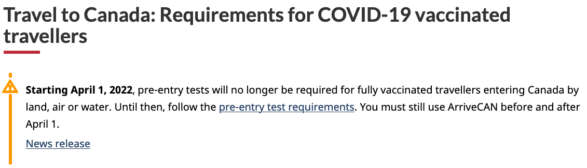
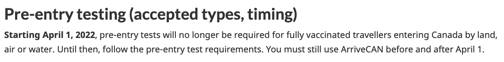
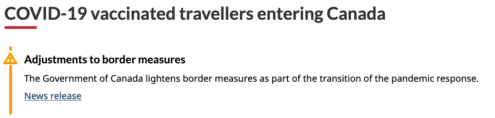

This guidance is intended to help bring consistency to each department's communications efforts. Follow these recommendations when communicating about service disruptions, or urgent and evolving situations on Canada.ca.

<h2>On this page</h2>

* [Keep news products and web content in sync](#keep-news-products-and-web-content-in-sync)  
* [Standardized alerts for news content](#standardized-alerts-for-news-content)   
* [How to add temporary alerts on affected content pages](#alerts)  
* [Alerts that repeat across several pages](#alerts-that-repeat-across-several-pages)  
* [Examples and code](#examples)

<h2 id="#keep-news-products-and-web-content-in-sync">Keep news products and web content in sync</h2>

Ideally news products and supporting web content updates are released **at the same time**. Unfortunately, this isn’t always realistic or possible. Sometimes news has to go out ahead of other web content updates, and this can cause issues for people accessing our pages.

<h2 id="#standardized-alerts-for-news-content">Standardized alerts for news content</h2>

In an evolving situation, alerts can be added to a news product to inform readers that the content may no longer reflect the most current information. These alerts should include a link to a central page with the latest updates.

Alerts are typically added when a news product is deemed outdated—either replaced by a newer release or containing outdated information. Teams should coordinate with their Strategic Communications colleagues to determine the best timing for adding alerts to individual news products.

<h2>How to add temporary alerts on content pages</h2>

Alerts are meant to draw attention to changes in regular content in 2 ways:

* a change to the content of the page on which the alert appears  
* a change that has been made elsewhere, such as new information being published

In cases where you can’t update web content at the same time as when a news product is published, add a temporary alert that links to the news release. This lets you intercept people on a content page where they naturally look for the most recent information. From there, you can direct them to “breaking news” content. 

This is a stop-gap measure that can buy you some time to complete detailed updates on the content page. You should still plan to incorporate the new information into the content page as soon as possible and then remove the alert.

### Place alerts in context, not just at the top

An alert at the top of a page may get missed by enthusiastic scrollers. Placing it within the relevant subsection of a page, where appropriate, lets you draw attention to an important change at the point where it makes the most sense for the reader. This maximizes the impact of the alert.

### What to include in alerts

Alert content should:

* be easy to understand  
* be short (long alerts push content down for mobile users)  
* describe the impact on the user  
* include the dates (if known) when the changes will take place  
* use the appropriate verb tense to reflect when the change is taking place  
* use links sparingly \- if a link is needed, only include one

### Limit use of alerts

Be aware that alert fatigue reduces the effectiveness of the alert over time. The more people see alerts and warning messages the less receptive they are to them. To avoid this, follow these guidelines:

* only use alerts on a temporary basis (for the time it takes to integrate the information or resolve the situation)  
* place alerts in context, not just at the top
* limit the number of alerts on each page  
* avoid using alerts just for styling regular content (for emphasis or highlighting)  
* remove alerts as soon as you’ve updated the program or service content to reflect what was announced

### Which alert to use

Follow the implementation guidance for contextual alerts to choose the appropriate type of alert for your content: 

* [Contextual alerts \- Canada.ca](https://design.canada.ca/common-design-patterns/contextual-alerts.html#how)

<h2 id="#alerts-that-repeat-across-several-pages">Alerts that repeat across several pages</h2>

If you need to add the same alert on many different pages, it may make sense to make a single page that all these alerts can link to.

The central page will:

* summarize the change in plain language  
* explain the impact on the users of affected services  
* be updated as soon as new information arises

The breadcrumb for this central page should lead to the Government of Canada's main response page for the crisis.

### How this helps

* prevents scattered crisis and service disruption pages  
* encourages a coordinated approach within each department and across the Government of Canada  
* reduces the work required to maintain various alerts and related updates

<h2>Examples and code</h2>

<figure class="gc-complex-img" role="group">
	
	<figcaption>

			
What to do: Clear date, correct verb tense, repeated in-context within the page

			
Alert text placed at the top of the page with a clear effective date:

    
<b>Starting April 1, 2022</b>, pre-entry tests will no longer be required for fully vaccinated travellers entering Canada by land, air, or water. Until then, follow the pre-entry test requirements. You must still use ArriveCAN before and after April 1.

    
News release

		
</figcaption>
</figure>

<figure class="gc-complex-img" role="group">
	
	<figcaption>

			
What to do: Clear date, correct verb tense, repeated in-context within the page

			
Alert repeated within the relevant section of the page with clear effective date:

    
<b>Pre-entry testing(accepted types, timing)</b>

    
<b>Starting April 1, 2022</b>, pre-entry tests will no longer be required for fully vaccinated travellers entering Canada by land, air, or water. Until then, follow the pre-entry test requirements. You must still use ArriveCAN before and after April 1.

		
</figcaption>
</figure>

<figure class="gc-complex-img" role="group">
	
	<figcaption>

			
What not to do: Critical date was missing and verbs are in present tense, so it made it seem like the rules were in effect already, (released February 15, rules were not changing until February 28)

			
Example of alert text that is too vague and caused misunderstanding by using the wrong verb tense:

    
<b>Adjustments to border measures</b>

    
The Government of Canada lightens border measures as past of the transition of the pandemic response.

    
News release

		
</figcaption>
</figure>

 <h2 id="latest">
  Latest changes
 </h2>
 <section>
  <dl class="dl-horizontal">
   <dt>
    <time class="link-muted" datetime="2025-03-31">
     2025-03-31
    </time>
   </dt>
   <dd>
    Revised to include instructions and examples for keeping content pages in sync with news releases.
     
     
    Added a recommendation to include dates in the alert and use the correct verb tense.
   </dd>
   <dt>
    <time class="link-muted" datetime="2022-05-10">
     2022-05-10
    </time>
   </dt>
   <dd>
    Revised headings to say “service disruption” rather than “crisis”.
     
     
    Added a recommendation to include dates in the alert and use the correct verb tense.
   </dd>
  </dl>
 </section>
