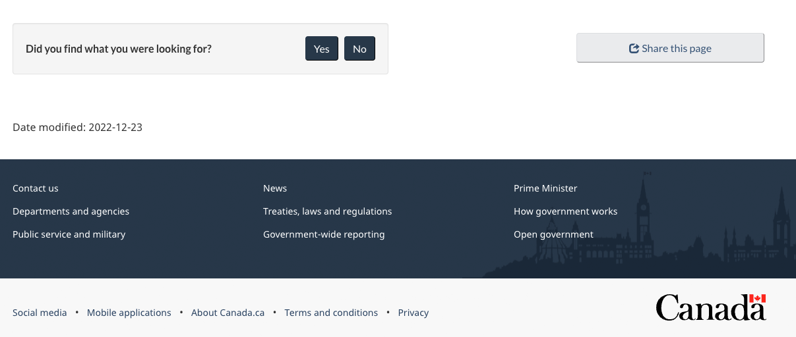

  

    <ul class="toc lst-spcd col-md-12">
      <li class="col-md-4 col-sm-6"><a class="list-group-item active" href="about-page-feedback.html">How the tool works</a></li>

      <li class="col-md-4 col-sm-6"><a class="list-group-item" href="when.html">When to use page feedback</a></li>
      <li class="col-md-4 col-sm-6"><a class="list-group-item" href="benefits.html">How feedback can help</a></li>
    </ul>
  

## On this page

*   [Why collect user feedback](#why-collect-user-feedback)
*   [Feedback tool design](#feedback-tool-design)
*   [Protecting personal information](#protecting-personal-information)

The page feedback tool is still in a pilot phase. This means that you can use the pattern, but there may be changes to how it looks or is coded in the future.

## Why collect user feedback

The primary purpose of collecting feedback is to use it as a **research tool** to improve content.

> Client feedback is a critical input into ensuring that services meet the needs of clients and to support continual improvement.
>
> Source: [Guideline on Service and Digital](https://www.canada.ca/en/government/system/digital-government/guideline-service-digital.html#ToC2_2)

First person feedback captured “in the moment” of failure gives us a lens into the issues affecting a page of content, task or service.

Combining feedback insights with other quantitative data is an important step towards building a service culture that is human-centred and evidence-driven to continuously improve our services in a timely manner for Canadians.

## Feedback tool design

The feedback tool is an **optional** pattern. It can be added to the bottom of a content page after the page content and before the date modified. It replaces the “Report a problem” pattern while actively collecting user feedback.

The feedback tool invites visitors to:

*   indicate if they found what they were looking for (yes / no)
*   indicate a reason for why not
*   offer their feedback describing the problem

  
Image of the Canada.ca footer with the feedback tool

  <figure class="mrgn-tp-lg">
    
    </figure>

  
Image of the form after clicking "No"

  <figure class="mrgn-tp-lg">
    
    </figure>
    

    
Feedback tool

    
A heading labelled "Please provide more details"

    
Followed by the text "You will not receive a reply. Don't include personal information (telephone, email, SIN, financial, medical, or work details). Maximum 300 characters", and a text field to provide more details.

    

## Protecting personal information

Filters are in place to remove these common types of personal information and profanity if submitted:

*   phone numbers
*   email addresses
*   social insurance numbers
*   passport numbers
*   postal codes
*   curse words

When personal information is automatically scrubbed, it is replaced with hashtags (###).
<nav role="navigation" class="mrgn-bttm-lg">
<ul class="pager">
<li class="next"><a href="when.html" rel="next">Next: When to use page feedback</a></li>
</ul>
</nav>
