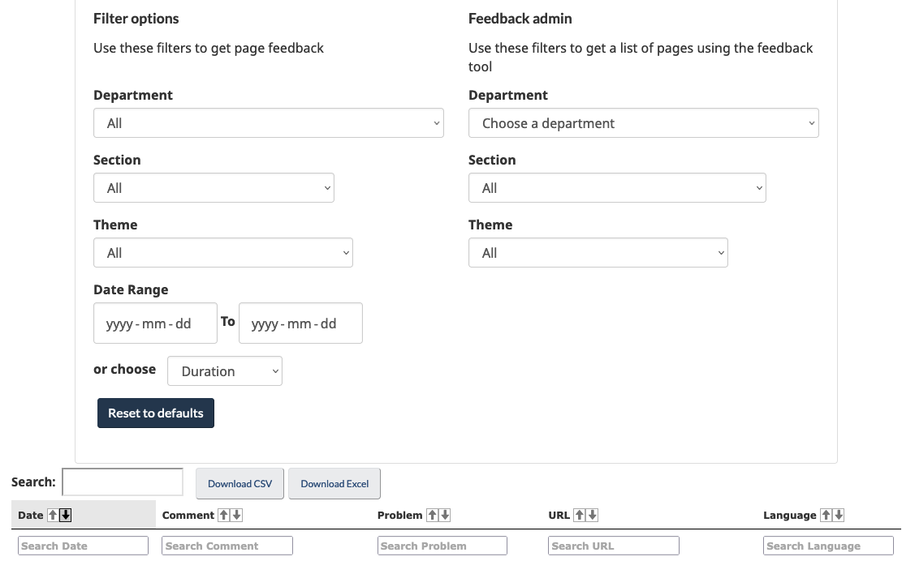

  

    <ul class="toc lst-spcd col-md-12">
      <li class="col-md-4 col-sm-6"><a class="list-group-item active" href="access-feedback.html">Access feedback</a></li>
      <li class="col-md-4 col-sm-6"><a class="list-group-item" href="analyze-feedback.html">Analyzing feedback</a></li>
      <li class="col-md-4 col-sm-6"><a class="list-group-item" href="insights.html">Sharing insights</a></li>
      <li class="col-md-4 col-sm-6"><a class="list-group-item" href="prioritize.html">Deciding what to improve</a></li>
    </ul>
  

## On this page
* [Where feedback is stored](#where-feedback-is-stored)
* [How to access feedback](#how-to-access-feedback)

## Where feedback is stored

When a user submits a comment, it is sent and stored in a database managed by the Digital Transformation Office at TBS.

## How to access feedback

Feedback can be viewed and downloaded as CSV or Excel files at any time using the Feedback Viewer website.

The Feedback Viewer is a password protected environment available to all page feedback participants. Contact the DTO to access to the site.

Email: [{{ site.emails.dto }}](mailto:{{ site.emails.dto }})

### Feedback Viewer filters

The Feedback Viewer includes filters so that you can access and download specific feedback, including:
* Date range
* Institution, Theme, and section of content
* URL
* Language
* Comment field search

  
Image of the Feedback Viewer

  

<nav role="navigation" class="mrgn-bttm-lg">
  <ul class="pager">
    <li class="next"><a href="analyze-feedback.html" rel="next">Next: Methods for analyzing feedback</a></li>
  </ul>
</nav>
