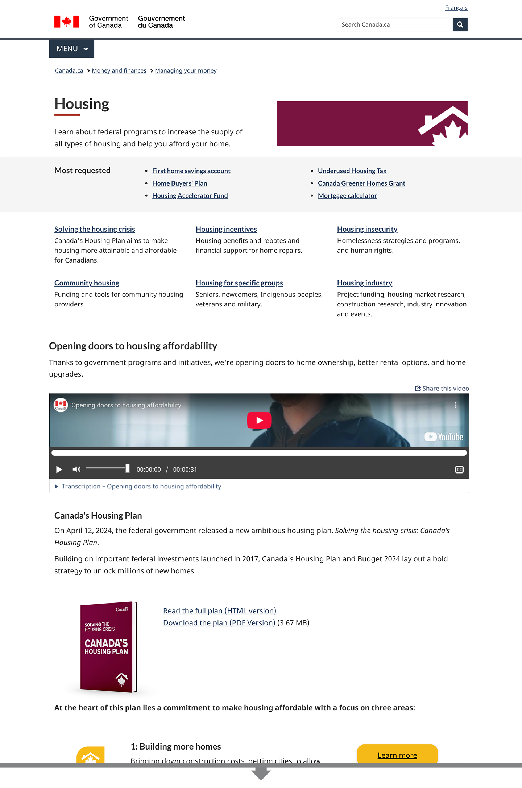
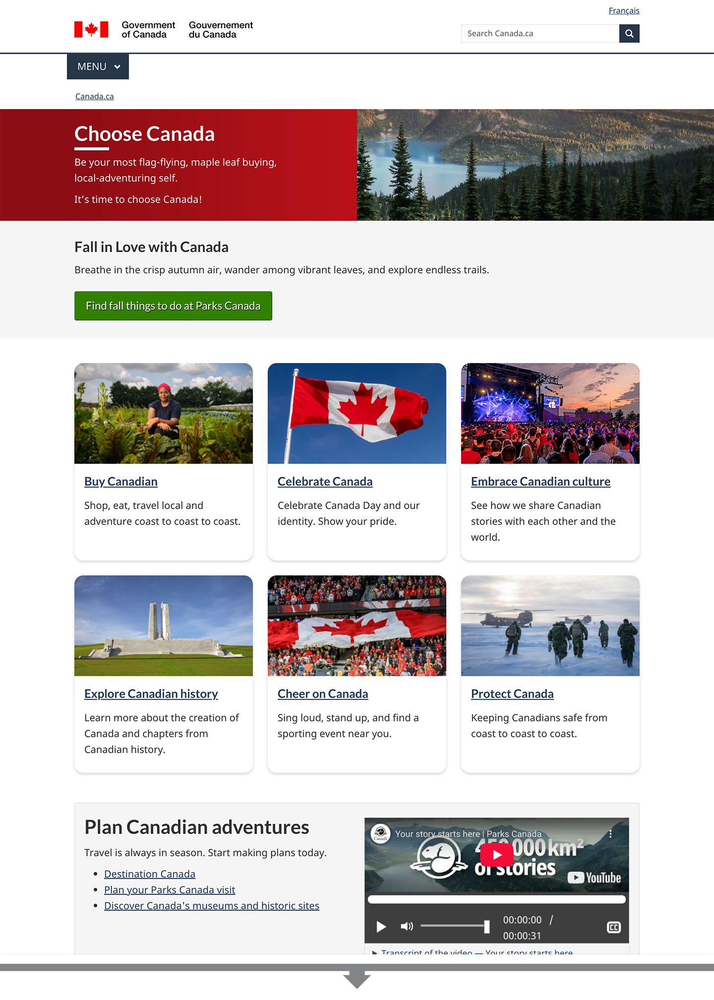

Advertising or marketing campaigns respond to the Government of Canada’s need to communicate, educate, influence, market, raise awareness or call to action. They can be initiated at the institutional level or be centrally requested.

Campaigns should have a communications plan, with clear goals and measurable outcomes to track progress and success. The communication objectives outlined in the plan should support users’ service needs by linking campaign content to relevant program or service information on Canada.ca. This ensures that promotional efforts not only raise awareness but also guide users toward completing their desired tasks.

## On this page

* [When to use](#when-to-use)
* [What to include](#what-to-include)
* [What to avoid](#what-to-avoid)
* [Visual examples](#visual-examples)
* [Latest changes](#latest-changes)

## When to use  {#when-to-use}

Use campaign content to support a planned marketing initiative. Depending on the goals, you can add this content to either an existing core page, such as a topic or program page, or to a dedicated campaign page. Wherever possible, modify existing core content to include campaign information, instead of creating a dedicated campaign page. This helps eliminate duplicate information.

### When to use a core page

* For promoting an update to an existing permanent program, service or initiative
* For regular or cyclical promotion of an existing high-priority program, service or initiative (for example, flu [influenza] vaccines, income tax)

You can strategically add campaign-related visuals and calls to action to core content for the duration of a campaign to tie the content to other campaign-related material.

### When to use a dedicated campaign page

* For events or days/months of observance
* To provide a one-stop shop for content that was created for an advertising campaign, along with links to related program- or service-based content

Dedicated campaign pages can offer greater visual design flexibility, while remaining connected to Canada.ca through navigation elements.

### When to use a combination

* For major changes to existing content, programs, services or initiatives
* For promoting a program, service or initiative that connects content that is in different areas across Canada.ca

Sometimes programs, services or initiatives with existing core content can change significantly enough to warrant a dedicated campaign page (like major eligibility updates). In these situations, you can use both a dedicated campaign page and update core content. The dedicated page should focus on what’s new and how it impacts people, while the core content remains the authoritative source of information.

If you use a combination approach, make sure to:

* update the permanent Canada.ca core content with all the details
* create a dedicated campaign page to highlight key messages
* after the campaign is over, consider moving successful engagement pieces (such as a video, quiz or printable materials) into the core content, if they align and help with understanding the core content

## What to include {#what-to-include}

When creating a dedicated campaign page, first map out what already exists on Canada.ca. Most relevant information in a campaign should already be built into core content. This ensures that content isn’t duplicated on a dedicated page. It also allows the content to be used after the campaign has ended and the dedicated page is removed. By directing users to core content, you provide them with comprehensive and up-to-date information.

In certain circumstances, you can also create a vanity URL, which redirects to the dedicated page or related core content page.

* [See the guidance on vanity URLs for more information](https://design.canada.ca/specifications/mandatory-elements/domains-urls.html#du3b)

### Content specifications for a core page

You can optimize your content on core Canada.ca pages by using design patterns or components. This will help visually link the content to the campaign throughout its duration. For example, you could include:

* an image
* a graph or other informative visual
* a video, podcast or other visual/audio media

Ensure that the campaign-related visuals do not interfere with task success. While the goal of a campaign is usually to raise awareness of a program or initiative, people come to Canada.ca to complete tasks. The campaign content should help people do this without interfering or causing delays in completing their tasks. For example, you can add a campaign-related visual to the image portion of the introduction block, but don’t place other campaign content above the most requested band.

Set a clear end or review date where campaign content is either updated or removed from the core page.

Find design patterns and components:

* [Canada.ca design patterns](https://design.canada.ca/pattern-library.html)
* [GC Design System components](https://design-system.alpha.canada.ca/en/components/)

### Content specifications for a dedicated campaign page

Dedicated pages should:

* focus on key messages
* have a clear end or review date when content is updated or removed or, if used seasonally or annually, updated to reflect the current status of the campaign
* be housed in a campaign node and not in the permanent Canada.ca core information architecture

The following are examples of content you can include on a dedicated page.

Primary content:

* Temporary messaging about the subject matter, such as the launch date, time-limited information, upcoming events or the reason it is being implemented or changed
* Links to permanent core content, to avoid duplication

Optional supporting content:

* Videos that help users with the call to action for the campaign (such as how to apply or explaining criteria)
  * Do not include promotional videos that are simply meant to drive users to the site
* A subscribe function for receiving campaign updates
* Tools for stakeholders, such as posters, digital banners and social media templates
* Links to news releases announcing the new or changed program, service or initiative

Note: If you have multiple dedicated campaign pages, create a central landing page that links to all of them.

#### Design components on a dedicated campaign page

Though design flexibility is encouraged in the content area, use existing Web Experience Toolkit (WET) or GC Design System components to ensure accessibility.

* [GCWeb](https://wet-boew.github.io/GCWeb/index-en.html)
* [GC Design System](https://design-system.alpha.canada.ca)

Make sure the dedicated page follows the mandatory elements of the Canada.ca design:

* [Mandatory elements of the Canada.ca design](https://design.canada.ca/specifications/mandatory-elements.html)

## What to avoid   {#what-to-avoid}

Dedicated campaign pages should not replace or duplicate existing content on Canada.ca. You should only use them to add a promotional layer for highlighting certain aspects of a program, service or initiative.

Don’t use dedicated pages as a replacement for other page types such as:

* institutional, organizational or partnering and collaborative arrangement profiles
* service description or initiation pages
* program description pages
* reports
* theme or topic pages
* any other content that is not time-limited

## Visual examples

### A campaign incorporated in core content

  <figure class="mrgn-tp-md mrgn-bttm-lg">
    <figcaption><b>Here is an example where campaign content has been incorporated in a core page.</b></figcaption>
    
    

      
Image description: Campaign content added on a core page

      
An image with the campaign branding was added to the image space in the introduction block in this mock-up of the Housing topic page. Campaign content was also added to the flexible space, which is the bottom portion of the page above the footer. The campaign content includes a video about affordable housing, as well as a description and image of Canada’s Housing Plan, with a link to download the plan.

    

  </figure>

### Dedicated campaign page linking to core content

  <figure class="mrgn-tp-md mrgn-bttm-lg">
    <figcaption><b>Here is an example of where a dedicated campaign page was created that links to existing content.</b></figcaption>
    
    

      
Image description: Dedicated campaign page linking to core content

      
Choose Canada is an example of a dedicated campaign page that links to six existing pages, which are a combination of core content and other campaigns. The content for each is highlighted in cards with images. It also includes a feature for Parks Canada, with a promotional video.

    

  </figure>

## Latest changes

<dl class="dl-horizontal">
  <dt><time>2025-09-08</time></dt>
  <dd>We have replaced our previous campaign guidance to specify that in some cases core content can be modified to incorporate campaign visuals instead of creating a dedicated campaign page.</dd>
</dl>
