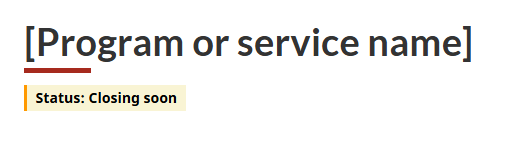
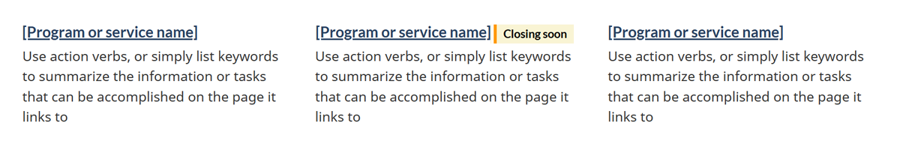
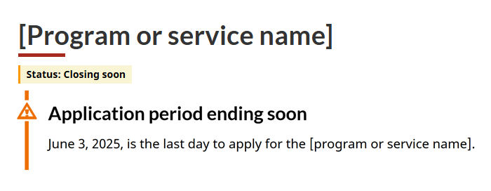
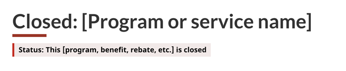
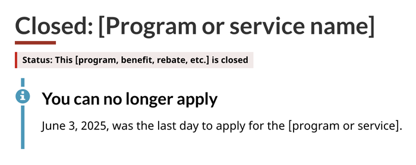
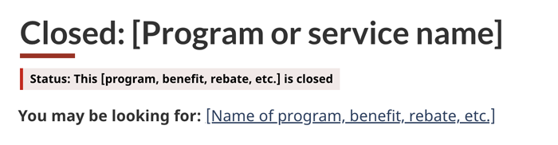
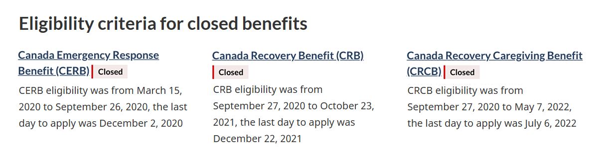

<span class="wb-prettify all-pre"></span>
Follow this guidance to update content when a Government of Canada program or service closes.

## On this page

* [Provide advance warning](#provide-advance-warning)
* [Mark a program or service as closed](#mark-a-program-or-service-as-closed)
* [When to remove the page](#when-to-remove-the-page)
* [Patterns used in this guidance](#patterns-used-in-this-guidance)

## Provide advance warning {#provide-advance-warning}

In most cases, add a warning to your web content at least one month in advance to let people know when your program or service is ending.

If the program or service has a very short duration, adjust the timing of the advanced warning appropriately. For example, if the program is two months long, provide the warning two to three weeks in advance.

Follow the steps below to include a warning in your content.

### Add a warning label under the page title

On the program or service page, add a warning label component that says “Status: Closing soon” directly below the visible page title (or H1).

<div class="pattern-demo mrgn-tp-md mrgn-bttm-md">
  <figure class="mrgn-tp-md mrgn-bttm-lg">
    <figcaption><b>Warning label under a page title</b></figcaption>
    
    <details>
      <summary class="wb-toggle" data-toggle="{ &quot;print&quot;: &quot;on&quot; }">Image description: warning label under a page title</summary>
      <p>This warning label was added directly below the title of a program page. The label reads:</p>
      <p>Status: Closing soon</p>
    </details>
  </figure>
</div>

### Add a warning label beside other titles

Add a warning label component with the text “Closing soon” beside or under the title of the program or service in the following locations:

* Most requested
* Doormats on any pages using the services and information pattern

<div class="pattern-demo mrgn-tp-md mrgn-bttm-md">
  <figure class="mrgn-tp-md mrgn-bttm-lg">
    <figcaption><b>Warning label in a doormat</b></figcaption>
    
    <details>
      <summary class="wb-toggle" data-toggle="{&quot;print&quot;:&quot;on&quot;}">Image description: warning label in a doormat</summary>
      <p>Three doormats are displayed across three columns in the services and information section of a page. A warning label that says “Closing soon” appears beside the heading of one of the benefit doormats.</p>
    </details>
  </figure>
</div>

### Add a warning alert for application deadlines

Consider adding an advance warning alert at the top of the program or service page to signal the last day to apply. This should appear below the label component. Add the alert only when there is less than a month left in the application period.

<div class="pattern-demo mrgn-tp-md mrgn-bttm-md">
  <figure class="mrgn-tp-md mrgn-bttm-lg">
    <figcaption><b>Warning alert at the top of page</b></figcaption>
    
    <details>
      <summary class="wb-toggle" data-toggle="{&quot;print&quot;:&quot;on&quot;}">Image description: warning alert at the top of page</summary>
      <p>This warning alert was placed at the top of the page, below the H1 and warning label, with a clear deadline for submitting applications. It reads:</p>
      <p><b>Application period ending soon</b></p>
      <p>June 3, 2025, is the last day to apply for the [program or service name].</p>
    </details>
  </figure>
</div>

## Mark a program or service as closed {#mark-a-program-or-service-as-closed}

Once the program or service is no longer available, make it clear right away. Update all related web pages as soon as it closes by following these steps.

### Update the page title and metadata

* **Add "Closed:"** to the beginning of the visible page title (H1) and the metadata `<title>` tag
  * **Placing the text at the front** ensures it appears in search results and isn't cut off in longer titles
* **Update the metadata description** to clearly state that the program or service is now closed

Here are examples:

#### Metadata title

```html
<title>Closed: [Program or service name] - Canada.ca</title>
```

#### Metadata description

```html
<meta name="description" content="This program is now closed. It stopped accepting applications on June 3, 2025." />
```

For more information, refer to the guidance for:

* [writing effective content for <code>&lt;title&gt;</code> and <code>&lt;h1&gt;</code> elements](https://design.canada.ca/specifications/information-findability/metadata.html#m2)
* [writing effective metadata descriptions](https://design.canada.ca/specifications/information-findability/metadata.html#m3)

### Update the status label

Update the label component you added directly below the page title to say the program or service is closed. Change it to a danger label. This provides a quick visual indicator to users who may be scanning the page as opposed to reading each word.

<div class="pattern-demo mrgn-tp-md mrgn-bttm-md">
  <figure class="mrgn-tp-md mrgn-bttm-lg">
    <figcaption><b>Danger label under a page title</b></figcaption>
    
    <details>
      <summary class="wb-toggle" data-toggle="{&quot;print&quot;:&quot;on&quot;}">Image description: danger label under a page title</summary>
      <p>To mark a program as closed, this danger label was added directly below the H1. It reads:</p>
      <p>Status: This [program, benefit, rebate, etc.] is closed</p>
    </details>
  </figure>
</div>

### Update the alert for closed applications

If your program or service has an application process, add an info alert below the label component explaining that it is no longer possible to apply.

* Include the application deadline
* In most cases, remove the alert no later than a month after it was added
* Consider keeping the alert for longer if the page continues to receive a lot of traffic, as users may still benefit from having this information

<div class="pattern-demo mrgn-tp-md mrgn-bttm-md">
  <figure class="mrgn-tp-md mrgn-bttm-lg">
    <figcaption><b>Info alert at the top of a page</b></figcaption>
    
    <details>
      <summary class="wb-toggle" data-toggle="{&quot;print&quot;:&quot;on&quot;}">Image description: info alert at the top of a page</summary>
      <p>This info alert was placed at the top of the page, after the H1 and a danger label, with a clear closing date for the program. It reads:</p>
      <p><b>You can no longer apply</b></p>
      <p>June 3, 2025, was the last day to apply for the [program or service].</p>
    </details>
  </figure>
</div>

### Restructure or update content

Depending on the nature of your program or service, you will need to make different updates to your content. This can include any or all of the following.

#### Add content for next steps

If there are follow-up steps after the program or service ends, such as appealing a decision or returning a payment, add new sections for this information. Place any new section before the rest of the content so that it is not buried under outdated information.

#### Change to past tense

Review your content and determine where it makes sense to change the wording to past tense, such as where an action can no longer be taken. This is especially important for any language that explains eligibility or how to apply. This way if people are still scanning the content, they will see things are no longer active. This also helps AI applications understand that the program is closed. If applicable, add the start and end date for when something took place, like a review process or an application period.

If your program or service content spans multiple pages, make sure the tense is updated on all applicable pages and not just the first one.

Here are some examples of updated text:

The Canada Emergency Response Benefit (CERB) **provided** financial support to employed and self-employed Canadians **who were** directly **affected** by COVID-19.

The one-time top-up to the Canada Housing Benefit **helped** low-income renters with the cost of renting. The Canada Revenue Agency (CRA) **administered** this one-time payment. Applications **were open** from **December 12, 2022,** to **March 31, 2023**.

#### Remove outdated content

Take out content that is no longer useful or could cause confusion, such as links to an application form.

### Redirect to current information

If there is something new that has replaced the closed program or service, add content to direct people there. You can do this by adding a link at the top of your page. Use the text “You may be looking for:” followed by the title and link to that new page. Place this below the label component.

<div class="pattern-demo mrgn-tp-md mrgn-bttm-md">
  <figure class="mrgn-tp-md mrgn-bttm-lg">
    <figcaption><b>Link to current information</b></figcaption>
    
    <details>
      <summary class="wb-toggle" data-toggle="{&quot;print&quot;:&quot;on&quot;}">Image description: link to current information</summary>
      <p>At the top of the page, below the H1 and a danger label, is this text with a link:</p>
      <p><b>You may be looking for:</b> [Name of program, benefit, rebate, etc.]</p>
    </details>
  </figure>
</div>

### Place labels in context

On a page that lists multiple items, add warning label components with the text “Closed” beside each of the doormat headings. For example, if there are different benefits listed on the page that Canadians can apply for under one program. This maximizes the impact of the labels, especially if a reader scrolls quickly and misses the one at the top of the page.

<div class="pattern-demo mrgn-tp-md mrgn-bttm-md">
  <figure class="mrgn-tp-md mrgn-bttm-lg">
    <figcaption><b>Warning labels added to doormats</b></figcaption>
    
    <details>
      <summary class="wb-toggle" data-toggle="{&quot;print&quot;:&quot;on&quot;}">Image description: warning labels added to doormats</summary>
      <p>Three doormats are displayed across three columns in the services and information section of a page. Warning labels that say “Closed” were added beside the heading of each one.</p>
    </details>
  </figure>
</div>

## When to remove the page {#when-to-remove-the-page}

Be sure to follow your department’s content lifecycle plan for when to move the program or service page to a digital repository and remove it from your website. If you don’t have a specific plan, the recommended timeframe is to take down content two years after the program or service has ended.

## Patterns used in this guidance {#patterns-used-in-this-guidance}

### When adding labels

Follow the implementation guidance for the label component. Use the warning label for when you are providing advance warning and use the danger label once the program or service is closed.

* [Label component - How to implement](https://design.canada.ca/common-design-patterns/labels.html#how)

### When adding alerts

Follow the implementation guidance for contextual alerts. Use the warning alert for when you are providing advance warning and use the info alert once the program or service is closed.

* [Contextual alert pattern - How to implement](https://design.canada.ca/common-design-patterns/contextual-alerts.html#how)
