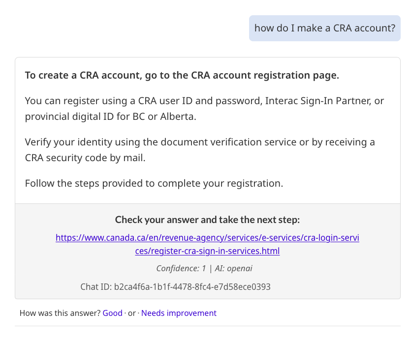

Follow this content guidance to create a consistent experience for Canada.ca visitors. 

### On this page

* [Topic-specific AI applications](#topic-specific-ai-applications)  
* [Disclaimers, transparency and accountability](#disclaimers-transparency-and-accountability)  
* [Accessibility](#accessibility)  
* [Accuracy](#accuracy)  
* [Language](#languages)  
* [Handling online wizards](#handling-online-wizards)  
* [Citations](#citations)  
* [Answer length](#restricting-answer-length)  
* [Chat IDs for reference](#chat-ids-for-reference)  
* [Things to avoid](#things-to-avoid)

### Topic-specific AI applications {#topic-specific-ai-applications}

While you can limit a chat application to a certain topic, keep the Canada.ca vision in mind as you experiment and design. The Canada.ca vision is one where users don't need to know which department handles a specific task. Instead, they should be able to find the information they need seamlessly, regardless of departmental boundaries. 

People expect Canada.ca to function as a unified site. If an AI application is limited to a specific topic, its invitation button or link should clearly indicate that topic. This ensures users understand they will only find information related to that specific topic.

### Disclaimers, transparency and accountability {#disclaimers-transparency-and-accountability}

Generative AI chat solutions must be clearly labelled as AI. Disclaimers should address privacy, potential mistakes and similar issues without blocking access to the chat service.

To ensure transparency and accountability, make information about data usage accessible to users. Add a link or [details-summary](https://design-system.alpha.canada.ca/en/components/details/design/) directly to the chat solution, similar to the evidence-based approach for privacy statements on Canada.ca. 

* [Privacy disclaimer pattern](https://design.canada.ca/common-design-patterns/privacy-disclaimer.html)

Prompt-engineer for accuracy as much as possible, and always provide citation links for answers, rather than relying solely on disclaimers. 

### Accessibility {#accessibility}

Ensure that your AI chat application is accessible to all users by:

* using accessible labels for form fields and buttons   
* providing status updates to inform users when the AI is generating a response and when it has stopped  
* allowing full navigation with a keyboard  
* offering both text-to-speech and speech-to-text functionalities  
* making sure it is compatible with screen readers

### Accuracy {#accuracy}

Use a combination of techniques to ensure accuracy. Here are some ways you can prompt-engineer for accuracy:

* Use a comprehensive system prompt, covering all aspects of providing accurate answers while preventing the AI from addressing questions outside its scope  
* Provide a predefined response for out-of-scope questions to avoid creating polite responses that could invite abuse  
* Keep overlapping federal, provincial and municipal jurisdictions in mind and address them in your system prompt

### Languages {#languages}

To ensure effective communication in multiple languages, follow this guidance:

* Per Official Language requirements, users invoking AI on a French page should see the French version of the application, and the English version from an English page  
* On the English AI application page, citations should be to official English URLs, and on the French version, citations should be to official French URLs   
* While it’s possible a user could ask a question in English on the French page, the citation should still be to a French URL, just as if a user asked a question in Spanish on the French AI version, a French citation would be provided. In the system prompt, instruct the AI that French answers must use official Canadian French terminology and style similar to Canada.ca.  
* Visitors to Canada.ca often use their browser to translate the page into their language. LLMs are trained to answer in the language of the question. Your team will  need to decide whether to support questions and  answers in languages other than English and French, and the quality controls required to support that decision (for example, logging translations of the questions and answers into official languages for evaluation and monitoring purposes).

### Citations {#citations}

All in-scope answers must include an authoritative citation link. Citations help users verify the answer and provide a link for the next step. Citations must point to a Government of Canada web page so that people can review the information source for themselves. 

#### Ensure the AI is citing the correct page

To illustrate how citation links should be used, consider the following scenarios:

For the question "Where to find passport offices", the citation link provided should be a URL to the page “Find a passport service location in Canada”.

For the question "I need the passport form", the AI should not provide a direct link to a passport form because there are several forms. It isn’t clear which form is needed. Instead, it should ask a clarifying question to understand the situation better. For example, it could ask, “Is this an adult passport?” or “Is this a first-time application?” 

Once the situation is clarified, the AI can provide the appropriate link. For instance, it could direct the user to answer the questions on the “Who can renew a passport” page to be led to the correct form for their situation. 

#### Designing the system prompt

When creating the system prompt, it's important to ensure that it produces citation links effectively and accurately. Consider the following guidelines:

* Require that answers are sourced from gc.ca and canada.ca URLs and that they include a citation link to a single Government of Canada page  
* Tag the URL so it can be formatted correctly in the output as a clickable link   
* Display the link url in the output  
* Restrict the AI from providing a citation URL for answers out of scope   
  * For example, if the question is about a provincial or territorial issue, direct users to visit their provincial or territorial website without providing a link, as accuracy cannot be guaranteed

#### Make citations highly visible        

To ensure citations are highly visible, consider the following guidelines:

* Visually set citations apart from the answer so users can easily find them by centring the text and adding a grey well  
* Place instructional text before citations that asks users to check their answer and take the next step  
* Ensure citations are close enough to the answer to make it clear it is related to the answer

Here is an example of providing a citation that is formatted to be highly visible:

### Handling online wizards {#handling-online-wizards}

An online wizard is a step-by-step guide that helps users complete a task by breaking it into smaller, manageable steps. There are many heavily used Canada.ca wizards like “Find out if you need a visa”. These wizards can be many layers deep with extensive logic and are always kept up to date. 

Your system prompt should direct the AI service to send users to any existing wizard pages rather than the AI trying to ask all the relevant questions. Since current AI models are reinforced to answer questions, rather than to ask questions, providing these answers should be left to the wizard.     

Eventually it may be possible to feed the wizard logic to the AI service so that it can handle the questions and answers. 

### Restricting answer length {#restricting-answer-length}

Keep answers concise and to the point. Our usability tests show that a successful and accessible approach is to limit the answers to a maximum of 4 sentences of 18 words or less. This approach is designed to ensure an easily-understood answer that also reinforces the need to use the citation link to take the next steps.   

In the system prompt, encourage the AI to not include more information than is needed. Shorter answers also contribute to preventing hallucination. 

### Chat IDs for reference {#chat-ids-for-reference}

All conversations should have a visible identifier that is documented in the system. This allows for easy reference if necessary.

### Things to avoid {#things-to-avoid}

When designing your AI chat application, avoid language related to live chat, including:

* **Using the word "Chat";** Research suggests that "chat" is associated with human agents  
* **Using the word "Now",** as it implies that a live agent is standing by
