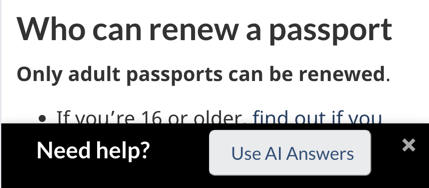
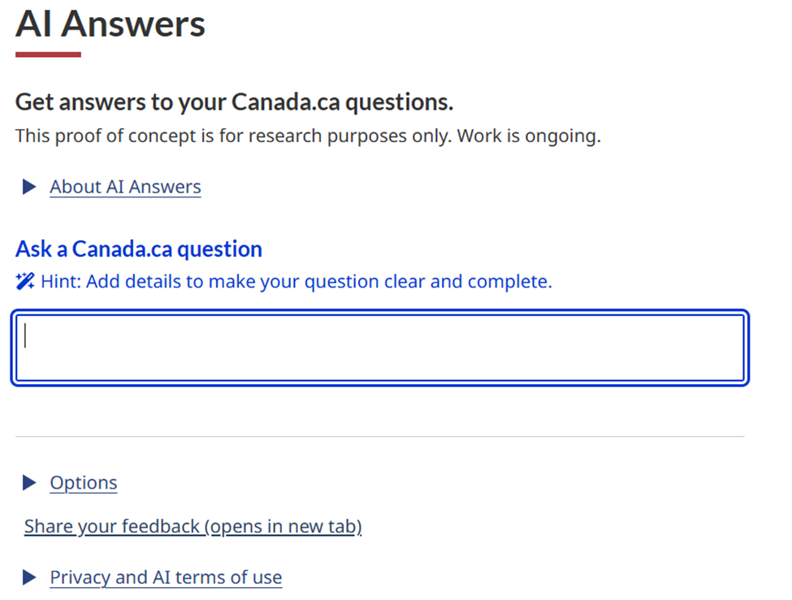

AI applications must meet the [Canada.ca design requirements](https://design.canada.ca/specifications.html). Use this guidance to provide a consistent experience with AI chat applications across Canada.ca. 

### On this page

* [Naming your AI application](#naming-your-ai-application)  
* [Use icons for navigation](#use-icons-for-navigation) <mark>There appears to be no related heading on this page</mark>
* [Open a new browser window](#open-a-new-browser-window-not-a-chat-panel)  
* [Initiate chat with links or overlay bars](#initiate-chat-with-links-or-overlay-bars)  
* [Design of AI Answers](#design-of-ai-answers)

### Naming your AI application {#naming-your-ai-application}

Do not use a human name. Use “AI Answers” as the name, followed by a colon and then your topic (For example, AI Answers: Taxes). Our testing shows that when you use this naming convention, users clearly understand that there is no human hand-off within the application. In our testing our usability participants all clearly understood this name and that no human would be responding to their questions. 

### Open a new browser window, not a chat panel {#open-a-new-browser-window-not-a-chat-panel}

Use a full-page URL for your AI application to open in a new window, rather than a narrow panel on an existing page. This approach allows for faster iteration, deployment, and management. It also differentiates your application from non-AI chats.

### Initiate chat with links or overlay bars {#initiate-chat-with-links-or-overlay-bars}

Use a link or mobile-first bottom-overlay instead of a floating-at-bottom-right chat button. People often ignore or miss floating chat buttons. They are also a significant barrier to mobile users.

**Example of a bottom-overlay**

*Long description: Web content on a page is followed by black bar at the bottom of the page. On the black bar there is white text that reads “Need help?”. This is followed by a grey button that reads “Use AI Answers”. There is an “x” in the far right corner that allows the user to dismiss the overlay.* 

### Design of AI Answers {#design-of-ai-answers}

The Digital Transformation Office, in collaboration with several departments, is piloting AI Answers, a generative AI chat application. This application is being piloted for all of Canada.ca and is currently in alpha mode. As we work with departments to test and iterate on this pilot, we will continue to update our guidance on AI chat applications to reflect any new findings. 

This screenshot demonstrates the current design of the application.

### Design of AI Answers: alpha

<mark>Add a long description once sure of the final screenshot.</mark>
