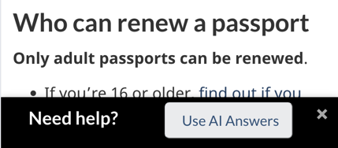

People expect and trust consistency and transparency on Canada.ca, including in AI interactions. This guidance aims to provide a unified voice for Government of Canada AI chat applications, assisting government teams in delivering trustworthy and effective generative AI solutions.

Use this guidance when building a public-facing AI chat application. The guidance will continue to evolve over time as we build and test applications with departments.

<table>
<tr style="vertical-align: top;">
<td>
  
<strong><a href="#central-guidance-and-ai-research">Central global guidance and AI research</a></strong>

  
Vision of AI chat applications, Guide on the use of generative AI, key contacts

  <strong><a href="#privacy-and-security">Privacy and security</a></strong>
  
Redaction techniques, threats, jailbreaking, red teaming

</td>
<td>
  
<strong><a href="#design-guidance">Design guidance</a></strong>

  
Design specifications, standard icons

  
<strong><a href="#iterative-design">Iterative design</a></strong>

    
Design phase, user testing, launch phases, feedback loop, feedback mechanisms

</td>
<td>
  
<strong><a href="#content-guidance">Content guidance</a></strong>

  
Disclaimers, transparency and accountability, accuracy, citation links, accessibility, language, citation links, answer length

</td>
</tr>
</table>

## Central guidance and AI research {#central-guidance-and-ai-research}

Every day, thousands of visitors come to Canada.ca seeking information. However, based on the daily feedback we receive from GC Feedback, we know that not everyone finds what they need. Many of their responses are questions about how to interpret the page for their specific situation, how to find a particular answer and how to get a telephone number.

The goal of AI chat applications on Canada.ca is to provide quick, accurate and tailored answers to users' questions about GC services.

### Follow the central guidance

You should follow the Treasury Board of Canada Secretariat’s [Guide on the use of generative AI](https://www.canada.ca/en/government/system/digital-government/digital-government-innovations/responsible-use-ai/guide-use-generative-ai.html). This guide cites public AI chat applications and chatbots as a higher risk use case. The guidance is intended to support teams in maintaining the public trust in Canada.ca while meeting the “FASTER” principles (fair, accountable, secure, transparent, educated and relevant) that are outlined in the guide.

* For information and guidance on specific uses of generative AI, contact the Responsible Data and AI team: [ai-ia@tbs-sct.gc.ca](mailto:ai-ia@tbs-sct.gc.ca)   
* For AI security questions and advice, contact: [zztbscybers@tbs-sct.gc.ca](mailto:zztbscybers@tbs-sct.gc.ca) 

### Other guidance and research 

We have based our AI guidance on our own research as well as best practices from other governments and organizations. This includes the following sources: 

#### Government of Canada

<ul>
  <li><a href="https://www.canada.ca/en/government/system/digital-government/digital-government-innovations/responsible-use-ai/guide-use-generative-ai.html">Guide on the use of generative artificial intelligence - Canada.ca</a></li>
  <li><a href="https://blog.canada.ca/2021/04/08/using-interactive-questions.html">The magic of using interactive questions | Canada.ca blog</a></li>
  <li><a href="https://blog.canada.ca/2022/02/07/chatbots.html">Thinking of adding a chat application? | Canada.ca blog</a></li>
  <li><a href="https://blog.canada.ca/2020/01/28/voice-search-optimization.html">Optimize your content for voice search | Canada.ca blog</a></li>
</ul>

#### Government of the United Kingdom 

<ul>
  <li><a href="https://insidegovuk.blog.gov.uk/2024/11/05/were-running-a-private-beta-of-gov-uk-chat/">We’re running a private beta of GOV.UK Chat – Inside GOV.UK</a></li>
  <li><a href="https://insidegovuk.blog.gov.uk/2024/01/18/experimenting-with-how-generative-ai-could-help-gov-uk-users/">Experimenting with how generative AI could help GOV.UK users – Inside GOV.</a></li>
  <li><a href="https://insidegovuk.blog.gov.uk/2024/01/18/the-findings-of-our-first-generative-ai-experiment-gov-uk-chat/">The findings of our first generative AI experiment: GOV.UK Chat – Inside GOV.UK</a></li>
</ul>

#### Other organizations

<ul>
  <li><a href="https://www.bi.team/blogs/chatgov-will-people-trust-ai-tools-to-help-them-use-public-services/">ChatGOV: Will people trust AI tools to help them use public services? | The Behavioural Insights Team</a></li>
  <li><a href="https://www.nngroup.com/articles/chat-ux/">The User Experience of Customer-Service Chat: 20 Guidelines</a></li>
  <li><a href="https://www.shapeof.ai/#:~:text=The%20Shape%20of%20AI&text=How%20will%20patterns%20and%20experiences,is%20more%20important%20than%20ever">The Shape of AI | UX Patterns for Artificial Intelligence Design</a></li>
  <li><a href="https://microsoft.github.io/generative-ai-for-beginners/#/07-building-chat-applications/README?wt.mc_id=academic-105485-koreyst&id=user-experience-ux">Generative AI for beginners: User Experience (UX)</a></li>
</ul>

## Design guidance {#design-guidance}

AI applications must meet the [Canada.ca design requirements](https://design.canada.ca/specifications.html). Use this guidance to provide a consistent experience with AI chat applications across Canada.ca. 

### On this page

* [Naming your AI application](#naming-your-ai-application)  
* [Use icons for navigation](#heading=h.oawgrncqqilr)  
* [Open a new browser window](#open-a-new-browser-window-not-a-chat-panel)  
* [Initiate chat with links or overlay bars](#initiate-chat-with-links-or-overlay-bars)  
* [Design of AI Answers](#heading=h.h9nob8oiyhl)

### Naming your AI application {#naming-your-ai-application}

Do not use a human name. Use “AI Answers” as the name, followed by a colon and then your topic (For example, AI Answers: Taxes). Our testing shows that when you use this naming convention, users clearly understand that there is no human hand-off within the application. In our testing our usability participants all clearly understood this name and that no human would be responding to their questions. 

### Open a new browser window, not a chat panel {#open-a-new-browser-window-not-a-chat-panel}

Use a full-page URL for your AI application to open in a new window, rather than a narrow panel on an existing page. This approach allows for faster iteration, deployment, and management. It also differentiates your application from non-AI chats.

### Initiate chat with links or overlay bars {#initiate-chat-with-links-or-overlay-bars}

Use a link or mobile-first bottom-overlay instead of a floating-at-bottom-right chat button. People often ignore or miss floating chat buttons. They are also a significant barrier to mobile users.

**Example of a bottom-overlay**

*Long description: Web content on a page is followed by black bar at the bottom of the page. On the black bar there is white text that reads “Need help?”. This is followed by a grey button that reads “Use AI Answers”. There is an “x” in the far right corner that allows the user to dismiss the overlay.* 

### Design of AI Answers

The Digital Transformation Office, in collaboration with several departments, is piloting AI Answers, a generative AI chat application. This application is being piloted for all of Canada.ca and is currently in alpha mode. As we work with departments to test and iterate on this pilot, we will continue to update our guidance on AI chat applications to reflect any new findings. 

This screenshot demonstrates the current design of the application.

### Design of AI Answers: alpha

<mark>Add a long description once sure of the final screenshot.</mark>

## Content guidance {#content-guidance}

### Follow this content guidance to create a consistent experience for Canada.ca visitors. 

### On this page

* [Topic-specific AI applications](#topic-specific-ai-applications)  
* [Disclaimers, transparency and accountability](#disclaimers-transparency-and-accountability)  
* [Accessibility](#accessibility)  
* [Accuracy](#accuracy)  
* [Language](#languages)  
* [Handling online wizards](#handling-online-wizards)  
* [Citations](#citations)  
* [Answer length](#restricting-answer-length)  
* [Chat IDs for reference](#chat-ids-for-reference)  
* [Things to avoid](#things-to-avoid)

### Topic-specific AI applications {#topic-specific-ai-applications}

While you can limit a chat application to a certain topic, keep the Canada.ca vision in mind as you experiment and design. The Canada.ca vision is one where users don't need to know which department handles a specific task. Instead, they should be able to find the information they need seamlessly, regardless of departmental boundaries. 

People expect Canada.ca to function as a unified site. If an AI application is limited to a specific topic, its invitation button or link should clearly indicate that topic. This ensures users understand they will only find information related to that specific topic.

### Disclaimers, transparency and accountability {#disclaimers-transparency-and-accountability}

Generative AI chat solutions must be clearly labelled as AI. Disclaimers should address privacy, potential mistakes and similar issues without blocking access to the chat service.

To ensure transparency and accountability, make information about data usage accessible to users. Add a link or [details-summary](https://design-system.alpha.canada.ca/en/components/details/design/) directly to the chat solution, similar to the evidence-based approach for privacy statements on Canada.ca. 

* [Privacy disclaimer pattern](https://design.canada.ca/common-design-patterns/privacy-disclaimer.html)

Prompt-engineer for accuracy as much as possible, and always provide citation links for answers, rather than relying solely on disclaimers. 

### Accessibility {#accessibility}

Ensure that your AI chat application is accessible to all users by:

* using accessible labels for form fields and buttons   
* providing status updates to inform users when the AI is generating a response and when it has stopped  
* allowing full navigation with a keyboard  
* offering both text-to-speech and speech-to-text functionalities  
* making sure it is compatible with screen readers

### Accuracy {#accuracy}

Use a combination of techniques to ensure accuracy. Here are some ways you can prompt-engineer for accuracy:

* Use a comprehensive system prompt, covering all aspects of providing accurate answers while preventing the AI from addressing questions outside its scope  
* Provide a predefined response for out-of-scope questions to avoid creating polite responses that could invite abuse  
* Keep overlapping federal, provincial and municipal jurisdictions in mind and address them in your system prompt

### Languages {#languages}

To ensure effective communication in multiple languages, follow this guidance:

* Per Official Language requirements, users invoking AI on a French page should see the French version of the application, and the English version from an English page  
* On the English AI application page, citations should be to official English URLs, and on the French version, citations should be to official French URLs   
* While it’s possible a user could ask a question in English on the French page, the citation should still be to a French URL, just as if a user asked a question in Spanish on the French AI version, a French citation would be provided. In the system prompt, instruct the AI that French answers must use official Canadian French terminology and style similar to Canada.ca.  
* Visitors to Canada.ca often use their browser to translate the page into their language. LLMs are trained to answer in the language of the question. Your team will  need to decide whether to support questions and  answers in languages other than English and French, and the quality controls required to support that decision (for example, logging translations of the questions and answers into official languages for evaluation and monitoring purposes).

### Citations {#citations}

All in-scope answers must include an authoritative citation link. Citations help users verify the answer and provide a link for the next step. Citations must point to a Government of Canada web page so that people can review the information source for themselves.. 

#### Ensure the AI is citing the correct page

To illustrate how citation links should be used, consider the following scenarios:

For the question "Where to find passport offices," the citation link provided should be a URL to the page “Find a passport service location in Canada.”

For the question "I need the passport form," the AI should not provide a direct link to a passport form because there are several forms. It isn’t clear which form is needed. Instead, it should ask a clarifying question to understand the situation better. For example, it could ask, “Is this an adult passport?” or “Is this a first-time application?” 

Once the situation is clarified, the AI can provide the appropriate link. For instance, it could direct the user to answer the questions on the “Who can renew a passport” page to be led to the correct form for their situation. 

#### Designing the system prompt

When creating the system prompt, it's important to ensure that it produces citation links effectively and accurately. Consider the following guidelines:

* Require that answers are sourced from gc.ca and canada.ca URLs and that they include a citation link to a single Government of Canada page  
* Tag the URL so it can be formatted correctly in the output as a clickable link   
* Display the link url in the output  
* Restrict the AI from providing a citation URL for answers out of scope   
  * For example, if the question is about a provincial or territorial issue, direct users to visit their provincial or territorial website without providing a link, as accuracy cannot be guaranteed

#### Make citations highly visible        

To ensure citations are highly visible, consider the following guidelines:

* Visually set citations apart from the answer so users can easily find them by centring the text and adding a grey well  
* Place instructional text before citations that asks users to check their answer and take the next step  
* Ensure citations are close enough to the answer to make it clear it is related to the answer

Here is an example of providing a citation that is formatted to be highly visible:

 

### Handling online wizards  {#handling-online-wizards}

An online wizard is a step-by-step guide that helps users complete a task by breaking it into smaller, manageable steps. There are many heavily used Canada.ca wizards like “Find out if you need a visa.” These wizards can be many layers deep with extensive logic and are always kept up to date. 

Your system prompt should direct the AI service to send users to any existing wizard pages rather than the AI trying to ask all the relevant questions. Since current AI models are reinforced to answer questions, rather than to ask questions, providing these answers should be left to the wizard.     

Eventually it may be possible to feed the wizard logic to the AI service so that it can handle the questions and answers. 

### Restricting answer length {#restricting-answer-length}

Keep answers concise and to the point. Our usability tests show that a successful and accessible approach is to limit the answers to a maximum of 4 sentences of 18 words or less. This approach is designed to ensure an easily-understood answer that also reinforces the need to use the citation link to take the next steps.   

In the system prompt, encourage the AI to not include more information than is needed. Shorter answers also contribute to preventing hallucination. 

### Chat IDs for reference {#chat-ids-for-reference}

All conversations should have a visible identifier that is documented in the system. This allows for easy reference if necessary.

### Things to avoid {#things-to-avoid}

When designing your AI chat application,avoid language related to live chat, including:

* **Using the word "Chat";** Research suggests that "chat" is associated with human agents  
* **Using the word "Now,"** as it implies that a live agent is standing by

## Privacy and security {#privacy-and-security}

### On this page

* [Redacting Personally Identifiable Information(PII) in the user input field](#redacting-personally-identifiable-information)  
* [Redacting threats, profanity and AI manipulation](#prevention-of-jailbreaking-and-manipulation)  
* [Prevention of jailbreaking and manipulation](#prevention-of-jailbreaking-and-manipulation)

### Redacting Personally Identifiable Information (PII)  {#redacting-personally-identifiable-information}

Remove and redact as much personal identifiable information (PII) as possible, rather than sending it to the AI service or storing it in any manner. 

DTO has learned from testing the AI Answers prototypethe Page Feedback Tool that most questions with PII redacted will no longer make sense. Instead of sending the redacted message to the AI Service, our approach is to show the user the result of the PII redaction and ask them to reframe the question without personal details. 

* This user message is displayed when PII is redacted: “Your question contained personal details replaced with XXX.” “To protect your privacy, your question was not sent to the AI service. Please ask your question again without any personal details.”

### Redacting threats, profanity and AI manipulation 

Apply redaction patterns in the code for profanity, threats and manipulation..

All three of these types of redaction show an identical user message and are redacted with \# characters. An error message is displayed to advise users:  “Your question was not sent to the AI service.Your question used words that aren’t accepted. Please try asking it differently.” 

This redaction approach prevents people from attempting to contact the Government with threats and from attempting to manipulate or ‘jailbreak’ the AI service. Threats would need to be handled in real-time, which is not the role of an AI chat application. 

In our usability testing, 3 participants experienced this redaction because of a bug, and they all understood the message and easily adapted. Notice that the user message nudges people towards asking a question rather than a comment. 

* Make sure to redact the entire words, not parts of words, or you’ll end up with words like “assessment” and “died” not being accepted. 

There are three sets of files of words and phrases, in English and French, that can be used. Contact us if you’d like access to these files.  

1. Profanity (badwords\_en.txt, badwords\_fr.txt)  
2. Threats (threats\_en.txt, threats\_fr.txt)  
3. Manipulation (manipulation\_en.json, manipulation\_en.json) 

### Prevention of jailbreaking and manipulation {#prevention-of-jailbreaking-and-manipulation}

Jailbreaking a chat application means manipulating it into doing things it's not supposed to do, like providing private, harmful or out-of-scope answers.

Use limits: 

* limit the number of characters in the input field to 400   
  * Examine your usage data over time to evaluate reducing or increasing this value  
  * Error message when limit is exceeded should alert the user to the amount of characters over the limit and advise them to simplify it: “Your message is \[number\] characters too long. Please simplify your question.”  
* limit the conversation to a maximum of 3 questions, as longer conversations are more vulnerable and more expensive   
  * show a Reload button and message once the conversation limit is reached \- note that only messages sent to the AI service should count towards this limit   
  * Reload message: “You’ve reached the limit of 3 questions per conversation. Reload to start a new conversation”

# Iterative design {#iterative-design}

Learning and feedback are crucial for successful agile service development. With the rapid pace of generative AI development, you must experiment and learn quickly.

We propose experimentation phases that include user research throughout the life cycle. Usability research ensures that by the time of a full public launch, chat application designs meet user expectations and desired outcomes. It’s also important to continuously evaluate accuracy after launch and conduct periodic testing with actual users.

## Phases of experimentation, launch and continued analysis

#### User research in the design phase

Involve user experience (UX) researchers early so they can start testing design prototypes with potential end users. Apply best practices for developers from the Treasury Board of Canada Secretariat’s [Guide on the use of generative AI](https://www.canada.ca/en/government/system/digital-government/digital-government-innovations/responsible-use-ai/guide-use-generative-ai.html). 

##### Use evaluation datasets from Canada.ca feedback

Every weekday, users leave up to 4,000 feedback comments across the site, many in the form of questions. Consult your web team or the Digital Transformation Office to generate an evaluation dataset from this user feedback. <mark>Before using the dataset, ensure you remove all comments with redacted personal information, such as numbers, names, or emails (comments that include the \# character).</mark> 

For more information on using feedback, see:

* [How to access survey results and reports](https://design.canada.ca/survey/access-results.html)  
* [Guide to extracting data from the Feedback Viewer database \- (GCxhange link \- only available on the Government of Canada network)](https://gcxgce.sharepoint.com/:w:/t/10001402/EUO29ttIkP5BhpYVj4nGdkUBjvnMAxEVj8T-MuCjWfzEqw?e=HbLjyy) 

#### Initial testing phase

Provide call centre team members or other stakeholders with early versions of the chat application. They can provide feedback and rate/evaluate results. . 

#### Iterative usability testing sessions 

As the design process continues, UX researchers can continue to test various aspects and iterations of the design with end-users. Unmoderated video software works well for this. Perform as many iterations as required to meet a predetermined level of success, fulfilment rate and other criteria. 

## Measure outcomes using feedback mechanisms and a post-use survey

Generative AI is rapidly changing expectations, and underlying models can evolve too. It's crucial that AI chat applications deliver answers that meet users' needs. You must continually manage and improve the accuracy and trustworthiness of these applications on Canada.ca. Feedback mechanisms can provide both quantitative and qualitative data for iterative improvement and alert the product team to issues needing immediate attention.

For quick quantitative feedback, model services typically use thumbs up and thumbs down symbols, with a text response option for thumbs down. However, for government services, research by gov.uk suggests focusing on the usefulness of the answer with text, instead of icons. 

<mark>We recommend adding the following line below the answer: "How was this answer? Good or Needs improvement."</mark>

## Task Success user survey 

On Canada.ca, we randomly invite visitors to respond to the Task Success Survey (TSS). We use the results to evaluate and improve success by category.

We recommend adding a special version of the TSS to your AI application. To compare the success of visitors using your AI application with those using only the web pages, you could display the TSS invitation to a random selection of AI users. Additionally, you could always have the TSS link available at the bottom of the application page.

The Digital Transformation Office has created and usability tested a version of the TSS for AI applications. You can access the survey here: [https://cdssnc.qualtrics.com/jfe/form/SV\_4N2YTcAHkcBEGfs](https://cdssnc.qualtrics.com/jfe/form/SV_4N2YTcAHkcBEGfs)

Teams should use survey data and evaluations of chat interactions to inform their decisions and determine how effective the chat application is at delivering the desired service outcomes. Success is measured not by the number of people using the chat application, but by how many report that the chat application solved their problem and the rated accuracy of the answers they received.

For more information, [see the guidance on using the GC Task Success Survey](https://design.canada.ca/survey/index.html) 
