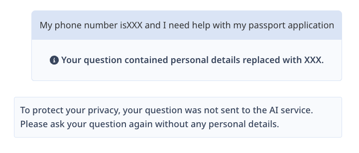
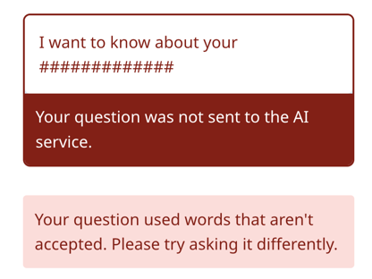

### On this page

* [Redacting Personally Identifiable Information(PII) in the user input field](#redacting-personally-identifiable-information)  
* [Redacting threats, profanity and AI manipulation](#redacting-threats)  
* [Prevention of jailbreaking and manipulation](#prevention-of-jailbreaking-and-manipulation)

### Redacting Personally Identifiable Information (PII) {#redacting-personally-identifiable-information}

Remove and redact as much personal identifiable information (PII) as possible, rather than sending it to the AI service or storing it in any manner. 

DTO has learned from testing that most questions with PII redacted will no longer make sense. Instead of sending the redacted message to the AI Service, our approach is to show the user the result of the PII redaction and ask them to reframe the question without personal details. 

* This user message is displayed when PII is redacted: “Your question contained personal details replaced with XXX”. “To protect your privacy, your question was not sent to the AI service. Please ask your question again without any personal details.”

### Redacting threats, profanity and AI manipulation {#redacting-threats}

Apply redaction patterns in the code for profanity, threats and manipulation.

All three of these types of redaction show an identical user message and are redacted with \# characters. An error message is displayed to advise users:  “Your question was not sent to the AI service.Your question used words that aren’t accepted. Please try asking it differently”. 

This redaction approach prevents people from attempting to contact the Government with threats and from attempting to manipulate or ‘jailbreak’ the AI service. Threats would need to be handled in real-time, which is not the role of an AI chat application. 

In our usability testing, 3 participants experienced this redaction because of a bug, and they all understood the message and easily adapted. Notice that the user message nudges people towards asking a question rather than a comment. 

* Make sure to redact the entire words, not parts of words, or you’ll end up with words like “assessment” and “died” not being accepted. 

There are three sets of files of words and phrases, in English and French, that can be used. Contact us if you’d like access to these files.  

1. Profanity (badwords\_en.txt, badwords\_fr.txt)  
2. Threats (threats\_en.txt, threats\_fr.txt)  
3. Manipulation (manipulation\_en.json, manipulation\_en.json) 

### Prevention of jailbreaking and manipulation {#prevention-of-jailbreaking-and-manipulation}

Jailbreaking a chat application means manipulating it into doing things it's not supposed to do, like providing private, harmful or out-of-scope answers.

Use limits: 

* limit the number of characters in the input field to 400   
  * Examine your usage data over time to evaluate reducing or increasing this value  
  * Error message when limit is exceeded should alert the user to the amount of characters over the limit and advise them to simplify it: “Your message is \[number\] characters too long. Please simplify your question”  
* limit the conversation to a maximum of 3 questions, as longer conversations are more vulnerable and more expensive   
  * show a Reload button and message once the conversation limit is reached \- note that only messages sent to the AI service should count towards this limit   
  * Reload message: “You’ve reached the limit of 3 questions per conversation. Reload to start a new conversation”

