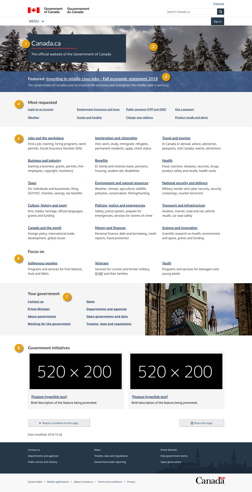

 
 <section>
  

   
    Mandatory
   
  

  

   The home page is the initial page of Canada.ca, where people can access all of the information and services that are available from the Government of Canada.
  

  <ul>
   <li>
    the home page surfaces the top tasks from across government
   </li>
   <li>
    it links to all themes and government-wide audiences
   </li>
   <li>
    it links to key corporate information
   </li>
   <li>
    it allows the promotion of key programs, initiatives and  activities
   </li>
  </ul>
 </section>
 <section>
  <h2>
   On this page
  </h2>
  <ul>
   <li>
    <a href="#use">
     When to use this template
    </a>
   </li>
   <li>
    <a href="#specifications">
     How to use this template
    </a>
   </li>
   <li>
    <a href="#examples">
     Working examples
    </a>
   </li>
  </ul>
 </section>
 <section>
  <h2 id="use">
   When to use this template
  </h2>
  

   The home page template is used only once on Canada.ca.
  

 </section>
 <section>
  <h2 id="specifications">
   How to use this template
  </h2>
  

   <button class="btn btn-default wb-toggle" data-toggle='{"selector": "details", "parent": "#template-elements", "type": "on"}' type="button">
    Expand All
   </button>
   <button class="btn btn-default wb-toggle" data-toggle='{"selector": "details", "parent": "#template-elements", "type": "off"}' type="button">
    Collapse All
   </button>
  

  

   

    <figure class="mrgn-bttm-lg">
     <figcaption class="text-center">
      <b>
       Home page template
      </b>
     </figcaption>
     
    </figure>
   

   

    <section id="template-elements">
     <section>
      <h3>
       1: Site title and byline
      </h3>
      

       
        Mandatory
       
      

      

       Identifies the site as the Government of Canada website
      

      <ul class="list-unstyled">
       <li id="element1">
        

         

          <strong>
           Content
          </strong>
         

         <ul>
          <li>
           consists of a title, followed by short byline
          </li>
          <li>
           site title: Canada.ca
          </li>
          <li>
           byline: The official website of the Government of Canada
          </li>
         </ul>
        

       </li>
       <li id="element2">
        

         

          <strong>
           Presentation
          </strong>
         

         <ul>
          <li>
           the site title and byline appear in a dark blue box
          </li>
          <li>
           the site title is presented as an H1, with a red horizontal rule underneath
          </li>
          <li>
           the byline appears immediately below the site title
          </li>
         </ul>
        

       </li>
      </ul>
     </section>
     <section>
      <h3>
       2: Home page banner image
      </h3>
      

       
        Mandatory
       
      

      

       Promotes relevant and timely information about
       <abbr title="Government of Canada">
        GC
       </abbr>
       priorities, initiatives, activities, news and events
      

      <ul class="list-unstyled">
       <li id="element3">
        

         

          <strong>
           Content
          </strong>
         

         <ul>
          <li>
           images must be photographic (no illustration or abstract imagery)
          </li>
          <li>
           choose images that show seasonal details (e.g. snow in winter, flowers in spring)
          </li>
          <li>
           avoid images of people or faces as these are distracting
          </li>
         </ul>
        

       </li>
       <li id="element4">
        

         

          <strong>
           Presentation
          </strong>
         

         <ul>
          <li>
           the banner image appears across the full width of the page, underneath the site header and behind the box containing the site title and headline
          </li>
         </ul>
        

       </li>
      </ul>
     </section>
     <section>
      <h3>
       3: Home page feature
      </h3>
      

       
        Mandatory
       
      

      

       Promotes relevant and timely information about
       <abbr title="Government of Canada">
        GC
       </abbr>
       priorities, initiatives, activities, news and events
      

      <ul class="list-unstyled">
       <li id="element5">
        

         

          <strong>
           Content
          </strong>
         

         <ul>
          <li>
           PCO controls the content in this section
          </li>
          <li>
           there are 4 featured links, only 1 of which is displayed at a time
          </li>
          <li>
           use a call to action for the link text
          </li>
          <li>
           limit link text to 65 characters
          </li>
         </ul>
        

       </li>
       <li id="element6">
        

         

          <strong>
           Presentation
          </strong>
         

         <ul>
          <li>
           the home page feature appears in an overlay across the bottom portion of the home page banner image
          </li>
          <li>
           each time the home page loads, 1 of 4 featured links will be displayed  to visitors at random
          </li>
          <li>
           in exceptional situations such as an important government policy announcement (for example, the federal budget), eliminate random rotation and use only 1 featured link for all visitors
          </li>
          <li>
           when only 1 featured link is being used for all visitors, the home page banner image may be changed to one that complements the link being featured
          </li>
         </ul>
        

       </li>
      </ul>
     </section>
     <section>
      <h3>
       4: Government-wide top tasks
      </h3>
      

       
        Mandatory
       
      

      

       Links for government-wide top tasks based on page-view metrics and user research
      

      <ul class="list-unstyled">
       <li id="element7">
        

         

          <strong>
           Content
          </strong>
         

         <ul>
          <li>
           includes the 8 top tasks from across the Government of Canada based on page-view metrics and user research
          </li>
         </ul>
        

       </li>
       <li id="element8">
        

         

          <strong>
           Presentation
          </strong>
         

         <ul>
          <li>
           appears below the home page feature
          </li>
          <li>
           links are presented in four columns of two links each
          </li>
         </ul>
        

       </li>
      </ul>
     </section>
     <section>
      <h3>
       5: Theme links and descriptions
      </h3>
      

       
        Mandatory
       
      

      

       Links and descriptions for the Canada.ca themes
      

      <ul class="list-unstyled">
       <li id="element9">
        

         

          <strong>
           Content
          </strong>
         

         <ul>
          <li>
           presents links and descriptions for all 15 Canada.ca themes
          </li>
          <li>
           use the
           <a href="../common-design-patterns/services-information.html">
            Services and information
           </a>
           pattern
          </li>
         </ul>
        

       </li>
       <li id="element10">
        

         

          <strong>
           Presentation
          </strong>
         

         <ul>
          <li>
           appears immediately below government-wide top tasks
          </li>
         </ul>
        

       </li>
      </ul>
     </section>
     <section>
      <h3>
       6: Government-wide audiences
      </h3>
      

       
        Mandatory
       
      

      

       Links and descriptions for government-wide audience pages
      

      <ul class="list-unstyled">
       <li id="element11">
        

         

          <strong>
           Content
          </strong>
         

         <ul>
          <li>
           presents links to the to government-wide audiences:
           <ul>
            <li>
             Indigenous peoples
            </li>
            <li>
             veterans
            </li>
            <li>
             youth
            </li>
           </ul>
          </li>
          <li>
           heading label: "Focus on"
          </li>
          <li>
           use the
           <a href="../common-design-patterns/services-information.html">
            Services and information
           </a>
           pattern
          </li>
         </ul>
        

       </li>
       <li id="element12">
        

         

          <strong>
           Presentation
          </strong>
         

         <ul>
          <li>
           appears immediately below theme links and descriptions
          </li>
         </ul>
        

       </li>
      </ul>
     </section>
     <section>
      <h3>
       7: Your government
      </h3>
      

       
        Mandatory
       
      

      

       Links for key GC-wide corporate information
      

      <ul class="list-unstyled">
       <li id="element13">
        

         

          <strong>
           Content
          </strong>
         

         <ul>
          <li>
           presents 8 links in 2 columns:
           <ul>
            <li>
             Contact us
            </li>
            <li>
             Prime Minister
            </li>
            <li>
             About government
            </li>
            <li>
             Working for the government
            </li>
            <li>
             News
            </li>
            <li>
             Departments and agencies
            </li>
            <li>
             Open government and data
            </li>
            <li>
             Treaties, laws and regulations
            </li>
           </ul>
          </li>
          <li>
           heading label: "Your government"
          </li>
         </ul>
        

       </li>
       <li id="element14">
        

         

          <strong>
           Presentation
          </strong>
         

         <ul>
          <li>
           appears below the Government-wide audiences section
          </li>
          <li>
           links are placed in two columns of four links each
          </li>
          <li>
           on large screens, an image that complements this section appears to the right of the links
          </li>
          <li>
           on smaller screens, the image does not appear
          </li>
         </ul>
        

       </li>
      </ul>
     </section>
     <section>
      <h3>
       8: Government initiatives
      </h3>
      

       
        Mandatory
       
      

      

       Promotes government-wide priorities
      

      <ul class="list-unstyled">
       <li id="element15">
        

         

          <strong>
           Content
          </strong>
         

         <ul>
          <li>
           heading is labelled "Government initiatives"
          </li>
          <li>
           consists of a set of 2 features
          </li>
          <li>
           use the
           <a href="../common-design-patterns/feature-tiles.html">
            Context-specific features
           </a>
           pattern
          </li>
         </ul>
        

       </li>
       <li id="element16">
        

         

          <strong>
           Presentation
          </strong>
         

         <ul>
          <li>
           appears below Your Government
          </li>
         </ul>
        

       </li>
      </ul>
     </section>
    </section>
   

  

 </section>
 <section>
  <h2 id="examples">
   Working examples
  </h2>
  <ul>
   <li>
    <a href="https://www.canada.ca/en.html">
     English working example
    </a>
   </li>
   <li>
    <a href="https://www.canada.ca/fr.html">
     French working example
    </a>
   </li>
  </ul>
 </section>

