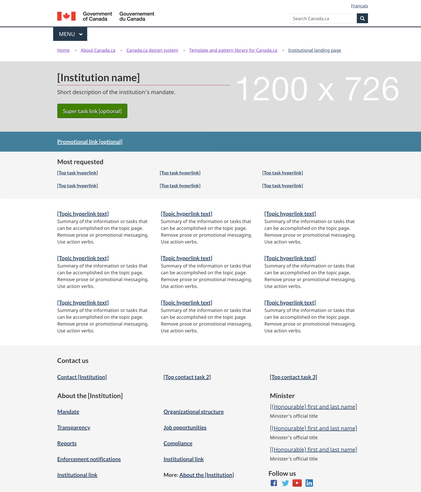

Mandatory

Use this template as the landing page for Government of Canada institutions and organizations.

The purpose of this page is to enable people to find information and services offered by that institution, with a focus on top tasks.

It should also allow people to find all the other content owned by that institution, including:

<ul>
  <li>mandate and organizational structure</li>
  <li>contact information</li>
  <li>news and promotions</li>
  <li>reports and publications</li>
</ul>
<section>
  <h2>On this page</h2>
  <ul>
    <li><a href="#use">When to use</a></li>
    <li><a href="#avoid">What to avoid</a></li>
    <li><a href="#specifications">How to implement</a></li>
    <li><a href="#research">Research</a></li>
    <li><a href="#changes">Latest changes</a></li>
  </ul>
</section>
<section>
  <h2 id="use">When to use</h2>
  
All Government of Canada institutions and organizations subject to the <a href="http://www.tbs-sct.gc.ca/pol/doc-eng.aspx?id=30682"><cite>Directive on the Management of Communications</cite></a>must use this template as their landing page.
  
Consult the <a href="https://www.canada.ca/en/government/about/design-system/institutions-list.html">Canada.ca Institutions list</a>for the full list.

  

</section>
<section>
  <h2 id="avoid">What to avoid</h2>
  
Only use this template as the landing page of official institutions and organizations from the <a href="https://www.canada.ca/en/government/about/design-system/institutions-list.html">Canada.ca Institutions list</a>.

  
Don't use this template for specific programs or entities that are not official institutions or organizations of the Government of Canada.

</section>
<section>
  <h2 id="specifications">How to implement</h2>
  
You can use either the <strong>beta</strong> or the <strong>stable</strong> version of this template.

  <section>
    <h3>Beta institutional landing page</h3>
    
The beta version is an improvement over the stable version. The code is still under review. It may still be subject to changes.

    
The beta version will eventually replace the stable version.

    
You will need to apply custom CSS to use this beta version.

    

      

        

          

            

              

            

            

              
Beta institutional landing page

              
<a class="btn btn-call-to-action" href="../coded-layout/institutional_landing_page_guidance.html">Template with guidance</a>

            

          

        

      

    

    

      
Code

      
      

        

          

            
HTML

            <pre><code>&lt;div class="provisional bg-cover bg-right bg-hide-sm bg-hide-xs mrgn-tp-md pb-3" data-bgimg="put your image link here"&gt;
				&lt;div class="container"&gt;
					&lt;div class="row"&gt;
						&lt;div class="col-md-7"&gt;
							&lt;h1 property="name" id="wb-cont"&gt;[Institution name]&lt;/h1&gt;
							&lt;p&gt;Short description of the institution’s mandate.&lt;/p&gt;
							&lt;a class="provisional btn btn-call-to-action" href="#"&gt;Super task button [optional]&lt;/a&gt;
						&lt;/div&gt;
						&lt;div class="clearfix"&gt;&lt;/div&gt;
					&lt;/div&gt;
				&lt;/div&gt;
			&lt;/div&gt;
			&lt;section class="provisional gc-featured-lnk"&gt;
				&lt;div class="container"&gt;
					&lt;h2 class="wb-inv"&gt;Featured link&lt;/h2&gt;
					&lt;a class="h5" href="#"&gt;Featured link [optional]&lt;/a&gt;
				&lt;/div&gt;
			&lt;/section&gt;
			&lt;section class="provisional most-requested-bullets well well-sm brdr-0"&gt;
				&lt;div class="container"&gt;
					&lt;div class="row"&gt;
						&lt;div class="pddng-r-0 col-md-2"&gt;
							&lt;h2 class="mrgn-tp-md"&gt;Most requested&lt;/h2&gt;
						&lt;/div&gt;
						&lt;div class="col-md-10"&gt;
							&lt;ul class="wb-eqht mrgn-tp-md mrgn-bttm-md colcount-md-2"&gt;
								&lt;li&gt;&lt;a href="#"&gt;[Top task hyperlink]&lt;/a&gt;&lt;/li&gt;
								&lt;li&gt;&lt;a href="#"&gt;[Top task hyperlink]&lt;/a&gt;&lt;/li&gt;
								&lt;li&gt;&lt;a href="#"&gt;[Top task hyperlink]&lt;/a&gt;&lt;/li&gt;
								&lt;li&gt;&lt;a href="#"&gt;[Top task hyperlink]&lt;/a&gt;&lt;/li&gt;
								&lt;li&gt;&lt;a href="#"&gt;[Top task hyperlink]&lt;/a&gt;&lt;/li&gt;
								&lt;li&gt;&lt;a href="#"&gt;[Top task hyperlink]&lt;/a&gt;&lt;/li&gt;
							&lt;/ul&gt;
						&lt;/div&gt;
					&lt;/div&gt;
				&lt;/div&gt;
			&lt;/section&gt;
			&lt;section class="gc-srvinfo col-md-12 mrgn-bttm-lg"&gt;
				&lt;div class="container"&gt;
					&lt;div class="row"&gt;
						&lt;h2 class="wb-inv"&gt;Services and information&lt;/h2&gt;
						&lt;div class="wb-eqht"&gt;
							&lt;div class="col-lg-4 col-md-6"&gt;
								&lt;h3&gt;&lt;a href="#"&gt;[Hyperlink text]&lt;/a&gt;&lt;/h3&gt;
								&lt;p&gt;Use action verbs, or simply list keywords to summarize the information or tasks that can be accomplished on the page it links to.&lt;/p&gt;
							&lt;/div&gt;
							&lt;div class="col-lg-4 col-md-6"&gt;
								&lt;h3&gt;&lt;a href="#"&gt;[Hyperlink text]&lt;/a&gt;&lt;/h3&gt;
								&lt;p&gt;Use action verbs, or simply list keywords to summarize the information or tasks that can be accomplished on the page it links to.&lt;/p&gt;
							&lt;/div&gt;
							&lt;div class="col-lg-4 col-md-6"&gt;
								&lt;h3&gt;&lt;a href="#"&gt;[Hyperlink text]&lt;/a&gt;&lt;/h3&gt;
								&lt;p&gt;Use action verbs, or simply list keywords to summarize the information or tasks that can be accomplished on the page it links to.&lt;/p&gt;
							&lt;/div&gt;
							&lt;div class="col-lg-4 col-md-6"&gt;
								&lt;h3&gt;&lt;a href="#"&gt;[Hyperlink text]&lt;/a&gt;&lt;/h3&gt;
								&lt;p&gt;Use action verbs, or simply list keywords to summarize the information or tasks that can be accomplished on the page it links to.&lt;/p&gt;
							&lt;/div&gt;
							&lt;div class="col-lg-4 col-md-6"&gt;
								&lt;h3&gt;&lt;a href="#"&gt;[Hyperlink text]&lt;/a&gt;&lt;/h3&gt;
								&lt;p&gt;Use action verbs, or simply list keywords to summarize the information or tasks that can be accomplished on the page it links to.&lt;/p&gt;
							&lt;/div&gt;
							&lt;div class="col-lg-4 col-md-6"&gt;
								&lt;h3&gt;&lt;a href="#"&gt;[Hyperlink text]&lt;/a&gt;&lt;/h3&gt;
								&lt;p&gt;Use action verbs, or simply list keywords to summarize the information or tasks that can be accomplished on the page it links to.&lt;/p&gt;
							&lt;/div&gt;
							&lt;div class="col-lg-4 col-md-6"&gt;
								&lt;h3&gt;&lt;a href="#"&gt;[Hyperlink text]&lt;/a&gt;&lt;/h3&gt;
								&lt;p&gt;Use action verbs, or simply list keywords to summarize the information or tasks that can be accomplished on the page it links to.&lt;/p&gt;
							&lt;/div&gt;
							&lt;div class="col-lg-4 col-md-6"&gt;
								&lt;h3&gt;&lt;a href="#"&gt;[Hyperlink text]&lt;/a&gt;&lt;/h3&gt;
								&lt;p&gt;Use action verbs, or simply list keywords to summarize the information or tasks that can be accomplished on the page it links to.&lt;/p&gt;
							&lt;/div&gt;
							&lt;div class="col-lg-4 col-md-6"&gt;
								&lt;h3&gt;&lt;a href="#"&gt;[Hyperlink text]&lt;/a&gt;&lt;/h3&gt;
								&lt;p&gt;Use action verbs, or simply list keywords to summarize the information or tasks that can be accomplished on the page it links to.&lt;/p&gt;
							&lt;/div&gt;
							&lt;div class="clearfix"&gt;&lt;/div&gt;
						&lt;/div&gt;
					&lt;/div&gt;
				&lt;/div&gt;
			&lt;/section&gt;
			&lt;div class="clearfix"&gt;&lt;/div&gt;
			&lt;section class="well well-sm brdr-0 mrgn-bttm-0"&gt;
				&lt;div class="container"&gt;
					&lt;div class="wb-eqht"&gt;
						&lt;h2 class="h3 mrgn-tp-md"&gt;Contact us&lt;/h2&gt;
						&lt;ul class="provisional list-bld list-unstyled mrgn-tp-lg lst-spcd-2 colcount-md-3"&gt;
							&lt;li&gt;&lt;a href="#"&gt;Contact [Institution]&lt;/a&gt;&lt;/li&gt;
							&lt;li&gt;&lt;a href="#"&gt;[Top contact task 2]&lt;/a&gt;&lt;/li&gt;
							&lt;li&gt;&lt;a href="#"&gt;[Top contact task 3]&lt;/a&gt;&lt;/li&gt;
						&lt;/ul&gt;
					&lt;/div&gt;
					&lt;div class="row"&gt;
						&lt;section class="col-md-8 pull-left mrgn-bttm-lg"&gt;
							&lt;h2 class="h3 mrgn-tp-md"&gt;About the [Institution]&lt;/h2&gt;
							&lt;ul class="provisional list-bld list-unstyled mrgn-tp-lg lst-spcd-2 colcount-md-2"&gt;
								&lt;li&gt;&lt;a href="#"&gt;Mandate&lt;/a&gt;&lt;/li&gt;
								&lt;li&gt;&lt;a href="#"&gt;Organizational structure&lt;/a&gt;&lt;/li&gt;
								&lt;li&gt;&lt;a href="#"&gt;Transparency&lt;/a&gt;&lt;/li&gt;
								&lt;li&gt;&lt;a href="#"&gt;Job opportunities&lt;/a&gt;&lt;/li&gt;
								&lt;li&gt;&lt;a href="#"&gt;Reports&lt;/a&gt;&lt;/li&gt;
								&lt;li&gt;&lt;a href="#"&gt;Compliance&lt;/a&gt;&lt;/li&gt;
								&lt;li&gt;&lt;a href="#"&gt;Enforcement notifications&lt;/a&gt;&lt;/li&gt;
								&lt;li&gt;&lt;a href="#"&gt;[Institutional link]&lt;/a&gt;&lt;/li&gt;
								&lt;li&gt;&lt;a href="#"&gt;[Institutional link]&lt;/a&gt;&lt;/li&gt;
								&lt;li&gt;More: &lt;a href="#"&gt;About the [Institution]&lt;/a&gt;&lt;/li&gt;
							&lt;/ul&gt;
						&lt;/section&gt;
						&lt;div class="provisional col-md-4 col-sm-5 pull-right xs-left"&gt;
							&lt;section class="lnkbx"&gt;
								&lt;h2 class="h3"&gt;Minister&lt;/h2&gt;
								&lt;p&gt;
									&lt;a href="#"&gt;[(Honourable) first and last name]&lt;/a&gt;&lt;br&gt;
									&lt;small&gt;Minister's official title&lt;/small&gt;
								&lt;/p&gt;
								&lt;p&gt;
									&lt;a href="#"&gt;[(Honourable) first and last name]&lt;/a&gt;&lt;br&gt;
									&lt;small&gt;Minister's official title&lt;/small&gt;
								&lt;/p&gt;
								&lt;p&gt;
									&lt;a href="#"&gt;[(Honourable) first and last name]&lt;/a&gt;&lt;br&gt;
									&lt;small&gt;Minister's official title&lt;/small&gt;
								&lt;/p&gt;
							&lt;/section&gt;
							&lt;section class="provisional followus"&gt;
								&lt;h2 class="mrgn-tp-lg h3"&gt;Follow us&lt;/h2&gt;
								&lt;ul&gt;
									&lt;li&gt;&lt;a href="#" class="facebook" rel="external"&gt;&lt;span class="wb-inv"&gt;Facebook&lt;/span&gt;&lt;/a&gt;&lt;/li&gt;
									&lt;li&gt;&lt;a href="#" class="twitter" rel="external"&gt;&lt;span class="wb-inv"&gt;Twitter&lt;/span&gt;&lt;/a&gt;&lt;/li&gt;
									&lt;li&gt;&lt;a href="#" class="youtube" rel="external"&gt;&lt;span class="wb-inv"&gt;YouTube&lt;/span&gt;&lt;/a&gt;&lt;/li&gt;
									&lt;li&gt;&lt;a href="#" class="linkedin" rel="external"&gt;&lt;span class="wb-inv"&gt;LinkedIn&lt;/span&gt;&lt;/a&gt;&lt;/li&gt;
								&lt;/ul&gt;
							&lt;/section&gt;
						&lt;/div&gt;
						&lt;div class="clearfix"&gt;&lt;/div&gt;
					&lt;/div&gt;
				&lt;/div&gt;
			&lt;/section&gt;
			&lt;div class="container"&gt;
				&lt;div class="row"&gt;
					&lt;section class="col-md-4 wb-feeds limit-3 gc-nws"&gt;
						&lt;h2 class="h3"&gt;News&lt;/h2&gt;
						&lt;!-- demonstrate the look - use json feed where applicable --&gt;
						&lt;ul class="feeds-cont list-unstyled lst-spcd feed-active"&gt;
							&lt;li&gt;&lt;a href="#"&gt;[News title]&lt;/a&gt;&lt;br&gt; &lt;small class="feeds-date"&gt;YYYY-MM-DD HH:MM&lt;/small&gt;&lt;/li&gt;
							&lt;li&gt;&lt;a href="#"&gt;[News title]&lt;/a&gt;&lt;br&gt; &lt;small class="feeds-date"&gt;YYYY-MM-DD HH:MM&lt;/small&gt;&lt;/li&gt;
							&lt;li&gt;&lt;a href="#"&gt;[News title]&lt;/a&gt;&lt;br&gt; &lt;small class="feeds-date"&gt;YYYY-MM-DD HH:MM&lt;/small&gt;&lt;/li&gt;
						&lt;/ul&gt;
						&lt;!-- json feed for news example
						&lt;ul class="feeds-cont list-unstyled lst-spcd"&gt;
							&lt;li&gt; &lt;a data-ajax="https://www.canada.ca/content/canadasite/api/nws/fds/en/web-feeds/revenue-agency.json" href="https://www.canada.ca/en/revenue-agency.atom.xml" rel="external"&gt;Canada Revenue Agency news items&lt;/a&gt; &lt;/li&gt;
						&lt;/ul&gt;--&gt;
						&lt;p&gt;More: &lt;a href="#" class="admin"&gt;[Institution] news&lt;/a&gt;&lt;/p&gt;
					&lt;/section&gt;
					&lt;section class="col-md-8 gc-prtts"&gt;
						&lt;h2 class="h3"&gt;Features&lt;/h2&gt;
						&lt;div class="row wb-eqht gc-srvinfo"&gt;
							&lt;div class="col-sm-6"&gt;
								&lt;div class="well well-sm brdr-rds-0 eqht-trgt"&gt;
									&lt;img class="img-responsive full-width" src="https://wet-boew.github.io/themes-dist/GCWeb/img/360x203.png" alt=""&gt;
									&lt;h3 class="h5"&gt;&lt;a href="#" class="stretched-link"&gt;[Feature hyperlink text]&lt;/a&gt;&lt;/h3&gt;
									&lt;p&gt;Brief description of the feature being promoted.&lt;/p&gt;
								&lt;/div&gt;
							&lt;/div&gt;
							&lt;div class="col-sm-6"&gt;
								&lt;div class="well well-sm brdr-rds-0 eqht-trgt"&gt;
									&lt;img class="img-responsive full-width" src="https://wet-boew.github.io/themes-dist/GCWeb/img/360x203.png" alt=""&gt;
									&lt;h3 class="h5"&gt;&lt;a href="#" class="stretched-link"&gt;[Feature hyperlink text]&lt;/a&gt;&lt;/h3&gt;
									&lt;p&gt;Brief description of the feature being promoted.&lt;/p&gt;
								&lt;/div&gt;
							&lt;/div&gt;
						&lt;/div&gt;
					&lt;/section&gt;
				&lt;/div&gt;
			&lt;/div&gt;</code></pre>
          

          

            
CSS

            <pre><code>.provisional.bg-cover {
	background-size: cover;
}

.provisional.bg-right {
	background-position: right;
}

.provisional.pb-3 {
	padding-bottom: 15px;
}

.provisional.btn-call-to-action {
	font-size: 1em;
}

.provisional.gc-featured-lnk {
	background: #31708f;
	margin-bottom: 0em;
	padding-top:20px;
	padding-bottom:20px;
}

.provisional.gc-featured-lnk a {
	color:#fff
}

ul.feeds-cont li a {
	font-weight: bold;
}

.provisional.most-requested-bullets li {
	font-family: 'Lato', sans-serif;
	font-size: 17px;
	font-weight: 600;
	line-height: 26px;
	margin-top: 0
}

.provisional.most-requested-bullets .pddng-r-0 {
	padding-right: 0px;
}

.provisional.most-requested-bullets h2 {
	font-size: 1.2em;
}

.provisional.list-bld {
	font-weight: 600;
}

.provisional.followus h2 {
	font-size: 1.1em;
	margin-top: 10px;
}

.provisional.followus {
	padding: 0;
}

.provisional.followus h2 {
	display: block;
}

.provisional.followus h2,
.provisional.followus ul {
	margin-left: 0;
}

.provisional.followus-vertical {
	line-height: 0em;
}

.provisional.followus-vertical,
.provisional.followus {
	background-color: transparent;
}

.provisional.followus-vertical a {
	text-decoration: none;
}

.provisional.followus-vertical ul {
	display: block;
	list-style-type: none;
	margin-block-start: 1em;
	padding-inline-start: 1em;
	font-size: 16px;
	margin-block-end: 0em;
}

.provisional.followus-vertical ul li {
	margin-bottom: 15px;
}

.provisional.followus-vertical ul li:last-child {
	margin-bottom: 0px;
}

.provisional.followus-vertical ul li a {
	border: none;
	padding: 0px 5px;
}

.provisional.followus ul li a {
	border: none;
}

.provisional .social-lnk {
	position: relative;
	bottom:-18px;
	left:45px;
}

.provisional.followus-vertical li {
	display: block;
	background-position: left;
}

.provisional.followus .facebook,
.provisional.followus .twitter,
.provisional.followus .youtube,
.provisional.followus .instagram,
.provisional.followus .linkedin {
	display: block;
	height: 38px;
	width: 38px;
}
/* remove this section if you do not want the new icons */

.provisional.followus .facebook {
	background: url("https://design.canada.ca/images/social-media/facebook.png") 0 0 / cover no-repeat;
}
.provisional.followus .twitter {
	background: url("https://design.canada.ca/images/social-media/twitter.png") 0 0 / cover no-repeat;
}
.provisional.followus .youtube {
	background: url("https://design.canada.ca/images/social-media/youtube.png") 0 0 / cover no-repeat;
}
.provisional.followus .instagram {
	background: url("https://design.canada.ca/images/social-media/instagram.png") 0 0 / cover no-repeat;
}
.provisional.followus .linkedin {
	background: url("https://design.canada.ca/images/social-media/linkedin.png") 0 0 / cover no-repeat;
}
/* end of new social media icons */

@media screen and (max-width: 767px) {
	.provisional.bg-hide-xs {
		background-image: url("none") !important;
	}

	.provisional.btn-call-to-action {
		font-size: .9em;
	}

	.provisional.xs-left {
		float: left !important;
	}
}

@media (min-width:768px) and (max-width:991px) {
	.provisional.bg-hide-sm {
		background-image: url("none") !important;
	}
}</code></pre>
          

        

      

    

  </section>
  

  <section>
    <h3>Stable institutional landing page</h3>
    
The beta version will eventually replace this stable version.

    

      
Guidance for the stable institutional landing page

      <h3 id="profile">Profile page</h3>
      

        <button class="btn btn-default wb-toggle" data-toggle='{"selector": "details", "parent": "#template-elements", "type": "on"}' type="button">Expand All</button>
        <button class="btn btn-default wb-toggle" data-toggle='{"selector": "details", "parent": "#template-elements", "type": "off"}' type="button">Collapse All</button>
      

      

        

          <figure class="mrgn-bttm-lg">
            <figcaption class="text-center"><b>Profile page template</b></figcaption>
            </figure>
        

        

          

            <section>
              <h4>1: Institution name</h4>
              
Mandatory

              
Provides the applied title of the institution

              <ul class="list-unstyled">
                <li id="element1">
                  

                    
<strong>Content</strong>

                    <ul>
                      <li>use the applied title of the institution, as specified in the <a href="https://www.tbs-sct.gc.ca/hgw-cgf/oversight-surveillance/communications/fip-pcim/reg-eng.asp">Registry of Applied Titles</a></li>
                      <li>use the legal title if the applied title is not available</li>
                      <li>do not use acronyms or abbreviations</li>
                    </ul>
                  

                </li>
                <li id="element2">
                  

                    
<strong>Presentation</strong>

                    <ul>
                      <li>institutional profile title must be a unique H1</li>
                      <li>must be the first component on the page</li>
                    </ul>
                  

                </li>
              </ul>
            </section>
            <section>
              <h4>2a: Insignia</h4>
              
Conditional

              
Provides identification of the Royal Canadian Mounted Police

              <ul class="list-unstyled">
                <li id="element3">
                  

                    
<strong>Content</strong>

                    <ul>
                      <li>this component is only allowed for the Royal Canadian Mounted Police, to display their primary approved insignia</li>
                    </ul>
                  

                </li>
                <li id="element4">
                  

                    
<strong>Presentation</strong>

                    <ul>
                      <li>the insignia appears to the right of the institutional mandate</li>
                      <li>the image is not hyperlinked</li>
                    </ul>
                  

                </li>
              </ul>
            </section>
            <section>
              <h4>3: Institutional mandate</h4>
              
Mandatory

              
Provides 1 or 2 sentences that describe the institution’s mandate

              <ul class="list-unstyled">
                <li id="element5">
                  

                    
<strong>Content</strong>

                    <ul>
                      <li>lists the applied title of the institution followed by a brief, plain language overview of how the institution serves the public</li>
                      <li>keep the text short and concise</li>
                      <li>written for a grade 6-8 reading level</li>
                    </ul>
                  

                </li>
                <li id="element6">
                  

                    
<strong>Presentation</strong>

                    <ul>
                      <li>the institutional mandate appears directly below the institutional profile page title</li>
                    </ul>
                  

                </li>
              </ul>
            </section>
            <section>
              <h4>4: Institutional social media channels</h4>
              
Conditional

              
Features institution-specific social media channels

              <ul class="list-unstyled">
                <li id="element7">
                  

                    
<strong>Content</strong>

                    <ul>
                      <li>this component is mandatory for all institutions listed under <a href="http://laws-lois.justice.gc.ca/eng/acts/f-11/page-30.html#h-74">Schedule I of the FAA</a>; otherwise, it is optional</li>
                      <li>use the <a href="./multi-p-ds-patterns-channels.html">Social media channels block (follow box)</a>pattern</li>
                    </ul>
                  

                </li>
                <li id="element8">
                  

                    
<strong>Presentation</strong>

                    <ul>
                      <li>appears to the right of the institutional mandate</li>
                    </ul>
                  

                </li>
              </ul>
            </section>
            <section>
              <h4>5: Latest news</h4>
              
Conditional

              
Features current news items related to the institution

              <ul class="list-unstyled">
                <li id="element9">
                  

                    
<strong>Content</strong>

                    <ul>
                      <li>this component is mandatory for all institutions listed under <a href="http://laws-lois.justice.gc.ca/eng/acts/f-11/page-30.html#h-74">Schedule I of the FAA</a>; otherwise, it is optional</li>
                      <li>use the <a href="../common-design-patterns/latest-news.html">Latest news</a>pattern</li>
                    </ul>
                  

                </li>
                <li id="element10">
                  

                    
<strong>Presentation</strong>

                    <ul>
                      <li>appears below “Institutional social media channels”</li>
                    </ul>
                  

                </li>
              </ul>
            </section>
            <section>
              <h4>6: Services and information</h4>
              
Mandatory

              
Lists the institution-specific topics or top tasks

              <ul class="list-unstyled">
                <li id="element11">
                  

                    
<strong>Content</strong>

                    <ul>
                      <li>use the <a href="./multi-p-ds-patterns-doormat.html">Link and description</a>pattern</li>
                    </ul>
                  

                </li>
                <li id="element12">
                  

                    
<strong>Presentation</strong>

                    <ul>
                      <li>appears below the social media channels and to the left of “Most requested”</li>
                    </ul>
                  

                </li>
              </ul>
            </section>
            <section>
              <h4>7: Most requested</h4>
              
Conditional

              
Features institution-specific top tasks

              <ul class="list-unstyled">
                <li id="element13">
                  

                    
<strong>Content</strong>

                    <ul>
                      <li>this component in mandatory to provide shortcuts to the institution's top tasks. However, it should not be used if all of the institution's top tasks are already included as direct links under Services and information.</li>
                      <li>use the <a href="./multi-p-ds-patterns-most_requested.html">Most requested</a>pattern</li>
                    </ul>
                  

                </li>
                <li id="element14">
                  

                    
<strong>Presentation</strong>

                    <ul>
                      <li>appears to the right of “Services and information”</li>
                    </ul>
                  

                </li>
              </ul>
            </section>
            <section>
              <h4>8: Contact us</h4>
              
Mandatory

              
Provides access to institutional contact information

              <ul class="list-unstyled">
                <li id="element15">
                  

                    
<strong>Content</strong>

                    <ul>
                      <li>go to <a href="../common-design-patterns/contact-information.html">Contact information</a>- use either the contact address pattern or contact links pattern</li>
                    </ul>
                  

                </li>
                <li id="element16">
                  

                    
<strong>Presentation</strong>

                    <ul>
                      <li>appears below “Latest news” and to the right of “Services and information”</li>
                    </ul>
                  

                </li>
              </ul>
            </section>
            <section>
              <h4>9: More information for</h4>
              
Optional

              
Links to related audience information

              <ul class="list-unstyled">
                <li id="element17">
                  

                    
<strong>Content</strong>

                    <ul>
                      <li>use the <a href="./multi-p-ds-patterns-more_info_for.html">More information for</a>pattern</li>
                    </ul>
                  

                </li>
                <li id="element18">
                  

                    
<strong>Presentation</strong>

                    <ul>
                      <li>appears below “Most requested”</li>
                    </ul>
                  

                </li>
              </ul>
            </section>
            <section>
              <h4>10: What we are doing</h4>
              
Conditional

              
Provides links to the institution’s program and policy development content

              <ul class="list-unstyled">
                <li id="element19">
                  

                    
<strong>Content</strong>

                    <ul>
                      <li>this component is mandatory when the institution has program and policy development content to present</li>
                      <li>use the <a href="../common-design-patterns/what-we-are-doing.html">What we are doing</a>pattern</li>
                    </ul>
                  

                </li>
                <li id="element20">
                  

                    
<strong>Presentation</strong>

                    <ul>
                      <li>appears below “Services and information”</li>
                    </ul>
                  

                </li>
              </ul>
            </section>
            <section>
              <h4>11: Corporate information</h4>
              
Mandatory

              
Provides consistent access to key corporate information

              <ul class="list-unstyled">
                <li id="element21">
                  

                    
<strong>Content</strong>

                    <ul>
                      <li>consists of a series of links to institution-specific content not presented elsewhere on the page</li>
                      <li>heading is labelled “Corporate information”</li>
                      <li>only the “Mandate” and “Transparency” links are mandatory; all other links are optional</li>
                      <li>links must be labelled and ordered as follows:
                        <dl class="dl-horizontal">
                          <dt><strong>Mandate</strong></dt>
                          <dd>
                            <ul>
                              <li>mandatory</li>
                              <li>links to a page providing the institution’s mandate, vision and objectives</li>
                            </ul>
                          </dd>
                          <dt><strong>Programs</strong></dt>
                          <dd>
                            <ul>
                              <li>optional</li>
                              <li>links to a page providing the institution’s list of programs</li>
                            </ul>
                          </dd>
                          <dt><strong>Organizational structure</strong></dt>
                          <dd>
                            <ul>
                              <li>optional</li>
                              <li>links to a page providing the institution’s organizational chart or structure</li>
                            </ul>
                          </dd>
                          <dt><strong>Portfolio</strong></dt>
                          <dd>
                            <ul>
                              <li>optional</li>
                              <li>links to a page providing the institution’s ministerial portfolio</li>
                            </ul>
                          </dd>
                          <dt><strong>Partners</strong></dt>
                          <dd>
                            <ul>
                              <li>optional</li>
                              <li>links to a page providing the institution’s existing formal partnerships (for example, federal/provincial/territorial, international or non-governmental organizations)</li>
                            </ul>
                          </dd>
                          <dt><strong>Transparency</strong></dt>
                          <dd>
                            <ul>
                              <li>mandatory</li>
                              <li>links to institution-specific transparency information prescribed by Employment and Social Development Canada, such as forward regulatory plans and proactive disclosure</li>
                            </ul>
                          </dd>
                          <dt><strong>Job opportunities</strong></dt>
                          <dd>
                            <ul>
                              <li>optional</li>
                              <li>links to a landing page for institution-specific job opportunities</li>
                            </ul>
                          </dd>
                          <dt><strong>Service performance reporting</strong></dt>
                          <dd>
                            <ul>
                              <li>mandatory, if content exists (see <a href="../recommended-templates/institutional-service-performance-reporting-pages.html">Institutional service performance reporting pages</a>)</li>
                              <li>links to a landing page for institution-specific service performance reporting</li>
                            </ul>
                          </dd>
                        </dl>
                      </li>
                    </ul>
                  

                </li>
                <li id="element22">
                  

                    
<strong>Presentation</strong>

                    <ul>
                      <li>appears above “Features”</li>
                    </ul>
                  

                </li>
              </ul>
            </section>
            <section>
              <h4>12a: Minister of a department or head of a quasi-judicial arm’s-length institution</h4>
              
Conditional

              
Provides a single profile for each <abbr title="Government of Canada">GC</abbr>minister or institutional head

              <ul class="list-unstyled">
                <li id="element23">
                  

                    
<strong>Content</strong>

                    <ul>
                      <li>this component is mandatory for all institutions, unless you are using the portfolio ministers component (12b)</li>
                      <li>includes hyperlinked images of either an institution’s minister(s), including associate minister(s), or its institutional head (in the case of arm’s-length or quasi-judicial institutions).
                        <ul>
                          <li>no other individuals may be displayed on the institutional profile</li>
                        </ul>
                      </li>
                      <li>images and texts are hyperlinked to the appropriate ministerial profile page (see <a href="../mandatory-templates/ministerial-profile-pages.html">Ministerial profile pages</a>)</li>
                      <li>the hyperlink text is limited to the minister’s or institutional head’s honorific (“The Honourable”) and first and last name</li>
                      <li>non-hyperlinked text is limited to the minister’s or institutional head’s official title</li>
                      <li>the following headings must be presented above the appropriate elected official:
                        <ul>
                          <li>“Minister”</li>
                          <li>“Parliamentary secretary”</li>
                          <li>“Associate minister”</li>
                        </ul>
                      </li>
                      <li>the heading of “Management” or “Ombudsman”, must be presented, as appropriate, above the senior-most public servant who is the institutional head</li>
                    </ul>
                  

                </li>
                <li id="element24">
                  

                    
<strong>Presentation</strong>

                    <ul>
                      <li>appears to the right of “Corporate information”</li>
                      <li>priority sequencing is from left to right</li>
                      <li>when more than 3 images are required, continue the list on a second row</li>
                      <li>when fewer than 3 images are required, the image must be left-aligned to the corporate information block</li>
                      <li>go to the <a href="http://wet-boew.github.io/themes-dist/GCWeb/index-en.html">Canada.ca GitHub page</a>for image sizing details</li>
                    </ul>
                  

                </li>
              </ul>
            </section>
            <section>
              <h4>13: Institution features</h4>
              
Optional

              
Promotes institution-specific current activities being led by the institution

              <ul class="list-unstyled">
                <li id="element25">
                  

                    
<strong>Content</strong>

                    <ul>
                      <li>use the <a href="./multi-p-ds-components-features.html">Context-specific features</a>component</li>
                    </ul>
                  

                </li>
                <li id="element26">
                  

                    
<strong>Presentation</strong>

                    <ul>
                      <li>heading is labelled “Features”</li>
                    </ul>
                  

                </li>
              </ul>
            </section>
          

        

      

      <section>
        <h3 id="branding">How to use the arms-length branding</h3>
        

          <button class="btn btn-default wb-toggle" data-toggle='{"selector": "details", "parent": "#template-elements2", "type": "on"}' type="button">Expand All</button>
          <button class="btn btn-default wb-toggle" data-toggle='{"selector": "details", "parent": "#template-elements2", "type": "off"}' type="button">Collapse All</button>
        

        

          

            <figure class="mrgn-bttm-lg">
              <figcaption class="text-center"><b>Arm’s length branding example</b></figcaption>
              </figure>
          

          

            

              <section>
                <h4>2b: Arm’s-length branding</h4>
                
Conditional

                
Displays approved identifier for institutions that meet the criteria for Arm’s Length

                <ul class="list-unstyled">
                  <li id="element2-1">
                    

                      
<strong>Content</strong>

                      <ul>
                        <li>this component is conditional. Only institutions categorized as administrative tribunals under the <a href="http://www.appointments-nominations.gc.ca/prsnt.asp?menu=2&amp;page=gicIntro&amp;lang=eng">rules for Governor in Council appointments</a>have the option to display their approved brand identification</li>
                        <li>institutions categorized as agencies or boards that have a core mandate to make binding decisions or rulings may also have the option to display their approved, primary brand identification, as determined on a case-by-case basis by central agencies</li>
                        <li>the branding must follow the Federal Identity Program (FIP) rules for identifying federal institutions</li>
                      </ul>
                    

                  </li>
                  <li id="element2-2">
                    

                      
<strong>Presentation</strong>

                      <ul>
                        <li>the arm’s-length branding appears at the top of the page</li>
                        <li>the image must be formatted according to FIP design specifications, where applicable (i.e. for institutions not exempt from FIP)</li>
                        <li>the image must be configured to scale automatically to screen size (SVG is the recommended format), in line with responsive web design</li>
                        <li>the image is not hyperlinked</li>
                      </ul>
                    

                  </li>
                </ul>
              </section>
              <section>
                <h4>3a: Arm’s-length statement</h4>
                
Conditional

                
Explains the arm’s-length nature of the institution

                <ul class="list-unstyled">
                  <li id="element2-3">
                    

                      
<strong>Content</strong>

                      <ul>
                        <li>this component is conditional. Only institutions categorized as administrative tribunals under the <a href="http://www.appointments-nominations.gc.ca/prsnt.asp?menu=2&amp;page=gicIntro&amp;lang=eng">rules for Governor in Council appointments</a>have the option to include the arm’s length statement</li>
                        <li>institutions categorized as agencies or boards that have a core mandate to make binding decisions or rulings may also have the option to include this statement, as determined on a case-by-case basis by central agencies</li>
                        <li>the statement gives a concise explanation of the autonomous nature of the arm’s-length institution</li>
                      </ul>
                    

                  </li>
                  <li id="element2-4">
                    

                      
<strong>Presentation</strong>

                      <ul>
                        <li>it is presented in boldface</li>
                      </ul>
                    

                  </li>
                </ul>
              </section>
            

          

        

      </section>
      <section>
        <h3 id="ministers">How to use the portfolio ministers pattern</h3>
        

          <button class="btn btn-default wb-toggle" data-toggle='{"selector": "details", "parent": "#template-elements3", "type": "on"}' type="button">Expand All</button>
          <button class="btn btn-default wb-toggle" data-toggle='{"selector": "details", "parent": "#template-elements3", "type": "off"}' type="button">Collapse All</button>
        

        

          

            <figure class="mrgn-bttm-lg">
              <figcaption class="text-center"><b>Portfolio ministers example</b></figcaption>
              </figure>
          

          

            

              <section>
                <h4>12b: Portfolio ministers</h4>
                
Optional

                
Provides access to the profiles of all portfolio ministers under the institution’s portfolio

                <ul class="list-unstyled">
                  <li id="element3-1">
                    

                      
<strong>Content</strong>

                      <ul>
                        <li>must not be used when a minister or institutional head is listed under “Corporate information” (see 12a)</li>
                        <li>can only be used when 3 or more ministers are presented</li>
                        <li>it provides hyperlinked images of an institution’s minister(s)
                          <ul>
                            <li>no other individuals can be displayed on the institutional profile</li>
                          </ul>
                        </li>
                        <li>images and texts are hyperlinked to the appropriate ministerial profile page (see <a href="../mandatory-templates/ministerial-profile-pages.html">Ministerial profile pages</a>)</li>
                        <li>hyperlink text is limited to minister’s honorific, first and last name only: Honourable [name of minister]</li>
                        <li>non-hyperlinked text is limited to the minister’s official title</li>
                      </ul>
                    

                  </li>
                  <li id="element3-2">
                    

                      
<strong>Presentation</strong>

                      <ul>
                        <li>appears above “Corporate information”</li>
                        <li>priority sequencing is from left to right</li>
                        <li>when more than 3 images are required, continue the list on a second row</li>
                        <li>go to the <a href="http://wet-boew.github.io/themes-dist/GCWeb/index-en.html">Canada.ca GitHub page</a>for image sizing details</li>
                      </ul>
                    

                  </li>
                </ul>
              </section>
            

          

        

      </section>
      <section>
        <h3 id="organizations">How to use the portfolio organizations pattern</h3>
        

          <button class="btn btn-default wb-toggle" data-toggle='{"selector": "details", "parent": "#template-elements4", "type": "on"}' type="button">Expand All</button>
          <button class="btn btn-default wb-toggle" data-toggle='{"selector": "details", "parent": "#template-elements4", "type": "off"}' type="button">Collapse All</button>
        

        

          

            <figure class="mrgn-bttm-lg">
              <figcaption class="text-center"><b>Portfolio organizations example</b></figcaption>
              </figure>
          

          

            

              <section>
                <h4>14: Portfolio organizations</h4>
                
Optional

                
Provides navigation to portfolio organizations within the institution

                <ul class="list-unstyled">
                  <li id="element4-1">
                    

                      
<strong>Content</strong>

                      <ul>
                        <li>lists all portfolio organizations under an institution</li>
                        <li>heading is labelled “Portfolio organizations”</li>
                        <li>links must be directed to an organizational profile page (see <a href="../mandatory-templates/organizational-profile-pages.html">Organizational profile pages</a>)</li>
                      </ul>
                    

                  </li>
                  <li id="element4-2">
                    

                      
<strong>Presentation</strong>

                      <ul>
                        <li>appears below “What we are doing”</li>
                      </ul>
                    

                  </li>
                </ul>
              </section>
            

          

        

      </section>
    

  </section>
</section>
<section>
  <h2 id="research">Research</h2>
  
We succesfully tested the new beta institutional landing page during 2 optimization projects with the Canada Revenue Agency.

  
<a href="{{ site.url }}/research-summaries/cra-contact-us-research-summary.html">Research summary: Contact the CRA</a>

</section>
<section>
  <h2 id="changes">Latest changes</h2>
  
<strong>2020-07-23:</strong>

  <ul>
    <li>Front-end code review, creating changes to overall HTML/CSS</li>
    <li>Remove opacity from featured link for contrast</li>
    <li>Improvements to background image layout</li>
  </ul>
  
<strong>2020-07-13:</strong>

  <ul>
    <li>Changes to fix accessibility issues</li>
    <li>Most requested pattern updated to bullets</li>
    <li>Changes to doormat columns in tablet view</li>
  </ul>
  
<strong>2020-03-05:</strong> added an optional CSS class to hide the top image in tablet view

  
<strong>2019-11-28:</strong> a new beta version of this template was added

</section>
