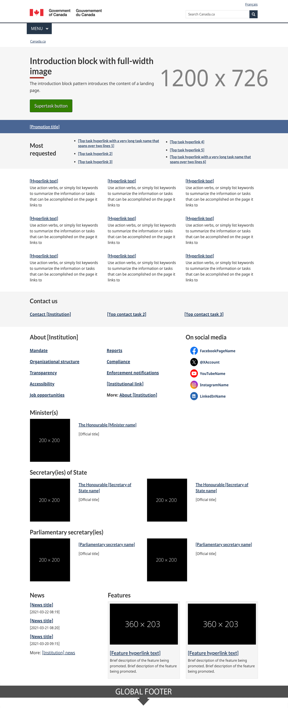

<strong>Last updated</strong>: {{ page.dateModified }}

This is the template for the landing page of each Government of Canada department, agency and organization that has an applied title under the <a href="https://www.tbs-sct.canada.ca/ap/fip-pcim/reg-eng.asp">Federal Identity Program (FIP) registry</a>.

<section>
    <h2>On this page</h2>
    <ul>
        <li><a href="#use">When to use</a></li>
        <li><a href="#avoid">What to avoid</a></li>
        <li><a href="#design">Content and design</a></li>
        <li><a href="#implement">How to implement</a></li>
        <li><a href="#research">Research and rationale</a></li>
        <li><a href="#latest">Latest changes</a></li>
    </ul>
</section>
<section>
    <h2 id="use">When to use</h2>
    
The purpose of this page is to help people find information and services with a focus on top tasks.

    
It should also allow people to find additional content, including:

    <ul>
        <li>mandate and organizational structure</li>
        <li>contact information</li>
        <li>news and promotions</li>
        <li>reports and publications</li>
    </ul>
</section>
<section>
    <h2 id="avoid">What to avoid</h2>
    
Don't use this template unless your department, agency or organization appears on the <a href="https://www.tbs-sct.canada.ca/ap/fip-pcim/reg-eng.asp">FIP registry</a>.

</section>
<section>
    <h2 id="design">Content and design</h2>
    
The institutional landing page is composed of several patterns:

   

  

    

      <table class="table table-striped" id="ilp-01" aria-live="polite">
        <caption class="wb-inv">
        Content and design patterns for Institutional Landing Page
        </caption>
        <thead>
          <tr>
            <th class="col-md-3">Pattern</th>
            <th class="col-md-7">Institutional landing page guidance guidance</th>
            <th class="col-md-2 text-center">Required</th>
          </tr>
        </thead>
        <tbody>
          <tr>
            <td><a href="#">Introduction block</a></td>
            <td>
Use the applied title of the institution (see <a href="https://www.tbs-sct.gc.ca/hgw-cgf/oversight-surveillance/communications/fip-pcim/reg-eng.asp">Registry of Applied Titles</a>).

              
The description should be a very brief summary of what the institution does.
</td>
            <td class="text-center"> Required</td>
          </tr>
          <tr>
            <td><a href="#">Super task button</a></td>
            <td>
Only include a super task button if there is a specific task that has at least a third of the clickthrough on the institution's home page.
</td>
            <td class="text-center">Optional</td>
          </tr>
          <tr>
            <td><a href="#">Featured link</a></td>
            <td>
??????.
</td>
            <td class="text-center">Optional</td>
          </tr>
          <tr>
            <td><a href="#">Most requested</a></td>
            <td>
Features institution-specific top tasks.

              
If any one of the institution's top tasks are already included as a direct link under Services and information, do not duplicate them here.
</td>
            <td class="text-center"> Required</td>
          </tr>
          <tr>
            <td><a href="#">Services and information</a></td>
            <td>
The services and information pattern points to the top-level categories of your organization’s information architecture.
</td>
            <td class="text-center"> Required</td>
          </tr>
          <tr>
            <td><a href="#">Contact us band</a></td>
            <td>
The first link should be the main contact for your institution. You should limit the band to three contact links.
</td>
            <td class="text-center"> Required</td>
          </tr>
          <tr>
            <td><a href="#">About the institution</a></td>
            <td>No specific guidance related to the institutional landing page. Follow the pattern.</td>
            <td class="text-center"> Required</td>
          </tr>
          <tr>
            <td><a href="#">Social media channels</a></td>
            <td>No specific guidance related to the institutional landing page.  Follow the pattern.</td>
            <td class="text-center">Optional</td>
          </tr>
          <tr>
            <td><a href="#">Minister or institutional head</a></td>
            <td>No specific guidance related to the institutional landing page. Follow the pattern.</td>
            <td class="text-center"> Required</td>
          </tr>
          <tr>
            <td>Flexible space:
            <ul>
            <li><a href="">Latest news</a></li>
            <lu><a href="">context-specific features</a></li>
            </ul>
            </td>
            <td>
The bottom portion of the page above the footer is considered a flexible space where departments may add content of their choosing.

              
The use of this space is optional and the default patterns are the latest news and context-specific features.
</td>
            <td class="text-center">Optional</td>
          </tr>
        </tbody>
      </table>
    

  

    <h3>Visual example</h3>
      

        <figure class="mrgn-tp-md mrgn-bttm-lg">
            <figcaption><b>Institutional landing page - large screen</b></figcaption>
            
            

                
Image description: institutional landing page - large screen 

                
At the top of the page is an introduction block which includes an h1 titled [Institution name]. It is underlined with a short thick red line. Below the heading is a short description of the institution’s mandate.

                
Following the introduction block there is a supertask button which is a green rectangle with the words Super task button [optional].

                
Below this is the featured link pattern. It is contained within a horizontal blue band that stretches the entire length of the screen. Within the band is white, underlined text that reads: Featured link [optional].

                
The next item on the page is the most requested pattern. It is contained within a light grey band that stretches the entire length of the screen. Within the band are the words Most requested in black text. This is followed by two columns of links. Each column contains three links in a bulleted list. The placeholder text for each link is [Top task hyperlink].

                
Below this is the services and information pattern. It is composed of nine separate doormats displayed across three columns and three rows. Each doormat has a linked placeholder heading that says [Hyperlink text]. Below the heading there is a placeholder description which contains the following instructions: Use action verbs, or simply list keywords to summarize the information or tasks that can be accomplished on the page it links to.

                
The next item on the page is the contact us pattern. It consists of a horizontal light grey band with a Contact us heading followed by three links in a single row. The first link is Contact [Institution], the following links are placeholders for top contact tasks. 

                
The contact us band is followed by the about the institution pattern on the left and the social media channels pattern on the right. The about the institution links appear in a section with the heading “About the [Institution]”.  The design organizes bolded links in a bulleted list that spans across two columns. The first column has:

                <ul>
                  <li>Mandate</li>
                  <li>Organizational structure</li>
                  <li>Transparency</li>
                  <li>Accessibility</li>
                </ul>
                
The second column has:

                  <ul>
                  <li>Reports</li>
                  <li>Compliance</li>
                  <li>Enforcements notifications</li>
                  <li>[Institutional link]</li>
                  <li>More: About the [institution] (Note: “more” is not linked) </li>
                </ul>
                
The social media channels pattern begins with the heading “On social media”.  Below the heading, is a vertical list with associated icons and labels:

                <ul>
                <li>Facebook icon followed by the placeholder text FacebookPageName</li>
                <li>Twitter icon followed by the placeholder text @TwitterAccount</li>
                <li>Youtube icon followed by the placeholder text  YouTubeName</li>
                <li>Instagram icon followed by the placeholder text InstagramName</li>
                <li>LinkedIn icon followed by the placeholder text LinkedInName</li>
                </ul>
                
The next item that appears on the page is the minister or institutional head pattern.  The pattern appears in 2 columns with the heading “Minister(s)”.

                
The first column presents a placeholder for an institutional head’s image on the left. The dimensions for the image are 200px x 250px. Information on the right includes:

                <ul>
                <li>The Honourable [Minister name] (link)</li>
                <li>[Official title] (text)</li>
                <li>List item: Mandate letter [optional] (link)</li>
                <li>List item: Briefing book [optional] (link)</li>
                </ul>
                
The second column presents a placeholder for an institutional head’s image on the left.  The dimensions for the image are 200px x 250px. Information on the right includes:

                <ul>
                <li>The Honourable [Minister name] (link)</li>
                <li>[Official title] (text)</li>
                <li>List item: Mandate letter [optional - single item] (link)</li>
                </ul>
                
Below this pattern is the latest news pattern on the left and context-specific features pattern on the right. The latest news pattern has a heading that reads “News” followed by three groupings of text. Each grouping has bold, linked placeholder text that reads [News title] followed by placeholder text for the date on a new line. The date format displayed is YYYY-MM-DD HH:MM. After the three groupings of text there is another line of text that reads “More: [Institution] news”. The words “[Institution] news” are linked.

                
The context-specific features pattern is composed of a heading titled “Features” followed by two feature placeholders in a horizontal row. Each have an image placeholder surrounded by a light grey background. Within the image placeholder are the prescribed image dimensions: 360px x 203px. Below each image placeholder on the grey background is a placeholder link that reads [Feature hyperlink text]. Underneath is the following placeholder text: Brief description of the feature being promoted. 

            

        </figure>
    

      

        <figure class="mrgn-tp-md mrgn-bttm-lg">
            <figcaption><b>Institutional landing page - small screen</b></figcaption>
            
            

                
Image description: institutional landing page - small screen

                
At the top of the page is an introduction block which includes an h1 titled [Institution name]. It is underlined with a short thick red line. Below the heading is a short description of the institution’s mandate.

                
Following the introduction block there is a supertask button which is a green rectangle with the words Super task button [optional]. 

                
Below this is the featured link pattern. It is contained within a horizontal blue band that stretches the entire length of the screen. Within the band is white, underlined text that reads: Featured link [optional].

                
The next item on the page is the most requested pattern. It is contained within a light grey band that stretches the entire length of the screen. Within the band are the words Most requested in black text. This is followed by a single list of links in a bulleted list. The placeholder text for each link is [Top task hyperlink].

                
Below this is the services and information pattern. It is composed of nine separate doormats that are vertically stacked on each other. Each doormat has linked placeholder headings that say [Hyperlink text]. Below the headings there are placeholder descriptions which contain the following instructions: Use action verbs, or simply list keywords to summarize the information or tasks that can be accomplished on the page it links to. 

                
The next item on the page is the contact us pattern. It is contained within a light grey band that stretches the entire length of the screen. There is a “Contact us” heading followed by three links in a vertical row. The first link is Contact [Institution], the following links are placeholders for top contact tasks.

                
The contact us band is followed by the about the institution pattern. It consists of a  heading “About the [Institution]”. Followed by nine bolded links: 

                <ul>
                  <li>Mandate</li>
                  <li>Organizational structure</li>
                  <li>Transparency</li>
                  <li>Accessibility</li>
                  <li>Reports</li>
                  <li>Compliance</li>
                  <li>Enforcements notifications</li>
                  <li>[Institutional link]</li>
                  <li>More: About the [institution] (Note: “more” is not linked) </li>
                </ul>
                
Below the about the institution pattern is the social media channels pattern. It begins with the heading “On social media”.  Below the heading, is a vertical list with associated icons and labels:

                <ul>
                <li>Facebook icon followed by the placeholder text FacebookPageName</li>
                <li>Twitter icon followed by the placeholder text @TwitterAccount</li>
                <li>Youtube icon followed by the placeholder text  YouTubeName</li>
                <li>Instagram icon followed by the placeholder text InstagramName</li>
                <li>LinkedIn icon followed by the placeholder text LinkedInName</li>
                </ul>
                
The next item that appears on the page is the Minister or institutional head pattern.  The pattern begins with the heading “Minister(s)” and is followed by two items.

                
The first item begins with a linked heading “The Honourable [Minister name]” followed by an image placeholder with the prescribed dimensions of 200px x 250px.  Below the image is the text [Official title]. This is followed by a bulleted list with the following two linked items:

                <ul>
                <li>Mandate letter [optional] (link)</li>
                <li>Briefing book [optional] (link)</li>
                </ul>
                
The second item begins with a linked heading “The Honourable [Minister name] followed by an image placeholder with the prescribed dimensions of 200px x 250px.  Below the image is the text [Official title]. This is followed by the following linked item:

                <ul>
                <li>List item: Mandate letter [optional - single item] (link)</li>
                </ul>
                
Below this pattern is the latest news pattern. It has a heading that reads “News” followed by three groupings of text. Each grouping has bold, linked placeholder text that reads [News title] followed by placeholder text for the date on a new line. The date format displayed is YYYY-MM-DD HH:MM. After the three groupings of text there is another line of text that reads “More: [Institution] news”. The words “[Institution] news” are linked.

                
The next item on the page is the context-specific features pattern. It is composed of a heading titled “Features” followed by two items. Each item has an image placeholder surrounded by a light grey background. Within the image placeholder are the prescribed image dimensions: 360px x 203px. Below each image placeholder on the grey background is a placeholder link that reads [Feature hyperlink text]. Underneath is the following placeholder text: Brief description of the feature being promoted.

            

        </figure>
    

</section>
<section>
    <h2 id="implement">How to implement</h2>
    
Find working examples and code for implementing the contact us band pattern.

    <h3>GCweb (WET) theme implementation reference</h3>
    
The implementation reference includes how to configure each element of the institutional landing page.

    <ul>
        <li><a href="#">Institutional landing page template - GCWeb</a></li>
    </ul>
    <h3>Implementations</h3>
    
Determine what best suits the type of page you're creating.

    

        

            

                

                    

                        
<strong>GC-AEM</strong>

                        
For the Government of Canada Adobe Experience Manager (AEM):

                        <ul>
                            <li><a href="https://www.gcpedia.gc.ca/wiki/AEM_GC-specific_Documentation_6.5">AEM/Managed Web Service documentation (GCPedia link - only available on the Government of Canada network)</a></li>
                        </ul>
                    

                    

                        
<strong>CDTS</strong>

                        
For the Centrally Deployed Templates Solution (CDTS):

                        <ul>
                            <li><a href="https://cenw-wscoe.github.io/sgdc-cdts/docs/index-en.html">CDTS documentation</a></li>
                        </ul>
                    

                    

                        
<strong>Drupal WxT</strong>

                        
For Drupal WxT:

                        <ul>
                            <li><a href="https://drupalwxt.github.io/">Drupal WxT documentation</a></li>
                        </ul>
                    

                

            

        

    

</section>
<section>
    <h2 id="research">Research and rationale</h2>
    
Consult resarch findings and policy rationale.

    <h3>Research findings</h3>
    
We validated the institutional landing page during two optimization projects with the Canada Revenue Agency. We found that this design was useful for providing access to the top tasks for an institution while also giving users access to corporate information about the organization.

    <h3>Policy rationale</h3>
    
This template is a mandatory element of the Content and Information Architecture Specification.

    <ul>
        <li><a href="https://www.canada.ca/en/treasury-board-secretariat/services/government-communications/canada-content-information-architecture-specification/mandatory-elements.html">Mandatory elements of the design system</a></li>
    </ul>
</section>
<section>
    <h2 id="latest">Latest changes</h2>
    <dl class="dl-horizontal">
     <dt>
            <time datetime="2023-10-xx" class="link-muted">2023-10-xx</time>
        </dt>
        <dd>
        <ul>
            <li>Moved template from beta to stable</li>
            <li>Updated the guidance to include content and design specifications, visual examples and implementation guidance</li>
        </ul>
        </dd>
    <dt>
            <time datetime="2020-07-23" class="link-muted">2020-07-23</time>
        </dt>
        <dd>
        <ul>
            <li>Front-end code review, creating changes to overall HTML/CSS</li>
            <li>Remove opacity from featured link for contrast</li>
            <li>Improvements to background image layout</li>
        </ul>
        </dd>
       <dt>
            <time datetime="2020-07-13" class="link-muted">2020-07-13</time>
        </dt>
        <dd>
        <ul>
            <li>Changes to fix accessibility issues</li>
            <li>Most requested pattern updated to bullets</li>
            <li>Changes to doormat columns in tablet view</li>
        </ul>
        </dd>
       <dt>
            <time datetime="2020-03-05" class="link-muted">2020-03-05</time>
        </dt>
        <dd>added an optional CSS class to hide the top image in tablet view</dd>
        <dt>
            <time datetime="2019-11-28" class="link-muted">2019-11-28</time>
        </dt>
        <dd> a new beta version of this template was added</dd>
    </dl>
</section>
