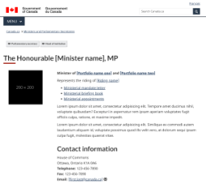

  

    <ul class="list-inline small mrgn-bttm-sm" id="list-inline-desktop-only" style="line-height:1.65em">
    <li class="mrgn-rght-lg">
      Mandatory
    </li>
    <li class="mrgn-rght-lg">Last updated: {{ page.dateModified }}</li>
    </ul>
  

A ministerial profile page is the landing page for ministers, secretaries of State, parliamentary secretaries and heads of quasi-judicial organizations. It provides a consistent biographical overview and clarifies their roles and responsibilities.

<section>
  <h2>On this page</h2>
  <ul>
    <li>
    <a href="#when">When to use</a>
    </li>
    <li>
    <a href="#avoid">What to avoid</a>
    </li>
    <li>
    <a href="#how">How to implement</a>
    </li>
    <li>
    <a href="#latest">Latest changes</a>
    </li>
  </ul>
</section>

<section>
  <h2 id="when">When to use</h2>
  
Use the ministerial profile template to provide a consistent presentation for information about:

  <ul>
    <li>ministers of the Government of Canada</li>
    <li>secretaries of State included in the "Secretaries of State" tab of the <a href="https://www.canada.ca/en/government/ministers.html">ministers index</a></li>
    <li>parliamentary secretaries included in the “Parliamentary Secretaries” tab of the <a href="https://www.canada.ca/en/government/ministers.html">ministers index</a></li>
    <li>heads of quasi-judicial arm’s-length institutions</li>
  </ul>
</section>

<section>
  <h2 id="avoid">What to avoid</h2>
  
Don't use this template more than once for each minister, secretary of State, parliamentary secretary or head of organization.

</section>

<section>
  <h2 id="how">How to implement</h2>
  
Use this template and follow the guidance:

  

    

    

      

      

        
      

      

        
Ministerial profile page

        
<a class="btn btn-call-to-action" href="../coded-layout/ministerial-profile-pages.html">Template with guidance</a>

      

      

    

    

  

</section>
<section>
  <h2 id="changes">Latest changes</h2>
  <dl class="dl-horizontal">
    <dt>
      <time>{{ page.dateModified }}</time>
    </dt>
    <dd>
      <ul>
        <li>updated the guidance to include square image specifications, visual examples and implementation guidance</li>
      </ul>
    </dd>
    <dt>
      <time>2025-06-11</time>
    </dt>
    <dd>
      <ul>
        <li>added the new role of secretary of State</li>
      </ul>
    </dd>
    <dt>
      <time>2021-09-27</time>
    </dt>
    <dd>
      <ul>
        <li>replaced Latest, Recent announcements, and Gallery with a flexible Features section</li>
        <li>removed the social media feed</li>
        <li>simplified and streamlined the guidance</li>
        <li>clarified how to display ministers, parliamentary secretaries and heads of organizations</li>
      </ul>
    </dd>
  </dl>
</section>
