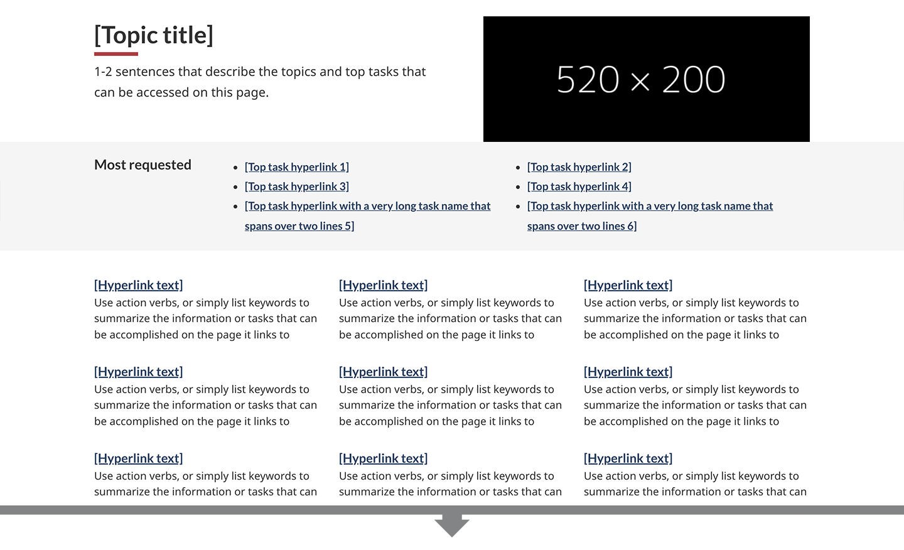
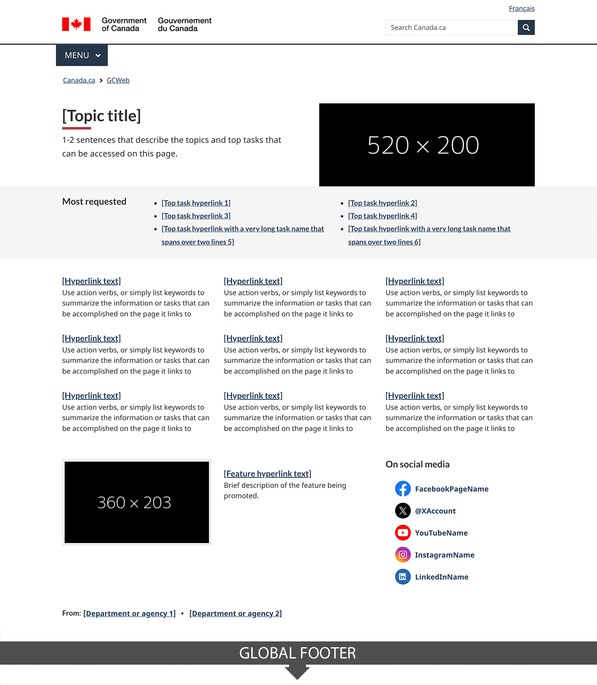
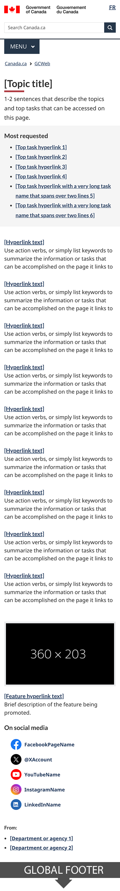

 
  Mandatory
 

<strong>Last updated</strong>: {{ page.dateModified }}

Topic pages provide access to topics and destination pages that support task completion.

<section>
 <h2>On this page</h2>
    <ul>
        <li><a href="#use">When to use</a></li>
        <li><a href="#avoid">What to avoid</a></li>
        <li><a href="#design">Content and design</a></li>
        <li><a href="#implement">How to implement</a></li>
        <li><a href="#research">Policy rationale</a></li>
        <li><a href="#changes">Latest changes</a></li>
    </ul>
</section>
<section>
     <h2 id="use">When to use</h2>
     
This template must be used for the first 2 levels of topics of each theme in the <a href="https://www.canada.ca/en/government/about/design-system/topic-tree-content-types.html#tree">Canada.ca topic tree</a>.

     
It is optional for lower-level topics.

</section>
<section>
     <h2 id="avoid">What to avoid</h2>
     
Pages where people can initiate a task should be considered destination content, and should not use the topic page template.

     
The topic page template should not be used for promotion; instead, use <a href="https://design.canada.ca/recommended-templates/campaign-pages.html">Campaign pages</a>.

</section>
<section>
     <h2 id="design">Content and design</h2>
     
Find content and design specifications and visual examples.

     
The topic page template is composed of several patterns:

     

            

                

                    <table class="table table-striped" id="ilp-01" aria-live="polite">
                        <caption class="wb-inv">
                            Content and design patterns for the topic page
                        </caption>
                        <thead>
                            <tr>
                                <th class="col-md-3">Pattern</th>
                                <th class="col-md-7">Topic page guidance</th>
                                <th class="col-md-2 text-center">Required</th>
                            </tr>
                        </thead>
                        <tbody>
                            <tr>
                                <td><a href="../common-design-patterns/intro-block.html">Introduction block</a></td>
                                <td>
                                    
Follow the pattern.

                                    
Image is optional. If including an image, use the half-width image dimensions.

                                </td>
                                <td class="text-center"> Required</td>
                            </tr>
                            <tr>
                                <td><a href="../common-design-patterns/most-requested.html">Most requested</a></td>
                                <td>
                                    
Features top tasks.

                                    
This component provides shortcuts to the topic’s top tasks. However, if all of the topic's top tasks are already included as direct links under Services and information, do not duplicate them here. In that case, you can choose not to include this component.

                                </td>
                               <td class="text-center">Optional</td>
                            </tr>
                            <tr>
                                <td><a href="../common-design-patterns/services-information.html">Services and information</a></td>
                                <td>
                                
Prioritize content and navigation by presenting the most visited information and services first.

                                
The "Services and information" heading in this section should have the wb-inv class, so it is not visible, but is still present for the semantic outline and for screen readers.

                                </td>
                                <td class="text-center"> Required</td>
                            </tr>
                            <tr>
                                <td>
                                    Flexible space: 
                                    <ul>
                                        <li><a href="../common-design-patterns/feature-tiles.html">Context-specific features</a></li>
                                        <li><a href="../common-design-patterns/social-media-channels.html">Social media channels</a></li>
                                        <li><a href="../common-design-patterns/contributors.html">Contributors</a></li>
                                    </ul>
                                </td>
                                <td>
                                    
The bottom portion of the page above the footer is considered a flexible space.

                                    
The use of this space is optional and the patterns which can be used in this space are the social media channels, contributors and a single context-specific feature.

                                </td>
                                <td class="text-center">Optional</td>
                            </tr>
                        </tbody>
                    </table>
                

            

        

 <h3>Visual examples</h3>
        

            <figure class="mrgn-tp-md mrgn-bttm-lg">
                <figcaption><b>Topic page - large screen</b></figcaption>
                
                

                    
Image description: topic page - large screen

                    
The topic page begins with an introduction block. This has the [Topic title] in the standard Canada.ca h1 style. It is followed by 1-2 sentences that describe the topics and top tasks that can be accessed on the page. To the right is an image with dimensions of 520px x 200px.

                    
Underneath the introduction block is a most requested band with two columns of links (three in each row). The links lead to top tasks.

                    
Below the most requested band is the services and information pattern. It is three columns, with three topics in each column. The topic begins with a hyperlinked title and then is followed by a description. The instructions for the description reads: Use action verbs, or simply list keywords to summarize the information or tasks that can be accomplished on the page it links to.

                    
Underneath the services and information pattern is a contextual feature. It has an image positioned to the left, with image dimensions of 360px x 203px, and to the right of the image is a linked title for the feature followed by a brief description of the feature being promoted.

                    
To the right of the contextual feature is the social media channels component. Its heading is “On social media”. It features five icons: Facebook, X, YouTube, Instagram, LinkedIn. Beside each icon is linked text for the account name.

                    
At the bottom of the page, just above the date modified field and the footer, there is the contributors pattern. It is left-aligned. The text is “From:” it is then followed by linked text labeled [Department or agency], presented horizontally.
 
               

               </figure>
        

                

            <figure class="mrgn-tp-md mrgn-bttm-lg">
                <figcaption><b>Topic page - small screen</b></figcaption>
                
                

                    
Image description: topic page - small screen

                    
The topic page begins with an introduction block. This has the [Topic title] in the standard Canada.ca h1 style. It is followed by 1-2 sentences that describe the topics and top tasks that can be accessed on the page.

                    
Underneath the introduction block is a most requested band with one column of links (six in total). The links lead to top tasks. 

                    
Below the most requested band is the services and information pattern. It is one column, with nine topics in total. The topic begins with a hyperlinked title and then is followed by a description. The instructions for the description reads: Use action verbs, or simply list keywords to summarize the information or tasks that can be accomplished on the page it links to.

                    
Underneath the services and information pattern is a contextual feature. The image for the feature appears first, with image dimensions of 360px x 203px, and below the image is a linked title for the feature followed by a brief description of the feature being promoted.

                    
Below the contextual feature is the social media channels component. Its heading is “On social media”. It features five icons: Facebook, X, YouTube, Instagram, LinkedIn. Beside each icon is linked text for the account name.

                    
At the bottom of the page, just above the date modified field and the footer, there is the contributors pattern. It is left-aligned. The text is “From:” it is then followed by linked text labeled [Department or agency], presented vertically.
 
               

               </figure>
        

<section>
<section>
     <h2 id="implement">How to implement</h2>
        
Find working examples and code for implementing the topic page template.

        <h3>GCweb (WET) theme implementation reference</h3>
        
The implementation reference includes how to configure the topic page template.

        <ul>
            <li><a href="https://wet-boew.github.io/GCWeb/templates/topic/topic-doc-en.html">Topic page documentation - GCWeb</a></li>
        </ul>
        <h3>Implementations</h3>
        
Determine what best suits the type of page you're creating.

        

            

                

                    

                        

                            
<strong>GC-AEM</strong>

                            
For the Government of Canada Adobe Experience Manager (AEM):

                            <ul>
                                <li>
                                    <a href="https://www.gcpedia.gc.ca/wiki/AEM_GC-specific_Documentation_6.5">
                                        AEM/Managed Web Service documentation (GCPedia link - only available on the Government of Canada network)
                                    </a>
                                </li>
                            </ul>
                        

                        

                            
<strong>CDTS</strong>

                            
For the Centrally Deployed Templates Solution (CDTS):

                            <ul>
                                <li><a href="https://cenw-wscoe.github.io/sgdc-cdts/docs/index-en.html">CDTS documentation</a></li>
                            </ul>
                        

                        

                            
<strong>Drupal WxT</strong>

                            
For Drupal WxT:

                            <ul>
                                <li><a href="https://drupalwxt.github.io/">Drupal WxT documentation</a></li>
                            </ul>
                        

                    

                

            

        

</section>
<section>
     <h2 id="research">Policy rationale</h2>
     
This template is a mandatory element of the Canada.ca Specifications.

     <ul>
          <li><a href="https://design.canada.ca/specifications/mandatory-elements.html">Mandatory elements of the design system</a></li>
     </ul>
</section>
 <h2 id="changes">
  Latest changes
 </h2>
 

  <strong>
   2024-09-24:
  </strong>
 

 <ul>
  <li>
   Moved template from beta to stable
  </li>
  <li>
   Updated the guidance to include content and design specifications, visual examples and implementation guidance
  </li>
 </ul>
 

  <strong>
   2020-07-10:
  </strong>
 

 <ul>
  <li>
   Changes to doormat columns in tablet view
  </li>
  <li>
   Clarify social media account guidance
  </li>
 </ul>
 

  <strong>
   2020-06-30:
  </strong>
  A new beta version of this template was added
 

</section>
