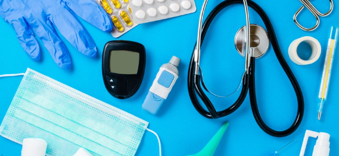
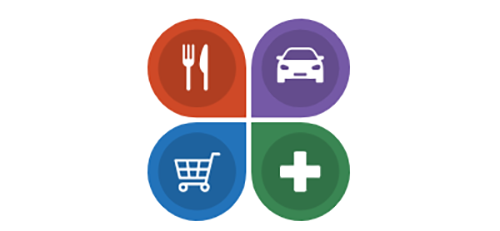

<h1 property="name" id="wb-cont" property="name headline" dir="ltr">
Working with partners to improve task success on Canada.ca
</h1>

The Digital Transformation Office works with federal institutions to make Canada.ca content easier to find and understand.

Our method includes:

<ul>
  <li>setting concrete usability targets</li>
  <li>usability testing on specific Government of Canada Services</li>
  <li>co-creating prototypes</li>
</ul>

We work collaboratively to refine prototypes until they achieve at least a 20% improvement in task success.  This standard for improvement means people will spend less time looking for the answers they need from the Government of Canada.

<h2>Projects with our partners</h2>

  

    
<a href="{{ site.url }}/partners/project-01.html" aria-label="Orientation and wayfinding">
      

        <h3>Orientation and wayfinding</h3>
        
<strong>Purpose</strong>: explore navigation and design options to help people find and use the services they need.

        
<strong>Partners</strong>: Agriculture and Agri-Food Canada, Immigration, Refugees and Citizenship Canada, Veterans Affairs Canada and Statistics Canada

      

      </a>

  

  

    
<a href="{{ site.url }}/partners/project-02.html" aria-label="Medical devices">
      

        <h3>Medical devices</h3>
        
<strong>Purpose</strong>: make it easier for stakeholders subject to Canada’s medical device regulations find and understand regulatory requirements.

        
<strong>Partner</strong>: Health Canada

      

      </a>

  

  

    
<a href="{{ site.url }}/partners/project-03.html" aria-label="Electronic Procurement Solution">
      

        <h3>Electronic Procurement Solution</h3>
        
<strong>Purpose</strong>: make it easier for Canadian businesses to find and understand government business opportunities and guidance.

        
<strong>Partners</strong>: Public Services and Procurement Canada (PSPC)

      

      </a>

  

  

    
<a href="{{ site.url }}/partners/project-04.html" aria-label="Pay for the public service">
      

        <h3>Pay for the public service</h3>
        
<strong>Purpose</strong>: make it easier for public servants to find and understand their pay information.

        
<strong>Partner</strong>: Public Services and Procurement Canada

      

      </a>

  

  

    
<a href="{{ site.url }}/partners/project-05.html" aria-label="Recalls and safety alerts search">
      

        <h3>Recalls and safety alerts search</h3>
        
<strong>Purpose</strong>: help Health Canada prepare for the implementation of a transformed Recalls and Safety Alerts Management System (RSAMS) with a new search interface.

        
<strong>Partners</strong>: Health Canada and Transport Canada

      

      </a>

  

  

    
<a href="{{ site.url }}/partners/project-06.html" aria-label="Canada Child Benefit">
      

        <h3>Canada Child Benefit</h3>
        
<strong>Purpose</strong>: make it easier for Canadians to find and understand information related to the Canada Child Benefit.

        
<strong>Partners</strong>: Canada Revenue Agency

      

      </a>

  

