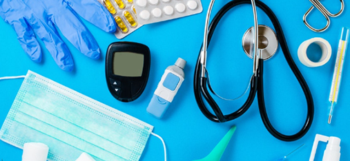

<h1 property="name" id="wb-cont" property="name headline" dir="ltr">

Working with partners to improve task success on Canada.ca
</h1>

The Digital Transformation Office works with federal institutions to make Canada.ca content easier to find and understand.

Our method includes:

<ul>
  <li>setting concrete usability targets</li>
  <li>usability testing on specific Government of Canada Services</li>
  <li>co-creating prototypes</li>
</ul>

We work collaboratively to refine prototypes until they achieve at least a 20% improvement in task success.

<h2>Projects with our partners</h2>

  

    
<a href="{{ site.url }}/partners/project-01.html" aria-label="Orientation and wayfinding">
      

        <h3>Orientation and wayfinding</h3>
        
<strong>Purpose</strong>: explore navigation and design options to help people find services.

        
<strong>Partners</strong>:
        <ul>
          <li>Agriculture and Agri-Food Canada</li>
          <li>Immigration, Refugees and Citizenship Canada</li>
          <li>Veterans Affairs Canada and Statistics Canada</li>
        </ul>
      

      </a>

  

  

    
<a href="{{ site.url }}/partners/project-02.html" aria-label="Medical devices">
      

        <h3>Medical devices</h3>
        
<strong>Purpose</strong>: make it easier for stakeholders subject to Canada’s medical device regulations find and understand regulatory requirements.

        
<strong>Partner</strong>: Health Canada

      

      </a>

  

  

    
<a href="{{ site.url }}/partners/project-03.html" aria-label="Electronic Procurement Solution">
      

        <h3>Electronic Procurement Solution</h3>
        
<strong>Purpose</strong>: make it easier for Canadian businesses to find and understand government business opportunities and guidance.

        
<strong>Partners</strong>: Public Services; Procurement Canada (PSPC)

      

      </a>

  

  

    
<a href="{{ site.url }}/partners/project-04.html" aria-label="Pay for the public service">
      

        <h3>Pay for the public service</h3>
        
<strong>Purpose</strong>: make it easier for public servants to find and understand their pay information.

        
<strong>Partner</strong>: Public Services; Procurement Canada

      

      </a>

  

  

    
<a href="{{ site.url }}/partners/project-05.html" aria-label="Recalls and safety alerts search">
      

        <h3>Recalls and safety alerts search</h3>
        
<strong>Purpose</strong>: help Health Canada prepare for the implementation of a transformed Recalls and Safety Alerts Management System (RSAMS) with a new search interface.

        
<strong>Partners</strong>: Health Canada; Transport Canada

      

      </a>

  

  

    
<a href="{{ site.url }}/partners/project-06.html" aria-label="Canada Child Benefit">
      

        <h3>Canada Child Benefit</h3>
        
<strong>Purpose</strong>: make it easier for Canadians to find and understand information related to the Canada Child Benefit.

        
<strong>Partner</strong>: Canada Revenue Agency

      

      </a>

  

  

    
<a href="{{ site.url }}/partners/project-07.html" aria-label="Travel advice and advisories">
      

        <h3>Travel advice and advisories</h3>
        
<strong>Purpose</strong>: make it easier for Canadians to find and understand travel advice and guidance from the Government of Canada

        
<strong>Partners</strong>: Global Affairs Canada; Immigration, Refugees and Citizenship Canada; Public Health Agency of Canada; Health Canada; Canada Border Services Agency

      

      </a>

  

  

    
<a href="{{ site.url }}/partners/project-08.html" aria-label="Contact the CRA">
      

        <h3>Contact the CRA</h3>
        
<strong>Purpose</strong>: make it easier for Canadians to find the correct phone number or mailing address for specific services related to the CRA.

        
<strong>Partner</strong>: Canada Revenue Agency

      

      </a>

  

  

    
<a href="{{ site.url }}/partners/project-09.html" aria-label="EI maternity and parental benefits">
      

        <h3>EI maternity and parental benefits</h3>
        
<strong>Purpose</strong>: make it easier for Canadian parents to understand and apply for maternity and parental benefits.

        
<strong>Partner</strong>: Service Canada, Employment and Social Development Canada

      

      </a>

  

  

    
<a href="{{ site.url }}/partners/project-10.html" aria-label="Student loans and grants">
      

        <h3>Student loans and grants</h3>
        
<strong>Purpose</strong>: make it easier for Canadian students applying, managing and accessing details of their student loans and grants.

        
<strong>Partner</strong>: Employment and Social Development Canada

      

      </a>

  

  

    
<a href="{{ site.url }}/partners/project-11.html" aria-label="Find a job">
      

        <h3>Find a job</h3>
        
<strong>Purpose</strong>: make it easier for Canadians to find government jobs on Canada.ca.

        
<strong>Partners</strong>: Employment and Social Development Canada; Public Service Canada

      

      </a>

  

  

    
<a href="{{ site.url }}/partners/project-12.html" aria-label="Prepare for the citizenship test">
      

        <h3>Prepare for the citizenship test</h3>
        
<strong>Purpose</strong>: make it easier for applicants to study for the Canadian citizenship test.

        
<strong>Partners</strong>: Immigration, Refugees and Citizenship Canada

      

      </a>

  

  

    
<a href="{{ site.url }}/partners/project-13.html" aria-label="Business account maintenance">
      

        <h3>Business account maintenance</h3>
        
<strong>Purpose</strong>: make it easier for Canadians to register and manage their CRA business accounts.

        
<strong>Partner</strong>: Canada Revenue Agency

      

      </a>

  

  

    
<a href="{{ site.url }}/partners/project-14.html" aria-label="Recalls and safety alerts">
      

        <h3>Recalls and safety alerts</h3>
        
<strong>Purpose</strong>: make it easier for Canadians to find and understand both recalls and safety alerts for food, health products, vehicles and car seats.

        
<strong>Partners</strong>: Health Canada; Canadian Food and Safety Inspection Agency; Transport Canada; Environment Canada

      

      </a>

  

  

    
<a href="{{ site.url }}/partners/project-15.html" aria-label="EI special benefits">
      

        <h3>EI special benefits</h3>
        
<strong>Purpose</strong>: make it easier for Canadians to understand eligibility for caregiver benefits.

        
<strong>Partner</strong>: Employment and Social Development Canada

      

      </a>

  

  

    
<a href="{{ site.url }}/partners/project-16.html" aria-label="GST/HST and payroll">
      

        <h3>GST/HST and payroll</h3>
        
<strong>Purpose</strong>: make it easier for businesses to fulfill their GST/HST and payroll requirements.

        
<strong>Partner</strong>: Canada Revenue Agency

      

      </a>

  

  

    
<a href="{{ site.url }}/partners/project-17.html" aria-label="Disease and immunization information">
      

        <h3>Disease and immunization information</h3>
        
<strong>Purpose</strong>: make it easier for Canadians to interpret immunization guidelines.

        
<strong>Partners</strong>: Health Canada; Global Affairs Canada

      

      </a>

  

  

    
<a href="{{ site.url }}/partners/project-18.html" aria-label="Weather information">
      

        <h3>Weather information</h3>
        
<strong>Purpose</strong>: make it easier for Canadians to understand notifications about dangerous weather conditions.

        
<strong>Partner</strong>: Environment and Climate Change Canada

      

      </a>

  

  

    
<a href="{{ site.url }}/partners/project-20.html" aria-label="Travel documents">
      

        <h3>Travel documents</h3>
        
<strong>Purpose</strong>: help those potential visitors to Canada to clearly understand what documentation is required to enter.

        
<strong>Partner</strong>: Canada Revenue Agency

      

      </a>

  

  

    
<a href="{{ site.url }}/partners/project-19.html" aria-label="Business start-up activities">
      

        <h3>Business start-up activities</h3>
        
<strong>Purpose</strong>: combine information from across departments so that Canadians easily get the whole picture on what the Government of Canada requires when starting a business.

        
<strong>Partner</strong>: Canada Revenue Agency; Innovation, Science and Economic Development Canada

      

      </a>

  

