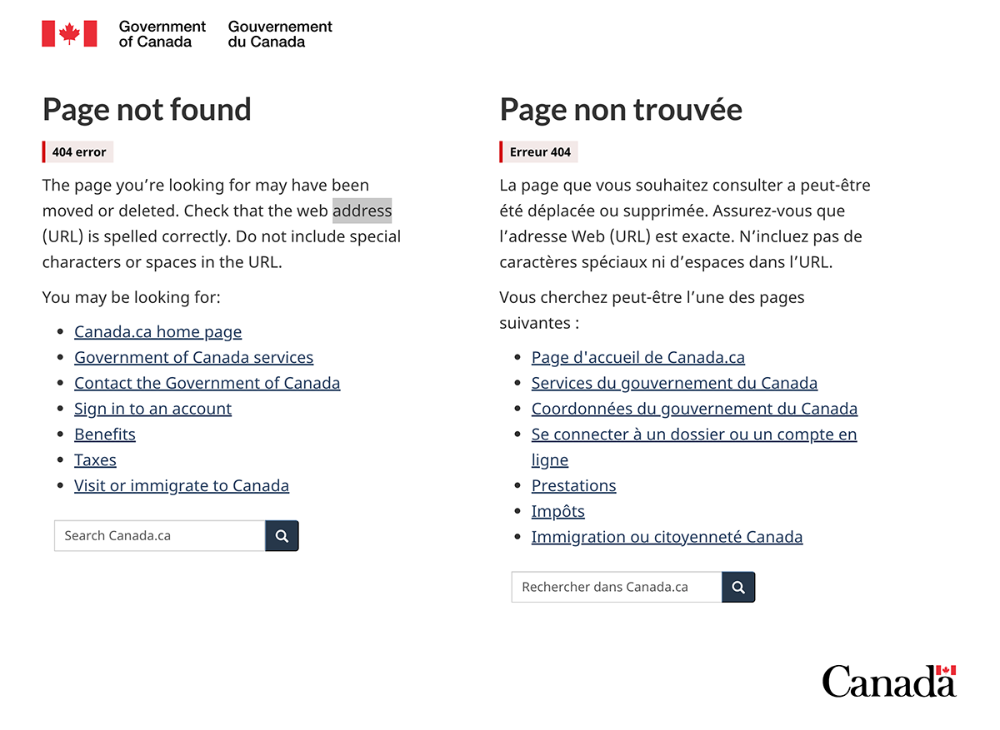
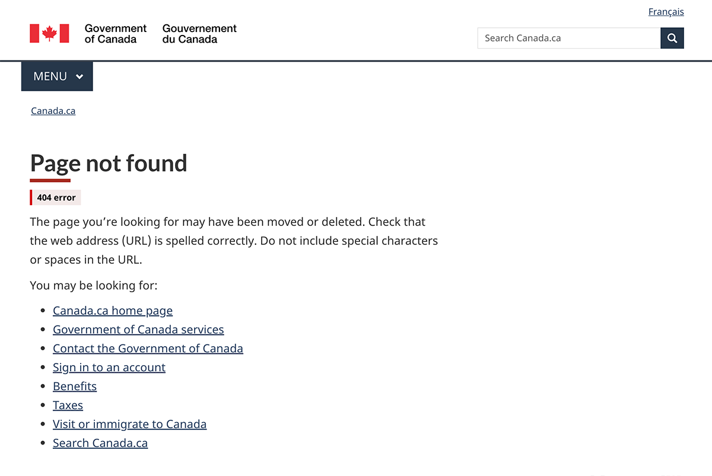

A 404 error is generated when someone tries to access a page that cannot be found.

This 404 error page template provides the user with suggestions for resolving the error and contains links to key sections that may be helpful. There are two versions of this template:

<ul>
    <li>A unilingual page with a language toggle for users whose language preference is known</li>
    <li>A bilingual page for users whose language preference is not known</li>
</ul>

<section>
<h2>On this page</h2>
<ul>
    <li><a href="#use">When to use</a></li>
    <li><a href="#avoid">What to avoid</a></li>
    <li><a href="#design">Content and design</a></li>
    <li><a href="#implement">How to implement</a></li>
</ul>
</section>

<section>
  <h2 id="use">When to use</h2>
  
Use this template to create a standard place for users to go to when encountering a 404 error.

</section>

<section>
  <h2 id="avoid">What to avoid</h2>
      
Don't use this template for any purpose other than indicating a 404 error.

    
Make sure the page includes, at a minimum, one rescue link (for example, the Canada.ca homepage). Do not provide irrelevant links that do not help the user navigate back to Government of Canada web content.

    
For the bilingual version, don't mix the languages within the same content block, paragraph or sentence.

</section>

<section>
    <h2 id="design">Content and design</h2>
    
Find content and design specifications and visual examples.

    <h3>Content specifications</h3>
    
Use "Page not found" for the H1 or page title.

    
Include a sentence stating that the page the user is looking for may have been moved or deleted.

    
Offer tips for what the user can try to resolve the error. This can include the following information:

        <ul>
            <li>Suggest they check the spelling of the web address (URL)</li>
            <li>Explain that they should remove special characters or spaces in the URL</li>
            <li>If it exists, provide a way to report the broken link</li>
        </ul>
    
Include the text "You may be looking for:" followed by a bulleted list of no more than 10 links. At the top of the list include these three common pages on Canada.ca:

        <ul>
            <li><a href="https://www.canada.ca/en.html">Canada.ca home page</a></li>
            <li><a href="https://www.canada.ca/en/services.html">Government of Canada services</a></li>
            <li><a href="https://www.canada.ca/en/contact.html">Contact the Government of Canada</a></li>
        </ul>
    
After those links, you can list some of the most requested pages specific to your institution. Here are some most requested pages on Canada.ca that you can also include:

        <ul>
            <li><a href="https://www.canada.ca/en/government/sign-in-online-account.html">Sign in to an account</a></li>
            <li><a href="https://www.canada.ca/en/services/benefits.html">Benefits</a></li>
            <li><a href="https://www.canada.ca/en/services/taxes.html">Taxes</a></li>
            <li><a href="https://www.canada.ca/en/services/immigration-citizenship.html">Visit or immigrate to Canada</a></li>
        </ul>
    <h4>Additional content specifications for bilingual version</h4>
    
In addition to the content that is laid out in the general specifications, for the bilingual page include two anchor links that will appear above each language when the page resizes for mobile.

    <ul>
        <li>For the link above the English content, use the text "Aller à la version française"</li>
        <li>For the link above the French content, use the text "Go to the English version"</li>
    </ul>
    <h4>Interactions</h4>
    <ul>
        <li>When the user's language preference <b>is known</b>, they should be brought to the 404 error page in that same language</li>
        <li>When the user's language preference is <b>not known</b>, they should be brought to a bilingual 404 error page</li>
    </ul>
    <h3>Design specifications</h3>
    <ul>
        <li>Include a danger label directly below the H1 heading that uses the text "404 error." 
        <ul>
            <li><a href="../common-design-patterns/labels.html#danger">Follow the implementation guidance for a danger label</a>.</li>
        </ul>
        </li>
        <li>For all links, text uses standard Canada.ca styles:
            <ul>
                <li><a href="../styles/typography.html">Typography</a></li>
                <li><a href="../styles/colours.html">Colours</a></li>
            </ul>
        </li>
        <li>You can include an optional search bar below the list of suggested links.
            <ul>
            <li><a href="../common-design-patterns/search-box.html">Follow the guidance for the site search box</a>.</li>
          </ul>
        </li>
    </ul>
    <h4>Additional design specifications for bilingual version</h4>
    
Use the following layouts for the bilingual version:

    <ul>
        <li>Two columns with all English content to the left and all French content to the right in large and medium screens</li>
        <li>A single column with all content stacked in small screens</li>
    </ul>
    
Because language preference isn't known, limit the elements in the header and footer to the following:

    <ul>
        <li>In the global header, include only the Government of Canada signature with a link to the Canada.ca splash page</li>
        <li>In the global footer, include only the Canada wordmark</li>
    </ul>
    <h4>Interactions</h4>
    
When the bilingual version of the page resizes for mobile, the English and French content will be stacked. When the content is stacked, a jump link should appear above each language that allows the user to jump from one language to the other.

    <h3>Visual examples</h3>
    

        <figure class="mrgn-tp-md mrgn-bttm-lg">
            <figcaption><b>Unilingual 404 error page - large screen</b></figcaption>
            
            

                
Image description: unilingual 404 error page - large screen

                
At the top of the page is an H1 titled "Page not found," which is underlined with a short thick red line. Below the H1 is a danger label with the text "404 error."

                
Following the label is a paragraph providing instructions to the user for how to find the page they are looking for.

                
Below the paragraph is the sentence "You may be looking for" with a bulleted list of links under it.

            

        </figure>
    

    

        <figure class="mrgn-tp-md mrgn-bttm-lg">
            <figcaption><b>Bilingual 404 error page - large screen</b></figcaption>
            
            

                
Image description: bilingual 404 error page - large screen

                  
The bilingual version of the 404 error page appears in 2 columns.

                  
The first column has an H2 titled "Page not found." Below the H2 is a danger label with the text "404 error."

                  
Following the label is a paragraph providing instructions to the user for how to find the page they are looking for.

                  
Below the paragraph is the lead-in sentence "You may be looking for:" and under it is a bulleted list of links to most requested pages on Canada.ca.

                  
After the list of links there is a short search bar with placeholder text that says "Search Canada.ca." There is a search button with a magnifying glass icon beside the search bar.

                  
The second column has an H2 titled "Page non trouvée." Below the H2 is a danger label with the text "Erreur 404."

                  
Following the label is a paragraph providing instructions to the user for how to find the page they are looking for.

                  
Below the paragraph is the lead-in sentence "Vous cherchez peut-être l'une des pages suivantes&nbsp;: " and under it is a bulleted list of links to most requested pages on Canada.ca.

                  
After the list of links there is a short search bar with placeholder text that says "Rechercher dans Canada.ca." There is a search button with a magnifying glass icon beside the search bar.

            

        </figure>
    

    

        <figure class="mrgn-tp-md mrgn-bttm-lg">
            <figcaption><b>Bilingual 404 error page - small screen</b></figcaption>
            
            

                
Image description: bilingual 404 error page - small screen

                
The bilingual version of the 404 error page appears in 1 column.

                
At the top of the page is an H2 titled "Page not found." Below the H2 is a danger label with the text "404 error."

                
Following the label is a link that says "Aller à la version française."

                
After the link is a paragraph providing instructions to the user for how to find the page they are looking for.

                
Below the paragraph is the lead-in sentence "You may be looking for:" and under it is a bulleted list of links to most requested pages on Canada.ca.

                
After the list of links there is a short search bar with placeholder text that says "Search Canada.ca." There is a search button with a magnifying glass icon beside the search bar.

                
Next there is a second H2 titled "Page non trouvée." Below this H2 is a danger label with the text "Erreur 404."

                
Following the label is a link that says "Go to the English version."

                
After the link is a paragraph providing instructions to the user for how to find the page they are looking for.

                
Below the paragraph is the lead-in sentence "Vous cherchez peut-être l'une des pages suivantes&nbsp;: " and under it is a bulleted list of links to most requested pages on Canada.ca.

                
After the list of links there is a short search bar with placeholder text that says "Rechercher dans Canada.ca." There is a search button with a magnifying glass icon beside the search bar.

            

        </figure>
    

</section>
<section>
  <h2 id="implement">How to implement</h2>
  
Find working examples and code for implementing the 404 error page.

  <h3>GCweb (WET) theme implementation reference</h3>
  
The implementation reference includes how to configure the 404 error page.

  <ul>
      <li><a href="https://wet-boew.github.io/GCWeb/templates/servermessage/404-en.html">GCWeb (WET) We couldn't find that Web page (Error 404) documentation</a></li>
      <li><a href="https://wet-boew.github.io/GCWeb/templates/servermessage/404-en-fr.html">GCWeb (WET) We couldn't find that Web page (Error 404) - Canada.ca theme / Nous ne pouvons trouver cette page Web (Erreur 404) - Thème Canada.ca</a></li>
  </ul>
  </section>
