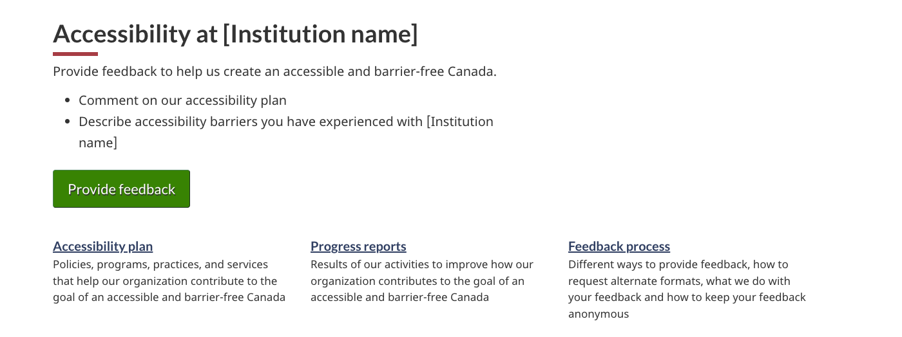

<strong>Last updated</strong>: {{ page.dateModified }}

All Government of Canada entities, including departments and agencies, must provide public-facing information about their accessibility plans, progress reports, and a feedback mechanism.

<section>
    <h2>On this page</h2>
    <ul>
        <li><a href="#use">When to use</a></li>
        <li><a href="#design">Content and design</a></li>
        <li><a href="#implement">How to implement</a></li>
        <li><a href="#research">Policy rationale</a></li>
        <li><a href="#changes">Latest changes</a></li>
    </ul>
</section>
<section>
    <h2 id="use">When to use</h2>
    
This is a recommended template to help comply with planning and reporting requirements set by the <cite>Accessible Canada Regulations</cite>.

    

        Guidance on the Accessible Canada Regulations can be found here:
    

    <ul>
        <li><a href="https://www.canada.ca/en/employment-social-development/programs/accessible-canada-regulations-guidance.html">Guidance on the Accessible Canada Regulations - Canada.ca</a></li>
    </ul>
</section>
<section>
    <h2 id="design">Content and design</h2>
    
Find content and design specifications.

    <h3>Accessibility landing page</h3>
    
Accessibility landing pages are outside the theme/topic structure, however they use a similar layout to topic pages. The page consists of:

    <ul>
        <li>An H1</li>
        <li>Introduction block</li>
        <li>Supertask button linking to your feedback process</li>
        <li>
            The following doormats:
            <ul>
                <li>Accessibility plan</li>
                <li>Progress reports</li>
                <li>Feedback process</li>
            </ul>
        </li>
    </ul>
    
Suggested text for each of these elements can be found in the template here:

    <ul>
        <li><a href="./accessibility/accessibility.html">Accessibility at [institution name] - Canada.ca</a></li>
    </ul>
    
The accessibility plan, progress reports and feedback process all use the:

    <ul>
        <li><a href="./generic-destination.html">Basic content page layout</a></li>
    </ul>
    <h3>Accessibility plan</h3>
    
Follow the content outline found here:

    <ul>
        <li><a href="./accessibility/plan.html">Accessibility plan at [Institution name] - Canada.ca</a></li>
    </ul>
    <h3>Progress reports</h3>
    
For the landing page, follow the content outline found here:

    <ul>
        <li><a href="./accessibility/progress-reports-landing.html">Accessibility progress reports at [Institution name]</a></li>
    </ul>
    
For the progress report, follow the content outline and associated guidance found here:

    <ul>
        <li><a href="./accessibility/progress-report.html">Accessibility progress report at [Institution name]</a></li>
    </ul>
    <h3>Feedback process</h3>
    
Follow the content outline found here:

    <ul>
        <li><a href="./accessibility/feedback-process.html">Accessibility feedback process at [Institution name] - Canada.ca</a></li>
    </ul>
    <h3>Accessibility feedback form</h3>
    
Follow the content outline found here:

    <ul>
        <li><a href="./accessibility/feedback-form.html">[Institution name]’s accessibility feedback form - Canada.ca</a></li>
    </ul>
    
The accessibility feedback form uses the:

    <ul>
        <li><a href="https://wet-boew.github.io/GCWeb/components/wb-fieldflow/alternative-en.html">Advanced field flow component</a> from GCWeb</li>
    </ul>
</section>
<section>
    <h2 id="implement">How to implement</h2>
    
Find working examples and code for implementing the accessibility template.

    <h3>GCweb (WET) theme implementation reference</h3>
    
GCWeb implementation references for:

    <ul>
        <li><a href="https://wet-boew.github.io/GCWeb/components/wb-fieldflow/alternative-en.html">Fieldflow documentation - GCWeb</a></li>
        <li><a href="https://wet-boew.github.io/GCWeb/templates/content-page/content-en.html">Basic content page</a></li>
    </ul>
    <h3>Implementations</h3>
    
Determine what best suits the type of page you're creating.

    

        

            

                

                    

                        
<strong>GC-AEM</strong>

                        
For the Government of Canada Adobe Experience Manager (AEM):

                        <ul>
                            <li>
                                <a href="https://www.gcpedia.gc.ca/wiki/AEM_GC-specific_Documentation_6.5">
                                    AEM/Managed Web Service documentation (GCPedia link - only available on the Government of Canada network)
                                </a>
                            </li>
                        </ul>
                    

                    

                        
<strong>CDTS</strong>

                        
For the Centrally Deployed Templates Solution (CDTS):

                        <ul>
                            <li><a href="https://cenw-wscoe.github.io/sgdc-cdts/docs/index-en.html">CDTS documentation</a></li>
                        </ul>
                    

                    

                        
<strong>Drupal WxT</strong>

                        
For Drupal WxT:

                        <ul>
                            <li><a href="https://drupalwxt.github.io/">Drupal WxT documentation</a></li>
                        </ul>
                    

                

            

        

    

</section>
<section>
    <h2 id="research">Policy rationale</h2>
    
This template supports the planning and reporting requirements set by the:

    <ul>
        <li>
            <a href="https://laws.justice.gc.ca/eng/regulations/SOR-2021-241/"><cite>Accessible Canada Regulations</cite></a>
        </li>
    </ul>
    
For additional guidance on these requirements visit:

    <ul>
        <li>
            <a href="https://www.canada.ca/en/employment-social-development/programs/accessible-canada-regulations-guidance.html">Guidance on the Accessible Canada Regulations</a>
        </li>
    </ul>
</section>
<section>
    <h2 id="changes">Latest changes</h2>
    <dl class="dl-horizontal">
        <dt>
            <time datetime="2024-12-05" class="link-muted">2024-12-05</time>
        </dt>
        <dd>
            <ul>
                <li>Updated the guidance to include content and design specifications, visual examples and implementation guidance</li>
            </ul>
        </dd>
    </dl>
</section>
