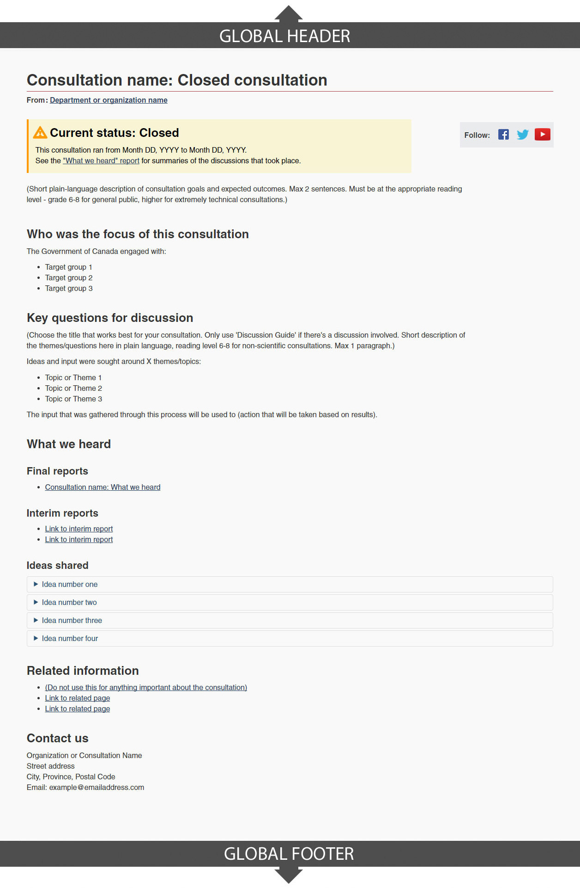

 

  <strong>
   From:
   <a href="https://www.canada.ca/en/treasury-board-secretariat.html">
    Treasury Board of Canada Secretariat
   </a>
  </strong>
 

 <section>
  

   Consultation profile pages provide access to Government of Canada consultations and engagement activities.
  

  

   Consultation profiles:
  

  <ul>
   <li>
    provide a plain-language description of a particular consultation or engagement activity, including its objectives
   </li>
   <li>
    consolidate information related to the status of the consultation or engagement activity, including background materials, data, and planned and completed events
   </li>
   <li>
    provide consolidated access to the outcomes of the consultation or engagement activity, including any documentation or data generated as part of the process
   </li>
   <li>
    relate consultations to Canada.ca topics and institutions, as well as other related consultations or engagement activities
   </li>
  </ul>
 </section>
 <section>
  <h2>
   On this page
  </h2>
  <ul>
   <li>
    <a href="#specifications">
     How to use this template
    </a>
   </li>
   <li>
    <a href="#navigation">
     User navigation
    </a>
   </li>
  </ul>
 </section>
 <section>
  <h2 id="specifications">
   How to use this template
  </h2>
  

   <button class="btn btn-default wb-toggle" data-toggle='{"selector": "details", "parent": "#template-elements", "type": "on"}' type="button">
    Expand All
   </button>
   <button class="btn btn-default wb-toggle" data-toggle='{"selector": "details", "parent": "#template-elements", "type": "off"}' type="button">
    Collapse All
   </button>
  

  

   

    <figure class="mrgn-bttm-lg">
     <figcaption class="text-center">
      <b>
       Profile page for an open consultation template
      </b>
     </figcaption>
     
    </figure>
    <figure class="mrgn-bttm-lg">
     <figcaption class="text-center">
      <b>
       Profile page for a closed consultation template
      </b>
     </figcaption>
     
    </figure>
   

   

    <section id="template-elements">
     <section>
      <h3>
       1: Consultation title
      </h3>
      

       Provides the title of the consultation
      

      <ul class="list-unstyled">
       <li id="element1">
        

         

          <strong>
           Content
          </strong>
         

         <ul>
          <li>
           the H1 heading should start with a verb phrase oriented to the users. Options include:
           <ul>
            <li>
             Share your thoughts (this is the default verb phrase)
            </li>
            <li>
             Share and view ideas
            </li>
            <li>
             Comment on
            </li>
            <li>
             Join the discussion
            </li>
           </ul>
          </li>
          <li>
           add the name of the consultation after the verb phrase. For example:
           <ul>
            <li>
             Share your thoughts: Accessible Transportation
            </li>
            <li>
             Share and view ideas:  Nutrition North food subsidies
            </li>
            <li>
             Comment on Pyrimethanil, Proposed Maximum Residue Limit PMRL2016-38
            </li>
            <li>
             Comment on proposed revisions:  Canadian Transportation Agency General Rules
            </li>
            <li>
             Join the discussion:  Open Government action plan 2.0
            </li>
           </ul>
          </li>
          <li>
           when the consultation closes, the verb phrase should be removed from the heading, and  "Closed consultation" should be added after the consultation name. For example:
           <ul>
            <li>
             Accessible Transportation:  Closed consultation
            </li>
            <li>
             Nutrition North food subsidies:  Closed consultation
            </li>
            <li>
             Pyrimethanil, Proposed Maximum Residue Limit PMRL2016-38:  Closed consultation
            </li>
            <li>
             Canadian Transportation Agency General Rules:  Closed consultation
            </li>
            <li>
             Open Government action plan 2.0:  Closed consultation
            </li>
           </ul>
          </li>
         </ul>
        

       </li>
       <li id="element2">
        

         

          <strong>
           Presentation
          </strong>
         

         <ul>
          <li>
           the consultation title must be a unique H1
          </li>
          <li>
           must be the first component on the page
          </li>
         </ul>
        

       </li>
      </ul>
     </section>
     <section>
      <h3>
       2: Status message
      </h3>
      

       Indicates whether the consultation is upcoming, active or closed
      

      <ul class="list-unstyled">
       <li id="element3">
        

         

          <strong>
           Content
          </strong>
         

         <ul>
          <li>
           indicates how long the consultation will continue to be open, or indicates the start and end dates if closed
          </li>
          <li>
           provides a link to the consultation outcome report, if a report is available
          </li>
         </ul>
        

       </li>
       <li id="element4">
        

         

          <strong>
           Presentation
          </strong>
         

         <ul>
          <li>
           appears below the title
          </li>
         </ul>
        

       </li>
      </ul>
     </section>
     <section>
      <h3>
       3: Social media channels
      </h3>
      

       Features consultation-specific social media channels
      

      <ul class="list-unstyled">
       <li id="element5">
        

         

          <strong>
           Content
          </strong>
         

         <ul>
          <li>
           use the
           <a href="../common-design-patterns/social-media-channels.html">
            Social media channels block (follow box)
           </a>
           pattern
          </li>
         </ul>
        

       </li>
       <li id="element6">
        

         

          <strong>
           Presentation
          </strong>
         

         <ul>
          <li>
           appears to the right of the status message
          </li>
         </ul>
        

       </li>
      </ul>
     </section>
     <section>
      <h3>
       4: Consultation description
      </h3>
      

       Provides a plain language description of the consultation and its objectives
      

      <ul class="list-unstyled">
       <li id="element7">
        

         

          <strong>
           Content
          </strong>
         

         <ul>
          <li>
           keep the introductory description short and concise
          </li>
          <li>
           must include the objectives of the consultation
          </li>
         </ul>
        

       </li>
       <li id="element8">
        

         

          <strong>
           Presentation
          </strong>
         

         <ul>
          <li>
           appears below the status message
          </li>
         </ul>
        

       </li>
      </ul>
     </section>
     <section>
      <h3>
       5: How to participate
      </h3>
      

       Lists ways in which interested parties can participate in the consultation
      

      <ul class="list-unstyled">
       <li id="element9">
        

         

          <strong>
           Content
          </strong>
         

         <ul>
          <li>
           recommended format is a set of doormat links, in which each item corresponds to a different method of participation, including any relevant links
          </li>
          <li>
           written for a grade 6-8 reading level
          </li>
          <li>
           this component should be removed from the page once the consultation has closed
          </li>
         </ul>
        

       </li>
       <li id="element10">
        

         

          <strong>
           Presentation
          </strong>
         

         <ul>
          <li>
           appears below the consultation description
          </li>
         </ul>
        

       </li>
      </ul>
     </section>
     <section>
      <h3>
       6: Consultation details
      </h3>
      

       Provides a plain language description of the groups being targeted by the consultation, the key questions/themes that are expected to be topics of conversation, and the details of when/where any meetings will be held, if applicable
      

      <ul class="list-unstyled">
       <li id="element11">
        

         

          <strong>
           Content
          </strong>
         

         <ul>
          <li>
           content provides indication of upcoming opportunities to contribute; if appropriate, use a table
          </li>
          <li>
           recommended format is a “who/what/where/when/why” structure for quick comprehension
          </li>
          <li>
           written for a grade 6-8 reading level
          </li>
          <li>
           content for this component must be drawn from a feed if one exists
          </li>
          <li>
           remove meeting dates/locations from the page once the consultation has been closed
          </li>
         </ul>
        

       </li>
       <li id="element12">
        

         

          <strong>
           Presentation
          </strong>
         

         <ul>
          <li>
           appears below the “How to participate” section
          </li>
         </ul>
        

       </li>
      </ul>
     </section>
     <section>
      <h3>
       7: What we are hearing
      </h3>
      

       Links to interim reports and shared ideas/comments
      

      <ul class="list-unstyled">
       <li id="element13">
        

         

          <strong>
           Content
          </strong>
         

         <ul>
          <li>
           use this component as ideas and reports become available
          </li>
          <li>
           if consultation meetings are being conducted in multiple locations, place the summaries from all meetings onto a single page, rather than splitting them up across several pages
          </li>
          <li>
           when consultations are active, the recommended heading is labeled “What we are hearing”. For closed consultations, the recommended heading is labeled “What we heard”
          </li>
          <li>
           when a consultation is closed, a link to the final “What we heard” report should be placed here as well
          </li>
         </ul>
        

       </li>
       <li id="element14">
        

         

          <strong>
           Presentation
          </strong>
         

         <ul>
          <li>
           appears below the consultation details, on profile pages for consultations that are still open
          </li>
          <li>
           on profile pages for closed consultations, this component should be moved up to appear just after the consultation description, near the top of the page
          </li>
         </ul>
        

       </li>
      </ul>
     </section>
     <section>
      <h3>
       8: Related information
      </h3>
      

       Links to related consultations, reports and information
      

      <ul class="list-unstyled">
       <li id="element15">
        

         

          <strong>
           Content
          </strong>
         

         <ul>
          <li>
           when used, the heading is labeled “Related information”
          </li>
          <li>
           do not use this section for anything about this specific consultation
          </li>
         </ul>
        

       </li>
       <li id="element16">
        

         

          <strong>
           Presentation
          </strong>
         

         <ul>
          <li>
           appears below What we are hearing
          </li>
          <li>
           use the
           <a href="../common-design-patterns/related-links.html">
            Related links
           </a>
           pattern
          </li>
         </ul>
        

       </li>
      </ul>
     </section>
     <section>
      <h3>
       9: Contact us
      </h3>
      

       Provides relevant contact information for the consultation
      

      <ul class="list-unstyled">
       <li id="element18">
        

         

          <strong>
           Presentation
          </strong>
         

         <ul>
          <li>
           use the
           <a href="../common-design-patterns/contact-information.html">
            Contact information
           </a>
           pattern
          </li>
         </ul>
        

       </li>
      </ul>
     </section>
    </section>
   

  

 </section>
 <section>
  <h2 id="navigation">
   User navigation
  </h2>
  <figure class="mrgn-bttm-lg">
   <figcaption class="text-center">
    <b>
     Figure 3. User navigation diagram
    </b>
   </figcaption>
   
   

    

     Figure 3 – Text version
    

    

     Consultation pages can be accessed from the Canada.ca Open Government home page.
    

   

  </figure>
 </section>

