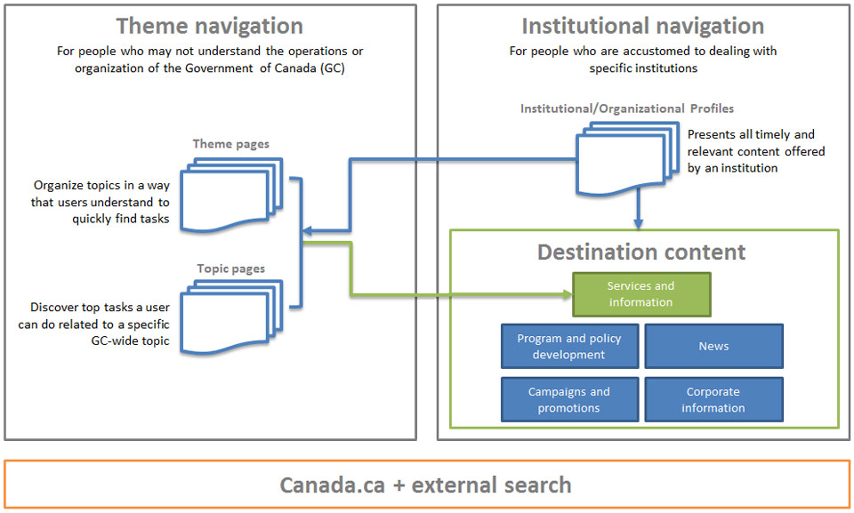

  <section>
    <h2>On this page</h2>
    <ul>
      <li><a href="#toc1">How people find tasks: theme and institutional navigation</a></li>
      <li><a href="#user">User-need categories for destination content</a></li>
      <li><a href="#toc3">URL model</a></li>
      <li><a href="#state">Content types and content states</a></li>
    </ul>
  </section>
  <section>
    <h2 id="toc1">How people find tasks</h2>
    
Canada.ca helps people navigate in 3 different ways:

    <ul>
      <li class="theme-navigation"><strong>Theme navigation:</strong> people who do not know which institution offers what they are looking for can find it through theme and topic pages</li>
      <li><strong>Institutional navigation:</strong> people can find what they are looking for directly through the institutional presence of each department</li>
      <li><strong>Search:</strong> supports findability for both theme and institutional navigation through the on and off-site search engine</li>
    </ul>
    
Most people looking for government services and information don't understand how government is organized. To address this, the theme-based navigation is the priority navigation path on Canada.ca.

    
See where your content fits under themes and their corresponding topics in the <a href="https://www.canada.ca/en/government/about/design-system/topic-tree-content-types.html#tree">Canada.ca Topic tree</a>.

    <figure class="mrgn-bttm-lg">
      <figcaption class="text-center"><b>Navigation conceptual overview</b></figcaption>
      
      

        
Text version

        
People who may not understand the operations or organization of the Government of Canada (GC) may access content through theme navigation. Theme pages organize topics in a way that people understand so they can find content that supports their tasks quickly. Theme pages link to topic pages and/or destination content. Topic pages allow people to discover top-task content related to a specific GC-wide topic. They also link to destination content.

          People can also access content through institutional navigation. This navigation is intended for people who are accustomed to dealing with specific institutions. An Institutional/Organizational profile presents all timely and relevant content offered by an institution. It then leads people to either theme or topic pages, or directly into destination content. Destination content is about services or information, program and policy development, news, campaigns and promotions, or corporate information.

      

    </figure>
  </section>
  <section>
    <section>
      <h2 id="user">User-need categories for destination content</h2>
      
Organize your content to fit under one of these 5 user-need categories:

      <ol>
        <li><a href="#services">Services and information</a></li>
        <li><a href="#program">Program and policy development</a></li>
        <li><a href="#corporate">Corporate information</a></li>
        <li><a href="#campaigns">Campaigns and promotions</a></li>
        <li><a href="#news">News</a></li>
      </ol>
      <section>
        <h3 id="services">Services and information</h3>
        
Services and information form the core content that allows a person to complete a task.

        
Tasks can range from very simple to very complex. They can be informational or transactional. Tasks can be things like:

        <ul>
          <li>find a contact</li>
          <li>get the weather forecast</li>
          <li>find out what you need to report on your tax return</li>
          <li>apply for a visa</li>
          <li>get EI benefits</li>
          <li>get ideas on places to visit in Canada</li>
        </ul>
        
This category consists of content that:

        <ul>
          <li>allows people to initiate a transaction with the government</li>
          <li>answers questions people have about government services</li>
          <li>focuses on what people can do or are looking for, not on what the government offers</li>
          <li>helps people complete a task, and may include reports, guides, digital services or databases</li>
        </ul>
        <ul class="list-unstyled">
          <li>
            

              
Navigation

              
This content must be accessible from both:

              <ul>
                <li>the topic tree</li>
                <li>the "Services and information" section of the Institutional/Organizational profile</li>
              </ul>
              
All your user navigation decisions should make it easier for people to find your top tasks.

            

          </li>
          <li>
            

              
Breadcrumb trail

              
Leads back to the topic tree, not the institutional presence.

            

          </li>
        </ul>
      </section>
      <section>
        <h3 id="program">Program and policy development</h3>
        
Program and policy development content shows what the government is doing to support programs, policies and services.

        
It consists of content that:

        <ul>
          <li>provides information about programs and policies, and activities related to their development</li>
          <li>provides background information about what is presented on a topic page</li>
          <li>includes program descriptions, policies, research papers, consultations, statistics, legislation, etc.</li>
        </ul>
        <ul class="list-unstyled">
          <li>
            

              
Navigation

              
This content must be accessible from:

              <ul>
                <li>the "About the institution" section of the Institutional/Organizational profile</li>
              </ul>
            

          </li>
          <li>
            

              
Breadcrumb trail

              
Leads back to the Institutional/Organizational profile.

            

          </li>
        </ul>
      </section>
      <section>
        <h3 id="corporate">Corporate information</h3>
        
Corporate  information is information about the institution itself and its business lines.

        
It consists of content such as:

        <ul>
          <li>institutional mandate and organizational structure</li>
          <li>performance reporting and transparency</li>
          <li>job opportunities</li>
        </ul>
        <ul class="list-unstyled">
          <li>
            

              
Navigation

              
This content must be accessible from the “About the institution” section of the Institutional/Organizational profile.

            

          </li>
          <li>
            

              
Breadcrumb trail

              
Leads back to the Institutional/Organizational profile.

            

          </li>
        </ul>
      </section>
      <section>
        <h3 id="campaigns">Campaigns and promotions</h3>
        
Consists of content that:

        <ul>
          <li>supports advertising campaigns, events, announcements, etc.</li>
          <li>leads people to core content found in either "Services and information" or "Program and policy development" </li>
        </ul>
        <ul class="list-unstyled">
          <li>
            

              
Navigation

              
This content can be accessible from:

              <ul>
                <li>the “Latest news” section of the Institutional/Organizational profile</li>
                <li>the “Context-specific features” on Institutional/Organizational profiles and topic pages</li>
                <li>contextual promotions on relevant content pages</li>
              </ul>
            

          </li>
          <li>
            

              
Breadcrumb trail

              
Promotion campaigns don't need a breadcrumb trail. If you add one, it can lead back to the topic tree, the Institutional/Organizational profile, or to the Home page of Canada.ca.

            

          </li>
        </ul>
      </section>
      <section>
        <h3 id="news">News</h3>
        
Consists of content that: 

        <ul>
          <li>supports media and public awareness of government activities</li>
          <li>includes backgrounders, media advisories, news releases, speeches, statements, campaigns, etc.</li>
          <li>includes other media or news products not supported by <abbr title="Government of Canada">GC</abbr> News</li>
        </ul>
        <ul class="list-unstyled">
          <li>
            

              
Navigation

              
This content must be accessible from the “Latest news” section of the Institutional/Organizational profile and in the Canada.ca newsroom.

            

          </li>
          <li>
            

              
Breadcrumb trail

              
Leads back to the Institutional/Organizational profile.

            

          </li>
        </ul>
      </section>
      <h2 id="toc3">URL model</h2>
      
For information on the URL model, domain requirements and sub-domains, visit:

      <ul>
        <li><a href="../mandatory-elements/domains-urls.html">Government of Canada domains and URLs</a></li>
      </ul>
</section>
<h2 id="state">Content types and content states</h2>
<h3>Content types</h3>

A content type is a unique element describing the nature of the page content.

Use the <a href="https://www.canada.ca/en/government/about/design-system/topic-tree-content-types.html#types">Canada.ca  content type list</a>, a common taxonomy, to classify and filter large lists of content based on content type. 

<h3>Content states</h3>

There are 3 content states for content published on Canada.ca: 

<ol>
  <li>current  content</li>
  <li>archived  content</li>
  <li>legacy  content </li>
</ol>
<section>
  <h4>Current content</h4>
  
Current content is information and services that are actively sought out by people. It can also be content that must  be available to the public at all times. 

</section>
<section>
  <h4>Archived content</h4>
  
Archived content is information that is no longer current. It is still accessible through Canada.ca for reference or to  provide context for current versions of content. 

  
On archived content, provide links to the current version of the content. If a task would require people to find archived content, provide links to the archived content on the current content. 

  
Archived content is indexed and is findable through the search function. This supports findability when there is no current content.

</section>
<section>
  <h4>Legacy content</h4>
  
Legacy content is information that has been revised or replaced by more recent content. Remove this content from the website and move it into your corporate repository for recordkeeping purposes.

</section>
