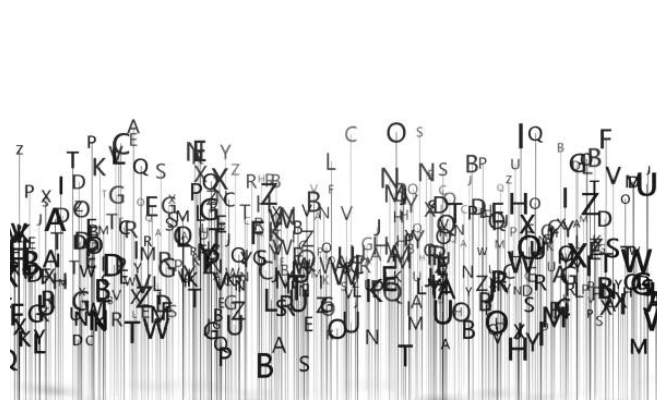

  

    

      <h1 property="name" id="wb-cont" dir="ltr">Canada.ca Content Style Guide</h1>
      
These are the rules to create web content that can be easily found, understood and used. They are based on writing principles and techniques that help make web content clear and adapted to the needs of all people. Use the style guide with the <cite>Canada.ca Content and Information Specification</cite> when you're designing and organizing web content.

      <a href="{{ site.url }}/style-guide/" class="btn btn-lg btn-primary">Full Guide (all sections)</a> 

    
  

  

  <section class="gc-srvinfo">
    <h2 class="wb-inv">Canada.ca Content Style Guide sections</h2>
    

      

        <h3><a href="00-intro.html">Introduction</a></h3>
        
Purpose, use, summary of changes, and related policies, standards and procedures

      

      

        <h3><a href="01-writing.html">1.0 Writing principles</a></h3>
        
Rules that reflect how people read and use web content

      

      

        <h3><a href="02-plain-language.html">2.0 Plain language</a></h3>
        
Write in plain language

      

      

        <h3><a href="03-tone.html">3.0 Tone</a></h3>
        
Write with the proper tone

      

      

        <h3><a href="04-style.html">4.0 Style</a></h3>
        
Keep style and punctuation simple

      

      

        <h3><a href="05-content.html">5.0 Content structure</a></h3>
        
Structure and layouts to help people find what they need

      

      

        <h3><a href="06-images.html">6.0 Images and videos</a></h3>
        
Present images and videos strategically and effectively

      

      

        <h3><a href="07-links.html">7.0 Links</a></h3>
        
Use links and anchors strategically and effectively

      

      

        <h3><a href="08-makeovers.html">Web content makeovers</a></h3>
        
Two case studies - examples of plain language and complex table improvements

      

      

        <h3><a href="09-resources.html">Resources</a></h3>
        
Sources used to create the Content Style Guide

      

      

        <h3><a href="10-formats.html">Formats</a></h3>
        
Avaialable in open source formats - HTML, PDF, and EPUB

      

    

  </section>

