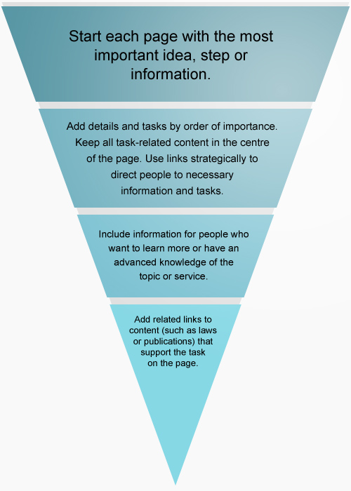
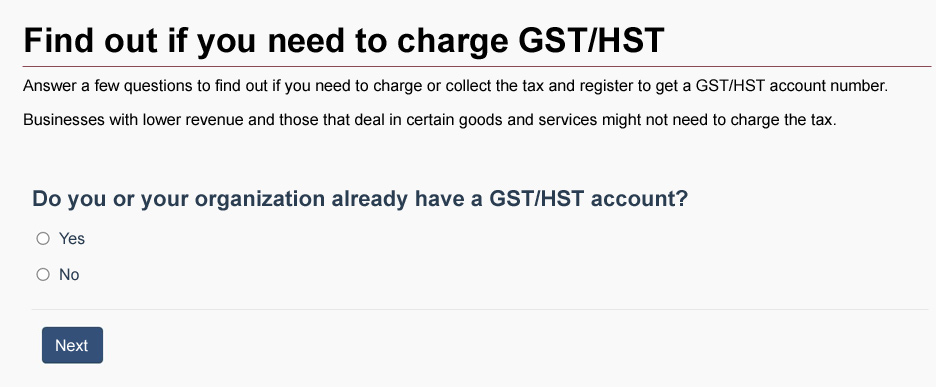

These are the rules to create web content that can be easily found, understood and used. They are based on writing principles and techniques that help make web content clear and adapted to the needs of all people. Use it with the [Content and Information Architecture Specification]({{ site.url }}/architecture/canada-content-information-architecture-specification.html) when you're designing and organizing web content.

Version 2.2.1

Revised: February 3, 2020

Table of contents
-----------------

*   [Summary of changes](#toc1)
*   [Purpose](#toc2)
*   [Use of the style guide](#toc3)
*   [Related policies, standards and procedures](#toc4)
*   [1.0 Writing principles for web content](#toc5)
*   [2.0 Plain language](#toc6)
*   [3.0 Tone](#toc7)
*   [4.0 Style](#toc8)
*   [5.0 Content structure](#toc9)
*   [6.0 Images and videos](#toc10)
*   [7.0 Links](#toc11)
*   [Web content makeovers](#toc12)
*   [Resources](#toc13)

Summary of changes
------------------

Here are the changes we made to this version of the guide:

*   we’ve added “Writing for inclusivity” to the [Writing principles for web content](#toc5) section

Refer to the listed section for details.

Purpose
-------

This guide establishes the rules you must use to develop and edit English web content that will be published on a Government of Canada website. The rules are different from practices adapted to print to support principles related to accessibility, readability and usability.

The purpose of these rules is to make web content easy to find, easy to understand and easy to use for everyone, including people who have physical or cognitive disabilities.

The techniques described in this guide complement the rules set out in [The Canadian Style](https://www.btb.termiumplus.gc.ca/tpv2guides/guides/tcdnstyl/index-eng.html?lang=eng). If there are conflicts between this guide and The Canadian Style or any other resource, this guide takes priority for content published online.

As web and language trends evolve, we'll update this guide to meet the changing needs of our audiences.

Use of the style guide
----------------------

This style guide is referenced in the [Directive on the Management of Communications](https://www.tbs-sct.gc.ca/pol/doc-eng.aspx?id=30682). The requirements apply to departments and other organizations of the federal public administration listed in Schedules [I](https://laws-lois.justice.gc.ca/eng/acts/F-11/page-30.html#h-74), [I.1](https://laws-lois.justice.gc.ca/eng/acts/F-11/page-31.html#h-75) and [II](https://laws-lois.justice.gc.ca/eng/acts/F-11/page-32.html#h-76) of the Financial Administration Act.

These organizations must follow this style guide's requirements for all public-facing websites and digital services, regardless of the technology, domain name or publishing platform used.

### Out-of-scope situations

Institutions that fall outside of Schedules I, I.1, and II of the Financial Administration Act do not have to follow this style guide. However, all institutions are encouraged to use it for both their internal and external web products. Following this guide's rules and techniques will make it easier for everyone to find, understand and use the government's digital content.

Related policies, standards and procedures
------------------------------------------

Content must comply with:

*   templates, content components, character limits and other requirements as described in the [Canada.ca Content and Information Architecture Specification]({{ site.urlcanada.ca }}/en/treasury-board-secretariat/services/government-communications/canada-content-information-architecture-specification.html)
*   requirements set out in the related legislated and policy instruments, including:
    *   [Policy on Communications and Federal Identity](https://www.tbs-sct.gc.ca/pol/doc-eng.aspx?id=30683)
    *   [Directive on the Management of Communications](https://www.tbs-sct.gc.ca/pol/doc-eng.aspx?id=30682)
    *   [Standard on Web Accessibility](https://www.tbs-sct.gc.ca/pol/doc-eng.aspx?id=23601)
    *   [Standard on Web Interoperability](https://www.tbs-sct.gc.ca/pol/doc-eng.aspx?id=25875)
    *   [Standard on Optimizing Websites and Applications for Mobile Devices](https://www.tbs-sct.gc.ca/pol/doc-eng.aspx?id=27088)
    *   [Guidance on Publishing in the Government of Canada]({{ site.urlcanada.ca }}/en/treasury-board-secretariat/services/government-communications/guidance-publishing-government.html)
    *   [Procedures for Publishing](https://www.tbs-sct.gc.ca/pol/doc-eng.aspx?id=27167)
    *   [Official Languages Act](https://laws-lois.justice.gc.ca/eng/acts/O-3.01/)

1.0 Writing principles for web content
--------------------------------------

### In this section

*   [1.1 Help people complete tasks](#wp1-1)
*   [1.2 Consider the needs of the audience](#wp1-2)
    *   [Writing for accessibility](#wp1-2-1)
    *   [Writing for inclusivity](#wp1-2-1b)
    *   [Writing for readability](#wp1-2-2)
    *   [Writing for specialized audiences](#wp1-2-3)
    *   [Consider all screen sizes](#wp1-2-4)
*   [1.3 Provide equivalent content in both official languages](#wp1-3)

The rules in this guide reflect how people read and use web content.

### 1.1 Help people complete tasks

Most people come to a government website to complete a task and expect us to provide information that will help them. Tasks can be:

*   transactional (submit a form or download a report)
*   informational (find out how to collect a benefit or find a phone number)

People trying to complete a task online usually don't read word by word. They scan quickly for words and links related to what they want to do.

Government of Canada web content must be:

*   **intuitive**: give people who have no previous knowledge of the topic or process just enough information to complete a task on their own
*   **comprehensive**: give the appropriate details to specialists who have more knowledge of a topic or process
*   **targeted**: present the most important information first, in a way that is tailored to the needs of the audience, instead of giving all the options and leaving people to figure out which ones apply to them
*   **consistent**: use a standardized approach so that people can scan content quickly and easily with a sense of confidence and trust

### 1.2 Consider the needs of the audience

When planning web content, consider people's needs. Make sure that the content is accessible, clear and adapted to the widest audience.

#### Writing for accessibility

Making content accessible means a wide range of people can use it, including people with physical and cognitive disabilities (for example, reading disorders, attention deficit disorders, memory disorders).

To make your content accessible, consider how assistive technologies work and how some writing practices may impact people's ability to read or understand text. Remember to also refer to the [Web Content Accessibility Guidelines (WCAG) 2.0](https://www.w3.org/TR/WCAG/).

#### Writing for inclusivity

Make gender-inclusive writing your standard practice. Avoid references to gender whenever possible.

For more guidance, including how to write inclusively in French, see the Translation Bureau’s [Gender-inclusive writing: correspondence](https://www.btb.termiumplus.gc.ca/tpv2guides/guides/wrtps/index-eng.html?lang=eng&lettr=indx_catlog_g&page=9tZXuAe4oZYs.html).

#### Writing for readability

Readability is the ease with which a person can read and understand a text. Readable content means better task completion and higher client satisfaction.

To make your content readable, consider your audience's reading level and literacy needs. Not everyone reads at the same level or understands content in the same way. Even when content is presented clearly and simply, people who have low literacy levels and other difficulties can find it hard to understand text.

According to Statistics Canada (2012) and Canadian literacy organizations, almost 50% of Canadians have literacy challenges. Research shows that people with literacy challenges:

*   spend a lot of time trying to understand words that contain more than two syllables
*   read word by word and slowly move their eyes across each line of text
*   skip over large amounts of information when it contains many multi-syllable words, uncommon terms and long sentences

Techniques for improving and measuring readability are in the [section on plain language](#toc6).

#### Writing for specialized audiences

Sometimes, your content targets people who have in-depth knowledge of a subject.

When writing for a specialized audience, you can use terms they're familiar with, even if those terms aren't familiar to a general audience.  Include a summary in plain language for:

*   people who aren't familiar with the subject
*   specialists who might be scanning the content to decide whether it's relevant to their task

#### Consider all screen sizes

People will view your content on different sizes of screens. Phone and tablet screens display less content than desktop and laptop screens. Readers who use small screens:

*   have to go through more steps to access the same amount of information
*   rely on their short-term memory to [recall information that isn't visible on the screen](https://www.nngroup.com/articles/short-term-memory-and-web-usability/)

### 1.3 Provide equivalent content in both official languages

#### Official languages requirements

According to the [Official Languages Act](https://laws-lois.justice.gc.ca/eng/acts/o-3.01/page-1.html), you must publish communications and provide services to the public in both official languages.

Government content must:

*   be professionally translated
*   reflect Canadian writing conventions in English and French
*   include fully bilingual images, multimedia files and transcripts, or contain equivalent information in both official languages

#### Persons responsible for official languages

The [person responsible for official languages in your institution](https://www.tbs-sct.gc.ca/psm-fpfm/ve/ol-lo/lst-eng.asp) can help answer questions about your obligations and about exceptions.

Your communications team can help determine whether it's appropriate to communicate with audiences in other languages, in addition to Canada's official languages.

2.0 Plain language
------------------

### In this section

*   [2.1 Start with the most important information](#wp2-1)
*   [2.2 Use simple and common words](#wp2-2)
*   [2.3 Use active voice and positive form](#wp2-3)
    *   [Active or passive voice](#wp2-3-1)
    *   [Positive or negative form](#wp2-3-2)
*   [2.4 Use verbs instead of nouns formed from verbs](#wp2-4)
*   [2.5 Avoid jargon, idioms and expressions](#wp2-5)
*   [2.6 Use simple sentences](#wp2-6)
*   [2.7 Use short sentences and paragraphs](#wp2-7)
*   [2.8 Explain references to legislation](#wp2-8)
*   [2.9 Check the reading level of the content](#wp2-9)
    *   [Use a readability tool](#wp2-9-1)
    *   [Follow the reading level requirements](#wp2-9-2)
    *   [Verify whether the content is easy to understand](#wp2-9-3)

### Plain language requirements

The use of plain language is a requirement of the [Directive on the Management of Communications](https://www.tbs-sct.gc.ca/pol/doc-eng.aspx?id=30682).

Writing in plain language doesn't mean over-simplifying or leaving out critical information. Using plain language actually makes critical information accessible and readable for everyone.

By writing plainly and simply, you:

*   increase the chances that people will find, read and understand your information from any device
*   make your information more accessible to people with disabilities
*   allow people who are reading your information on a small screen to see essential information first
*   save resources when editing and translating your text
*   improve task completion and cuts costs by, for example, reducing enquiries

### 2.1 Start with the most important information

Start your content with the most important information, and be direct. When people scan web pages, they tend to start in the top left hand corner and scan to the right and down. As they move down the page, they scan less and less to the right.

Organize your content using an inverted pyramid structure to:

*   guide your audience to the information they need to complete their task
*   place supporting and relevant details toward the end of the text

**Figure 1**

 Figure 1 - Text version

Inverted pyramid divided into four sections, from top to bottom. The image shows the order of information on a web page.

*   First:
    *   start with the most important idea, step or information
*   Second:
    *   add details and tasks in order of importance
    *   keep all task related content in the centre of the page
    *   use links to direct people to key information and tasks
*   Third:
    *   include information for audiences who want to learn more or have more knowledge of the topic or service, but only if it makes sense
*   Fourth:
    *   add links only if they relate to content that supports completion of the task on the web page (for example, laws or publications)

#### Get to the point

Omit background information and messages that welcome people to your program or site. These kinds of messages get in people's way when they're trying to accomplish a task.

Write direct statements.

##### Example of direct statements

**Write**: Present your passport to the border officer.  
**Instead of**: According to Canadian legislation, you're required to present your passport to the agent who will welcome you into the country.

[See how this rule applies to content in French]({{ site.urlconceptioncanadaca }}/guide-redaction/#wp2-1)

[Share this rule by email](mailto:?subject=Canada.ca%20Content%20Style%20Guide&body=See%20the%20rule%20for%20using%20the%20inverted%20pyramid%20structure%20to%20organize%20content%20on%20Canada.ca:%20{{ site.url }}/style-guide/#wp2-1)

### 2.2 Use simple and common words

Replace long words with short, simple and everyday words that most people understand and use. Simple words have 2 syllables or less. They're easier to scan than long, complex words.

#### Example of simple and common words

**Write**: ask  
**Instead of**: make a request

**Write**: you must  
**Instead of**: you shall

**Write**: to  
**Instead of**: in order to

**Write**: before  
**Instead of**: prior to

**Write**: get  
**Instead of**: obtain

[See how this rule applies to content in French]({{ site.urlconceptioncanadaca }}/guide-redaction/#wp2-1)

[Share this rule by email](mailto:?subject=Canada.ca%20Content%20Style%20Guide&body=See%20the%20rule%20for%20using%20simple%20and%20common%20words%20on%20Canada.ca:%20{{ site.url }}/style-guide/#wp2-2)

### 2.3 Use active voice and positive form

Whenever possible use the:

*   active voice instead of the passive voice
*   positive form instead of the negative form

#### Active or passive voice

In an active sentence, the subject does the action. The sentence is clear and direct.

In a passive sentence, it may not be clear who or what is doing the action.

##### Example of passive and active sentences

**Active**: We may ask you to provide proof of citizenship.  
**Passive**: You may be asked to provide proof of citizenship.

#### Positive or negative form

Whenever possible, tell people what they may or must do instead of what they may not or must not do. Avoid negatives, double negatives and exceptions to exceptions.

##### Examples of positive and negative sentences

**Positive**: You're entitled to part of the deduction.  
**Negative**: You're not entitled to the entire deduction.

**Positive**: The procedure will be effective.  
**Double** **negative**: The procedure will not be ineffective.

**Positive**: You may claim a child born in 1972 or earlier as a dependent, if he or she has a mental or physical disability.  
**Double negative**: You may not claim anything for a dependent child born in 1972 or earlier, unless the child has a mental or physical disability.

If something has serious consequences, you can use the negative form to explain that something isn't possible or should not be done.

##### Examples of using the negative form for something that has serious consequences

**Write**: Do **not** try to locate the source of carbon monoxide. Leave your home immediately and move to fresh air.

[See how this rule applies to content in French]({{ site.urlconceptioncanadaca }}/guide-redaction/#wp2-3)

[Share this rule by email](mailto:?subject=Canada.ca%20Content%20Style%20Guide&body=See%20the%20rule%20for%20using%20the%20active%20voice%20and%20positive%20form%20on%20Canada.ca:%20{{ site.url }}/style-guide/#wp2-3)

### 2.4 Use verbs instead of nouns formed from verbs

Avoid using nouns that are formed from verbs. They can be vague. Verbs alone clearly express the action needed.

#### Examples of the use of verbs instead of nouns

**Write**: apply  
**Instead of**: submit your application

**Write**: consider  
**Instead of**: take into consideration

**Write**: modify  
**Instead of**: make a modification

**Write**: needs  
**Instead of**: is in need of

Always use the simplest form of a verb. When possible, use the present tense.

[See how this rule applies to content in French]({{ site.urlconceptioncanadaca }}/guide-redaction/#wp2-4)

[Share this rule by email](mailto:?subject=Canada.ca%20Content%20Style%20Guide&body=See%20the%20rule%20for%20using%20verbs%20instead%20of%20nouns%20formed%20from%20verbs%20on%20Canada.ca:%20{{ site.url }}/style-guide/#wp2-4)

### 2.5 Avoid jargon, idioms and expressions

Where possible, avoid using jargon, idioms and expressions. Use the clearest, most popular term for your audience.

Legal and technical terms and "government-speak" confuse most people.

People who don't speak English or French might use online tools to translate text. These tools don't always translate idioms and expressions accurately.

#### Examples of jargon, idioms and expressions

**Jargon**: bench warrant (an order by a judge to arrest someone who didn't show up in court or comply with certain conditions)

**Idiom**: to hire a helping hand (meaning to hire an employee)

**Expression**: attack your least favourite task first (meaning do your least favourite task first)

If you must include jargon familiar to your target audience, be sure to:

*   explain it using simple, familiar words or give an example to help non-specialists understand
*   never use jargon to explain jargon

#### Examples of statements that avoid the use of jargon

**Write**: You have to file your income tax return (T1) by April 30.  
**Instead of**: You have to file your T1 return by April 30.

**Write**: Learn about savings plans that can help you save enough money to retire.  
**Instead of**: Learn about different types of savings plans that will let you build up your retirement nest egg.

[See how this rule applies to content in French]({{ site.urlconceptioncanadaca }}/guide-redaction/#wp2-5)

[Share this rule by email](mailto:?subject=Canada.ca%20Content%20Style%20Guide&body=See%20the%20rule%20for%20jargon,%20idioms%20and%20expressions%20on%20Canada.ca:%20{{ site.url }}/style-guide/#wp2-5)

#### Identify keywords your audience is using to find your content

Tools you can use to see which search terms are most popular:

*   [Google Trends](https://www.google.ca/trends/explore)
*   [Google Keyword Planner](https://adwords.google.com/keywordplanner)
*   [Bing Keyword Research](https://www.bing.com/toolbox/keywords)
*   Mozilla Firefox's Keywords Everywhere 

Refer to your analytics to find out which search terms your audience uses to find related content.

### 2.6 Use simple sentences

Keep sentence structure simple by putting the subject and the verb at the beginning of the sentence and by using the subject + verb + object construction. This structure helps the reader understand what the subject of the sentence is doing by placing the subject first, followed by the verb.

Avoid complex and compound sentences. They generally contain too much information for people to understand when they're scanning.

#### Examples of simple sentences

**Write**: Learn about Canada's transportation system. Find information about using paved roads, bike trails, airports and ports across the country.  
**Instead of**: Canada's vast transportation system enables millions of people each year to travel throughout the country, around the world, and to work and back. From this page you can access a wealth of transportation information related to travelling and commuting.

Replace complex sentence structures with direct statements.

#### Examples of direct statements

**Write**: You have until April 30 to file your tax return.  
**Instead of**: The period of time that you have to file your tax return ends on April 30.

Replace noun strings (a series of 2 or more nouns used to name something) with direct statements.

#### Examples of statements that avoid chains of nouns

**Write**: The evaluation team will submit its final report on the training program in September.  
**Instead of**: The training program evaluation team will submit its final report in September.

Surround a long sentence with shorter ones because it helps people understand the long sentence.

[See how this rule applies to content in French]({{ site.urlconceptioncanadaca }}/guide-redaction/#wp2-6)

[Share this rule by email](mailto:?subject=Canada.ca%20Content%20Style%20Guide&body=See%20the%20rule%20for%20using%20simple%20sentences%20on%20Canada.ca:%20{{ site.url }}/style-guide/#wp2-6)

### 2.7 Use short sentences and paragraphs

Be concise. Use as few words as possible to express an idea. By being concise, you'll help everyone, even specialists, complete the task they set out to do.

Keep sentences and paragraphs short to make them easier to scan on any screen size. People who have learning disabilities may find it difficult to scan and understand long sentences and paragraphs.

Try to keep sentences under 20 words. You can do this by: 

*   breaking long sentences into shorter ones
*   limiting each sentence to 1 idea
*   removing unnecessary words

#### Examples of shortened sentences

**Write**: We received your request for funding and approved it.  
**Instead of**: We received your request for funding, which we've thoroughly reviewed and approved in a timely manner.

**Write**: We'll consider any type of investment.  
**Instead of**: Any type of investment will be taken into consideration.

Try to keep paragraphs to 3 sentences. You can do this by:

*   developing 1 main idea per paragraph
*   presenting a series of more than 2 ideas or words as a vertical list
*   using a short form for a long title instead of repeating it

[See how this rule applies to content in French]({{ site.urlconceptioncanadaca }}/guide-redaction/#wp2-7)

[Share this rule by email](mailto:?subject=Canada.ca%20Content%20Style%20Guide&body=See%20the%20rule%20for%20using%20short%20sentences%20and%20paragraphs%20on%20Canada.ca:%20{{ site.url }}/style-guide/#wp2-7)

### 2.8 Explain references to legislation

When explaining a requirement that comes from an act or regulation, avoid mentioning the act or regulation by name. Include only the information people need to complete the task.

If you **must** include the name of the act or regulation, always give a plain-language description. First, explain what your audience needs to know and why they need to know more about the act or regulation. Then, you may add the reference to the act or regulation.

#### Examples of references to legislation

**Write**: You can apply for your child to become a Canadian citizen after they arrive in Canada as a permanent resident.

Related links

*   [Citizenship Act](https://laws-lois.justice.gc.ca/eng/acts/c-29/FullText.html), section 5.1

**Instead of**: After your child arrives in Canada as a permanent resident, you can apply for citizenship on the child's behalf under section 5.1 of the Citizenship Act.

[See how this rule applies to content in French]({{ site.urlconceptioncanadaca }}/guide-redaction/#wp2-8)

[Share this rule by email](mailto:?subject=Canada.ca%20Content%20Style%20Guide&body=See%20the%20rule%20for%20explaining%20references%20to%20legislation%20on%20Canada.ca:%20{{ site.url }}/style-guide/#wp2-8)

### 2.9 Check the reading level of the content

Check the reading level of your text. Make sure that it meets the reading level you're targeting based on the literacy needs of your audience. Do this every so often while you're writing content. You can use various tools to do this.

Readability tools help you check if content is too wordy or complex. Writing content at a reading level above grade 8 can make it difficult for many people to understand or complete their task.

#### Use a readability tool

You can use a readability tool like Flesch-Kincaid to check the reading level of your English content. This tool is available as part of Microsoft Word. It generally reflects the years of education needed to understand the text.

To use Flesch-Kincaid:

1.  in Word 2010 and later, click the **File** tab, and then click **Options**
2.  click **Proofing**
3.  under **When correcting spelling and grammar in Word**, make sure the **Check grammar with spelling** check box is selected
4.  select **Show readability statistics**  

You can check the reading level of a whole page or just part of a page. To check the reading level:

1.  accept any tracked changes
2.  place periods at the end of any bulleted items and headings (remove the periods before publishing)
3.  highlight the text in your Word document
4.  click the **Review** tab
5.  click **Spelling & Grammar**
6.  when Word has finished checking the text, it will ask whether you want to check the rest of the content
7.  click **No**

If your text contains technical terms that consist of long, multi-syllable words that you need to use for your specialized audience, remove these terms before you test the content for readability to see whether the surrounding text can be simplified. Reinsert the technical terms once you've simplified the surrounding text.

The Readability Statistics dialog box will appear and show the Flesch-Kincaid grade level.

**Figure 2**

 Figure 2 - Text version

A screen capture of Microsoft Word's readability statistics dialog box shows that a sample of text got a Flesch-Kincaid reading level of 5.8.

In newer versions of Microsoft Word, search for "Flesch-Kincaid" using the help feature.

#### Follow the reading level requirements

Evaluate the reading level of content as follows for:

*   navigation content (home, theme and topic pages), aim for no higher than grade 8
*   all other content intended for general audiences, aim for grade 8 or lower
*   content intended for experts, determine the appropriate grade level and apply it across all content for this audience

#### Verify whether the content is easy to understand

Readability tools reveal the reading level of your content, but they can't tell you whether it makes sense.

To check whether your content is easy to read and understand, test it:

*   ask colleagues who aren't familiar with the subject to review the text for clarity and logic
*   work with your communications team to set up usability testing for your content

If your content has a high reading level, or if usability testing shows low task completion, try to:

*   shorten words, sentences or paragraphs, but keep words of 3 or more syllables if they're well known
*   replace technical jargon with terms that people will understand
*   remove details that people don't need to complete the task
*   replace secondary references to a program with "program" rather than using its full name or abbreviation
*   create numbered or bulleted lists for key tasks

[See how this rule applies to content in French]({{ site.urlconceptioncanadaca }}/guide-redaction/#wp2-9)

[Share this rule by email](mailto:?subject=Canada.ca%20Content%20Style%20Guide&body=See%20the%20rule%20for%20measuring%20the%20reading%20level%20of%20content%20on%20Canada.ca:%20{{ site.url }}/style-guide/#wp2-9)

3.0 Tone
--------

### In this section

*   [3.1 Write directly to the person](#wp3-1)
    *   [Address the person in page titles, links and navigation labels](#wp3-1-1)
    *   [Don't use the first person](#wp3-1-2)
*   [3.2 Use "we" to refer to the Government of Canada](#wp3-2)
    *   [Third parties](#wp3-2-1)
*   [3.3 Expressing an obligation or a recommendation](#wp3-3)

The tone of the government's web content should be:

*   direct
*   informative
*   conversational
*   professional

Write as if you were talking to your audience in person, but with the authority of an institution that provides information as part of its mandate.

### 3.1 Write directly to the person

Use an informal tone, and speak directly **to** people by using the second person ("you," "your").

#### Examples of statements that use the second person

*   Send your application to…
*   To get this benefit you must…

#### Address the person in page titles, links and navigation labels

For page titles, links and navigation labels, use the possessive adjective "your" when the audience might consider the item being referred to as belonging to them.

##### Examples of navigation labels that address the person

*   Change your address
*   Replace your card

If the subject of the title, link or label refers to general information, use the indefinite article ("a" or "an") or no article at all.

##### Examples of navigation labels that don't use a possessive adjective

*   Start a new business
*   Pay application fees

#### Don't use the first person

Don't switch from speaking to people to speaking on their behalf. Don't use "I" or "my" statements.

##### Example of statements that don't use "I" or "my"

**Write**:

*   How to renew your passport
*   Renew your passport

**Instead of**: How do I renew my passport?

##### Exception

You may use "my" in content, page titles and links for proper names (such as My Service Canada Account).

[See how this rule applies to content in French]({{ site.urlconceptioncanadaca }}/guide-redaction/#wp3-1)

[Share this rule by email](mailto:?subject=Canada.ca%20Content%20Style%20Guide&body=See%20the%20rule%20for%20writing%20directly%20to%20the%20audience%20on%20Canada.ca:%20{{ site.url }}/style-guide/#wp3-1)

### 3.2 Use "we" to refer to the Government of Canada

We generally provide information to people from the perspective of the government as a whole rather than from a specific institution.

Use "we" and "our" when writing on behalf of the Government of Canada.

#### Examples of statements that use "we" or "our" to refer to the Government of Canada

**Write**: If you started a new claim within the last 52 weeks and there are still weeks payable on that claim, we will automatically renew your existing claim.  
**Instead of**: If you started a new claim within the last 52 weeks and there are still weeks payable on that claim, Service Canada will automatically renew your existing claim.

Use "Government of Canada" when:

*   describing Canada's stance on a topic relative to another named jurisdiction (country, province, territory city, etc.)
*   explaining Canada's role with respect to a topic or issue

Use the name of a specific institution in situations when the:

*   institution will be contacting the person
*   person needs to contact the institution by phone, mail or online process
*   role of the institution in a process is relevant to the task

#### Examples of statements that refer to specific institutions

*   The Canada Revenue Agency will inform you if you have to repay benefits.
*   The Canadian Food Inspection Agency gives permits for some meat products.
*   All restricted or controlled drugs need an import permit from Health Canada.

Don't include references to your website on your website.

#### Example of a statement that doesn't refer to Canada.ca on the Canada.ca site

**Write**: [Determine whether you're eligible](#exmp1).  
**Instead of**: Get [more information about eligibility on the Canada.ca website](#exmp2).

#### Third parties

Don't provide information on behalf of another organization. Don't duplicate information provided on another organization's website. Instead, direct people to that website to get the information.

Name the other organization when your content refers to it.

##### Example of a reference to a third party

**Write**: If you plan to [travel to or transit through the United States](https://www.cbp.gov/travel), find out about the rules you need to follow from U.S. Customs and Border Protection.  
**Instead of**: If you plan to travel to or transit through the U.S., CBSA encourages you to visit the [U.S. Customs and Border Protection website](https://www.cbp.gov/travel) for information on the U.S. Western Hemisphere Travel Initiative, and the requirements for entering or returning to the U.S.

[See how this rule applies to content in French]({{ site.urlconceptioncanadaca }}/guide-redaction/#wp3-2)

[Share this rule by email](mailto:?subject=Canada.ca%20Content%20Style%20Guide&body=See%20the%20rule%20for%20using%20'we'%20on%20Canada.ca%20to%20refer%20to%20the%20Government%20of%20Canada:%20{{ site.url }}/style-guide/#wp3-2)

### 3.3 Expressing an obligation or a recommendation

As a government organization, we often publish rules, information and instructions that are set out in law. We also provide advice on how to follow them.

#### Express an obligation

When telling people about:

*   what the law requires them to do, use "must" instead of "legally required to" or similar language
*   an administrative requirement, use "need to"

##### Example of statements that express legal and administrative requirements

**Legal**: To be eligible for compassionate care benefits, you must be able to show that…  
**Administrative**: After you apply online, you'll need to provide us with the following documents before we can finalize your claim.

#### Express a recommendation

When telling people that they're allowed to perform an action:

*   do use "may" or "might" (expresses permission or a possibility)
*   don't use "can" or "could" (expresses ability)

[See how this rule applies to content in French]({{ site.urlconceptioncanadaca }}/guide-redaction/#wp3-3)

[Share this rule by email](mailto:?subject=Canada.ca%20Content%20Style%20Guide&body=See%20the%20rule%20for%20expressing%20an%20obligation%20or%20a%20recommendation%20on%20Canada.ca:%20{{ site.url }}/style-guide/#wp3-3)

4.0 Style
---------

### In this section

*   [4.1 Capitalization and punctuation](#wp4-1)
    *   [Titles, headings and subheadings](#wp4-1-1)
    *   [Lists](#wp4-1-2)
    *   [Links](#wp4-1-3)
    *   [Commas](#wp4-1-4)
    *   [Hyphen and dashes](#wp4-1-5)
*   [4.2 Underlining, bold and italics](#wp4-2)
*   [4.3 Symbols](#wp4-3)
*   [4.4 Abbreviations and acronyms](#wp4-4)
    *   [Latin abbreviations](#wp4-4-1)
*   [4.5 Contractions](#wp4-5)
*   [4.6 Numbers](#wp4-6)
*   [4.7 Dates](#wp4-7)
*   [4.8 Times](#wp4-8)
*   [4.9 Phone numbers](#wp4-9)
*   [4.10 Addresses](#wp4-10)
*   [4.11 Words and expressions in transition](#wp4-11)

On the web, less is more. Keep style and punctuation simple. Formatting (such as bold, italics and underlining) and complex punctuation can be distracting and make reading difficult for many people.

### 4.1 Capitalization and punctuation

Use these styles for capitalization and punctuation of content in text, links and applications.

Capitalize the main words of:

*   titles of official publications (such as reports, frameworks, strategies and plans)
*   institution names
*   program names
*   titles of policy instruments
*   titles of legislation (in other words, acts and regulations)
*   Government of Canada

Lowercase the short form of proper names.

#### Example of proper names and their short forms

**Full names**: Agriculture and Agri-Food Canada, Canada Pension Plan  
**Short form**: the department, the plan

##### All caps

Don't capitalize all the letters in a word.

**Exceptions**

*   Abbreviations (although avoid them unless they're necessary)
*   Military exercise or operation names (for example, Operation PROVISION)

#### Titles, headings and subheadings

*   Capitalize the first letter of the first word (sentence case) of all page titles, headings, subheadings, table captions and table headers
*   Capitalize proper nouns in page titles, headings and subheadings
*   Don't use punctuation at the end of page titles, headings and subheadings

##### Exceptions

*   You may use punctuation at the end of page titles, headings and subheadings for campaign slogans
*   Only use question marks when asking for information in a form, wizard, survey or quiz

##### Example of question marks being used in forms, wizards, surveys or quizzes

**Figure 3**

 Figure 3 - Text version

A web page containing a heading with a question mark.

*   Title of page
    *   Find out if you need to charge GST/HST
*   Plain language summary of page
    *   Answer a few questions to find out if you need to charge or collect the tax and register to get a GST/HST account number. Businesses with lower revenue and those that deal in certain goods and services might not need to charge tax.
*   Heading
    *   Do you or your organization already have a GST/HST account?
*   2 clickable options
    *   Yes
    *   No
*   Action button to continue process
    *   Next

#### Lists

*   Avoid having more than 1 sentence in a single list item
*   Don't end the list items with any punctuation

When list items are grammatically independent of each other or follow a heading, capitalize the first letter of each list item.

##### Example of punctuation in independent list items

**Most requested**

*   [Financing your new business](https://canadabusiness.ca/eng/page/2852/pof-191/)
*   [Financing for innovation](https://www.canadabusiness.ca/eng/page/2772/)
*   [Find a loan for your small business](https://www.ic.gc.ca/eic/site/csbfp-pfpec.nsf/eng/h_la00007.html)
*   [Canada job grants for employers]({{ site.urlcanadaca }}/en/employment-social-development/programs/job-grant/employers.html)

When the meaning of list items depends on a lead-in phrase, don't capitalize the first letter of each unless it's a proper name.

##### Example of punctuation in interdependent list items preceded by a colon

Representatives can be:

*   citizenship or immigration consultants
*   lawyers
*   other representatives

#### Links

Use lower case for a link in a sentence, unless the link contains a proper name.

#### Commas

Remove unnecessary commas to make web content easier to read:

*   avoid multiple commas in a sentence by breaking it up into a few shorter sentences
*   place a comma before "and" and "or" only if it will help people understand a list of items in a sentence

#### Hyphen and dashes

Hyphens and dashes have different uses. They aren't interchangeable. Avoid using dashes:

*   use a hyphen (-) to join words together
*   use "to" instead of the en dash (–) in a span or range of numbers, dates or time
*   use a comma (,) to emphasize or frame an idea instead of an em dash (—)
*   simplify your sentence instead of using em dashes

[See how this rule applies to content in French]({{ site.urlconceptioncanadaca }}/guide-redaction/#wp4-1)

[Share this rule by email](mailto:?subject=Canada.ca%20Content%20Style%20Guide&body=See%20the%20rule%20for%20using%20capitalization%20and%20punctuation%20on%20Canada.ca:%20{{ site.url }}/style-guide/#wp4-1)

### 4.2 Underlining, bold and italics

Formatting must support the most important information on the page.

Don't combine styles, like underlining and bold formatting, unless it's part of the hyperlinked text found on a topic page.

#### Underlining

Use underlining for links only.

#### Bold

Use bold for emphasis, **but** use it sparingly: the more you use it, the less effective it is.

#### Italics

People with dyslexia or other reading disorders may find it difficult to read italicized text.

Don't use italics:

*   for design or decorative purposes
*   to emphasize a word or phrase (use bold sparingly instead)
*   for long passages of text, such as quotations
*   in page titles

Follow [The Canadian Style](https://www.btb.termiumplus.gc.ca/tcdnstyl-chap?lang=eng&lettr=chap_catlog&info0=6#zz6)'s rules for applying italics for the following:

*   French and foreign words (article 6.03)
*   Latin terms and abbreviations (article 6.04)
*   titles of publications (including acts and legislation) and works of art (article 6.05)
*   legal references (article 6.06)
*   mathematical, statistical and scientific material (article 6.11)

[See how this rule applies to content in French]({{ site.urlconceptioncanadaca }}/guide-redaction/#wp4-2)

[Share this rule by email](mailto:?subject=Canada.ca%20Content%20Style%20Guide&body=See%20the%20rule%20for%20using%20bold,%20italics%20and%20underlining%20on%20Canada.ca:%20https://www.tbs-sct.gc.ca/hgw-cgf/oversight-surveillance/communications/csc-grc-eng.asp#wp4-2)

### 4.3 Symbols

Some symbols make web content more difficult to read while others improve readability. Research whether they're understood by a wide audience before using them.

#### Ampersand

*   Spell out the word "and" instead of using an ampersand (&)
*   Use the ampersand only for proper names when it's part of a company name and in certain abbreviations, including:
    *   R&D (research and development)
    *   O&M (operating and maintenance)

#### Percent

*   20% (not 20 percent)
*   A quarter or one quarter (not ¼)
*   Half (not ½)

#### Currency

*   $100 per month

[See how this rule applies to content in French]({{ site.urlconceptioncanadaca }}/guide-redaction/#wp4-3)

[Share this rule by email](mailto:?subject=Canada.ca%20Content%20Style%20Guide&body=See%20the%20rule%20for%20using%20symbols%20on%20Canada.ca:%20{{ site.url }}/style-guide/#wp4-3)

### 4.4 Abbreviations and acronyms

Don't use an abbreviation or acronym unless it's better known to the widest audience than its long-form equivalent. For example:

*   EI
*   RCMP
*   T4

#### Research common keywords

Check your analytics to find out what keywords your audiences are using to find your content.

If you have to use a multi-word term more than once on a web page, use the full term the first time you use it. For any further uses of the term:

*   use a short form such as "the program" or "the plan," in lower case instead of repeating the full term or using an abbreviation
*   only use an abbreviation for a secondary reference if analytics data or usability testing determines that people often use and search for the abbreviation

Always spell out an abbreviation the first time you use it on a page. 

#### Example of statements that avoid the use of abbreviations and acronyms

**Write**: There are 15 client contact centres across Canada.  
**Instead of**: There are 15 CCCs across Canada.

**Write**: The act strengthens the Government of Canada's commitment to…  
**Instead of**: The EEA strengthens the Government of Canada's commitment to…

Include abbreviations that your audience uses in your metadata (for example, in the description field) to help search engines find your page more easily.

#### Avoid abbreviations and acronyms by rethinking the content

If your content contains a lot of abbreviations and acronyms, rethink its structure. Consider placing related content under distinct headings and sections.

For example, when introducing legal requirements, use the title of the act once, if necessary, and then talk about what people "must" do. The context will make it clear that the things they "must" do are requirements under the act. Don't use the abbreviation for the act, because it makes the text harder to follow.

Close the topic before referring to other obligations under different legislation.

#### Latin abbreviations

Avoid using e.g. and i.e. Use clearer alternatives instead, for example:

**Write**: for example, such as, or like  
**Instead of**: e.g.

**Write**: that is, in other words  
**Instead of**: i.e.

You may use these abbreviations when space is limited, for example, in a table or a figure.

[See how this rule applies to content in French]({{ site.urlconceptioncanadaca }}/guide-redaction/#wp4-4)

[Share this rule by email](mailto:?subject=Canada.ca%20Content%20Style%20Guide&body=See%20the%20rule%20for%20using%20abbreviations%20and%20acronyms%20on%20Canada.ca:%20{{ site.url }}/style-guide/#wp4-4)

### 4.5 Contractions

Use contractions that people use when they speak. They're easier to scan than the full form.

Use most positive contractions of auxiliary verbs. For example:

*   you've (you have), you're (you are), you'll (you will) or you'd (you would)
*   we've (we have), we're (we are), we'll (we will) or we'd (we would)

Use some negative contractions of auxiliary verbs. For example:

*   can't (cannot)
*   don't (do not) or didn't (did not)
*   won't (will not)
*   isn't (is not)
*   weren't (were not) or wasn't (was not)
*   aren't (are not)

Use, but don't confuse:

*   **its** (possessive) and **it's** (it is)
*   **they're** (they are) and **their** (possessive)

Uncommon or more complex contractions can be harder for people with low literacy skills to understand.

Don't use:

*   should've (should have) or could've (could have)
*   shouldn't (should not), couldn't (could not) or wouldn't (would not)
*   mightn't (might not)
*   mustn't (must not)
*   it'll (it will)

#### Negative contractions: exceptions

Don't use contractions when there is a **critical** difference between two things, for example, between doing and not doing something.

##### Example of statements showing differences that are critical and not critical

**Critical**: Do **not** drive while taking this medicine.  
**Not critical**: Most people **don't** have reactions to the flu vaccine.

This rule doesn't apply in French.

[Share this rule by email](mailto:?subject=Canada.ca%20Content%20Style%20Guide&body=See%20the%20rule%20for%20using%20contractions%20on%20Canada.ca:%20{{ site.url }}/style-guide/#wp4-5)

### 4.6 Numbers

#### General

*   Write numbers as numerals (0, 1, 2, 3, etc.), except in:
    *   proper names (First Baptist Church)
    *   titles (Three Men in a Boat)
    *   figurative expressions (one day, things will be better)
*   Keep Roman numerals when used in proper names (Canada Gazette, Part II)
*   Place a non-breaking space (Ctrl+Shift+Spacebar) between all numeral and word combinations ($5 million, 20 years)
*   Write first, second, third, and so on, up to and including ninth
*   Use the ordinal indicator in the same text size (not in superscript) for numbers 10 and above (10th, 50th, 150th)
*   Use "to" instead of an en dash in number ranges (for example, $4,000 to $10,000, 4 to 10 years)

#### Ages

*   Adults aged 30 or more
*   People 30 to 65 years old
*   A 10-year-old child

[See how this rule applies to content in French]({{ site.urlconceptioncanadaca }}/guide-redaction/#wp4-6)

[Share this rule by email](mailto:?subject=Canada.ca%20Content%20Style%20Guide&body=See%20the%20style%20rule%20for%20numbers%20on%20Canada.ca:%20{{ site.url }}/style-guide/#wp4-6)

### 4.7 Dates

*   Write dates without an ordinal indicator ("st," "nd," "rd," "th")

**Write**: July 31, 2016, or just July 31 if the year is already clear  
**Instead of**: July 31st, 2016, or July 31st

*   Use non-breaking spaces between the month and the day
*   Use the numeric date format **only** when space is limited (for example, in a table)
    *   write yyyy-mm-dd
    *   explain the format in surrounding text (for example, notes, legends)
*   Capitalize the first letter of the month (for example, January, February, March)
*   Abbreviate month names when space is limited (for example, Jan, Feb, Mar)

#### Date ranges

*   Use "to" instead of an en dash in date ranges. For example:
    *   calendar year 2014
    *   Monday to Friday
    *   March 29 to April 4
    *   fiscal year 2015 to 2016
    *   January to March 2016 (instead of Q1, Q2, Q3 or Q4)
*   For date ranges like fiscal years, explain what period the range covers in surrounding text. For example:
    *   This report covers the 2015 to 2016 fiscal year. A fiscal year runs from April 1 to March 31.

[See how this rule applies to content in French]({{ site.urlconceptioncanadaca }}/guide-redaction/#wp4-7)

[Share this rule by email](mailto:?subject=Canada.ca%20Content%20Style%20Guide&body=See%20the%20style%20rule%20for%20dates%20on%20Canada.ca:%20{{ site.url }}/style-guide/#wp4-7)

### 4.8 Times

*   4:30 pm
*   9 am to 5 pm

### 4.9 Phone numbers

Use non-breaking hyphens (Ctrl+Shift+Hyphen) in phone numbers. For example:

*   if you need help, call 1-800-622-6232
*   613-999-9900 ext. 123

### 4.10 Addresses

#### Mailing addresses

*   Abbreviate street types, street direction and province or territory
*   Use the [correct abbreviations for provinces and territories](https://www.canadapost.ca/tools/pg/manual/PGaddress-e.asp#1442131)
*   Insert 2 spaces between the province or territory abbreviation and the postal code
*   Use uppercase to write the letters in the postal code
*   Don't use punctuation except for a hyphen between the unit designator and the civic number

\[Organization name or person name\]  
\[Additional delivery information\]  
\[Suite or office\]-\[Civic number\] \[Street name\] \[Abbreviated street type\] \[Abbreviated street direction\]  
\[City\] \[Two-letter province or territory abbreviation\] \[Postal code\]

#### Example of a mailing address.

Integrity Regime  
Departmental Oversight Branch  
Public Services and Procurement Canada  
Portage III Tower A 10A1  
105-11 Laurier St  
Gatineau QC  K1A 0S5

#### Email addresses

Spell out email addresses instead of embedding them within your text.

**Write**:

*   Please submit your request by email to [abcxyz@canada.ca](mailto:abcxyz@canada.ca).
*   Please submit your request by email: [abcxyz@canada.ca](mailto:abcxyz@canada.ca).

**Instead of**: [Email us](mailto:abcxyz@canada.ca) to submit a request.

[See how this rule applies to content in French]({{ site.urlconceptioncanadaca }}/guide-redaction/#wp4-9)

[Share this rule by email](mailto:?subject=Canada.ca%20Content%20Style%20Guide&body=%20See%20the%20style%20rules%20for%20times,%20phone%20numbers%20and%20mailing%20addresses%20on%20Canada.ca:%20{{ site.url }}/style-guide/#wp4-9)

### 4.11 Words and expressions in transition

Words and expressions in transition are those written commonly in 2 or more different ways. Reduce confusion by using the following spellings:

*   website (not "web site")
*   web page (not "webpage")
*   web (not "Web")
*   email (not "e-mail")
*   online (not "on line")

This rule doesn't apply to content in French.

[Share this rule by email](mailto:?subject=Canada.ca%20Content%20Style%20Guide&body=See%20the%20rule%20for%20words%20and%20expressions%20in%20transition%20on%20Canada.ca:%20{{ site.url }}/style-guide/#wp4-11)

5.0 Content structure
---------------------

### In this section

*   [5.1 Write useful page titles and headings](#wp5-1)
    *   [Make the page title unique](#wp5-1-1)
    *   [Use a page title, headings and subheadings to show structure](#wp5-1-2)
*   [5.2 Use lists to help people scan](#wp5-2)
    *   [Lead-in sentence](#wp5-2-1)
    *   [Numbered lists](#wp5-2-2)
    *   [Bulleted lists](#wp5-2-3)
    *   [Alphabetical lists](#wp5-2-4)
*   [5.3 Use tables to organize data](#wp5-3)
    *   [Use column and row headers](#wp5-3-1)
    *   [Use the simplest structure possible](#wp5-3-2)
    *   [Limit the use of texture and colour](#wp5-3-3)
    *   [Avoid having blank cells](#wp5-3-4)

The structure and layout of content components help people find what they need quickly. Content components include:

*   page title  
*   headings
*   lists
*   tables

### On a web page

Make sure you:

*   divide the page into logical sections to give an overview of the information it contains
*   focus on the task and show only the information people need to complete the task

Structure the content components efficiently to make your page:

*   more visible to search engines and easier to find
*   easier to view on mobile devices

### Across multiple web pages

Think about how a person will journey through the content. If:

*   your web page content covers too many topics, you might need to divide it into several pages
*   several web pages contain pieces of content that relate to the same subject, consider combining them into a single page

### 5.1 Write useful page titles and headings

In your page title, accurately describe what's on the page. A descriptive page title is important because search engines often display the title without the context that the rest of the page provides.

Most people scan page titles and headings, looking for keywords that will confirm that they have found what they're looking for. People who use assistive technology may listen for keywords using software or may use keyboard shortcuts to access all the headings on a page.

When writing a page title, heading or subheading, make sure that it:

*   gives a clear idea of what follows
*   is short and contains no unnecessary words
*   contains the most relevant terms at the beginning
*   makes sense on its own
*   is followed by text and not by another heading, unless the heading introduces a table of contents on the same page
*   has no punctuation at the end
*   contains no abbreviation unless the audience knows it better than it knows its long-form equivalent
*   contains no promotional messaging (boastful, subjective claims) because it might confuse and stop people from navigating to the page

#### Make the page title unique

Most search engines identify relevant search results based on:

*   page title
*   headings
*   subheadings

They display the page title as a link on the results page.

Unique page titles help search engines tell the difference between similar pages. They also help ensure that people don't need to look at many pages with the same name to find the information they need.

Check whether your page title is unique by using a search engine. Search for the title of the page followed by "site:" and the domain extension (for example, "food safety site:gc.ca" or "food safety site:canada.ca").

#### Use a page title, headings and subheadings to show structure

The page title, headings and subheadings help people find information on the screen easily. Use headings to divide text into logical sections approximately every 200 words.

Structuring headings clearly helps establish the authority of one heading over another.

For the page **title**:

*   use this style: Heading 1
*   apply a Heading 1 only once per page

For the **main sections**:

*   use this style: Heading 2
*   can appear many times

For **subsections**:

*   use this style: Heading 3
*   can appear many times and in many main sections

For **sub-subsections**:

*   use this style: Heading 4 (and so on)
*   can appear many times in many subsections

Structure your content with automated style features

Having clear and consistently formatted headings helps your web team produce the web pages more quickly and with fewer errors.

Use the automated styles feature of your word processing software to structure headings. The styles feature clearly differentiates headings from content and helps you format headings consistently.

##### Table of contents

Use the table of contents feature from your Word processing software to automatically generate a table of contents based on the heading levels in your document. Then, check the table of contents to make sure you've correctly structured the page title, headings and subheadings.

Delete the table of contents before you send the document for approval if it isn't required for the final online version.

##### Navigation pane

Use the navigation pane feature in Microsoft Word. When you select Find (or press Control + F), a small window will display all the headings in your document.

[See how this rule applies to content in French]({{ site.urlconceptioncanadaca }}/guide-redaction/#wp5-1)

[Share this rule by email](mailto:?subject=Canada.ca%20Content%20Style%20Guide&body=See%20the%20rule%20for%20writing%20useful%20page%20titles%20and%20headings%20on%20Canada.ca:%20{{ site.url }}/style-guide/#wp5-1)

##### Publication and program titles usually don't make good web page titles

Using the titles of reports, brochures, publications or programs as the web page title can make it difficult for people to find your content, even if it relates to their task.

The titles of publications are usually not written in plain language, short enough or descriptive enough.

To help make sure your page ranks high in search results, use page titles that:

*   are short
*   describe the page accurately
*   are relevant to what people type into search engines

When you post a publication online, you must adapt it for the web. Here are some things you can do to get better results:

#### Write a title that describes the contents of the page

The web page title (Heading1) is the title you see at the top of the page when you're looking at it. Make sure that it accurately describes, in plain language, what your publication is about.

#### Use the first paragraph to introduce your publication

The first paragraph of your web page should introduce your publication in plain language. It helps people who've landed on the page decide whether they've found what they are looking for. You can include the title of your publication here.

#### Include keywords in the page's metadata

Use the title tag and the description metadata field to improve where your publication ranks in search results. Here's what you can do:

**Title tag**: The page title tag is the blue hyperlinked text you see when a search engine generates a list of results. Write an effective page title (Heading1), and use it as your title tag.

**Description metadata field**: The description metatdata is the content you see under the blue hyperlinked text in search results. **Avoid listing only keywords**, because search engines might ignore these. Write 1 or 2 short sentences that summarize the page. Make sure they contain keywords that people use when searching for your content (for example, abbreviations familiar to your audience).

Refer to the [section on plain language](#toc6) for tips on using simple and common words as keywords.

### 5.2 Use lists to help people scan

A short vertical list is easier for people to scan and remember than a long paragraph. If possible, aim for maximum of 7 items in your list.

When writing lists:

*   use positive statements as much as possible
*   place negatively phrased items together, if you must use them
*   use consistent grammatical structure. For example, if you:
    *   use the imperative mood (or command) for the first item of your list, use the same mood for each subsequent list item
    *   start your first item with a noun, start the other list items with nouns
*   if a list contains more than 7 items, consider breaking it up into categories

#### Lead-in sentence

If you need to clarify the relationship between each element, start the list with a lead-in paragraph that:

*   introduces or applies to all the list items
*   emphasizes the common element between all the items

If necessary, specify "all" or "or" in the introductory paragraph to clarify whether the list is comprehensive or conditional. For example, you can write:

*   "You must meet all of the following requirements:"
*   "To be eligible, you must meet 1 or more of the following requirements:"

#### Numbered lists

Use numbered lists to show:

*   ranking
*   order
*   priority
*   step-by-step instructions

#### Bulleted lists

Place only one idea in each bulleted item. If you need to include more information to explain an idea, use sub-bullets, but use them sparingly.

##### Example of bulleted list items

**Write**:  
To draft a high-quality source document:

*   organize your ideas
    *   arrange your ideas from most to least important to the task
    *   test your order with a representative audience
*   use the active voice
*   use the right words
*   write short sentences and paragraphs
*   follow the guidelines in the Canada.ca Content Style Guide

**Instead of**:  
To draft a high-quality source document:

*   organize your ideas
*   arrange your ideas from most to least important to the task
*   test your order with a representative audience
*   do not use the passive voice
*   it is important to use the right words
*   use only short sentences and paragraphs
*   use the Canada.ca Content Style Guide to ensure you have followed the guidelines

Take a look at the [section on capitalization and punctuation rules that apply to lists](#wp4-1).

#### Alphabetical lists

Only present your web content in an alphabetical order if it's the most logical and intuitive approach for the audience.

For example, listing provinces and territories in alphabetical order could be appropriate.

If you present content in alphabetical order in English, also present it in alphabetical order in French to provide the same intuitive experience.

[See how this rule applies to content in French]({{ site.urlconceptioncanadaca }}/guide-redaction/#wp5-2)

[Share this rule by email](mailto:?subject=Canada.ca%20Content%20Style%20Guide&body=See%20the%20rule%20for%20using%20lists%20to%20support%20scanning%20on%20Canada.ca:%20{{ site.url }}/style-guide/#wp5-2)

### 5.3 Use tables to organize data

Use tables to organize and present data. Make sure that the:

*   value of each cell relates to the column and row headers
*   entries in a column don't contain information that could be considered a subhead
*   value of each cell aligns with the column header that appears directly above it

Give your table a clear title that describes the information in it.

#### Example of a table that organizes data

**Comparison of net budgetary authorities and expenditures for Vote 1 as of December 31, for fiscal years 2011 to 2012 and 2012 to 2013 ($ millions)**

Vote 1

2011 to 2012

2012 to 2013

Net budgetary authorities

287.4

252.4

Year-to-date expenditures ending December 31

184.1

154.6

#### Use column and row headers

Each column and row of a table must have a header that describes the information in that column or row.

Column and row headers are different from headings and subheadings:

*   column and row headers appear in the cells at the top and on the far left of a table
*   headings and subheadings refer to the title of a table or a section of content that appears on a web page

Check that there is a consistent relationship between the columns and rows.

For example, to check the table above, ask yourself whether you can align the information that appears in:

*   the column, with the column header that appears directly above it ("Vote 1," "2011 to 2012" ($ millions) and "2012 to 2013" ($ millions))
*   a row, with the row header that defines it ("Net budgetary authorities" and "Year-to-date expenditures ending December 31")

Your web team will use the information in the headers to code the table. Afterwards, screen readers will be able to correctly interpret the data within the table.

In the following example, all the cells in the first:

*   row are column headers and appear bolded and in grey 
*   column are row headers (except the top-left cell) and appear bolded

**Disclosure of contracts over $10,000 from January to March 2010[table 2 note \*](#table2b-fn1)**

Date contract was awarded

Vendor name

Description

Value

**2010-02-01[table 2 note \*\*](#table2b-fn2)**

ABC Business Solutions

Rental of machinery office furniture and fixtures

$227,703.22

**2010-02-20**

IT Consultants R Us

Other professional services not elsewhere specified

$227,956.64

**2010-02-23**

Management Consulting Group Limited

Management consulting

$285,575.89

**2010-03-01**

XYZ Consultants

Other professional services not elsewhere specified

$56,294.42

##### Table 2 Notes

Table 2 Note \*

Fourth quarter of the April 1, 2009, to March 31, 2010, fiscal year.

[Return to table 2 note \* referrer](#table2b-fn1-rf)

Table 2 Note \*\*

Dates in this table represent the year, month and day (yyyy-mm-dd).

[Return to table 2 note \*\* referrer](#table2b-fn2-rf)

By looking at the column headers "Date contract was awarded," "Vendor name" and "Value," people can understand that on February 23, 2010, Management Consulting Group Limited was awarded a contract valued at $285,575.89.

#### Use the simplest structure possible

It can be difficult to make tables accessible and easy to read for people using screen readers or mobile devices.

To make information useful to the widest possible audience:

*   turn a complex table into one or more simple tables
*   convert a table to a list if the data is simple

##### Before: complex table

The following table is complex and poorly designed. It would be difficult for someone using a screen reader or a mobile device to access and understand the information.

###### Example of a complex table

**National Hockey League Stanley Cup Canadian winning teams (1927–2013)**

**Eastern Conference**

**Western Conference**

Team

Wins

Team

Wins

Team

Wins

Team

Wins

Team

Wins

Montréal Canadiens

22

Toronto Maple Leafs

11

Ottawa Senators

1

Edmonton Oilers

5

Calgary Flames

1

Source : [nhl.com](https://www.nhl.com)

##### After: simple tables

The complex table easily converts into simple tables.

###### Example: one simple table

**National Hockey League Stanley Cup Canadian winning teams (1927 to 2013)**

Team

Conference

Wins

Montreal Canadiens

Eastern

22

Toronto Maple Leafs

Eastern

11

Edmonton Oilers

Western

5

Calgary Flames

Western

1

Ottawa Senators

Eastern

1

Source : [nhl.com](https://www.nhl.com)

If it's important to highlight Stanley Cup championships by NHL conference (region), present the information using 2 simpler tables, and use table titles to clarify which conference the teams represent.

###### Example: multiple simple tables

**Table 1: Eastern conference: National Hockey League Stanley Cup Canadian winning teams (1927 to 2013)**

Team

Wins

Montreal Canadiens

22

Toronto Maple Leafs

11

Ottawa Senators

1

Source : [nhl.com](https://www.nhl.com)

**Table 2: Western conference: National Hockey League Stanley Cup Canadian winning teams (1927 to 2013)**

Team

Wins

Edmonton Oilers

5

Calgary Flames

1

Source : [nhl.com](https://www.nhl.com)

The complex table also easily converts into 2 lists.

###### Example: convert tables to text

**Eastern conference National Hockey League**:

The Stanley Cup Canadian winning teams from 1927 to 2013

*   Montreal Canadiens: 22
*   Toronto Maple Leafs: 11
*   Ottawa Senators: 1

**Western conference National Hockey League** :

The Stanley Cup Canadian winning teams from 1927 to 2013

*   Edmonton Oilers: 5
*   Calgary Flames: 1

#### Limit the use of texture and colour

Avoid formatting cells with textures or colours, because it can make text difficult to read.

If you must use textures and colours in a table, explain what they mean (for example, in a table note or in a legend). Make sure you comply with the [minimum colour contrast rules (1.4.3)](https://www.w3.org/TR/2008/REC-WCAG20-20081211/#visual-audio-contrast-contrast) from the Web Content Accessibility Guidelines (WCAG) 2.0.

**Never** rely on colour or texture alone to convey important information.

#### Avoid having blank cells

Assistive technologies like a screen reader will notify the person if the cell is blank. If a cell has no value, explain why in your table's:

*   notes
*   legend
*   caption
*   surrounding content

You may also write one of the following in the cell, as long as it's clear and doesn't create visual noise that would distract your audience:

*   "no data"
*   "0" (zero)
*   "n/a" (not applicable)

[See how this rule applies to content in French]({{ site.urlconceptioncanadaca }}/guide-redaction/#wp5-3)

[Share this rule by email](mailto:?subject=Canada.ca%20Content%20Style%20Guide&body=See%20the%20rule%20for%20using%20tables%20to%20organize%20data%20on%20Canada.ca:%20{{ site.url }}/style-guide/#wp5-3)

6.0 Images and videos
---------------------

### In this section

*   [6.1 Understand the purpose of images online](#wp6-1)
    *   [Functional images](#wp6-1-1)
    *   [Decorative images](#wp6-1-2)
    *   [Image sizing and placement](#wp6-1-3)
*   [6.2 Include alternative text for images](#wp6-2)
*   [6.3 Include long descriptions for complex images](#wp6-3)
*   [6.4 Include transcripts to describe audio and video files](#wp6-4)

You can use images and videos to:

*   enhance key messages
*   help people complete their task
*   make complicated information easier to understand
*   reflect Canada's diverse population as much as possible (including seniors, youth, Indigenous peoples, and people from a wide variety of ethnic origins)

When planning your content, weigh the benefits of using videos with the impact on people who will try to view them using mobile devices. Data plans and reliable network access vary.

### Obtain permission to publish

Make sure that you have the appropriate permissions to publish images, audio files and videos online. You'll need to have the written proof of those rights. Refer to the [Procedures for Publishing](https://www.tbs-sct.gc.ca/pol/doc-eng.aspx?id=27167) or contact your institution's authoring team for more details.

#### Help with images, audio files or videos on Canada.ca

For specific information about consent forms or licensing requirements related to Canada.ca, contact the Principal Publisher: [na-web\_support-soutien\_du\_web-gd@servicecanada.gc.ca](mailto:na-web_support-soutien_du_web-gd@servicecanada.gc.ca).

### 6.1 Understand the purpose of images online

Images can distract people. They can also make the page take longer to load. Make sure your images **add value** to your content.

There are 2 main types of images:

*   functional images
*   decorative images

#### Functional images

Functional images:

*   illustrate information or data to help people understand it
*   explain a complex concept
*   illustrate concrete things (such as a valid passport, species at risk, standard symbols)
*   convey branding (such as approved logos and campaign graphics)

Functional images add value to the content because they provide more information than can be provided through text alone. Examples of functional images:

*   infographics
*   charts
*   graphs

[Include the appropriate alternative text](#wp6-2) to describe the image for people who are unable to view it.

##### Example of functional images

**Figure 4**

 Figure 4 - Text version

**City**

**Condition**

**Temperature**

Calgary

Mainly sunny

0°C

Charlottetown

Drifting snow

\-11°C

Edmonton

(no data)

0°C

Fredericton

Sunny

\-12°C

Halifax

Mainly sunny

\-7°C

Iqaluit

Drifting snow

\-22°C

Montréal

Sunny

\-16°C

Ottawa (Kanata - Orléans)

Mainly sunny

\-15°C

Prince George

Partly cloudy

2°C

Québec

Partly cloudy

\-19°C

Regina

Cloudy

\-4°C

Saskatoon

Mist

\-8°C

St. John's

Mist

2°C

Thunder Bay

Partly cloudy

\-14°C

Toronto

Light snow

\-6°C

Vancouver

Mostly cloudy

9°C

Victoria

Light rain

8°C

Whitehorse

Partly cloudy

\-19°C

Winnipeg

Sunny

\-18°C

Yellowknife

Mainly sunny

\-28°C

**Figure 5**

 Figure 5 - Text version

**Education**

**Task**

**Navigation**

**Support**

**Information**

**Corporate**

General

2

0

20

4

100

50

Students

2

2

1

5

50

0

Business

60

10

20

90

50

8

Professional

46

26

5

101

200

142

Lawyer

0

2

4

0

300

300

#### Decorative images

Use decorative images only to provide visual context for the following templates:

*   a theme or topic page
*   the home page
*   campaign pages
*   promotional features on a topic page or home page (Government of Canada activities and initiatives)

Don't place meaningful text, such as campaign or program titles, in decorative images.

[Include the appropriate alternative text](#wp6-2) to describe the image for people who are unable to view it.

Get details about the templates above in the [Canada.ca Content and Information Architecture Specification](https://www.tbs-sct.gc.ca/hgw-cgf/oversight-surveillance/communications/cia-sca-eng.asp).

##### Example of a decorative image

**Description of the image**

A Royal Canadian Mounted Police officer on the Canada.ca web page related to jobs and the workplace.

#### Image sizing and placement

Learn where to place images and videos on Canada.ca and what size they should be:

*   use the templates in the [Canada.ca Content and Information Architecture Specification](https://www.tbs-sct.gc.ca/hgw-cgf/oversight-surveillance/communications/cia-sca-eng.asp)
*   see the [Canada.ca page types on GitHub](https://wet-boew.github.io/themes-dist/GCWeb/index-en.html)

[See how this rule applies to content in French]({{ site.urlconceptioncanadaca }}/guide-redaction/#wp6-1)

[Share this rule by email](mailto:?subject=Canada.ca%20Content%20Style%20Guide&body=See%20the%20rule%20for%20using%20images%20on%20Canada.ca:%20{{ site.url }}/style-guide/#wp6-1)

### 6.2 Include alternative text for images

Alternative text (or alt text) is text that describes an image. It makes it possible for people using assistive technologies to access the information conveyed by an image. It also helps search engines better understand the purpose of the image.

When you're writing alternative text for a [functional image](#wp6-1-1):

*   describe the image as if you were describing it to someone over the phone
*   use as few words as possible
*   limit the text to around 140 characters (including spaces)
*   use the text that is embedded in the image only if it provides enough context; otherwise, write different text that includes more information
*   use the null indicator as the alternative text (alt="") if the image doesn't provide any more information than what is already provided in the text on the page
*   don't use "image of..." or "graphic of..." to describe the image; screen readers do this already

[Decorative images](#wp6-1-2) don't require additional information to make them accessible or visible to search engines. Use the null indicator as the alternative text (alt="").

[See how this rule applies to content in French]({{ site.urlconceptioncanadaca }}/guide-redaction/#wp6-2)

[Share this rule by email](mailto:?subject=Canada.ca%20Content%20Style%20Guide&body=See%20the%20rule%20for%20using%20images%20on%20Canada.ca:%20{{ site.url }}/style-guide/#wp6-2)

### 6.3 Include long descriptions for complex images

Long descriptions explain information that is presented in complex infographics or images. You must provide a long description if you can't describe the content and function of the image in less than 140 characters. If you can describe the image in less than 140 characters, use alternative text instead.

If a detailed and equivalent explanation of the image appears in the text immediately before or after a complex image, you don't have to provide a long description.

If you provide a long description for an image, you must also provide alternative text for the long description.

Figure 1 illustrates a number of concepts. It requires a long description.

#### Example: Long description for the balanced scorecard

**Figure 1: using a balanced scorecard approach to monitor key performance indicators**

##### Alternative text

You could write the following alternative text for the image shown in Figure 1:

A balanced scorecard showing how business activities align with an organization's vision and strategy to monitor key performance indicators. Text version below.

##### Long description

You could write the following long description for the image shown in Figure 1:

A balanced scorecard is a strategic planning and management system used worldwide to align business activities with an organization's vision and strategy.

Business activities are grouped into 4 perspectives, all of which are interdependent and come from the vision and strategy. These are learning and growth, internal business processes, financial, and customer. Each has a question associated with it.

*   Learning and growth

To achieve our vision, how will we sustain our ability to change and improve?

*   Internal business processes

To satisfy our shareholders and customers, what business processes must we excel at?

*   Financial

To succeed financially, how should we appear to our shareholders?

*   Customer

To achieve our vision, how should we appear to our customers?

Each perspective can be monitored using the following 4 components:

*   objectives
*   messages
*   targets
*   initiatives

Figure 2 is a bar chart. The information in it came from a data table. You could therefore use the table as the long description for this image.

#### Example: Long description for the bar chart illustrating the proportion of men and women in the public service for selected years from 1983 to 2010

**Figure 2: proportion of men and women in the public service for selected years from 1983 to 2010**

Source: Office of the Chief Human Resources Officer, Treasury Board of Canada Secretariat  
Note: Includes all tenures. Figures do not include employees on leave without pay.

##### Alternative text

You could write the following alternative text:

Comparison of the ratio of women and men in the civil service between 1983 and 2010. Text version below.

##### Long description

You could write the following long description text:

**Figure 2: proportion of men and women in the public service for selected years 1983 to 2010**

**Gender (by percentage)**

**1983**

**1988**

**1993**

**1998**

**2003**

**2008**

**2010**

Men

58.2

55.7

52.9

49.6

46.7

45.1

44.8

Women

41.8

44.3

47.1

50.4

53.3

54.9

55.2

Source: Office of the Chief Human Resources Officer, Treasury Board of Canada Secretariat  
Note: Includes all tenures. Figures do not include employees on leave without pay.

Work with your web team to determine the best way to include the long description information. They'll guide you on how to make sure the image is accessible to people using assistive technology. They'll also ensure that your image meets the [Canada.ca Content and Information Architecture Specification](https://www.tbs-sct.gc.ca/hgw-cgf/oversight-surveillance/communications/cia-sca-eng.asp).

[See how this rule applies to content in French]({{ site.urlconceptioncanadaca }}/guide-redaction/#wp6-3)

[Share this rule by email](mailto:?subject=Canada.ca%20Content%20Style%20Guide&body=See%20the%20rule%20for%20including%20a%20long%20description%20for%20complex%20images%20on%20Canada.ca:%20{{ site.url }}/style-guide/#wp6-3)

### 6.4 Include transcripts to describe audio and video files

A transcript is the text equivalent of an audio or video file. They make it easier for people who need to access information in audio or visual media but can't hear or see the content because:

*   they have a disability
*   don't have equipment such as speakers or headphones
*   don't want to download a large file

Make sure the transcript describes all pre-recorded information and action, including:

*   on-screen text
*   dialogue and narration
*   important sounds (such as an explosion)
*   important action (for example, people running away from an explosion or characters wearing disguises)

[See how this rule applies to content in French]({{ site.urlconceptioncanadaca }}/guide-redaction/#wp6-4)

[Share this rule by email](mailto:?subject=Canada.ca%20Content%20Style%20Guide&body=See%20the%20rule%20for%20including%20a%20transcript%20that%20describes%20audio%20and%20videos%20files%20on%20Canada.ca:%20{{ site.url }}/style-guide/#wp6-4)

7.0 Links
---------

### In this section

*   [7.1 Use links strategically](#wp7-1)
    *   [Carefully select related content](#wp7-1-1)
*   [7.2 Write descriptive links](#wp7-2)
    *   [Focus on the task](#wp7-2-1)
*   [7.3 Make sure that links work](#wp7-3)
*   [7.4 Linking to non-government content](#wp7-4)

A link (or hyperlink) is a word, phrase or image on a web page that people click on to move to another part of the same content or to access an entirely different web resource (such as a web page, video or downloadable file).

People who use assistive technology can navigate web content using links. For example, screen readers list all links on a page without the contextual content.

Your links should be descriptive and able to stand alone so that it's clear what people can expect if they click on them.

### 7.1 Use links strategically

Be strategic about how you place and create links on a web page and about how many links you provide:

*   include links that directly support the topic or task on the current page
*   link to the original information posted by the authoritative source
*   don't include links to intranet sites unless the content targets government employees, in which case you should add "(accessible only on the Government of Canada network)"
*   don't bury links that are crucial to completing a task in the middle of a paragraph or at the bottom of the page

#### Example of appropriate use of links

###### Write:

A Food Guide serving is how much food you should eat from each of the 4 food groups every day. In some cases, a serving is the amount of a given food group that you normally eat in one sitting, like an apple. In other cases, the daily amount is more than one serving, such as for rice or pasta.

[Number of daily food servings for children, teens and adults](https://www.hc-sc.gc.ca/fn-an/food-guide-aliment/basics-base/quantit-eng.php)

###### Instead of:

A Food Guide Serving is simply a reference amount. It helps you understand [how much](https://www.hc-sc.gc.ca/fn-an/food-guide-aliment/basics-base/quantit-eng.php) food is recommended every day from each of the four food groups. In some cases, a Food Guide Serving may be close to what you eat, such as an apple. In other cases, such as rice or pasta, you may serve yourself more than one Food Guide Serving.

#### Carefully select related content

Providing links to other relevant web pages can help people find related information quickly. Links to your pages from other pages may also help improve where your page ranks in search results.

Be sure to select related links carefully. Too many links on a page can cause people to leave the page without reading important information or can discourage them from completing a task.

[See how this rule applies to content in French]({{ site.urlconceptioncanadaca }}/guide-redaction/#wp7-1)

[Share this rule by email](mailto:?subject=Canada.ca%20Content%20Style%20Guide&body=See%20the%20rule%20for%20using%20links%20strategically%20on%20Canada.ca:%20{{ site.url }}/style-guide/#wp7-1)

### 7.2 Write descriptive links

A link must describe the content a person will find once they click on it. It's easier to complete a task when a link's destination matches a person's expectations. Make sure links are descriptive so that person will understand what they'll get when they click on them.

The text you hyperlink doesn't have to match the title of the destination page to be compliant with Web Content Accessibility Guidelines. Text in a link gets some context from the web page's content. Make sure the main keywords of the link text correspond to the page title so that people know they're in the right place.

Tips for providing useful links:

*   use the first words of the target page or its entire title if it's descriptive enough
*   start with keywords that accurately describe the target page if the page title isn't enough
*   make sure that all links on the same page use unique descriptive text if they link to different target pages
*   when more than one link on a web page links to the same destination page, use the same words for the hyperlink
*   describe any content that must be downloaded
*   write email addresses in full, in lower case and as active links (contact [helpdesk@canada.ca](#wp7-2))

Don't use:

*   the same link text to point to 2 different pages
*   vague statements such as "click here" or "read more"
*   promotional messaging that might confuse someone who is deciding whether to go to the page that is being linked to

#### Focus on the task

When writing instructions for completing a task, sometimes you need to insert a link to guide the person to forms or other documents. Focus on the action they must perform when you create the link.

Don't repeat the name of a form or document in the steps to accomplish a task if the name isn't descriptive.

#### Example of the use of links that focus on the task

###### Write:

To get the highest Employment Insurance amount available to you:

1.  open the [form you need to declare your income](https://www.servicecanada.gc.ca/cgi-bin/search/eforms/index.cgi?app=prfl&frm=ins5241&ln=eng)
2.  identify your highest weeks of insurable income in the shortest period below:
    *   the last 52 weeks of employment
    *   since the start of your last claim
3.  return the completed form in person to the [Service Canada office closest to you](https://www.servicecanada.gc.ca/cgi-bin/sc-srch.cgi?app=hme&ln=eng)

###### Instead of:

To ensure that you are paid the maximum Employment Insurance (EI) benefit rate that you are entitled to, complete the [Claimant Attestation - Highest Weeks of Insurable Earnings (Variable Best Weeks) form](https://www.servicecanada.gc.ca/cgi-bin/search/eforms/index.cgi?app=prfl&frm=ins5241&ln=eng) with the required information about your highest weeks of insurable earnings in the last 52 weeks of employment or since the start of your last claim, whichever is the shorter period of the two.

[See how this rule applies to content in French]({{ site.urlconceptioncanadaca }}/guide-redaction/#wp7-2)

[Share this rule by email](mailto:?subject=Canada.ca%20Content%20Style%20Guide&body=See%20the%20rule%20for%20writing%20descriptive%20links%20on%20Canada.ca:%20{{ site.url }}/style-guide/#wp7-2)

### 7.3 Make sure that links work

Make sure that your links work. Check that they take people to the correct page, which contains up-to-date information, in the appropriate official language. Links that don't work frustrate people and hurt the credibility of your content.

[See how this rule applies to content in French]({{ site.urlconceptioncanadaca }}/guide-redaction/#wp7-3)

[Share this rule by email](mailto:?subject=Canada.ca%20Content%20Style%20Guide&body=See%20the%20rule%20for%20making%20sure%20links%20work%20as%20expected%20on%20Canada.ca:%20{{ site.url }}/style-guide/#wp7-3)

### 7.4 Linking to non-government content

Some non-government web content isn't available in both official languages. If you're linking to external web content that isn't available in the language of the current page, say in which language(s) it is available after the link.

On English pages, write the following after a link that leads to content that isn't available in English: "(XXXX only)".

If the link leads to content only available in:

*   French, write "(French only)"
*   Inuktitut, write "(Inuktitut only)"
*   Spanish and Portuguese, write "(Spanish and Portuguese only)"

#### Example of a link that leads to content only available in French

**Write**: Find out how to [renew your French passport while abroad in Canada](https://passeport.ants.gouv.fr/Vos-demarches/Renouvellement-perte-ou-vol) (French only).

[See how this rule applies to content in French]({{ site.urlconceptioncanadaca }}/guide-redaction/#wp7-4)

[Share this rule by email](mailto:?subject=Canada.ca%20Content%20Style%20Guide&body=See%20the%20rule%20for%20including%20links%20to%20unilingual%20non-government%20content%20on%20Canada.ca:%20{{ site.url }}/style-guide/#wp7-4)

### 7.5 Linking to internal-to-government content

In most cases, public-facing content should not link to content that is accessible only through internal government networks. Occasionally, the audience for content that is accessible to the public may be primarily internal.

When a link leads to content available only on internal government networks, write "(accessible only on the Government of Canada network)."

[See how this rule applies to content in French]({{ site.urlconceptioncanadaca }}/guide-redaction/#wp7-5)

[Share this rule by email](mailto:?subject=Canada.ca%20Content%20Style%20Guide&body=See%20the%20rule%20for%20including%20links%20to%20internal-to-government%20content%20on%20Canada.ca:%20{{ site.url }}/style-guide/#wp7-5)

Web content makeovers
---------------------

### Case study A: improve plain language and content structure

#### Before

The Employment Insurance (EI) program offers temporary financial assistance to Canadians and individuals who are legally entitled to work in Canada, have a valid Social Insurance Number and remain in Canada during their benefit period. One type of benefits that the EI program offers is regular benefits. EI regular benefits are offered to people who have lost their employment through no fault of their own (for example, because of a shortage of work or because they were employed in seasonal work) and who are ready, willing, and capable of working each day but unable to find work.

Flesch-Kincaid reading level: 17.2

#### After

The Employment Insurance (EI) program could give you temporary financial help if you lost your job.

To qualify for regular benefits, you must:

*   be Canadian or legally able to work in Canada
*   have a valid social insurance number
*   have lost your job through no fault of your own
*   be ready, willing and able to work each day but still can't find work
*   stay in Canada while you're getting EI help

Flesch-Kincaidreading level_:_ 5.9

#### What we did

To improve this content, we:

*   created a list out of the items in the text 
*   replaced complex nouns with verbs and complex verbs with simpler forms

### Case study B: improve and simplify tables

#### Before

**Table: supporting families and communities (in $ millions), Budget 2013**

Supporting Families and Communities (in $ millions)

2013 to 2014

2014 to 2015

Total

**Support for Families**

 

 

 

Expanding Tax Relief for Home Care Services

5

5

10

Palliative and End-of-Life Care

1

1

2

Tariff Relief for Canadians Consumers

76

76

152

Subtotal—Support for Families

82

82

164

 

 

 

 

**Investing in Communities**

 

 

 

Housing for Canadians in Need

 

 

 

Homelessness Partnering Strategy

 

119

119

Investment in Affordable Housing

 

253

253

Investment in Nunavut Housing

30

70

100

Supporting and Honouring Veterans

 

 

 

Enhancing Veterans Affairs Canada's Funeral and Burial Program

63

2

65

Road to 2017

1

2

3

Investments in Arts and Culture

 

 

 

Massey Hall Revitalization

8

 

8

Expanding Library Services for the

 

 

 

Blind and Partially Sighted

3

 

3

First-Time Donor's Super Credit

25

25

50

Supporting the Economic Transition of Communities Economically Linked to the Chrysotile Asbestos Industry

3

5

8

Subtotal—Investing in Communities

133

476

609

 

 

 

 

**Protecting Canada's Natural Environment**

 

 

 

Nature Conservancy of Canada

20

 

20

Improving the Conservation of Fisheries

 

 

 

Through Community Partnerships

5

5

10

Salmon Conservation Stamp

1

1

2

Enabling Responsible Marine Management

4

 

4

Protecting Against Invasive Species

2

2

3

Expanding Tax Support for Clean Energy Generation

 

1

1

Subtotal—Protecting Canada's Natural Environment

32

9

41

 

 

 

 

**Building Strong Aboriginal Communities**

 

 

 

Resolving Specific Claims

27

27

54

First Nations Land Management Regime

2

7

9

First Nations Policing Program

18

18

36

Aboriginal Justice Strategy

11

 

11

Renewal of the Family Violence Prevention Program

12

12

24

Improving Health Services to First Nations Communities

24

24

48

Enhancing Mental Health Services in First Nations Communities

2

2

4

Subtotal—Building Strong Aboriginal Communities

95

90

185

 

 

 

 

**Total—Supporting Families and Communities**

**342**

**657**

**999**

**Less funds existing in the fiscal framework**

**76**

**422**

**498**

**Less funds sourced from internal reallocations**

**1**

**11**

**12**

**Net fiscal cost**

**265**

**224**

**489**

Note: Totals may not add due to rounding.

#### After

**Table 1: supporting families and communities for fiscal years 2013 to 2014 and 2014 to 2015, net fiscal costs (in $ millions)[table 1 note 1](#table1-fn1)**

Cost breakdown

2013 to 2014

2014 to 2015

Total

Total: supporting families and communities[table 1 note 2](#table1-fn2)

342

657

999

Less funds existing in the fiscal framework

(76)

(422)

(498)

Less funds sourced from internal reallocations

(1)

(11)

(12)

Net fiscal costs

265

224

489

##### Table 1 Notes

Table 1 Note 1

Totals may not add due to rounding.

[Return to table 1 note 1 referrer](#table1-fn1-rf)

Table 1 Note 2

See Table 1B for detailed breakdown.

[Return to table 1 note 2 referrer](#table1-fn2-rf)

**Table 1A: supporting families and communities for fiscal years 2013 to 2014 and 2014 to 2015, total costs (in $ millions)[table 2 note 1](#table2-fn1)**

Initiatives and programs

2013 to 2014

2014 to 2015

Total

Support for families[table 2 note 2](#table2-fn2)

82

82

164

Investing in communities[table 2 note 3](#table2-fn3)

133

476

609

Protecting Canada's natural environment[table 2 note 4](#table2-fn4)

32

9

41

Building strong Aboriginal communities[table 2 note 5](#table2-fn5)

95

90

185

Total: supporting families and communities

342

657

999

##### Table 2 Notes

Table 2 Note 1

Totals may not add due to rounding.

[Return to table 2 note 1 referrer](#table2-fn1-rf)

Table 2 Note 2

See Table 1B for detailed breakdown.

[Return to table 2 note 2 referrer](#table2-fn2-rf)

Table 2 Note 3

See Table 1C for detailed breakdown.

[Return to table 2 note 3 referrer](#table2-fn3-rf)

Table 2 Note 4

See Table 1D for detailed breakdown.

[Return to table 2 note 4 referrer](#table2-fn4-rf)

Table 2 Note 5

See Table 1E for detailed breakdown.

[Return to table 2 note 5 referrer](#table2-fn5-rf)

**Table 1B: support for families for fiscal years 2013 to 2014 and 2014 to 2015 (in $ millions)[table 3 note 1](#table3-fn1)**

Initiatives and programs

2013 to 2014

2014 to 2015

Total

Expanding tax relief for home care services

5

5

10

Palliative and end-of-life care

1

1

2

Tariff relief for Canadian consumers

76

76

152

Subtotal: support for families

82

82

164

##### Table 3 Notes

Table 3 Note 1

Totals may not add due to rounding.

[Return to table 3 note 1 referrer](#table3-fn1-rf)

**Table 1C: investing in communities for fiscal years 2013 to 2014 and 2014 to 2015 (in $ millions)[table 4 note 1](#table4-fn1)**

Initiatives and programs

2013 to 2014

2014 to 2015

Total

Housing for Canadians in need

0

0

0

Homelessness partnering strategy

0

119

119

Investment in affordable housing

0

253

253

Investment in Nunavut housing

30

70

100

Supporting and Honouring veterans

0

0

0

Enhancing Veterans Affairs Canada's Funeral and Burial Program

63

2

65

Road to 2017

1

2

3

Investments in arts and culture

0

0

0

Massey Hall revitalization

8

0

8

Expanding library services for the blind and partially sighted

3

0

3

First-time Donor's Super Credit

25

25

50

Supporting the economic transition of communities economically linked to the chrysotile asbestos industry

3

5

8

Subtotal: investing in communities

133

476

609

##### Table 4 Notes

Table 4 Note 1

Totals may not add due to rounding.

[Return to table 4 note 1 referrer](#table4-fn1-rf)

**Table 1D: protecting Canada's natural environment for fiscal years 2013 to 2014 and 2014 to 2015 (in $ millions)[table 5 note 1](#table5-fn1)**

Initiatives and programs

2013 to 2014

2014 to 2015

Total

Nature Conservancy of Canada

20

0

20

Improving the conservation of fisheries through community partnerships

5

5

10

Salmon conservation stamp

1

1

2

Enabling responsible marine management

4

0

4

Protecting against invasive species

2

2

3

Expanding tax support for clean energy generation

0

1

1

Subtotal: protecting Canada's natural environment

32

9

41

##### Table 5 Notes

Table 5 Note 1

Totals may not add due to rounding.

[Return to table 5 note 1 referrer](#table5-fn1-rf)

**Table 1E: building strong Aboriginal communities for fiscal years 2013 to 2014 and 2014 to 2015 (in $ millions)[table 6 note 1](#table6-fn1)**

Initiatives and programs

2013 to 2014

2014 to 2015

Total

Resolving specific claims

27

27

54

First Nations Land Management Regime

2

7

9

First Nations Policing Program

18

18

36

Aboriginal Justice Strategy

11

0

11

Renewal of the Family Violence Prevention Program

12

12

24

Improving health services to First Nations Communities

24

24

48

Enhancing mental health services in First Nations communities

2

2

4

Subtotal: building strong Aboriginal communities

95

90

185

##### Table 6 Notes

Table 6 Note 1

Totals may not add due to rounding.

[Return to table 6 note 1 referrer](#table6-fn1-rf)

#### What we did

To create these tables, we:

*   divided a complex table into several simple tables that are more accessible and can be viewed easily on mobile devices
*   applied the inverted pyramid approach to provide the summary or conclusion first, followed by increasingly detailed information
*   created a clear title for each table
*   updated titles to reflect capitalization requirements
*   used existing subheadings embedded in the original example to create table headers
*   made sure that the last 3 column headers reflect the unit value of the information in each column
*   added zeros to provide relevant information in otherwise empty cells
*   removed empty cells, rows and irrelevant information (underlining) and subheadings (such as those that were not aligned with the column headers)

Resources
---------

[Addressing Guidelines](https://www.canadapost.ca/tools/pg/manual/PGaddress-e.asp), Canada Post  
[Clear Writing](https://www.omafra.gov.on.ca/english/nfporgs/07-049.htm), Ministry of Agriculture, Food and Rural Affairs of Ontario  
[Communicating with Seniors: Advice, Techniques and Tips](https://www.publications.gc.ca/site/eng/413603/publication.html), Health Canada  
[Good Fonts for Dyslexia](https://dyslexiahelp.umich.edu/sites/default/files/good_fonts_for_dyslexia_study.pdf), Luz Rello, NLP & Web Research Groups, et Ricardo Baeza-Yates, Yahoo! Labs & Web Research Group, UPF  
[How Users Read on the Web, Nielsen Norman Group](https://www.nngroup.com/articles/how-users-read-on-the-web/)  
[Introduction to Administrative Justice and To Plain Language](https://ccat-ctac.org/CMFiles/Publication/CCAT-EN-new2.pdf) (PDF), Council of Canadian Administrative Tribunals  
[Introduction to content design](https://www.gov.uk/guidance/content-design/what-is-content-design), Government Digital Service, GOV.UK  
[Language Portal of Canada](https://www.noslangues-ourlanguages.gc.ca/index-eng.php), Government of Canada  
[Literacy and Access to Administrative Justice in Canada](https://www.ccat-ctac.org/CMFiles/Publication/Literacyandjustice.pdf) (PDF), Council of Canadian Administrative Tribunals  
[Literacy and Numeracy in Canada](https://abclifeliteracy.ca/workplace-literacy-facts), ABC Life Literacy Canada  
[Lower-Literacy Users: Writing for a Broad Consumer Audience](https://www.nngroup.com/articles/writing-for-lower-literacy-users/), Jakob Nielsen, Nielsen Norman Group  
[Minimize Cognitive Load to Maximize Usability](https://www.nngroup.com/articles/minimize-cognitive-load/), Kathryn Whitenton, Nielsen Norman Group  
[Mobile User Experience: Limitations and Strengths](https://www.nngroup.com/articles/mobile-ux/), Raluca Budio, Nielsen Norman Group  
[Negative contraction](https://grammar.about.com/od/mo/g/Negative-Contraction.htm), Richard Nordquist  
[Plain Language Clear and Simple](https://publications.gc.ca/site/eng/9.644871/publication.html), Public Works and Government Services Canada (reprinted 2003)  
[Plain Language Association International](https://plainlanguagenetwork.org/)  
[Plain Language, Please! Here's Why to Avoid "Marketese" Only](https://www.navigatormm.com/blog/plain-language-please-heres-why-to-avoid-marketese-online/), Sarah Bauer  
[Reaching Out: A Guide to Communicating With Aboriginal Seniors](https://www.publications.gc.ca/site/eng/9.695565/publication.html), Health Canada  
[Resources of the Language Portal of Canada](https://www.noslangues-ourlanguages.gc.ca/index-eng.php), Government of Canada  
[Skills in Canada: First Results from the Programme for the International Assessment of Adult Competencies](https://www.statcan.gc.ca/pub/89-555-x/89-555-x2013001-eng.htm), Statistics Canada  
[Study: Literacy and numeracy among off-reserve First Nations people and Métis](https://www.statcan.gc.ca/daily-quotidien/160518/dq160518b-eng.htm), 2012, Statistics Canada  
[Study: University graduates with lower levels of literacy and numeracy skills](https://www.statcan.gc.ca/daily-quotidien/141104/dq141104b-eng.htm), 2012, Statistics Canada  
[TERMIUM Plus](https://www.btb.termiumplus.gc.ca/tpv2alpha/alpha-fra.html?lang=fra&index=frt)®, Translation Bureau  
[The Canadian Style](https://www.btb.termiumplus.gc.ca/tpv2guides/guides/tcdnstyl/index-eng.html?lang=eng), Translation Bureau  
[The Magical Number Seven, Plus or Minus Two: Some Limits on Our Capacity for Processing](https://www.musanim.com/miller1956/), George A. Miller  
[Use pair writing to collaborate with subject matter experts](https://gathercontent.com/blog/use-pair-writing-to-collaborate-with-subject-matter-experts), Jonathan Kahn, GatherContent  
[Watch Your Punctuation Online](https://www.searchenginepeople.com/blog/watch-your-punctuation-online.html), Search Engine People  
[Web Content Accessibility Guidelines (WCAG) 2.0](https://www.w3.org/TR/WCAG/), World Wide Web Consortium (W3C)  
[Why Don't Screen Readers Always Read What's on the Screen?](https://www.deque.com/blog/dont-screen-readers-read-whats-screen-part-1-punctuation-typographic-symbols/), The Deque Blog  
[Writing for the web](https://www.nngroup.com/topic/writing-web/), Nielsen Norman Group  
[Writing for the Web: Principles and Guidelines](https://www.uottawa.ca/uoweb/en/web-standards/web-writing), University of Ottawa

© Her Majesty the Queen in Right of Canada, represented by the President of the Treasury Board, 2017, ISBN: 978-0-660-09352-9
