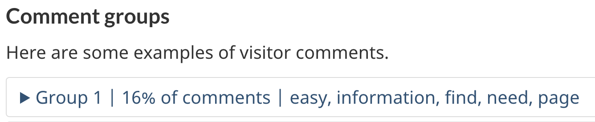

  

    <ul class="toc lst-spcd col-md-12">
      <li class="col-md-4 col-sm-6"><a class="list-group-item active" href="access-results.html">Survey results and reports</a></li>
      <li class="col-md-4 col-sm-6"><a class="list-group-item" href="analyze-feedback.html">How to analyze feedback</a></li>
      <li class="col-md-4 col-sm-6"><a class="list-group-item" href="insights.html">Sharing feedback insights</a></li>
      <li class="col-md-4 col-sm-6"><a class="list-group-item" href="prioritize.html">Deciding what to improve</a></li>
    </ul>
  

## On this page

* [Download raw survey data](#download-raw-survey-data)
* [Current quarterly results](#current-quarterly-results)
* [Annual survey reports](#survey-reports)

## Download raw survey data

This is the best option if you’re looking to download custom time frames of data.

Raw data from the survey has not been processed to ensure continuity if task labels change.  For example: In April 2024, TBS updated their task from “Read a public service collective agreement” to “Find a collective agreement”. To find results for these tasks, you will need to search for results using both task labels.

Download survey responses and comments as CSV or Excel files using the Feedback Viewer.

Use filters to select specific time frames, institutions, themes, or tasks.

The Feedback Viewer is password protected.

Password instructions can be found on [GCPedia (internal only)](https://www.gcpedia.gc.ca/wiki/Government_of_Canada_Task_Success_Survey_-_Access_Data#Raw_survey_responses_and_comments).
{: .alert .alert-info}

## Current quarterly resultats

### GC TSS Results Navigator  New - May 2024
As of May 2024, you can explore quarterly results from the survey online.

[GC TSS Results Navigator] (https://analytics-analytique.tbs.alpha.canada.ca/en/) (available from the GC network only)

Navigate survey results by theme or department and then drill directly into specific task results.

Data in the TSS Results Navigator has been processed to ensure scoring continuity if task labels change between quarters.  For example: In April 2024, TBS updated their task from “Read a public service collective agreement” to “Find a collective agreement”.  

For each task where there are more than 100 comments, feedback has been automatically clustered into groups of similar comments to help reduce some analysis burden. Clustering should be thought of as an initial method that helps sort feedback into smaller groups of comments.  

In each cluster, you will see:
* A cluster group number
* The percentage of the task’s comments sorted into the cluster
* Keywords that describe the cluster
* Total number of comments in the cluster
* 5 comments that best exemplify the overall theme of that cluster

  

Learn more about the specific data science methods behind clustering

Principal Publisher partnered with the Chief Data Office (CDO) at ESDC who developed the clustering script.

The clustering script uses:

<ul>
<li>A pre-trained machine learning model that converts text comments into points in space, based on the general concepts they contain.</li>
<li>First, the “Sentence-transformer model” encodes comments in a space based on “concepts” (e.g., gender, size, verb tense) The process is multilingual by design without needing translation, and can handle comments with synonyms or similar concepts even if they are not using the exact same words.</li>
<li>Next, “Agglomerative clustering creates clusters (groups) of comments that are close together in space.</li>
</ul>

While this method of analysis is fast to compute, it may sometimes have trouble with jargon or technical terms used in a particular context.

This model for analysis was selected for its ability to handle comments from many languages  without needing to first translate into one language which adds mistranslation errors and processing time.

As technology changes, we will continue to look for methods of feedback analysis that may bring us closer to summaries written in plain language of the issues found within the feedback.

## Survey reports

Download annual and quarterly results from the GC Task Success Survey

[Get survey reports on GCPedia (internal only)](https://www.gcpedia.gc.ca/wiki/Government_of_Canada_Task_Success_Survey_reports)

<nav role="navigation" class="mrgn-bttm-lg">
  <ul class="pager">
    <li class="next"><a href="analyze-feedback.html" rel="next">Next: Methods for analyzing comments</a></li>
  </ul>
</nav>
